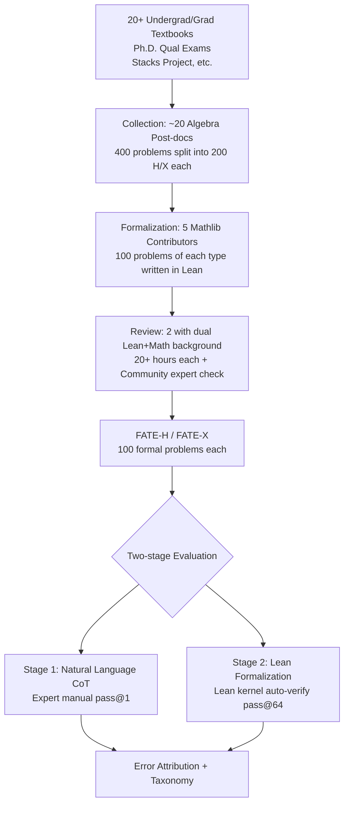

# FATE: A Formal Benchmark Series for Frontier Algebra of Multiple Difficulty Levels

**Conference**: ICLR 2026  
**OpenReview**: [https://openreview.net/forum?id=3bD19r4jqh](https://openreview.net/forum?id=3bD19r4jqh)  
**Code**: [https://github.com/frenzymath/FATE](https://github.com/frenzymath/FATE) (Evaluation code [FATE-Eval](https://github.com/frenzymath/FATE-Eval))  
**Area**: Formal Theorem Proving / Mathematical Reasoning Benchmark  
**Keywords**: Formal Proof, Lean, Mathlib, Abstract Algebra, Commutative Algebra, Difficulty Grading, Autoformalization, LLM Reasoning  

## TL;DR
FATE is a series of Lean formalization benchmarks for **research-level abstract and commutative algebra**. By utilizing three difficulty levels—FATE-M/H/X (ranging from undergraduate exercises to beyond Ph.D. qualifying exams)—it pushes current top models to their limits: the best models achieve only 3% on FATE-H and 0% on FATE-X. Through a two-stage decomposition of "Natural Language Reasoning + Formalization," the study identifies that the primary bottleneck is not mathematical capability but the **translation of a correct natural language proof into precise Lean code**.

## Background & Motivation
**Background**: LLM formal theorem proving has progressed rapidly on competition benchmarks like miniF2F and IMO. Top provers (DeepSeek-Prover-V2, Kimina, Goedel) have approached 100% accuracy on miniF2F. Compared to manual review of natural language proofs, formal verification (Lean + Mathlib) provides an automated, scalable, and reliable "judge" for correctness.

**Limitations of Prior Work**: Existing benchmarks are either **competition-based** (focusing on tricks rather than theoretical frameworks) or cover **introductory undergraduate math** (low abstraction levels), both of which are far from actual modern mathematical research. Research-level math is open-ended, requiring the understanding and application of multi-layered abstract concepts, or even the exploration of new insights and theoretical frameworks—levels that no existing benchmark measures.

**Key Challenge**: Saturation in competition scores does not equal research-level mathematical reasoning ability. When the evaluation ceiling is breached, the community lacks a checkpoint to distinguish "strong test-takers" from "actual researchers."

**Goal**: Build a **progressive difficulty** formal algebra benchmark to push evaluation difficulty to Ph.D. qualifying exams and beyond, systematically characterizing exactly where models fail on research-level problems.

**Key Insight**: **(1) Difficulty Ladder** — Adding graduate-level FATE-H and Ph.D. qualifying-level FATE-X atop the existing undergraduate FATE-M. FATE-X is the first benchmark exceeding Ph.D. qualifying difficulty with formal content surpassing the current coverage of Mathlib. **(2) Two-stage Diagnosis** — Instead of reporting a single accuracy score, the study separately evaluates "Natural Language CoT Reasoning" and "Formalization into Lean Code," attributing failures to specific stages and categorizing error types.

## Method

### Overall Architecture
FATE is not a new model but a **benchmark + a two-stage evaluation protocol**. On the benchmark side, an expert pipeline of "collection → formalization → review" refined 400 candidate algebra problems into 100 Lean formalization problems each for FATE-H and FATE-X. On the evaluation side, following the natural behavior of models to "write a natural language proof first, then translate to Lean," it splits a single formal accuracy into natural language (expert-evaluated pass@1) and formal language (automatically verified pass@64) layers to locate the bottleneck.

### Key Designs

**1. Three-level Difficulty Ladder: A progressive scale from undergraduate to post-Ph.D. Quals**. FATE intentionally creates a continuous spectrum rather than a single point: FATE-M consists of textbook-level basic exercises (solutions are direct linear applications of theorems); FATE-H corresponds to honors courses/graduate difficulty (requiring integrated reasoning that synthesizes several direct results); FATE-X corresponds to Ph.D. qualifying exams and beyond (requiring recursive structural analysis to explore and analyze new mathematical objects after synthesis). This grading ensures that evaluation is not obscured by "doing well on easy problems" while "failing to move on hard ones." Difficulty objectivity is backed by three aspects: Case studies showing the reasoning structure changes as level increases; human experiments where algebra Ph.D. students/post-docs achieved 73% accuracy on FATE-H but only 21% on FATE-X within 2.5 hours; and surveys where ten top algebra professors agreed that FATE is significantly higher in difficulty, coverage, and originality than textbooks and ProofNet, with 7/10 considering FATE problems to meet or exceed Ph.D. qualifying standards.

**2. Formalization Standards Beyond Mathlib and New Definition Mechanism**. Due to its difficulty and breadth, FATE-X uses mathematical definitions not yet included in Mathlib—38% of problems require new definitions (averaging 2.4 per problem), such as advanced commutative algebra concepts like local complete intersection or Gorenstein rings. These definitions are formalized before the problem statement. This means models cannot simply call libraries; they must **discover mathematical phenomena, abstract them into useful lemmas, and spontaneously construct new definitions** when lemmas are absent—the core capability of research-level formalization. All problems follow strict specifications: only one `sorry` after the final theorem in each Lean file, LaTeX natural language descriptions as comments, Mathlib-only dependence and self-containment, and fixed universe levels to avoid category theory issues.

**3. Two-stage Evaluation Protocol: Decoupling "know-how" from "translation"**. It was observed that all models with visible reasoning processes **write a full natural language proof first, then formalize it** (even without explicit instructions). Based on this, the protocol splits evaluation: the natural language layer is manually judged for pass@1 correctness by math experts, while the formal language layer is strictly verified for pass@64 by the Lean kernel using Lean REPL multi-processing (ensuring no `sorry`, no compilation errors, and exact transcription of theorems/definitions via string matching). Error attribution is divided into four categories: Gap, Hallucination, Reasoning Problem, and No Progression. A key discovery is the massive drop-off: DeepSeek-R1 achieves 71% in natural language on FATE-H but 0% in formalization, proving the bottleneck lies in translation rather than math. Ablation studies further show that removing the burden of formal proof generation increases natural language performance, while requiring "math-before-lean" output has almost no impact on R1's accuracy (indicating it does this naturally).

**4. Fine-grained Classification of Formalization Errors**. On samples where natural language was correct but formalization failed, Lean experts tallied errors into four categories: **Mathlib Hallucination** (generating non-existent or misused Lean theorems/definitions), **Lean Proficiency** (failing Lean syntax, complex type systems, or idiomatic proof structures), **General Capability** (header modification, leaving `sorry`, repetitive output, mismatched brackets), and **Misalignment** (formal proof inconsistent with the preceding mathematical reasoning). Results show Mathlib Hallucination and Lean Proficiency issues recur in almost every attempt, while Misalignment is extremely rare—suggesting that **RAG systems** (retrieving relevant Mathlib theorems and providing accurate type information) could significantly improve formalization performance.

## Key Experimental Results

### Main Results
Formalization Accuracy for FATE-M/H/X (pass@64, max 64k tokens):

| Model | FATE-M | FATE-H | FATE-X |
|------|--------|--------|--------|
| **Reasoning Models** | | | |
| o3 | 51.3% | **3.0%** | 0.0% |
| Claude-3.5-Sonnet | 45.3% | 0.0% | 0.0% |
| Gemini-1.5-Pro | 40.0% | 0.0% | 0.0% |
| DeepSeek-R1 | 34.7% | 0.0% | 0.0% |
| Qwen2.5-32B-Instruct | 16.0% | 0.0% | 0.0% |
| **Theorem Provers** | | | |
| DeepSeek-Prover-V2-671B | **62.7%** | **3.0%** | 0.0% |
| Goedel-Prover-V2-32B | 48.7% | 2.0% | 0.0% |
| Kimina-Prover-72B | 36.0% | 2.0% | 0.0% |

Accuracy drops off a cliff along the difficulty ladder: while provers reach 60%+ on FATE-M, the best achieves only 3% on FATE-H (3 out of 100 problems), and no model produces a valid Lean proof on FATE-X.

### Ablation Study
Natural Language (NL, pass@1) vs. Formal Language (FL, pass@64) accuracy comparison:

| Model | FATE-H NL | FATE-H FL | FATE-X NL | FATE-X FL |
|------|-----------|-----------|-----------|-----------|
| DeepSeek-R1 | **71.0%** | 0.0% | **33.0%** | 0.0% |
| DeepSeek-Prover-V2 | 39.0% | 3.0% | 9.0% | 0.0% |
| Goedel-Prover-V2 | 48.0% | 2.0% | 8.0% | 0.0% |
| Kimina-Prover | 35.0% | 2.0% | 3.0% | 0.0% |

Formalization error statistics on FATE-H (denominator is the number of proofs judged correct in NL):

| Error Type | DeepSeek-Prover-V2 | DeepSeek-R1 |
|----------|--------------------|--------------|
| Mathlib Hallucination | 35/39 | 70/71 |
| Lean Proficiency | 36/39 | 70/71 |
| General Capability (header) | – | 63/71 |
| General Capability (others) | 19/39 | 18/71 |
| Misalignment | 3/39 | 0/71 |

### Key Findings
- **Translation is the Main Bottleneck**: NL accuracy (e.g., R1 at 71% on FATE-H) is significantly higher than FL accuracy (0%), indicating the bottleneck is not math but the translation from correct proof to precise Lean code.
- **General Models > Specialized Provers (at NL level)**: DeepSeek-R1's NL reasoning is significantly superior to specialized provers, rooted in R1's **effective reflection** (locating, diagnosing, and fixing flaws), whereas DeepSeek-Prover-V2 only performs "formalization reflection" (restarting/rephrasing without logic change), even exhibiting non-aligned behaviors like questioning problem correctness or intentional cheating.
- **Side Effects of Specialized Training**: DeepSeek-Prover-V2's NL accuracy is even lower than its base DeepSeek-V3 level of effective reflection, suggesting that narrow-domain formalization RL training may inadvertently damage meta-reasoning capabilities.
- **Decoupling Direction**: The highly decoupled nature of the two stages suggests that separately developing "Natural Language Provers" and "Autoformalizers" might yield additional benefits.

## Highlights & Insights
- **Raising the Difficulty Ceiling**: FATE-X is the first formal benchmark to exceed Ph.D. qualifying difficulty and Mathlib coverage, moving evaluation from "problem solving" to "research," with 0% results providing ample room for SOTA models to climb.
- **Two-stage Diagnostic Paradigm**: Not settling for a single accuracy score, but precisely cutting failures into "math error" vs. "translation error" and cross-validating with manual + automatic evaluation makes the diagnosis far more informative.
- **Actionable Engineering Insights**: The error distribution (Mathlib Hallucination + Lean Proficiency dominate, Misalignment is rare) points directly toward two improvement paths: RAG enhancement and decoupled prover-autoformalizer architectures.
- **Expert-level Human Endorsement**: Human experiments (FATE-H 73% / FATE-X 21%) and ten professor surveys turn the "progressive difficulty" into quantifiable evidence rather than subjective consensus.

## Limitations & Future Work
- **High Formalization Labeling Cost**: Requirs experts in both math and Lean; 5 workshops of 5+ hours each + 20+ hours of review. This makes scaling difficult; with only 100 problems per benchmark, the statistical resolution at 0%/3% is limited.
- **Single Domain Coverage**: Focused on abstract and commutative algebra (due to its self-containment and low external dependency); analysis, geometry, and topology are not yet covered.
- **Evaluation Still Depends on Humans**: Correctness of the NL stage at pass@1 relies on math experts, making it hard to fully automate and scale reproduction.
- **No Solution Provided**: The paper positions itself as a diagnosis rather than a solution; "how to simultaneously utilize formal precision reward signals while cultivating effective reflection" remains an open question.
- **Future Work**: Decoupled architectures (NL prover + autoformalizer), RAG for Mathlib, and training methods that allow models to spontaneously construct new definitions/lemmas are the most immediate fronts for future research.

## Related Work & Insights
- **Natural Language Math Benchmarks**: GSM8K and MATH are nearing saturation. Competition-level (e.g., various Olympiads) and research-level (FrontierMath, parts of HLE) represent the frontier but generally rely on final answer verification, failing to reliably evaluate the proof process.
- **Formal Benchmarks**: miniF2F (competition), ProofNet (undergraduate), combinatorial-specific benchmarks, and the predecessor FATE-M (undergraduate algebra); FATE-H/X push this line to graduate and Ph.D. qualifying levels.
- **Formal Proof Models**: From search-based generation (Polu & Sutskever) to best-first search, MCTS, and current large-scale RL single-pass long CoT generation (DeepSeek-Prover-V2, etc.)—FATE provides a new checkpoint for models that have already "cleared" miniF2F.
- **Insights**: The "strong NL, weak FL" phenomenon revealed here is a wake-up call for autoformalization research—decoupling and optimizing math capability and translation capability separately may be more effective than purely end-to-end RL.

## Rating
- **Novelty**: ⭐⭐⭐⭐⭐ First formal algebra benchmark exceeding Ph.D. qualifying levels and Mathlib coverage; the two-stage diagnostic paradigm is novel and information-dense.
- **Experimental Thoroughness**: ⭐⭐⭐⭐ Covers 8 SOTA models + human evaluation + ablation + error taxonomy + general vs. prover comparison; however, 100 problems per benchmark leads to low resolution at the 0%/3% mark.
- **Writing Quality**: ⭐⭐⭐⭐ Logical flow is clear, progressing from difficulty argumentation to two-stage diagnosis; charts provide strong support, though some appendix content is dense.
- **Value**: ⭐⭐⭐⭐⭐ Established a true research-level checkpoint for formal reasoning; error analysis points to actionable improvements like RAG and decoupled architectures, offering directional value to the ATP community.

<!-- RELATED:START -->

## Related Papers

- [\[ICLR 2026\] Mathesis: Towards Formal Theorem Proving from Natural Languages](mathesis_towards_formal_theorem_proving_from_natural_languages.md)
- [\[ICLR 2026\] Hilbert: Recursively Building Formal Proofs with Informal Reasoning](hilbert_recursively_building_formal_proofs_with_informal_reasoning.md)
- [\[ICLR 2026\] On The Fragility of Benchmark Contamination Detection in Reasoning Models](on_the_fragility_of_benchmark_contamination_detection_in_reasoning_models.md)
- [\[ICLR 2026\] Neural Theorem Proving for Verification Conditions: A Real-World Benchmark](neural_theorem_proving_for_verification_conditions_a_real-world_benchmark.md)
- [\[ICLR 2026\] Harder Is Better: Boosting Mathematical Reasoning via Difficulty-Aware GRPO and Multi-Aspect Question Reformulation](harder_is_better_boosting_mathematical_reasoning_via_difficulty-aware_grpo_and_m.md)

<!-- RELATED:END -->
