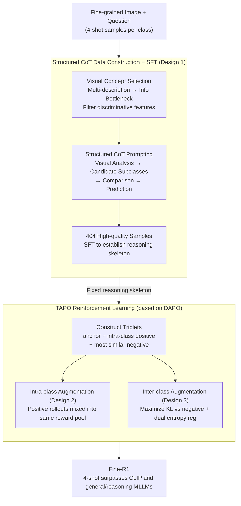

# Fine-R1: Make Multi-modal LLMs Excel in Fine-Grained Visual Recognition by Chain-of-Thought Reasoning

**Conference**: ICLR 2026  
**arXiv**: [2602.07605](https://arxiv.org/abs/2602.07605)  
**Code**: [https://github.com/PKU-ICST-MIPL/FineR1_ICLR2026](https://github.com/PKU-ICST-MIPL/FineR1_ICLR2026)  
**Area**: LLM Reasoning  
**Keywords**: Fine-grained recognition, CoT reasoning, Triplet Augmentation Policy Optimization, Few-shot FGVR, DAPO

## TL;DR
Fine-R1 surpasses CLIP and general/reasoning MLLMs in fine-grained visual recognition (FGVR) using only 4-shot training, achieved through CoT Supervised Fine-Tuning (structured reasoning chain: "Visual Analysis → Candidate Subclasses → Comparison → Prediction") and Triplet Augmentation Policy Optimization (TAPO), which utilizes intra-class augmentation for robustness and inter-class augmentation for discriminative power.

## Background & Motivation

**Background**: MLLMs perform excellently on coarse-grained visual tasks but significantly lag behind contrastive CLIP models in Fine-Grained Visual Recognition (FGVR, e.g., distinguishing between different bird species).

**Limitations of Prior Work**:
   - Adapting general MLLMs to FGVR requires massive amounts of labeled data, which is costly to collect (e.g., requiring domain experts to label thousands of bird species).
   - MLLMs tend to overfit seen subclasses and generalize poorly to unseen ones.
   - Even cutting-edge models like GPT-4V are inferior to specialized CLIP models in FGVR.

**Key Challenge**: The unique "high intra-class variance + low inter-class variance" problem in FGVR—different angles of the same bird species can vary greatly, while different species may appear extremely similar.

**Key Insight**: MLLMs have already internalized a vast amount of fine-grained knowledge; the issue is not a lack of knowledge, but the inability to effectively **invoke** it. This can be addressed through CoT reasoning to guide knowledge invocation and RL to optimize how knowledge is used.

**Core Idea**: Instead of making the model "learn more knowledge," the objective is to teach the model to "better use existing knowledge"—activating the MLLM's inherent fine-grained recognition capabilities through structured CoT and triplet contrastive RL.

## Method

### Overall Architecture
Fine-R1 aims to solve the problem where MLLMs "recognize" fine-grained subclasses but fail to retrieve this knowledge, causing them to be outperformed by CLIP in tasks like bird species identification. The approach teaches "knowledge utilization" in two stages. In the first stage, SFT is performed using a small batch of high-quality chain-of-thought samples to fix the output format into "Visual Analysis → Candidate Subclasses → One-by-one Comparison → Prediction," establishing the skeleton for fine-grained reasoning. In the second stage, reinforcement learning via TAPO (Triplet Augmentation Policy Optimization) is applied to this skeleton, using intra-class and inter-class contrastive signals to refine discriminative power. This ensures the model not only follows the correct reasoning structure but also focuses on key clues for subclass differentiation. The entire process is completed with extremely few samples (4-shot per category).

### Key Designs

**1. Structured CoT Data Construction: Solidifying the "narrow down then compare" reasoning pattern**

Standard CoT ("analyze then predict") is insufficient for FGVR, where the challenge is narrowing the search space to a few easily confused subclasses and then precisely excluding them. Fine-R1 constructs a four-step reasoning chain: Visual Analysis → List Candidate Subclasses → Comparison → Prediction. This is built in two steps: first, image-level visual concept selection—letting the MLLM describe the same image multiple times, aggregating descriptions, and using an information bottleneck to filter the most discriminative features to avoid irrelevant details; then, using structured prompts to guide the model to list the most confusing candidate subclasses and compare them one by one. Ultimately, only 404 samples are retained, each verified through multiple sampling rounds and manual checks to stabilize the reasoning format with minimal high-quality data.

**2. Intra-class Augmentation: Using reward differences between images of the same class to force focus on category-level clues**

A major issue in FGVR is high intra-class variance—different views of the same bird species vary greatly, making models prone to overfitting specific image appearances. Intra-class augmentation addresses this: for each anchor image $x$, a positive image $x_{pos}$ from the same subclass is sampled. Unlike traditional methods that generate separate rollouts for $(x,q)$ and $(x_{pos},q)$, here both rollouts are merged into the same reward pool to calculate advantage, while policy updates remain conditioned only on the anchor. Consequently, when two images of the same class yield inconsistent predictions, the discrepancy in the reward pool acts as a direct training signal, pushing the model to focus on "features shared by the subclass" rather than image-specific details, thereby increasing robustness to intra-class variations.

**3. Inter-class Augmentation: Using distribution differences of the most similar negatives to force usage of discriminative clues**

Conversely, inter-class variance is low—different subclasses look very similar. If the model provides the same prediction when given a similar-looking class, it fails to use fine-grained discriminative clues. Inter-class augmentation samples a negative $x_{neg}$ from the subclass most similar to, but different from, the anchor. It defines the discrimination ratio:

$$g^{inter}(\theta) = \frac{\pi_\theta(o\mid q,x_*)}{\pi_\theta(o\mid q,x_{neg})}$$

By maximizing the KL divergence $D_{KL}[\pi_\theta \,\|\, \pi_\theta^{neg}]$ between the anchor policy and the negative policy, the objective of "producing different output distributions for similar negatives" becomes an explicit optimization goal. In other words, the model is penalized for giving identical predictions across similar classes, forcing it to utilize details that distinguish the two. To prevent instability during this "pushing" training, a dual entropy regularization layer is added.

### Loss & Training
- **Stage 1**: Standard SFT, fine-tuning on 404 CoT samples to establish the structured reasoning skeleton.
- **Stage 2**: TAPO = Base DAPO + Intra-class Aug (mixed positive rollouts in the same reward pool) + Inter-class Aug (maximizing KL divergence vs. the most similar negative) + Dual entropy regularization.
- The entire process uses 4-shot per category.

## Key Experimental Results

### Main Results (6 FGVR Datasets, Closed-world)

| Method | Seen Avg↑ | Unseen Avg↑ | Total Avg↑ |
|------|----------|-----------|--------|
| SigLIP-L (CLIP) | 88.33 | 80.54 | 84.44 |
| Qwen2.5-VL-7B | ~84% | ~57% | ~70% |
| DeepPerception-7B | ~87% | ~50% | ~68% |
| **Fine-R1-3B** | **~93%** | **~81%** | **~87%** |

### Ablation Study

| Configuration | Seen↑ | Unseen↑ |
|------|------|--------|
| SFT only | Baseline | Baseline |
| + Standard RL (CLS-RL) | +5% | -2% (Overfitting) |
| + TAPO (Full) | **+8%** | **+13%** |
| — w/o Intra-class Aug | -3% | -5% |
| — w/o Inter-class Aug | -2% | -4% |

### Key Findings
- **Surpassing CLIP Specialized Models**: Fine-R1-3B averages about 3% higher than SigLIP-L across 6 datasets—the first time a generative MLLM has surpassed contrastive models in FGVR.
- **Strong Open-world Generalization**: Performs +23.75% better than Qwen2.5-VL-7B on unseen categories, proving it learns reasoning methods rather than memorizing classes.
- **4-shot is Sufficient**: Just 4 samples per category are enough to activate powerful fine-grained recognition capabilities.
- **Unchanged Knowledge and Visual Features**: The model's internal representations remain nearly unchanged before and after training—improvements stem from "better knowledge utilization" rather than "learning new knowledge."
- **Strong Cross-domain Transfer**: Also improves by +3.6% on tasks like ImageWikiQA that require object recognition.

## Highlights & Insights
- **"Not learning more knowledge, but using knowledge better"**: This insight is profound—the bottleneck for MLLMs in FGVR is not perception or knowledge, but knowledge invocation. Structured CoT is essentially a "knowledge retrieval strategy" that guides the model to narrow the search space before precise comparison.
- **Triplet Contrastive RL is a Natural Solution for FGVR**: Integrating metric learning (triplet loss) ideas into policy optimization, where intra-class augmentation equals positive alignment and inter-class augmentation equals negative pushing. This is more suitable for the unique structure of FGVR than general GRPO.
- **Efficient training with 404 CoT samples** is impressive—quality control (multi-round sampling + manual verification) shows that a small amount of high-quality data is better than a large amount of low-quality data.

## Limitations & Future Work
- Only 3B/7B models were tested; performance on larger MLLMs remains to be verified.
- Negative selection depends on predefined "most similar subclasses"—more dynamic online hard negative mining might be more effective.
- CoT data construction relies on Qwen2.5-VL-32B—presenting a dependency on external large models.
- Not tested on non-classification tasks (e.g., fine-grained detection/segmentation).
- The 6 datasets are classic FGVR sets—newer and harder datasets (like the full iNaturalist) remain to be explored.

## Related Work & Insights
- **vs CLS-RL (Li et al.)**: Direct RL with classification rewards leads to overfitting seen classes; Fine-R1 generalizes through CoT + TAPO.
- **vs SigLIP/CLIP**: Contrastive models are the gold standard for FGVR, but Fine-R1 proves generative MLLMs can surpass them with the right training.
- **vs DeepPerception**: Focuses on visual perception but lacks a fine-grained knowledge invocation mechanism.

## Rating
- Novelty: ⭐⭐⭐⭐⭐ Triplet augmentation policy optimization + structured CoT for FGVR, making MLLMs surpass CLIP for the first time.
- Experimental Thoroughness: ⭐⭐⭐⭐⭐ 6 datasets, open/closed-world, ablations, knowledge analysis, cross-domain transfer.
- Writing Quality: ⭐⭐⭐⭐ Clear motivation, though formulas are somewhat dense.
- Value: ⭐⭐⭐⭐⭐ A new paradigm for 4-shot FGVR, with significant practical value for knowledge-intensive domains.

<!-- RELATED:START -->

## Related Papers

- [\[CVPR 2026\] E-comIQ-ZH: A Human-Aligned Dataset and Benchmark for Fine-Grained Evaluation of E-commerce Posters with Chain-of-Thought](../../CVPR2026/llm_reasoning/e-comiq-zh_a_human-aligned_dataset_and_benchmark_for_fine-grained_evaluation_of_.md)
- [\[CVPR 2026\] Rationale-Enhanced Decoding for Multi-modal Chain-of-Thought](../../CVPR2026/llm_reasoning/rationale-enhanced_decoding_for_multi-modal_chain-of-thought.md)
- [\[ICLR 2026\] Are Reasoning LLMs Robust to Interventions on Their Chain-of-Thought?](are_reasoning_llms_robust_to_interventions_on_their_chain-of-thought.md)
- [\[ACL 2025\] RSVP: Reasoning Segmentation via Visual Prompting and Multi-modal Chain-of-Thought](../../ACL2025/llm_reasoning/rsvp_reasoning_segmentation_via_visual_prompting_and_multi-modal_chain-of-though.md)
- [\[ICLR 2026\] Learning What Reinforcement Learning Can't: Interleaved Online Fine-Tuning for Hardest Questions](learning_what_reinforcement_learning_cant_interleaved_online_fine-tuning_for_har.md)

<!-- RELATED:END -->
