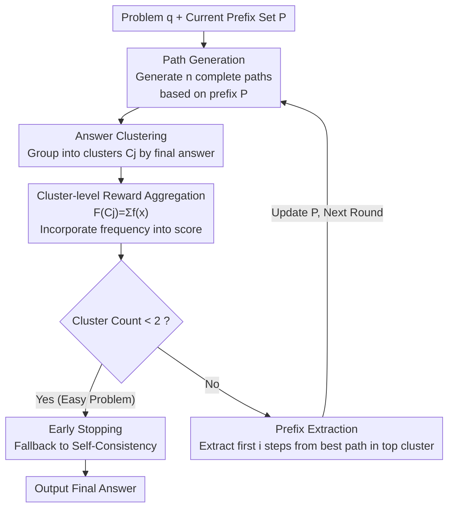

# Fixing the Broken Compass: Diagnosing and Improving Inference-Time Reward Modeling

**Conference**: ICLR 2026  
**arXiv**: [2503.05188](https://arxiv.org/abs/2503.05188)  
**Code**: [GitHub](https://github.com/BugMakerzzz/CRISP)  
**Area**: LLM Inference  
**Keywords**: [Reward Model, inference-time scaling, CRISP, Best-of-N, MCTS]

## TL;DR

This paper systematically diagnoses three failure modes of Reward Models (RMs) at inference time—performance degradation on easy problems, decreased discriminative power as the number of samples increases, and excessive search diversity harming accuracy. It proposes the CRISP algorithm to mitigate these issues through cluster-based reward integration and stepwise prefixing, achieving accuracy improvements of up to 5%.

## Background & Motivation

Inference-time scaling techniques (e.g., OpenAI o1, DeepSeek-R1) enhance LLM reasoning capabilities by increasing computation during inference. Current research primarily focuses on training-time optimization (RL/SFT), while inference-time reward-model-based methods remain relatively overlooked. However, the R1 series models exhibit issues such as "overthinking" and limited task generalization.

Taking CSQA commonsense reasoning as an example, DeepSeek-R1-7B achieves 64.8% accuracy using an average of 3,613 tokens, while the proposed inference-time method achieves 72.0% on the base Qwen2.5-Math-7B model with only 1,100 tokens. This suggests that optimizing inference-time RMs remains a critical direction.

Nevertheless, preliminary experiments show that advanced RMs provide limited improvements in downstream reasoning tasks: on most LLMs, BoN improves over SC by less than 5%, whereas the Oracle (recalling the correct answer directly from samples) significantly outperforms other methods. This indicates that the **bottleneck lies in the discriminative capacity of the RM rather than the generative capability of the LLM**.

## Method

### Overall Architecture

The paper follows a two-stage approach: **diagnosis** followed by **targeted solutions**. The diagnosis stage treats RM behavior at inference time as a function determined by "problem $q$, sample count $n$, and search parameters $\Phi$." By fixing two variables and varying one, the authors detect when the RM fails, identifying three failure modes (easy problem degradation, decreased discrimination with more samples, and diversity backfire). Consequently, the authors propose CRISP (Clustered Reward Integration with Stepwise Prefixing), a training-free iterative inference framework. In each round, $n$ complete reasoning paths are generated based on the current prefix set $\mathcal{P}$. These are clustered by the final answer, and rewards are aggregated at the **cluster level**. The process then evaluates early stopping: if the number of clusters is $<2$ (indicating an easy problem), it falls back to Self-Consistency; otherwise, top steps from the highest-scoring cluster are extracted as the prefix for the next round, narrowing the search space to promising branches. Each core module addresses one specific failure mode.

### Key Designs

**1. Diagnosis of Three Failure Modes: Identifying where RMs fail at inference time**

Simply stacking stronger RMs yields limited gains (BoN is less than 5% better than Self-Consistency on most models). Thus, the authors first perform controlled diagnosis. The first failure mode (Cl.1) is easy problem degradation: after dividing problems into 5 difficulty levels based on pass@1, BoN and MCTS-RM underperform Self-Consistency on the easiest Levels 1-2. The RM introduces noise where the model would have otherwise won. The second mode (Cl.2) is the "anti-long-tail" phenomenon: by analyzing high-scoring incorrect answers, it was found that these are often low-frequency answers (appearing $<5$ times). As $n$ increases, rare incorrect samples become more frequent, making it harder for the RM to distinguish them. The third mode (Cl.3) is diversity backfire: increasing the sampling temperature $T$ or expanding the MCTS width/depth consistently degrades RM performance (optimal width $\approx 5$, depth 3–5), indicating RMs are more sensitive to diversity than policy models. These findings directly inform the CRISP modules.

**2. Cluster-level Reward Aggregation: Incorporating frequency to suppress "anti-long-tail"**

This is the core innovation of CRISP, targeting Cl.2. Conventional BoN takes the single highest-scoring path, allowing a rare but over-rewarded incorrect path to win. CRISP first clusters paths $\mathcal{C}_j$ by their final answer (mapping $\psi:\mathcal{R}\to\mathcal{C}$) and lifts scores from the path level to the cluster level:

$$\mathcal{F}(\mathcal{C}_j)=\sum_{x\in\mathcal{C}_j} f(x)$$

where $f(x)$ is the normalized single-path reward. This summation naturally incorporates "answer frequency" into the score. High-frequency correct answers gain a high total score due to the volume of paths, while low-frequency incorrect answers—even those with high individual RM scores—cannot compete because their clusters contain fewer paths. This uses "population voting" to correct RM point-wise scoring errors.

**3. Early Stopping: Fallback for easy problems to prevent RM interference**

Targeting Cl.1, the authors use **cluster cardinality** as a low-cost signal for problem difficulty. If the number of clusters after one round of sampling is $<2$, it suggests the paths have converged to a single answer and the problem is easy. RM intervention at this stage only introduces noise. CRISP then terminates the iteration and defaults to the Self-Consistency majority vote, saving compute and avoiding RM instability.

**4. Full-path Generation + Stepwise Prefixing: Maintaining optimal search diversity**

Targeting Cl.3, this corresponds to the "Path Generation" and "Prefix Extraction" steps. Unlike node-by-node MCTS (which explodes into many intermediate states), CRISP generates $n$ **complete** paths per round based on the current prefix $\mathcal{P}$ (initially $\mathcal{P}=\varnothing$), limiting the explored states. After each round, the first $i$ steps of the best path from the top cluster are set as the new prefix $\mathcal{P}$ for the next round. This stabilizes good starts and narrows the search space iteratively, keeping diversity within the RM's optimal performance range.

The entire flow requires no training. Policy models include Qwen2.5-3B / Llama3.1-8B, and reward models include Skywork ORM and Skywork-o1 PRM. BoN uses $n=32$, and MCTS uses 32 rollouts for fair comparison.

## Key Experimental Results

### Main Results

| Method | Qwen2.5-3B GSM8K | Qwen2.5-3B MATH | Qwen2.5-3B Olympiad | Llama3.1-8B MATH |
|:---|:---|:---|:---|:---|
| CoT | 0.78 | 0.46 | 0.24 | 0.38 |
| Self-Consistency | 0.83 | 0.64 | 0.31 | 0.57 |
| BoN + PRM | 0.87 | 0.61 | 0.34 | 0.62 |
| MCTS + PRM | 0.95 | 0.71 | 0.31 | 0.57 |
| Beam Search | 0.95 | 0.73 | 0.34 | 0.56 |
| **CRISP + PRM** | **0.96** | **0.76** | **0.39** | **0.67** |

### Ablation Study (Comparison with R1)

| Comparison with R1 Model | MATH Acc / Tokens | CSQA Acc / Tokens | SIQA Acc / Tokens | LogiQA Acc / Tokens |
|:---|:---|:---|:---|:---|
| Qwen2.5-Math-7B Chat | 0.74 / 1855 | 0.58 / 1479 | 0.58 / 1388 | 0.49 / 2133 |
| R1-Distill-7B | **0.88** / 9626 | 0.65 / 3612 | 0.66 / 2920 | 0.50 / 6492 |
| **CRISP** | 0.79 / **987** | **0.72** / **1100** | **0.66** / **1059** | **0.59** / **2058** |

### Key Findings

- CRISP achieves up to 5% improvement on MATH-500 (Llama3.1-8B from 0.62 to 0.67) and 5% on OlympiadBench.
- Comparison with R1: 10% higher average accuracy on non-math tasks with up to 90% fewer tokens.
- Ablations confirm each module's contribution: removing clustering, early stopping, or prefixing leads to performance drops.
- Robustness: Even with a weaker Shepherd PRM (BoN only 0.47), CRISP maintains high accuracy.
- Efficiency: Inference time for MATH is 91.0s vs. MCTS 211.3s vs. Beam 268.7s.

## Highlights & Insights

- Systematic diagnosis: The "anti-long-tail" phenomenon (RMs over-rewarding rare incorrect answers) is a significant insight into RM behavior.
- Cluster-level reward aggregation is a clever design—incorporating frequency info naturally without modifying the RM.
- The early stopping mechanism gracefully handles the "harmful RM" problem on easy tasks.
- The weakness of R1 models in non-math tasks (and high token costs) highlights the persistent value of inference-time optimization.

## Limitations & Future Work

- Clustering relies on exact matching of final answers, which is not directly applicable to open-ended generation (e.g., summarization).
- Stepwise prefix extraction grows linearly with iterations, which may be too restrictive for long reasoning chains.
- Validated only on math and commonsense reasoning; more complex multi-step reasoning (e.g., coding, planning) remains to be explored.
- The early stopping threshold (cluster count < 2) is hardcoded and may require task-specific tuning.
- Does not consider RMs improving in real-time through the reasoning process itself.

## Related Work & Insights

- BoN Weighted (Snell et al., 2024) and MCTS (Hao et al., 2023) are primary competitors; CRISP improves upon them with clustering and prefix mechanisms.
- While DeepSeek-R1 uses rule-based rewards to avoid reward hacking, this paper addresses RM discriminative deficiencies from an inference-time perspective.
- The "anti-long-tail" phenomenon suggests that RM training data distributions should cover more rare error patterns.
- The idea of cluster-level aggregation could be extended to other scenarios requiring multiple candidate scoring, such as test-case aggregation in code generation.

## Rating

⭐⭐⭐⭐ — The diagnosis is systematic and deep. CRISP is designed with clear intent and comprehensive experiments. It holds significant practical value for inference-time optimization, though its scope (requiring exact answer matching) limits its generality.

<!-- RELATED:START -->

## Related Papers

- [\[ICLR 2026\] Linking Process to Outcome: Conditional Reward Modeling for LLM Reasoning](linking_process_to_outcome_conditional_reward_modeling_for_llm_reasoning.md)
- [\[ICLR 2026\] RL of Thoughts: Navigating LLM Reasoning with Inference-Time Reinforcement Learning](rl_of_thoughts_navigating_llm_reasoning_with_inference-time_reinforcement_learni.md)
- [\[ICML 2026\] Inference Time Optimization with Confidence Dynamics](../../ICML2026/llm_reasoning/inference_time_optimization_with_confidence_dynamics.md)
- [\[ICLR 2026\] The Limits of Inference Scaling Through Resampling](the_limits_of_inference_scaling_through_resampling.md)
- [\[ACL 2026\] C2: Scalable Rubric-Augmented Reward Modeling from Binary Preferences](../../ACL2026/llm_reasoning/c2_scalable_rubric-augmented_reward_modeling_from_binary_preferences.md)

<!-- RELATED:END -->
