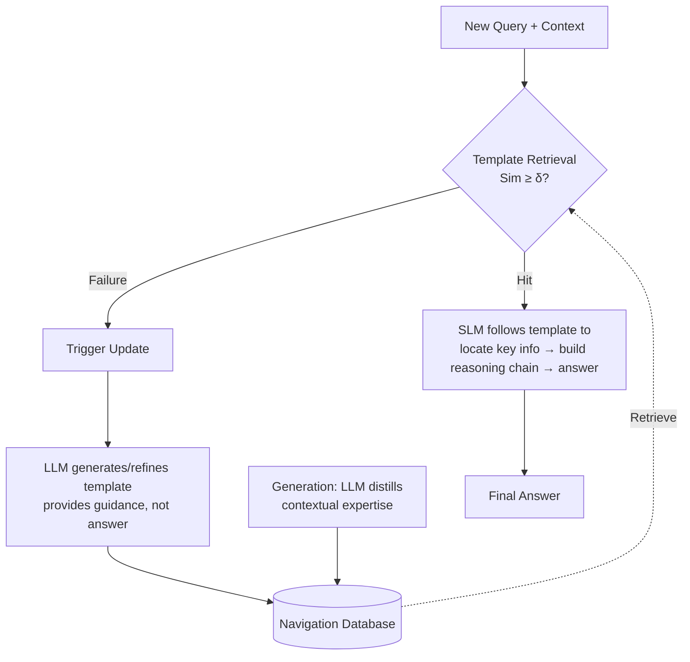

# Following the Navigation: Enhancing Small Language Models Contextual Reasoning with LLM Guidance

**Conference**: ICLR 2026  
**OpenReview**: [https://openreview.net/forum?id=R8A12kykPG](https://openreview.net/forum?id=R8A12kykPG)  
**Code**: To be confirmed  
**Area**: LLM Reasoning / SLM Enhancement  
**Keywords**: Small Language Models, Contextual Reasoning, Training-free, LLM Distillation, Template Retrieval, Knowledge Base  

## TL;DR
Proposes **Navigation**—a training-free framework that distills the "reasoning strategies" of large models for complex contexts into reusable navigation templates stored in a database. Using a three-phase "Generation-Utilization-Update" cycle, it guides 3B small models to locate key information, achieving an average accuracy improvement of 10.7% and outperforming GPT-3.5-Turbo.

## Background & Motivation
**Background**: Large models like o1 and DeepSeek-R1 perform excellently in contextual reasoning (requiring world knowledge, deep understanding of long texts, and multi-step inference), but their computational and deployment costs are high, making it difficult to deploy them on edge devices. 3B-scale small language models (SLMs) are computationally friendly but frequently fail in contextual reasoning due to limited parameter capacity and difficulty in modeling complex dependencies.

**Limitations of Prior Work**: Mainstream routes for transferring LLM capabilities to small models depend on additional training—knowledge distillation (white-box using logits/hidden states, black-box via fine-tuning students on teacher-generated pseudo-labels/reasoning trajectories) or data synthesis (using LLMs to create training data). These methods require labeled data and training overhead, and small models are prone to **catastrophic forgetting** after fine-tuning; SFT can even lead to performance drops on small datasets like MuSR.

**Key Challenge**: Small models easily get "lost in the middle" within information-dense long contexts, becoming overwhelmed by irrelevant details. However, existing research indicates that SLMs are highly sensitive to **prompt quality** under in-context learning and possess a degree of robustness. This suggests that **carefully designed guidance** can activate the contextual processing capabilities of small models without training or parameter expansion.

**Goal**: Construct a **training-free, low-cost LLM call** guidance mechanism that allows small models to borrow the "contextual processing expertise" of large models without exceeding their own capacity or introducing forgetting.

**Key Insight**: **Abstract the LLM's "how to read this type of problem" into structured templates, rather than distilling the answers to the small model.** The large model is only responsible for a one-time generation of general guidelines on "what key information to focus on for a specific task" (e.g., in murder mystery reasoning, check motives, weapon proficiency, and alibis), which are stored in a searchable Navigation database. When encountering a new problem, the small model retrieves the most similar template, locates evidence step-by-step according to the template, and constructs the reasoning chain, with the final answer still provided by the small model itself.

## Method

### Overall Architecture
Navigation operates as a closed loop around three phases: **Generation** (LLM distills contextual processing expertise into templates), **Utilization** (SLM retrieves the most similar template for a new query and performs one-step reasoning), and **Update** (triggered by retrieval failure to have the LLM supplement new templates, allowing the database to evolve dynamically). These three constitute a practical workflow: "try with the small model first; if it fails, invoke the LLM for 'remediation'; after that, similar problems are handled by the small model," minimizing expensive LLM calls.

### Key Designs

**1. Navigation Generation: Distilling "Reasoning Strategies" rather than "Reasoning Results" into structured templates.** Different tasks require vastly different types of key information—murder mysteries need an assessment of motive, means, and opportunity, while team assignments require analyzing member strengths and interpersonal dynamics. Navigation allows the LLM to complete a full reasoning cycle (understand problem → parse text → extract info → build reasoning chain → provide answer). During this process, it **identifies and abstracts task-related key information types while filtering irrelevant noise**, organizing this experience into a structured template. Each template contains three parts: `Task Category` (problem type, e.g., "Murder Mystery," for precise retrieval), `Task Scenarios` (archived historical queries and contexts, serving as anchors for similarity matching), and `Task Guidance` (enumerating key abstract info types with concise general explanations, e.g., "Alibi Credibility: Confirm presence elsewhere during the crime via witnesses, digital records, or timestamped activities"). Crucially, templates are **concise, general, and adapted to the small model's comprehension**, providing tailored actionable guidance rather than vague generalities.

**2. Navigation Utilization: Semantic retrieval + end-to-end single-step reasoning to avoid information overload.** Upon receiving a query and context, an **embedding model independent of the SLM/LLM** vectorizes the current task scenario $x_d$, calculates the cosine similarity with archived scenarios $\{D_{T_i}\}_{i=1}^{N}$ in the database, and selects the most similar one:
$$j = \arg\max_{i} \mathrm{Sim}\big(f(x_d),\, f(D_{T_i})\big)$$
If the highest similarity exceeds the threshold $\delta$, the template is selected to guide reasoning; otherwise, Update is triggered. Once selected, the small model **systematically scans the original text** according to the template instructions, capturing only evidence corresponding to each instruction (e.g., if the template says "check alibi credibility," it focuses only on witness testimony, digital records, and timestamps), filtering irrelevant details, and integrating them into a reasoning chain. Notably, this is **end-to-end single-step generation**—template instantiation and inference are completed in one generation, improving efficiency and reducing hallucinations because the small model focuses on pre-defined key points and avoids redundant processing.

**3. Navigation Update: Retrieval failure triggers continuous learning and database self-evolution.** When $\mathrm{Sim}(f(x_d), f(D_{T_i})) < \delta$ (no suitable template) or the existing template provides poor guidance, a **Navigation gap** is identified. The small model records the problem type, task characteristics, and failure reason (e.g., "lack of guidance for a new task type") and reports it to the LLM. The LLM then identifies the problem type (as a label for subsequent management) and generates the corresponding general guidance. **The key constraint is that the LLM only provides guidance and not the final answer**, ensuring task execution remains with the small model. The new template is added to the database (replacing outdated items or supplementing), allowing similar future problems to be handled by the small model using the new template. Combined with the workflow where the SLM handles queries first and only routes to the LLM upon failure, the LLM call frequency is kept extremely low (only 3% of SLEICL in experiments, with only single digits to a few dozen templates per dataset).

## Key Experimental Results

### Main Results (MuSR / StrategyQA / HotpotQA, Selected)
Templates were generated by DeepSeek-R1 / GPT-4o. △ represents the Gain relative to Vanilla.

| Backbone / Method | MuSR-OP | MuSR-MM | MuSR-TA | StrategyQA-Acc | HotpotQA-EM |
|---|---|---|---|---|---|
| GPT-3.5-Turbo (175B) | 44.6 | 60.3 | 42.4 | 68.1 | 44.4 |
| DeepSeek-R1 (671B) | 55.3 | 73.5 | 84.5 | 82.0 | 52.8 |
| **Qwen2.5-3B** Vanilla | 41.0 | 55.6 | 34.5 | 59.6 | 34.9 |
| 　+ CoT | 45.2 | 57.7 | 40.1 | 62.5 | 39.6 |
| 　+ SLEICL | 51.2 | 58.7 | 40.5 | 60.9 | 37.1 |
| 　+ SFT (LoRA) | 34.6 | 58.7 | 48.0 | 60.9 | 37.7 |
| 　**+ Navigation (GPT-4o)** | **52.7** | **64.5** | 45.0 | 65.9 | **51.8** |
| 　△ | +11.7 | +8.9 | +10.5 | +6.8 | +16.9 |
| **Llama-3.2-3B** + Navigation | 53.5 | 64.5 | 48.5 | 69.4 | 53.3 (△+17.5) |
| **Qwen2.5-7B** + Navigation | 60.8 | 66.1 | 47.8 | 74.6 | 52.3 (△+10.5) |

3B models with Navigation **outperform 175B GPT-3.5-Turbo** on MuSR/HotpotQA; 7B models surpass GPT-3.5-Turbo across all datasets and metrics.

### Cost Analysis (MuSR, Llama-3.2-3B as SLM)

| Method | Acc | Latency | Output Tokens | GFLOPs | LLM Call Frequency |
|---|---|---|---|---|---|
| Vanilla | 47.2 | 21.8 | 6 | 6441 | – |
| + CoT | 49.3 | 27.0 | 15 | 6587 | – |
| + SLEICL | 38.1 | 432.4 | 540 | 12477 | 502 |
| + SFT | 44.8 | 100.7 | 6 | 6460 | – (Training 6m55s) |
| **+ Navigation** | **54.3** | 175.5 | 934 | 14195 | **16** |

The proportion of templates to the dataset is extremely low: 8 templates for 756 MuSR samples (~1%), 13 for 2061 StrategyQA samples (0.6%), and 21 for 1000 HotpotQA samples. In contrast, SLEICL's LLM-generated examples account for 66.7% of its dataset—Navigation's LLM call frequency is only 3% of SLEICL's.

### Ablation Study (Qwen2.5-3B)

| Configuration | MuSR-OP | MuSR-MM | StrategyQA-Acc | HotpotQA-EM |
|---|---|---|---|---|
| + Navigation | 52.6 | 60.5 | 66.4 | 51.1 |
| w/o Generation | 41.0 | 55.6 | 59.6 | 34.9 |
| w/o Update | 46.7 | 56.0 | 62.3 | 35.1 |

### Key Findings
- **Templates (Generation) are the lifeline**: Removing template generation results in degradation to Vanilla levels, proving that "contextual guidance" is the core of the small model's success. Removing Update (using fixed general templates) leads to a 50%+ drop across datasets, showing that fine-grained adaptive templates are indispensable.
- **Longer output = Activated contextual analysis capability**: Navigation increases SLM output tokens from 6 to 934, which the authors interpret as effectively activating the text reasoning capacity of the small model rather than redundancy.
- **Threshold $\delta$ is data/model dependent**: Broad-domain datasets like StrategyQA and HotpotQA require lower thresholds, while more refined embedding models (E5-7B) require higher thresholds. Higher thresholds lead to finer granularity but monotonically increasing costs.
- **Case Study (Object Placement)**: The Vanilla small model incorrectly placed faith in "Emily moved the diary"; Navigation guided the small model to record each move and the subject responsible, correctly determining that Zoe would first check the drawer she last used according to human logical behavior.

## Highlights & Insights
- **Distilling "strategies" rather than "answers/data"**: Positioning the large model's value at the abstract layer of "refining which key information to focus on." Templates can be reused across similar tasks, fundamentally avoiding the forgetting and data dependence brought by fine-tuning.
- **Efficient Cost Structure**: The number of templates is ≤ 2.1% of the dataset, LLM calls are only 3% of the few-shot route, and the small model always retains answer generation rights—this "SLM-first, LLM-occasionally" workflow is friendly for real-world deployment.
- **Decoupled Retriever and Reasoner**: The embedding model is independent of the SLM/LLM and can be replaced with MPNet-v2 or E5-7B, providing engineering flexibility.

## Limitations & Future Work
- **Dependence on Embedding Retrieval Quality and Threshold**: The optimal $\delta$ varies by dataset/embedding model, requiring manual or empirical tuning. Low thresholds may miss detections and trigger more LLM calls, while high thresholds increase cost, lacking an adaptive threshold mechanism.
- **Narrow Evaluation Domain**: Primarily validated on narrative/common-sense multi-step reasoning (MuSR) and multi-hop QA (StrategyQA/HotpotQA); generalization to other contextual reasoning forms like math, code, or long-document retrieval has not been fully investigated.
- **Statistical Nuance**: Samples that trigger LLM template generation are excluded from accuracy statistics—while claimed for fairness, the end-to-end performance (including LLM costs) for these queries in a real system is not fully accounted for.
- **Cold Start Costs**: Insufficient template coverage in the early stages of a new domain will frequently trigger Updates, potentially making initial LLM calls higher than in a steady state.

## Related Work & Insights
- **In-Context Learning**: The essence of ICL is more like utilizing statistical patterns/implicit rules in data rather than memorizing examples. Small models are sensitive to label consistency, while large models are more noise-resistant. This paper leverages the premise that "SLMs are robust under good prompts."
- **LLM-Enhanced Small Models**: Compared to white-box/black-box knowledge distillation and data synthesis (CoT distillation, Instruction-Following Distillation) which require training, Navigation follows an **external knowledge base + non-parametric retrieval** route, closer to RAG ideas but retrieving "reasoning guidance" rather than "factual knowledge."
- **Inspiration**: This paradigm of "templates as reusable reasoning strategies" can be transferred to agent tool calls, domain expert systems, and other scenarios—explicitly making the meta-cognition of expensive models (how to decompose a class of problems) searchable so that cheaper models can follow the map.

## Rating
- Novelty: ⭐⭐⭐⭐ —— The perspective of "distilling reasoning strategies into searchable templates" is novel and distinct from mainstream training-based distillation, though the Generation/Utilization/Update trio shares similarities with RAG and prompt engineering.
- Experimental Thoroughness: ⭐⭐⭐⭐ —— 8 metrics across 3 benchmarks, multiple backbones, and comprehensive cost/ablation/case studies, though the evaluation domain is reasoning-heavy and the statistical exclusion of triggered samples adds some bias.
- Writing Quality: ⭐⭐⭐⭐ —— The logic from motivation to method and experiments is clear. Template structures and workflows are described specifically and are easy to understand.
- Value: ⭐⭐⭐⭐ —— The training-free approach enabling 3B to outperform GPT-3.5 and reducing LLM calls to 3% has practical appeal for edge deployment and low-cost contextual reasoning.

<!-- RELATED:START -->

## Related Papers

- [\[ICLR 2026\] SLM-MUX: Orchestrating Small Language Models for Reasoning](slm-mux_orchestrating_small_language_models_for_reasoning.md)
- [\[ICLR 2026\] T1: Tool-Integrated Verification for Test-Time Compute Scaling in Small Language Models](t1_tool-integrated_verification_for_test-time_compute_scaling_in_small_language_.md)
- [\[ICLR 2026\] Efficient Test-Time Scaling for Small Vision-Language Models](efficient_test-time_scaling_for_small_vision-language_models.md)
- [\[ICLR 2026\] Predicting LLM Reasoning Performance with Small Proxy Model](predicting_llm_reasoning_performance_with_small_proxy_model.md)
- [\[ICML 2025\] ProofCompass: Enhancing Specialized Provers with LLM Guidance](../../ICML2025/llm_reasoning/proofcompass_enhancing_specialized_provers_with_llm_guidance.md)

<!-- RELATED:END -->
