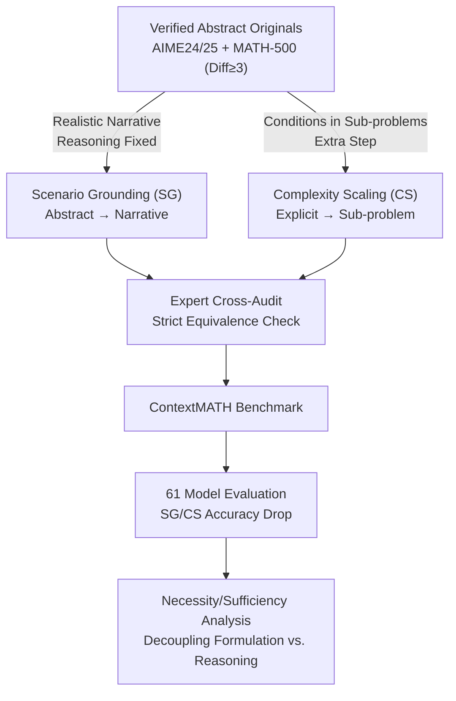

# From Abstract to Contextual: What LLMs Still Cannot Do in Mathematics

**Conference**: ICLR 2026  
**arXiv**: [2601.23048](https://arxiv.org/abs/2601.23048)  
**Code**: Not disclosed  
**Area**: LLM Reasoning  
**Keywords**: Mathematical Reasoning, Contextual Reasoning, Problem Formulation, benchmark, LLM Evaluation, AIME

## TL;DR

The authors propose the ContextMATH benchmark, which reveals that even top-tier models like GPT-5 and DeepSeek-R1 experience a 13-34% accuracy drop in contextual mathematical reasoning. By transforming AIME/MATH-500 abstract problems into Scenario Grounding (SG) and Complexity Scaling (CS) variants, the study identifies that errors primarily stem from problem formulation rather than computational reasoning.

## Background & Motivation

LLMs have approached near-perfect scores on mathematical benchmarks (AIME, MATH-500), even reaching IMO gold medal levels. However, these successes are confined to **well-formatted abstract problems** where equations and conditions are explicitly provided.

Real-world mathematical applications (financial analysis, scientific research, engineering design) rarely appear as ready-made equations; they typically require **extracting the mathematical core from concrete narrative scenarios before solving**. This ability is defined by the authors as **Contextual Mathematical Reasoning**.

Existing benchmarks focus almost entirely on abstract problems (GSM8K, MATH, AIME), and even those containing simple narratives (e.g., "Jack had 8 pens...") are superficial. This leaves a critical question: **Can the strong performance of LLMs on abstract benchmarks translate to contextual mathematical problems requiring modeling?**

Since collecting real-world mathematical problems is costly and difficult to scale, the authors adopt a **controlled transformation strategy**—systematically converting each problem from existing benchmarks (ensuring correctness) into contextual variants.

## Method

### Overall Architecture

ContextMATH does not collect data from scratch but builds upon the verified AIME 2024, AIME 2025, and MATH-500 (retaining only difficulty ≥3) datasets. Controlled rewriting is applied to each abstract original problem to derive two contextual variants, followed by human auditing. The pipeline consists of four steps: first, generating variants along two paths—Scenario Grounding (SG), which embeds the abstract structure into a realistic narrative without increasing reasoning volume to test if the model can "read the mathematical core from context," and Complexity Scaling (CS), which hides explicit conditions within sub-problems requiring extra reasoning to test if the model can "recover conditions before solving." Next, three experts cross-audit each variant to ensure strict equivalence with the original. Variants are compiled into ContextMATH to evaluate 61 models, observing accuracy drops relative to the original. Finally, a Necessity/Sufficiency framework is used to decouple the contributions of "formulation" and "reasoning" to locate the bottleneck.

### Key Designs

**1. Scenario Grounding (SG): Embedding abstract structures in realistic narratives to isolate contextual understanding.**

Real-world problems rarely appear as equations, but existing benchmarks fail to test the model's ability to translate narratives into mathematics. SG uses multi-step prompting to guide an LLM (o1-mini) to map each abstract element to a real entity—e.g., "variable $x$" to "initial fuel barrels"—and defines interaction rules based on the original properties. The model then self-verifies and iterates to ensure logical equivalence. The mathematical core and solving steps remain identical; thus, any drop in SG performance is attributed solely to "failure to understand the scenario."

**2. Complexity Scaling (CS): Hiding conditions in sub-problems to test condition recovery.**

Key values in real tasks are often not provided directly but must be inferred. CS encodes the original conditions as solutions to simple, self-contained sub-problems, forcing the model to perform an extra reasoning step to recover the original parameters. Strategies include encoding values as solutions to number theory or combinatorics problems, replacing explicit constants with variables determined by data points, or restating geometric relationships as physical descriptions. Since sub-problems are simple, the added burden is strictly on "recovering conditions," decoupling it from computational difficulty.

**3. Expert Cross-Audit: Ensuring strict equivalence of variants.**

To prevent ambiguity, each variant is independently reviewed by three experts with advanced degrees and competition math backgrounds. They evaluate narrative clarity, verify that no extra complexity is introduced, and independently re-model the scenario to ensure it is solvable and equivalent to the original. Variants are also tested on Gemini and GPT-5; failures are diagnosed for ambiguity. Acceptance requires unanimous expert agreement.

**4. Necessity/Sufficiency Analysis Framework: Decoupling responsibilities of "Formulation" and "Reasoning."**

Accuracy alone does not distinguish between "failing to list the equation" and "calculating incorrectly." Let $F$ denote correct formulation and $R$ denote correct final reasoning. Formulation accuracy is the ratio of correct translations. Two conditional probabilities are defined:

$$\text{Formulation Necessity} = P(F=\text{True} \mid R=\text{True}), \qquad \text{Formulation Sufficiency} = P(R=\text{True} \mid F=\text{True})$$

Necessity measures how much a correct answer relies on correct modeling, while sufficiency measures the probability of a correct calculation given correct modeling. Comparison of these two metrics allows for bottleneck localization.

### Loss & Training

To test if synthetic scenario data can bridge the gap, the authors compare three SFT settings on the Qwen3-Base series: $\text{SFT}_{\text{Ori}}$ (50k original data), $\text{SFT}_{\text{Syn}}$ (50k synthetic scenario data), and $\text{SFT}_{\text{Mix}}$ (100k mixture). They also attempt to train a "dedicated formulation model" to translate scenarios into formulas for a reasoning model to solve.

## Key Experimental Results

### Main Results

**Performance of top closed-source models on AIME (Single-pass accuracy %):**

| Model | AIME24 Ori | AIME24 SG | AIME24 CS | AIME25 Ori | AIME25 SG | AIME25 CS |
| :--- | :--- | :--- | :--- | :--- | :--- | :--- |
| DeepSeek-R1 | 93.3 | 70.0 (-25%) | 66.7 (-29%) | 86.7 | 73.3 (-15%) | 53.3 (-38%) |
| GPT-5 | 90.0 | 83.3 (-7%) | 80.0 (-11%) | 90.0 | 80.0 (-11%) | 66.7 (-26%) |
| Gemini 2.5 Pro | 83.3 | 73.3 (-12%) | 76.7 (-8%) | 83.3 | 56.7 (-32%) | 50.0 (-40%) |
| o3 | 83.3 | 70.0 (-16%) | 66.7 (-20%) | 76.7 | 70.0 (-9%) | 60.0 (-22%) |
| QwQ-plus | 86.7 | 56.7 (-35%) | 46.7 (-46%) | 73.3 | 53.3 (-27%) | 43.3 (-41%) |

**Open-source models (Average accuracy of 16 samples %):**

| Model | AIME24 Ori | AIME24 SG | AIME24 CS | AIME25 SG | AIME25 CS |
| :--- | :--- | :--- | :--- | :--- | :--- |
| Qwen3-32B | 81.2 | 67.9 (-16%) | 57.1 (-30%) | 54.4 (-22%) | 45.0 (-36%) |
| Qwen3-8B | 73.8 | 61.5 (-16%) | 42.9 (-42%) | 48.3 (-25%) | 35.8 (-45%) |
| Qwen3-4B | 70.4 | 52.5 (-25%) | 34.6 (-51%) | 39.6 (-38%) | 33.8 (-47%) |

On average, open-source models drop 13% on SG and 34% on CS; closed-source models drop 13% and 20% respectively.

### Ablation Study

**Modeling Ability Analysis (Key Models):**

| Model | Formulation Acc Avg | Formulation Necessity Avg | Formulation Sufficiency Avg |
| :--- | :--- | :--- | :--- |
| Qwen3-4B | 61.6 | 79.2 | 61.3 |
| Qwen3-8B | 73.8 | 83.8 | 60.7 |
| Qwen3-32B | 75.0 | 81.9 | 64.9 |
| GPT-5 | 81.4 | 85.6 | 82.7 |

**Training Experiments (Qwen3-14B-Base, average accuracy %):**

| Setting | Average |
| :--- | :--- |
| Base | 29.4 |
| + SFT_Ori | 55.5 (+26.1%) |
| + SFT_Syn | 60.4 (+31.0%) |
| + SFT_Mix | **61.3** (+31.9%) |

The attempt to train a dedicated formulation model failed; performance collapsed when using scenario-original paired data.

### Key Findings

1.  **Contextual complexity is a universal bottleneck**: Even GPT-5 drops 26% on AIME25-CS.
2.  **Scale mitigates but does not solve the problem**: The drop is 77% at 1.5B vs. 29% at 32B (CS), but the gap remains significant.
3.  **Error Analysis**: Formulation errors account for ~80%, far exceeding calculation or logic errors.
4.  **Formulation is a necessary condition**: Necessity is consistently higher than accuracy.
5.  **Formulation is not a sufficient condition**: Even with correct modeling, calculation failure remains a second hurdle.
6.  **RL specialization can be harmful**: Further SFT/RL improves scores on original problems but widens the contextual gap.
7.  **Scenario data training is effective but insufficient**: $\text{SFT}_{\text{Mix}}$ is optimal but a large gap remains.

## Highlights & Insights

1.  **Benchmark design concept is excellent**: SG and CS act as progressive probes to isolate contextual understanding and condition recovery.
2.  **Three-tier quantitative framework** (Accuracy-Necessity-Sufficiency) clearly characterizes dual bottlenecks.
3.  **Reveals a counter-intuitive phenomenon**: Specialized RL post-training may overfit to standard formats, weakening contextual reasoning.
4.  **Negative results are valuable**: The failure of dedicated formulation models suggests that modeling ability cannot be simply learned from paired data.
5.  **Extensive evaluation scale**: 61 models (46 open-source, 15 closed-source), including GPT-5.

## Limitations & Future Work

1.  **Limited benchmark scale**: Based on AIME and a subset of MATH-500, the data volume is relatively small.
2.  **Construction relies on LLM + human audit**: Difficult to scale massively.
3.  **CS variants were not built for MATH-500**: Simple problems were unsuitable for further conversion.
4.  **Closed-source models used single-pass evaluation**: API limits prevented multi-sample evaluation.
5.  Future work could expand to contextual reasoning in physics or economics.
6.  Exploration of curriculum learning strategies exposing both abstract and contextual variants during training is needed.

## Related Work & Insights

-   **GSM8K/MATH/AIME**: ContextMATH constructs variants directly from these benchmarks.
-   **Math-Perturb**: While others change surface parameters to test generalization, ContextMATH changes the fundamental presentation.
-   **SWE-bench/WebArena**: ContextMATH represents a similar attempt at real-world scenario evaluation for the mathematical domain.
-   Insight: Abstract ability $\neq$ application ability; this gap is particularly prominent in mathematics.

## Rating

-   **Novelty**: ⭐⭐⭐⭐ — The dual-dimension design of SG/CS and the analysis framework are novel.
-   **Technical Depth**: ⭐⭐⭐⭐ — Rigorous Necessity/Sufficiency framework.
-   **Experimental Thoroughness**: ⭐⭐⭐⭐⭐ — 61 models evaluated plus training experiments.
-   **Writing Quality**: ⭐⭐⭐⭐ — Clear structure and synthesized insights.
-   **Value**: ⭐⭐⭐⭐ — Directly guides the evaluation and training of LLM mathematical capabilities.
-   **Overall Recommendation**: ⭐⭐⭐⭐⭐ (4.5/5)

<!-- RELATED:START -->

## Related Papers

- [\[ICLR 2026\] Following the Navigation: Enhancing Small Language Models Contextual Reasoning with LLM Guidance](following_the_navigation_enhancing_small_language_models_contextual_reasoning_wi.md)
- [\[ACL 2026\] ChAIRO: Contextual Hierarchical Analogical Induction and Reasoning Optimization for LLMs](../../ACL2026/llm_reasoning/chairo_contextual_hierarchical_analogical_induction_and_reasoning_optimization_f.md)
- [\[ICML 2026\] Biases in the Blind Spot: Detecting What LLMs Fail to Mention](../../ICML2026/llm_reasoning/biases_in_the_blind_spot_detecting_what_llms_fail_to_mention.md)
- [\[ICLR 2026\] Learning What Reinforcement Learning Can't: Interleaved Online Fine-Tuning for Hardest Questions](learning_what_reinforcement_learning_cant_interleaved_online_fine-tuning_for_har.md)
- [\[NeurIPS 2025\] SAND-Math: Using LLMs to Generate Novel, Difficult and Useful Mathematics Questions and Answers](../../NeurIPS2025/llm_reasoning/sand-math_using_llms_to_generate_novel_difficult_and_useful_mathematics_question.md)

<!-- RELATED:END -->
