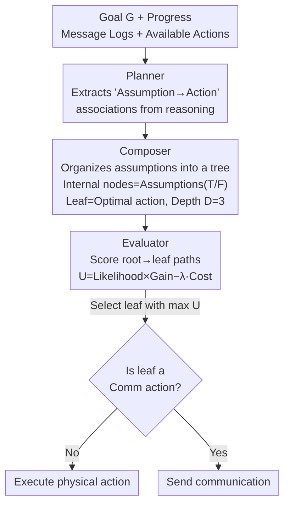

# From Assumptions to Actions: Turning LLM Reasoning into Uncertainty-Aware Planning

**Conference**: ICLR 2026  
**arXiv**: [2602.04326](https://arxiv.org/abs/2602.04326)  
**Code**: Available (Anonymous Supplementary Material)  
**Area**: LLM/NLP  
**Keywords**: Uncertainty-Aware Planning, LLM Multi-Agent Collaboration, Decision Tree, Partially Observable Environments, Communication Optimization

## TL;DR

The authors propose PCE (Planner-Composer-Evaluator), a framework that explicitly extracts implicit environmental assumptions from LLM reasoning chains and organizes them into decision trees. By employing a likelihood-gain-cost scoring mechanism for uncertainty-aware action selection, it significantly reduces communication overhead in multi-agent collaboration.

## Background & Motivation

In decentralized, partially observable multi-agent collaboration scenarios (e.g., two robots collaborating to prepare a meal), each agent perceives only a portion of the environment, facing pervasive uncertainty regarding hidden objects and collaborator intentions.

Existing LLM-driven multi-agent systems suffer from fundamental issues:

**Limitations of Prior Work**:
- **Over-reliance on Communication**: Methods like CoELA, REVECA, CaPo, and CoTS rely on repeated natural language dialogues to verify plans, exchange information, and iterate on optimization, leading to high token and time consumption.
- **Interruption of Human Workflows**: When the collaborator is human, frequent inquiries and reports disrupt established workflows.
- **Ineffectiveness of Scaling Alone**: Increasing model capacity or deepening reasoning chains does not fundamentally resolve uncertainty—without explicit mechanisms to identify and evaluate assumptions, LLMs still struggle to weigh competing environmental hypotheses.

**Key Insight**:
Two critical empirical observations drive the design:
- LLMs **implicitly generate assumptions about uncertain environments** during zero-shot CoT reasoning (e.g., "Food might be in the cabinet").
- These assumptions are **locally and implicitly referenced**, never explicitly aggregated for global decision-making, which prevents systematic reconciliation of multiple hypotheses.

## Method

### Overall Architecture

PCE addresses a classic problem in decentralized, partially observable collaboration: each agent sees only part of the environment and is uncertain about hidden objects and collaborator intentions, which previously could only be resolved through repeated communication. The Core Idea of PCE is to decompose the planning module into a three-stage pipeline: Planner, Composer, and Evaluator, situated between the memory module and the execution/communication module.

**Mechanism**: The Planner first extracts fragmented and implicit environmental assumptions along with their corresponding actions from the LLM reasoning chain; the Composer organizes these isolated assumptions into a comparable decision tree; the Evaluator then uses a unified utility function to score each path and select the optimal leaf node. Crucially, communication is treated as a standard option in the action space for scoring—determining "which assumption to verify" and "whether to expend communication" is reasoned out before execution, rather than defaulting to asking.

### Key Designs

**1. Planner: Extracting "Assumption-Action" Associations**

Under zero-shot CoT, LLMs naturally generate guesses about the environment while reasoning, but these guesses are scattered and isolated. The Planner receives the goal $G$, current progress, message logs, and available actions to produce candidate actions and their reasoning chains. Its function is to extract "assumption → action" local associations, such as "Useful items may be in the bathroom cabinet" corresponding to "Check the bathroom cabinet." This step prepares the raw materials—retaining the LLM's commonsense reasoning without prematurely reconciling competing hypotheses.

**2. Composer: Organizing Isolated Assumptions into a Decision Tree**

A single assumption cannot express conditional dependencies like "If it's not in the cabinet, what should I do?". The Composer assembles assumptions into a decision tree where internal nodes represent environmental assumptions (True/False branches) and leaf nodes represent optimal actions (physical or communication). The tree expands top-down using a local ranking strategy that prioritizes assumptions that best reduce uncertainty and influence action choices. If existing assumptions are insufficient, the Composer proposes new atomic assumptions based on context entities. Tree depth is limited to $D=3$ to balance expressiveness and overhead.

**3. Evaluator: Reducing Communication to a Standard Option via Unified Utility**

The Evaluator scores each root-to-leaf path based on three dimensions: Scenario Likelihood $\mathcal{L}(\mathcal{S})$ (estimated probability that the assumption path holds, given observations), Conditional Gain $\mathcal{G}(a)$ (how much action $a$ advances the goal if the assumption is true), and Execution Cost $C(a) = \alpha \cdot d(a) \cdot \mathbf{1}\{\text{move}\} + \beta \cdot \ell(a) \cdot \mathbf{1}\{\text{comm}\}$. These are combined into a final utility:

$$U(\mathcal{S}, a) = \mathcal{L}(\mathcal{S}) \cdot \mathcal{G}(a) - \lambda \cdot C(a)$$

Sorting leaves by $U$ yields the optimal action. The Novelty here is that communication is merely an atomic option; it is selected only when its utility exceeds physical actions. This differs fundamentally from CoELA or CoTS, which treat communication as a search heuristic, allowing PCE to reduce communication frequency to 10–20% of baseline levels.

### A Complete Example

Consider "searching for food": The Planner suggests candidate actions with assumptions. The Composer builds a tree with "Food is in the living room" as the root; the True branch leads to "Explore living room," while the False branch might spawn a new assumption "Bob might know the location," leading to "Ask Bob." The Evaluator calculates $U$ for both. If the likelihood of food in the living room is high, the utility of exploring outweighs the cost of asking, thereby saving a communication step.

### Loss & Training

PCE is a training-free inference-time framework. Default hyperparameters are $D=3, \alpha=1, \beta=1, \lambda=1, K_{\text{action}}=10, K_{\text{message}}=3$. Consistent configurations were maintained across GPT-4o mini, GPT-OSS:20B, and Gemma3:4B, demonstrating that its effectiveness stems from its structure rather than model-specific tuning.

## Key Experimental Results

### Main Results

**C-WAH Environment (Total Steps ↓ - Lower is Better)**:

| Method | GPT-4o mini | GPT-OSS:20B | Gemma3:4B |
|------|-------------|-------------|-----------|
| **Ours (PCE)** | **42.76** | **49.60** | **59.20** |
| CoELA | 60.40 | 72.72 | 77.20 |
| REVECA | 46.80 | 53.86 | 62.56 |
| CaPo | 60.82 | 68.34 | 75.88 |
| CoTS | 64.00 | 65.26 | 72.32 |

**TDW-MAT Environment (Transport Success Rate ↑ - Higher is Better)**:

| Method | GPT-4o mini Total | GPT-OSS:20B Total | Gemma3:4B Total |
|------|-------------------|-------------------|-----------------|
| **Ours (PCE)** | **87.50%** | **81.25%** | **70.83%** |
| CoELA | 62.50% | 55.00% | 45.84% |
| REVECA | 81.25% | 73.33% | 52.09% |
| CaPo | 73.33% | 65.41% | 67.50% |
| CoTS | 75.00% | 59.17% | 63.33% |

**Communication Frequency Comparison (PCE vs Baselines, GPT-4o mini)**:
- C-WAH: PCE 1.70 vs CoELA 9.88 / CaPo 8.72 / CoTS 10.24
- TDW-MAT: PCE 3.58 vs CoELA 13.33 / CaPo 70.79 / CoTS 108.92

### Ablation Study

**Component Ablation (C-WAH, GPT-4o mini)**:

| Variant | Total Steps ↓ | Token Consump. ↓ |
|------|---------|-----------|
| **Ours (PCE, Full)** | **42.76** | 44353 |
| w/o Planner | 56.46 | 139918 |
| w/o Composer | 46.82 | 33347 |
| w/o Evaluator | 47.34 | 44720 |

**Scaling Analysis**: When scaling Gemma3 from 4B → 12B → 27B, using only the Planner (without Composer+Evaluator) showed limited improvement. PCE consistently accelerated goal completion across all capacities.

### Key Findings

1. **80%+ Communication Reduction**: PCE's communication frequency is only 10-20% of baselines, yet task performance leads across the board.
2. **Controllable Token Usage**: Despite higher per-step reasoning costs, total episode length is shortened, making total token consumption comparable to baselines.
3. **Structure > Scaling**: Simply increasing model size or reasoning depth yields limited gains; structured uncertainty handling in PCE complements scaling.
4. **User Study Validation**: Participants rated PCE highest for efficiency and trust; selective communication was preferred over "always communicate" or "never communicate."

## Highlights & Insights

1. **Paradigm Shift**: Moves from "communication-driven coordination" to "structured hypothetical reasoning," treating communication as a standard action rather than a search mechanism.
2. **Assumptions as First-Class Citizens**: Explicitly modeling implicit LLM reasoning assumptions as decision variables provides a powerful abstraction.
3. **Contrast with ToT/CoTS**: While Tree of Thoughts (ToT) searches in the reasoning step space, PCE searches in the **assumption space**—different trees representing different concepts.
4. **Experimental Thoroughness**: Consistent verification through quantitative benchmarks, qualitative case studies, and user research.

## Limitations & Future Work

1. **LLM-Generated Assumptions**: Quality and coverage depend on the LLM's commonsense reasoning, potentially missing critical hypotheses.
2. **LLM-Dependent Scoring**: Likelihood and gain are estimated by the LLM rather than ground-truth probabilities, which may introduce bias.
3. **Simulation Constraints**: Validated primarily in simulated household environments (C-WAH, TDW-MAT).
4. **Fixed Tree Depth**: $D=3$ may be insufficient for complex long-horizon tasks; adaptive depth strategies remain an open area.
5. **Two-Agent Focus**: Large-scale verification with more than two agents (>2) is yet to be conducted.

## Related Work & Insights

- **Comparison with CoELA/REVECA**: While prior works exchange state and plan info via dialogue, PCE replaces most communication with structured internal reasoning.
- **Distinction from ToT**: ToT nodes are reasoning steps (cognitive space); PCE nodes are environmental assumptions (probabilistic state space).
- **Relation to DEC-POMDP**: PCE can be viewed as a practical approximation of Bayesian reasoning within the DEC-POMDP framework using LLMs.
- **Insight**: Structuring free-form LLM text into evaluable formal representations is a universal path to improving LLM decision-making beyond multi-agent scenarios.

## Rating

- Novelty: ⭐⭐⭐⭐⭐ — The paradigm shift of "assumptions as decision variables" is impactful.
- Experimental Thoroughness: ⭐⭐⭐⭐⭐ — Covers dual benchmarks, three backbones, component ablation, scaling analysis, and user studies.
- Writing Quality: ⭐⭐⭐⭐ — Problems are clearly defined, and the distinction from related work is precise.
- Value: ⭐⭐⭐⭐⭐ — Highly practical (80%+ comm reduction) and generalizable across models.

<!-- RELATED:START -->

## Related Papers

- [\[ICML 2026\] UCPO: Uncertainty-Aware Policy Optimization](../../ICML2026/llm_reasoning/ucpo_uncertainty-aware_policy_optimization.md)
- [\[ICLR 2026\] OpenEstimate: Evaluating LLMs on Reasoning Under Uncertainty with Real-World Data](openestimate_evaluating_llms_on_reasoning_under_uncertainty_with_real-world_data.md)
- [\[ICLR 2026\] PEAR: Phase Entropy Aware Reward for Efficient Reasoning](pear_phase_entropy_aware_reward_for_efficient_reasoning.md)
- [\[AAAI 2026\] Dropouts in Confidence: Moral Uncertainty in Human-LLM Alignment](../../AAAI2026/llm_reasoning/dropouts_in_confidence_moral_uncertainty_in_human-llm_alignment.md)
- [\[ICLR 2026\] Plan-Answer-Refine-on-Graph: Structured Planning and Self-Refinement for Large Language Model Reasoning on Knowledge Graphs](plan-answer-refine-on-graph_structured_planning_and_self-refinement_for_large_la.md)

<!-- RELATED:END -->
