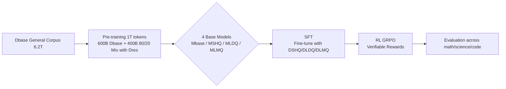

# Front-Loading Reasoning: The Synergy between Pretraining and Post-Training Data

**Conference**: ICLR 2026  
**OpenReview**: [https://openreview.net/forum?id=VmEkhV2yCX](https://openreview.net/forum?id=VmEkhV2yCX)  
**Code**: To be confirmed  
**Area**: LLM Reasoning / Training Data Configuration  
**Keywords**: Reasoning data, Pre-training, Supervised Fine-Tuning, Data scaling, Reinforcement Learning  

## TL;DR
Under a fixed reasoning token budget, this study systematically decomposes whether "reasoning data should be placed in pre-training or post-training." It finds that front-loading reasoning data into **pre-training** builds a persistent advantage that SFT cannot compensate for and proposes an asymmetric data allocation principle: "diversity for pre-training, quality for SFT."

## Background & Motivation
- **Background**: The current mainstream paradigm for enhancing LLM reasoning capabilities is to inject high-quality, long-CoT reasoning data during the **post-training** phase (mid-training / SFT / RL), treating reasoning as a specialized skill layered on a general base.
- **Limitations of Prior Work**: The role of reasoning data during the **pre-training** phase is virtually a blank space—pre-training corpora of frontier models are opaque, and end-to-end pre-training experiments are costly. Consequently, community research focuses on the more accessible post-training phase, lacking a systematic comparison of "when to feed reasoning data."
- **Key Challenge**: Under controlled token budgets, does early (pre-training) injection of reasoning data yield better results, or cause overfitting that harms generalization? Can subsequent SFT allow a "reasoning-poor" base to "catch up"? These questions are conflicting and unresolved.
- **Goal**: To conduct the first systematic study of the impact of reasoning data—in terms of **scale, diversity, and quality**—injected at **different training stages** on the final model (after RL), providing a data allocation guide for the entire training pipeline.
- **Core Idea**: **[Front-Loading Reasoning]** Front-load reasoning data into pre-training. Under a fully crossed experimental design strictly controlling the total reasoning token budget (80B), quantify the synergy, redundancy, and trade-offs between pre-training and SFT, concluding that "early investment yields compound returns."

## Method

### Overall Architecture
The authors formalize the problem as a **budget-constrained data allocation optimization**: given a fixed total reasoning data budget $B = |D^{PT}_{res}| + |D^{SFT}_{res}|$, find the optimal configuration for the pre-training side $D^{PT}_{res}$ and SFT side $D^{SFT}_{res}$ to maximize the expected accuracy $P(D^{PT}_{res}, D^{SFT}_{res}) = \mathbb{E}_{t\sim T}[\mathrm{Acc}(f_{\theta_{SFT}}(t))]$ on a downstream reasoning task set $T$. To this end, all experiments run on the same three-stage pipeline—**Pre-training → SFT → RL**—with a fully crossed comparison of carefully designed dataset variants.

### Key Designs

**1. Full Cross-Data Matrix: Decomposing "Quality × Diversity × Scale" into controllable variables.** The authors curate four datasets around reasoning data $D_{res}$ to decouple dimensions: the large-scale and diverse $D_{LDQ}$ (268M samples, 56% Math/17% Code/27% Science and General, mixed quality, representing "quantity over quality"), the small-scale high-quality $D_{SHQ}$ (1.2M strong teacher long-CoT samples, representing "high quality but narrow"), the mixed-quality union of the two $D_{LMQ}$, and the "complexity isolated" subset $D_{ALF}$ (7.1M) filtered by answer length >4096 tokens. Four base models are trained: a baseline with no reasoning data $M_{base}$, and $M_{LDQ}/M_{SHQ}/M_{LMQ}$, with their mean denoted as $M_{res}$. This matrix allows "early/late, diverse/high-quality" to become independent knobs.

**2. Controlled Token Budget and Ratio: Ensuring fairness across experiments.** All bases are pre-trained from scratch for 1T tokens—the first 600B uses $D_{base}$ exclusively, and the latter 400B uses a mix of 80% $D_{base}$ + 20% $D_{res}$. Thus, **all experiments share a constant 80B reasoning token budget**; small datasets (e.g., $D_{SHQ}$) are upsampled to maintain the same token count, isolating "what data and which stage" as variables. The base models use an 8B Mamba2 + Self-Attention + FFN hybrid Transformer, trained on 512 H100s.

**3. Three-stage Synergy + RL Sustainability Test.** After pre-training, each base undergoes SFT on different $D_{res}$ (4.8M samples, 32k context), forming a 4×3 cross-evaluation to test three hypotheses: the **Catch-Up Hypothesis** (can $M_{base}$ catch up via doubled SFT), the **Influence of Diversity** (broad vs. deep pre-training for SFT absorption), and the **Marginal Utility of SFT Quality**. Finally, **GRPO + verifiable rewards** (based on NEMOTRON-CROSSTHINK) are used for RL to check if early reasoning gains are sustainable and can translate into a decisive advantage in expert-level tasks like AIME.

## Key Experimental Results

### Main Results

Accuracy after pre-training (Table 1) and three-stage evolution (Table 2/3):

| Stage | Model | Avg | Math | Science | Code |
|------|------|------|------|------|------|
| Post-PT | Mbase | 52.70 | 47.17 | 47.13 | 40.89 |
| Post-PT | MLDQ | 64.09 | 75.56 | 54.38 | 49.94 |
| Post-PT | Mres (Mean) | 61.05 | 66.84 | 51.92 | 48.95 |
| Post-SFT | Mbase+SFT | 26.62 | 34.48 | 20.92 | 7.09 |
| Post-SFT | Mres+SFT | 35.92 | 40.61 | 34.77 | 16.75 |
| Post-RL | Mbase+SFT_SHQ+RL | 37.92 | — | — | — |
| Post-RL | MLMQ+SFT_SHQ+RL | 56.66 | — | — | — |

Pre-training creates an initial +8.35% average gap, which expands to +9.3% after SFT. After RL, MLMQ leads the baseline by **+18.57%**, with AIME competition math leading by as much as **+39.32%**—confirming "early investment, compound returns."

### Ablation Study

Catch-Up failure + latent value of high-quality data (Table 4):

| Model | Avg | Math | Note |
|------|------|------|------|
| Mbase + SFT_SHQ | 29.92 | 42.79 | Baseline |
| Mbase + SFT_SHQ (2× epochs) | 34.01 | 48.05 | Doubled SFT still fails to catch up |
| MSHQ + SFT_SHQ | 37.33 | 50.52 | Weakest reasoning base exceeds doubled baseline |
| MLDQ + SFT_SHQ | 46.70 | 60.79 | Advantage of diverse PT persists |
| MLMQ + SFT_SHQ | 50.95 | 64.67 | High-quality latent gain activated by SFT |

Pre-training ratio sensitivity (Table 6, MLMQ): Increasing $D_{base}:D_{res}$ from 80/20 to 60/40 improves the overall score from 64.07 to 67.28, with simultaneous increases in math/science/code and no degradation in general tasks.

### Key Findings
- **The Catch-Up Hypothesis is refuted**: $M_{base}$ with doubled SFT cannot catch up to even the weakest reasoning base, indicating SFT cannot replace the reasoning foundation established during pre-training.
- **Asymmetric Allocation Principle**: Pre-training favors **diversity and scale** (MLDQ's diversity brings +11% magnitude gain over MSHQ), while SFT favors **quality** (high-quality $D_{SHQ}$ brings +15% magnitude gain).
- **Latent Effect**: High-quality but narrow data yields almost no immediate benefit in the pre-training stage but "unlocks" an additional +4.25% gain after SFT (MLMQ vs. MLDQ).
- **Blindly expanding SFT is harmful**: Expanding SFT with large-scale mixed-quality data yields no average gain and decreases math accuracy by ~5%; however, increasing high-quality data by only 0.4% provides sustainable improvements.

## Highlights & Insights
- **Systematic study of "when to feed reasoning data" from first principles**: Conclusions are drawn under strictly controlled budgets, full cross-validation, and a three-stage pipeline (Pre-training/SFT/RL), offering a solid methodology that transcends the "more is better" intuition.
- **High operability of the Asymmetric Principle**: Distinct heuristics of "diversity for pre-training, quality for SFT" directly guide data procurement and allocation decisions.
- **Anomalous gains in science domains**: Unlike most post-training work that only impacts math, this study finds the most significant gap in **science**, suggesting early reasoning data helps the model build cross-domain transferable abstract/logical internal representations rather than just memorizing facts.
- **Discovery of Latent Effects**: The value of high-quality data is "delayed" until the alignment phase, revealing deeper synergistic mechanisms between pre-training and post-training.

## Limitations & Future Work
- Validated only on 8B hybrid architecture + 1T tokens (with 1.2B Transformer confirming trends); scaling laws for larger models or longer training remain to be confirmed.
- Reasoning ratio is an empirical knob; the optimal ratio varies by domain and dataset. Increasing the ratio strengthens reasoning but slightly harms instruction following (breadth–alignment trade-off), requiring systematic exploration per deployment domain.
- Dataset quality/diversity is defined by heuristics (answer length, source mix); lacks finer-grained quality metrics.
- The RL stage only compared two extreme bases; the RL behavior of intermediate configurations is not fully characterized.

## Related Work & Insights
- **Post-training reasoning paradigms** (Long-CoT SFT, Guha et al. 2025, etc.): This paper proves the ceiling of these methods is constrained by the pre-training base, serving as a supplement and boundary definition.
- **Pre-training/Mid-training reasoning injection** (Cheng et al. 2024, etc.): This study extends "small-scale CoT injection during mid-training" to "large-scale end-to-end pre-training injection" and quantifies synergy with post-training.
- **Insights for Practice**: Data engineering should shift from "independent stage-wise optimization" to "collaborative allocation across the pipeline"—prioritize diverse, large-scale reasoning corpora in pre-training to establish transferable priors, and use high-quality long CoT for targeted refinement in SFT, avoiding signal dilution with noisy data.

## Rating
- Novelty: ⭐⭐⭐⭐ First systematic study of cross-stage allocation under controlled budgets; asymmetric principles and latent effects are valuable new discoveries.
- Experimental Thoroughness: ⭐⭐⭐⭐ Three-stage design with multiple ablations and cross-architecture validation; limited to 8B scale.
- Writing Quality: ⭐⭐⭐⭐ Clear problem statement and actionable conclusions.
- Value: ⭐⭐⭐⭐ Provides direct guidance for data strategy in the industry.

<!-- RELATED:START -->

## Related Papers

- [\[ICLR 2026\] Understanding the Role of Training Data in Test-Time Scaling](understanding_the_role_of_training_data_in_test-time_scaling.md)
- [\[ICLR 2026\] Native Reasoning Models: Training Language Models to Reason on Unverifiable Data](native_reasoning_models_training_language_models_to_reason_on_unverifiable_data.md)
- [\[ICLR 2026\] Your Models Have Thought Enough: Training Large Reasoning Models to Stop Overthinking](your_models_have_thought_enough_training_large_reasoning_models_to_stop_overthin.md)
- [\[ICLR 2026\] OpenThoughts: Data Recipes for Reasoning Models](openthoughts_data_recipes_for_reasoning_models.md)
- [\[ICLR 2026\] ProofOptimizer: Training Language Models to Simplify Proofs without Human Demonstrations](proofoptimizer_training_language_models_to_simplify_proofs_without_human_demonst.md)

<!-- RELATED:END -->
