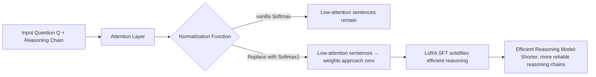

# FROST: Filtering Reasoning Outliers with Attention for Efficient Reasoning

**Conference**: ICLR 2026  
**OpenReview**: [https://openreview.net/forum?id=a9dngZLqGS](https://openreview.net/forum?id=a9dngZLqGS)  
**Code**: To be confirmed  
**Area**: Efficient LLM Inference / LLM Reasoning  
**Keywords**: Efficient inference, reasoning outliers, attention pruning, Softmax1, attention outliers, overthinking  

## TL;DR
Redundant sentences in reasoning chains with "low attention and low contribution" are defined as **reasoning outliers**. By replacing vanilla Softmax with Softmax₁ and performing lightweight SFT, large reasoning models can reduce reasoning tokens by approximately 70% while maintaining or even improving performance.

## Background & Motivation
**Background**: Large Reasoning Models (LRMs) such as DeepSeek-R1 and OpenAI o1 achieve strong performance in mathematics and coding through long-chain CoT. However, the "more thinking is better" training incentive causes them to generate excessive self-verification and repetitive backtracking steps—smaller models, in particular, are prone to "overthinking."

**Limitations of Prior Work**: Existing efficient reasoning methods have structural flaws. Token-level methods (TALE, R2R) truncate by tokens, but since reasoning naturally occurs in sentence units, they risk deleting critical steps; sentence-level methods (DRP, GRPO-S) utilize iterative refinement, introducing additional computational overhead and latency; prompt-based methods rely on manual token budgets, which are unstable for complex problems; SFT/RL-based methods require massive fine-tuning resources.

**Key Challenge**: How to accurately identify and remove "useless steps" without additional inference overhead or heavy retraining, while preserving the critical ones?

**Goal**: Provide a measurable definition for "useless steps" and design a mechanism with near-zero additional deployment cost to suppress them.

**Core Idea**: **[Observation]** LRMs assign high attention to key steps and low attention to useless steps, which often exhibit both low attention and low entropy. **[Definition]** Based on this, such sentences are named "reasoning outliers," and they are found to be homologous with known "attention outliers." **[Mechanism]** Replace Softmax with Softmax₁, which specifically addresses attention outliers—this pushes small weights toward 0 while preserving large weights, effectively "erasing" outlier reasoning steps at the sentence level. This efficient reasoning behavior is then solidified using a small amount of LoRA SFT.

## Method

### Overall Architecture
FROST is a two-part framework consisting of "activation function replacement + lightweight fine-tuning": replacing vanilla Softmax in Transformer attention with Softmax₁ (an outlier removal function) and performing limited LoRA SFT on math problems with detailed reasoning steps. This adapts the model parameters to the new activation and solidifies the behavior of "focusing only on key sentences." The modification only affects attention normalization and introduces no additional inference processes during deployment.

### Key Designs

**1. Reasoning Outliers: Transforming "useless steps" into measurable objects.** The paper performs an attribution analysis to pave the way for the definition: the reasoning process is segmented into question $Q$, reasoning steps $R_1, \dots, R_m$, and final answer $A$. For each sentence, the total attention flowing to the first token of the answer (`</think>`) is calculated as $W_{\text{trace}}=\sum_{t_i\in T_{\text{trace}}} a_{iA}$. Heatmaps and attribution experiments (Figure 2/3) show that while shallow attention is nearly uniform, only a few reasoning sentences contribute strongly in deep layers and later heads, while most sentences contribute minimally or zero. Thus, reasoning sentences with "low attention weight + negligible contribution to the final answer" are formally defined as reasoning outliers. The paper notes they share statistical characteristics (high infinity norm, high kurtosis) with attention outliers in neural networks, allowing for the use of similar mitigation tools.

**2. Sentence-level outlier suppression using Softmax₁.** The core replacement changes attention normalization from Softmax to Softmax₁:

$$\text{Softmax}_1(x_i)=\frac{\exp(x_i)}{\sum_j \exp(x_j)+1}$$

The extra constant $1$ in the denominator provides an "escape hatch" for attention—when a set of logits is small, weights are pulled toward 0 by this $1$, whereas large weights remain largely unaffected, achieving asymmetric contraction. This corresponds precisely to outlier removal: driving the weights of low-attention outlier sentences toward zero while preserving the high weights of key sentences. Unlike "bidirectional sharpening" activations like Sparsemax or Entmax15 that reduce both high and low weights, Softmax₁ performs **selective tail contraction**, avoiding damage to critical reasoning sentences.

**3. Theoretical Guarantees: Tail contraction and skipping at deployment.** The paper provides formal guarantees at the sentence level. Scaling token sequences into sentences $\{S_i\}$ and aggregating them via a monotonic pooling operator $\phi$ (sum/mean/max) yields sentence scores $s_i$, which are mapped via Softmax₁ $\sigma_1$ to sentence-level attention $\alpha=\sigma_1(s)$. A key assumption is that $\sigma_1$ satisfies **tail contraction**: there exists $\kappa \in (0,1)$ such that

$$\frac{\|\sigma_1(x)\|_\infty}{\text{median}(\sigma_1(x))}\le \kappa\,\frac{\|x\|_\infty}{\text{median}(x)}$$

This means the relative dominance of outliers is compressed (Theorem 5.1). Furthermore, for a low-attention sentence with $\alpha_i \le \varepsilon$, its single-layer contribution to output logits is bounded by $\|\Delta\ell_i\| \le B_o B_v \, \varepsilon$, and the overall influence remains $O(\varepsilon)$ after stacking $L$ layers (Theorem 5.2). This implies low-attention sentences are effectively "skipped" during inference, placing the empirical phenomenon that "removing outliers does not hurt or even enhances reasoning ability" (Figure 4) on a provable foundation.

**4. Lightweight Fine-tuning instead of training from scratch.** Previous uses of Softmax₁ to remove attention outliers required either pre-training from scratch or multi-step continual learning, both of which are costly. FROST starts directly from off-the-shelf pre-trained checkpoints, only replacing the activation function + cross-entropy loss + LoRA. A small number of fine-tuning steps suffices for adaptation, reducing training time by 42.2% compared to other SFT baselines, making the method accessible to users without massive compute resources.

## Key Experimental Results

### Main Results
Three backbones (Phi-4-Reasoning / GPT-OSS-20B / Magistral-Small-1.1) across four math OOD benchmarks (GSM8K / MATH500 / AIME24 / Minerva), reporting Pass@1 and token count #Tk. The following table highlights Phi-4-Reasoning on GSM8K and MATH500:

| Method | GSM8K Pass@1 | GSM8K #Tk | MATH500 Pass@1 | MATH500 #Tk |
|------|------|------|------|------|
| Base | 0.9242 | 1017.7 | 0.5480 | 1721.9 |
| TALE | **0.9500** | 1716.6 | 0.5800 | 1874.4 |
| DRP | 0.8340 | 721.0 | 0.6200 | 2122.0 |
| ThinkLess | 0.9279 | 1421.9 | 0.5414 | 1101.2 |
| **FROST** | 0.9311 | **154.3** | **0.5980** | **344.4** |

Average across three models: FROST improves accuracy by 26.70% and reduces token usage by 69.68% compared to the base. TALE occasionally achieves higher accuracy by increasing token usage significantly.

### Ablation Study
**Activation Function Ablation** (Phi-4-Reasoning, mean across four datasets):

| Activation Function | Average Pass@1 | Average #Tk |
|------|------|------|
| Base (Softmax) | 0.4472 | 1414.1 |
| Sparsemax | 0.4406 | 535.3 |
| Entmax state | 0.4751 | 471.7 |
| **Softmax₁ (FROST)** | **0.5169** | **449.9** |

**Outlier Metrics** (AIME2024, Phi-4-Reasoning): FROST reduces the maximum infinity norm $\|x\|_\infty$ from 35.31 to 29.67 (−15.97%), average kurtosis from 241.72 to 21.54 (−91.09%), and increases average sentence entropy from 2.71 to 3.07 (+13.28%).

### Key Findings
- **强 Correlation between outlier metrics and performance**: Higher infinity norm/kurtosis correlates with lower sentence entropy and inefficient reasoning—verifying the causal chain of "outlier removal = more efficient reasoning."
- **Selective contraction outperforms bidirectional sharpening**: Sparsemax/Entmax15 mistakenly delete key sentences by reducing both high and low weights; FROST’s unilateral tail contraction avoids this (Minerva is the only exception where Entmax15 slightly wins).
- **Generalization without performance loss**: On three OOD tasks (LeetCode / LiveCodeBench / UGPhysics), FROST maintains or improves performance because modifying only the activation and using LoRA results in minimal parameter shift.
- **Efficiency gains**: Inference time is reduced by at least 28.6%, and training time is 42.2% lower than other SFT baselines.

## Highlights & Insights
- **Clever conceptual transfer**: Transposing the "attention outlier" concept from NLP/quantization to "reasoning redundancy" is insightful. Finding they share the same origin allows for the direct application of Softmax₁, which is logical and efficient.
- **Single modification, full-chain benefit**: By changing only the normalization function without adding new inference pipelines or iterative refinement, the method achieves a 70% reduction in tokens with near-zero deployment cost.
- **Empirical-theoretical loop**: Moving from attention heatmaps → attribution experiments → outlier definition → tail contraction theorem → deployment skipping bounds creates a well-supported narrative for "removing redundancy without hurting performance."
- **Sentence-level focus**: Captured the structural fact that "reasoning naturally occurs in sentences," which is often ignored by token-level methods.

## Limitations & Future Work
- **Risk of deleting key low-attention steps**: The paper admits FROST may occasionally prune sentences that have low attention but are actually important, meaning accuracy is not always optimal—"low attention" is not strictly equivalent to "useless."
- **Strong theoretical assumptions**: Conditions like tail contraction, monotonic pooling, and near-constant operator norms in deep networks only approximately hold; the actual tightness of the $O(\varepsilon)$ bound requires further investigation.
- **Unexplained counter-examples**: Entmax15's superior performance on Minerva remains hard to explain.
- **Narrow task scope**: Training and evaluation focused on math; while code/physics generalization was tested, open-ended long-text or agentic reasoning is not yet covered.

## Related Work & Insights
- **Three Paradigms of Efficient Reasoning**: Prompt-based (TALE uses token budgets), SFT-based (DRP uses distillation pruning), and RL-based (SelfBudgeter, ThinkLess use rewards to penalize long chains). FROST proposes a fourth path—attention-based outlier removal, distinguished by zero extra cost at deployment.
- **Attention Outlier Research**: Inherits work from Hu et al. and Luo et al. regarding Softmax₁ for suppressing activation outliers but shifts the goal from "quantization-friendly" to "inference-efficient."
- **Contrast with KV-cache compression**: Think Clearly and R-KV also analyze sentence-level attention, but for redundant KV-cache compression; FROST performs fine-grained attribution of "how much each reasoning sentence contributes to the final answer."
- **Inspiration**: Treating "internal statistical outliers (infinity norm / kurtosis)" as proxy signals to indirectly control "output-level redundancy" is a reusable paradigm—it is worth considering what other "internal outliers" map to "external inefficiency."

## Rating
- **Novelty**: ⭐⭐⭐⭐ — The "reasoning outlier" concept + Softmax₁ migration is novel and theoretically grounded.
- **Experimental Thoroughness**: ⭐⭐⭐⭐ — Covers 3 backbones, 4 math sets, 3 OOD sets, and activation/outlier metric ablations; however, tasks are math-heavy and counter-examples lack explanation.
- **Writing Quality**: ⭐⭐⭐⭐ — Progressive logic from observation to definition to theory; clear charts, though some conclusions feel slightly hurried.
- **Value**: ⭐⭐⭐⭐ — Cutting 70% of tokens with zero deployment cost is highly practical for LRM deployment; the method is easily transferable.

<!-- RELATED:START -->

## Related Papers

- [\[ICLR 2026\] Attention as a Compass: Efficient Exploration for Process-Supervised RL in Reasoning Models](attention_as_a_compass_efficient_exploration_for_process-supervised_rl_in_reason.md)
- [\[ICLR 2026\] Whatever Remains Must Be True: Filtering Drives Reasoning in LLMs, Shaping Diversity](whatever_remains_must_be_true_filtering_drives_reasoning_in_llms_shaping_diversi.md)
- [\[ICLR 2026\] Echoes as Anchors: Probabilistic Costs and Attention Refocusing in LLM Reasoning](echoes_as_anchors_probabilistic_costs_and_attention_refocusing_in_llm_reasoning.md)
- [\[ACL 2026\] DELTA: Dynamic Layer-Aware Token Attention for Efficient Long-Context Reasoning](../../ACL2026/llm_reasoning/delta_dynamic_layer-aware_token_attention_for_efficient_long-context_reasoning.md)
- [\[ICLR 2026\] DRPO: Efficient Reasoning via Decoupled Reward Policy Optimization](drpo_efficient_reasoning_via_decoupled_reward_policy_optimization.md)

<!-- RELATED:END -->
