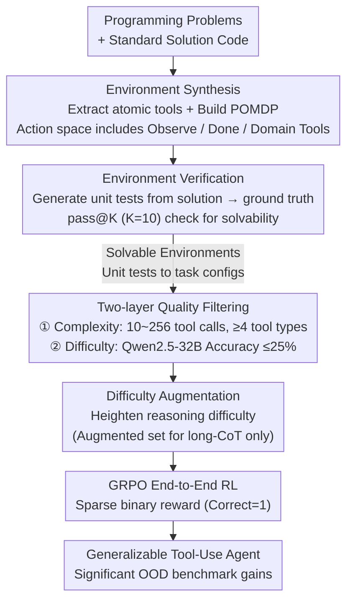

# Generalizable End-to-End Tool-Use RL with Synthetic CodeGym

**Conference**: ICLR2026  
**arXiv**: [2509.17325](https://arxiv.org/abs/2509.17325)  
**Code**: [StigLidu/CodeGym](https://github.com/StigLidu/CodeGym)  
**Area**: LLM Reasoning  
**Keywords**: tool-use, reinforcement-learning, LLM agent, synthetic environment, code-based training

## TL;DR

CodeGym is proposed to automatically transform programming problems into interactive multi-turn tool-use environments for reinforcing LLM agents. It achieves significant generalization improvements on out-of-distribution (OOD) benchmarks (e.g., +8.7 points for Qwen2.5-32B on $\tau$-Bench).

## Background & Motivation

Tool-augmented Large Language Models (LLM agents) expand their capabilities by calling external tools (databases, search engines, code executors, etc.). However, existing training methods face two bottlenecks:

1. **Limitations of Prior Work (SFT)**: Supervised Fine-Tuning relies on static trajectories. Generated data follows hand-crafted patterns with limited environment and task coverage, leading to poor generalization when facing new tools or unknown workflows.
2. **Limitations of Prior Work (RL)**: Existing RL training environments are restricted to narrow tasks (e.g., code debugging, information retrieval), limiting the potential of RL to promote generalization.

**Key Insight**: **Code naturally contains strict execution logic, which is highly isomorphic to the structure of real-world workflows**. For instance, a code pattern that loops until a condition is met resembles an iterative approval process in reality. Therefore, programming problems are ideal foundations for building diverse tool-use training environments.

## Core Problem

How to construct a **scalable, general-purpose RL environment** that enables LLM agents to acquire tool-use capabilities transferable to real-world tasks through active exploration and interaction?

## Method

### Overall Architecture

CodeGym addresses how to train generalizable tool-use capabilities. Existing training either relies on SFT with static trajectories or RL on narrow tasks, both of which struggle with new tools or workflows. Its **Core Idea** is that code execution logic (loops, conditionals, iterations until convergence) is highly isomorphic to real-world workflow structures. Thus, it automatically transforms programming problems with standard solutions into interactive POMDP environments. The data pipeline involves: extracting reusable atomic logic from solution code as tools, building the environment as a POMDP (environment synthesis); using the original solution to generate unit tests to verify solvability (environment verification); passing verified environments through a two-layer filter to remove overly simple, malformed, or already-solved configurations (quality filtering); and finally performing difficulty augmentation for long-CoT models to prevent shortcuts and feeding the remaining tasks into GRPO for end-to-end RL. This pipeline requires no human-labeled trajectories and can scale up to $13k$ environments and $80k+$ task configurations.

### Key Designs

**1. Gym Synthesis: Turning code logic into callable tools**

Current agent training environments either rely on static trajectories or narrow tasks, making generalization difficult. CodeGym takes programming problems and their solution code, extracts independent functions, computation tools, or common code snippets (e.g., loop bodies) as reusable atomic tools, and uses an LLM to generate precise documentation (function, parameters, examples) for each. Each environment is modeled as a POMDP $\mathcal{E} = \langle \mathcal{S}, \mathcal{A}, T, R, \mathcal{O} \rangle$, where the action space consists of general functions (Observe, Done) and domain-specific tools. Rewards are sparse and binary (1 for a correct final answer, 0 otherwise). A **Mechanism** detail is hiding examples in tool documentation during training, forcing the agent to explore and understand the actual behavior of each tool rather than copying examples, which is the source of transferable tool-use ability.

**2. Gym Verification: Ensuring solvability via unit tests**

Automatically synthesized environments might be unsolvable due to incomplete tool extraction or problem ambiguity, which would contaminate reward signals. CodeGym synthesizes unit test inputs covering various difficulties and edge cases, using the original solution to produce ground truth outputs. It then uses a pass@K strategy ($K=10$): 10 candidate solution functions are generated for an environment, and if any can pass all unit tests, the environment is deemed solvable and that function is recorded as the oracle solution. Verified unit tests are directly reused as task configurations for RL training, aligning "verifiable" and "trainable" criteria.

**3. Two-layer Quality Filtering: Balancing complexity and difficulty**

Solvability alone is insufficient; environments that are too simple or have malformed tool-use patterns do not help generalization. The first layer filters for tool-call complexity: using the oracle solution, it filters out configurations with fewer than $T_{\min}=10$ calls (too trivial) or more than $T_{\max}=256$ calls (often infinite loops), and requires at least 4 different tool types per environment. The second layer filters for difficulty: Qwen2.5-32B-Instruct evaluates each configuration 4 times, retaining only those with an accuracy $\le 25\%$. This results in a dataset of $13k$ environments and $80k+$ task configurations, averaging 6.52 tools and 44.07 steps per environment. Ablations show this filtering nearly doubles the average OOD Gain from $+3.9$ to $+7.3$.

**4. Difficulty Augmentation: Preventing shortcuts in long-CoT**

Long-CoT models may bypass tools by using pure reasoning once they have complete info. CodeGym intentionally increases the difficulty of the pure reasoning path at task initialization, forcing the model to engage in the interaction process. During training, long-CoT models use the augmented harder set, while short-CoT models use the original set, ensuring tool-use capabilities are truly learned.

### Loss & Training

The GRPO algorithm is used with a batch size of $512 \times 8$. To prevent environment interactions from slowing down the GPU, the framework decouples the CPU-side environment server from the GPU-side rollout for distributed execution. Robustness is ensured via a Trial-then-Overwrite mechanism: the environment state is serialized and a tool call is attempted in a sub-process; only successful calls commit the new state, while failures roll back and return error messages. A maximum call limit $T_{\max}$ prevents agent idling in error-retry loops.

## Key Experimental Results

### Models & Settings

- Short-CoT: Qwen2.5 series (7B/14B/32B/72B)
- Long-CoT: QwQ-32B
- Training steps: $\le 32B$ models saturate at ~100 steps, 72B at ~50 steps

### OOD Benchmark Results

| Model | $\tau$-airline | $\tau$-retail | $\tau^2$-bench | ALFWorld | ZebraLogic | MMLU-Pro | Average |
|------|-----------|----------|----------|----------|------------|----------|------|
| Qwen2.5-32B-Instruct | 26.8 | 41.4 | 24.7 | 66.8 | 24.2 | 70.0 | 42.3 |
| Qwen2.5-32B-Ours | **31.2** (+4.4) | **54.4** (+13.0) | **30.7** (+6.0) | **80.8** (+14.0) | **29.0** (+4.8) | **71.2** (+1.2) | **49.6** (+7.3) |
| QwQ-32B | 37.6 | 37.7 | 26.1 | 62.4 | 79.9 | 81.4 | 54.2 |
| QwQ-32B-Ours | **43.2** (+5.6) | **43.0** (+5.3) | **30.7** (+4.6) | **64.4** (+2.0) | 76.6 (-3.3) | 81.4 | **56.6** (+2.4) |

**Key Findings**:

- **Large models benefit more**: The 32B model sees an average Gain of $+7.3$, while the 7B gains only $+2.8$, suggesting larger models generalize rather than memorize.
- **Increasing tool calls**: Average tool-call counts per agent increase during training to approach the oracle, indicating the acquisition of more complete workflows.
- **Limitations of small models**: 7B models produce the most tool calls but mostly in repetitive failure-retry loops, exposing insufficient error diagnostic capabilities.

### RL vs. SFT Comparison

- Oracle-SFT and Distillation-SFT perform adequately in-domain but show **significant degradation** on OOD tasks.
- RL training is the key to achieving generalization; SFT is not a substitute.

### Ablation Study on Filtering

- Without Filtering (CodeGym-Full): OOD Average 46.2 (+3.9)
- With Filtering (CodeGym-Filter): OOD Average 49.6 (+7.3), nearly doubling the gain.

## Highlights & Insights

1. **Novelty**: Utilizing the structural similarity between code execution logic and real-world workflows to convert programming problems into general agent environments is a clever and natural idea.
2. **Complete Pipeline**: Covers data collection, environment synthesis, verification, quality control, to distributed RL training, forming a closed-loop system.
3. **Significant OOD Generalization**: Large gains are achieved even on tasks semantically distinct from the training environment (retail customer service, home navigation).
4. **Scalability**: $13k$ environments and $80k+$ task configurations far exceed existing agent training efforts.
5. **Convincing Qualitative Analysis**: Post-training agents demonstrate stronger multi-step planning before acting (e.g., in ALFWorld).

## Limitations & Future Work

1. **Environment diversity limited to code**: Despite rich logic, there is a lack of environments involving non-text modalities like vision or physical interaction.
2. **Slight regression in Long-CoT reasoning**: QwQ-32B dropped 3.3 points on ZebraLogic, suggesting a potential conflict between tool-use training and pure reasoning that requires joint optimization.
3. **Limited benefit for small models**: The 7B model only improved by 2.8 points and suffered from repetitive calls.
4. **Sparse reward signals**: Binary rewards for the final answer without process rewards may limit learning efficiency for long-sequence tasks.
5. **Multi-agent collaboration not explored**: All experiments follow a single-agent setting.

## Related Work & Insights

| Dimension | CodeGym | SWE-Gym | BrowseComp-Plus | ToolBench |
|---------|---------|---------|-----------------|-----------|
| Env Count | $13k$ | Low | Low | Large Dataset |
| Interactive | ✅ Multi-turn | ✅ Debugging | ✅ Web search | ❌ Static data |
| Generality | High (Code → General) | Low (Code only) | Low (Search only) | Medium |
| RL Support | ✅ Full GRPO | Limited | Limited | ❌ |
| Verifiable Reward | ✅ Unit Tests | ✅ | Partial | ❌ |

## Related Work & Insights

- The paradigm of **Code $\rightarrow$ General Agent Capability Transfer** is highly inspiring, similar to using "pre-training on code to improve reasoning," but extended to interactive agents.
- This work aligns with the RLVR (Reinforcement Learning with Verifiable Reward) trend, validating the effectiveness of verifiable rewards in agent training.
- It could be combined with process reward models to introduce fine-grained supervision for long-sequence tool calls.
- It offers insights for agent benchmark design: environment diversity and complexity directly impact post-training generalization.

## Rating
- Novelty: 8/10 — Converting programming problems to interactive environments is fresh, though core tech (GRPO, POMDP) exists.
- Experimental Thoroughness: 9/10 — Multiple model scales, OOD evaluation, ablations, and qualitative analysis.
- Writing Quality: 8/10 — Clear structure, rich diagrams, and natural motivation.
- Value: 8/10 — Provides a scalable general environment generation scheme for agent training with high practical value.

<!-- RELATED:START -->

## Related Papers

- [\[ICLR 2026\] SimpleTIR: End-to-End Reinforcement Learning for Multi-Turn Tool-Integrated Reasoning](simpletir_end-to-end_reinforcement_learning_for_multi-turn_tool-integrated_reaso.md)
- [\[CVPR 2026\] Latent Chain-of-Thought World Modeling for End-to-End Autonomous Driving](../../CVPR2026/llm_reasoning/latent_chain-of-thought_world_modeling_for_end-to-end_autonomous_driving.md)
- [\[ICLR 2026\] TUMIX: Multi-Agent Test-Time Scaling with Tool-Use Mixture](tumix_multi-agent_test-time_scaling_with_tool-use_mixture.md)
- [\[ICLR 2026\] THOR: Tool-Integrated Hierarchical Optimization via RL for Mathematical Reasoning](thor_tool-integrated_hierarchical_optimization_via_rl_for_mathematical_reasoning.md)
- [\[ICLR 2026\] Attention as a Compass: Efficient Exploration for Process-Supervised RL in Reasoning Models](attention_as_a_compass_efficient_exploration_for_process-supervised_rl_in_reason.md)

<!-- RELATED:END -->
