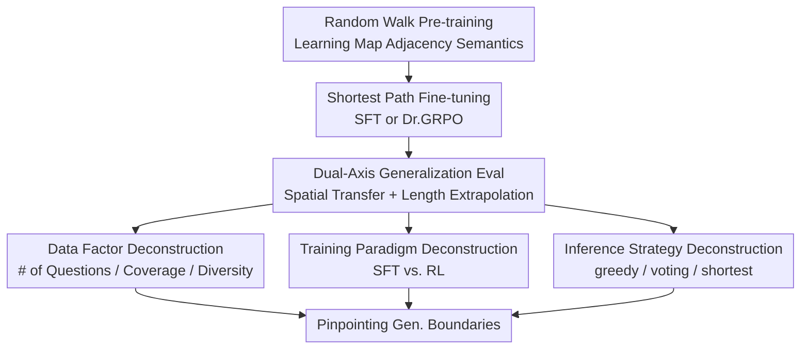

# Generalization in LLM Problem Solving: The Case of the Shortest Path

**Conference**: ICLR2026  
**OpenReview**: [https://openreview.net/forum?id=RnRHNEeqvI](https://openreview.net/forum?id=RnRHNEeqvI)  
**Code**: https://github.com/privacytrustlab/PathGeneralization  
**Area**: LLM Reasoning / Systemic Generalization / Length Extrapolation  
**Keywords**: Shortest Path, Systemic Generalization, Length Extrapolation, Data Coverage, Reinforcement Learning  

## TL;DR

This paper uses a controllable synthetic environment of shortest paths to decompose the sources of generalization in LLM problem solving. It finds that models can transfer learned local rules to unseen maps, yet fail on longer paths due to the instability of recursive composition. Data coverage determines the upper bound of performance, while RL primarily stabilizes training rather than extending the limit, and test-time sampling merely raises the curve without solving the length extrapolation issue.

## Background & Motivation

**Background**: The reasoning capabilities of LLMs are typically evaluated on natural tasks such as mathematics, code, QA, and planning, often enhanced by post-training or inference strategies like SFT, RLVR, and test-time scaling. The problem is that training data, task distribution, inference prompts, and sampling strategies in these benchmarks are often entangled, making it difficult to determine whether a model's high score stems from learning reusable rules or memorizing distributional patterns.

**Limitations of Prior Work**: If a model fails on a math problem or a graph reasoning task, the failure could originate from multiple layers: insufficient coverage of training problem types, training methods failing to induce the correct algorithm, RL not providing new capabilities, insufficient search budget during inference, or even the test set not being truly decoupled from the training set. Natural language tasks are particularly problematic because "unseen problems" often still contain semantic proximity patterns seen during training, leading to an overestimation of systemic generalization.

**Key Challenge**: The central contradiction in LLM problem solving is that "being able to solve small local problems" does not equal "being able to stably compose them into longer solutions." Many sequential optimization problems satisfy compositionality: the optimal solution from $i$ to $j$ can be decomposed into sub-solutions from $i$ to $k$ and $k$ to $j$. However, whether a Transformer can truly reuse such rules recursively when generating long sequences cannot be answered by testing on the same length or distribution alone.

**Goal**: Ours aims to construct a sufficiently simple, verifiable, yet compositionally structured experimental arena to answer three questions: whether models can generalize across unseen spatial structures; if they can solve short paths, whether they can compose longer ones; and what roles data selection, training paradigms, and test-time strategies play in these two types of generalization.

**Key Insight**: The paper selects the shortest path problem as a representative composable sequential optimization problem. Its advantages are that the answers are precisely verifiable, path lengths are controllable, maps can be completely replaced, and inputs/outputs can be framed as a sequence generation task similar to LLMs: given a start and end point, the model directly generates a sequence of directional actions.

**Core Idea**: Use a "controlled shortest path world" to split LLM reasoning generalization into two axes—spatial transfer and length extrapolation—then intervene step-by-step with data coverage, SFT/RL training, and test-time sampling to pinpoint exactly which layer limits systemic problem solving.

## Method

### Overall Architecture

The paper does not propose a new reasoning model but rather a controllable diagnostic framework. The authors first treat map nodes as a "vocabulary world," using random walk pre-training to let a small LLaMA-style Transformer learn node adjacency semantics. Subsequently, SFT or RL is performed on shortest path samples within a training map. Finally, evaluation is conducted under two OOD conditions: one involving completely different unseen maps but with path lengths within the training range, and the other involving long-range problems where path lengths exceed the training upper bound.

The core of this framework is making everything a controllable variable: training data can vary in "number of questions vs. number of answers," "coverage vs. diversity," and "inclusion of slightly longer paths." The training paradigm compares SFT with Dr.GRPO, and the inference phase compares greedy, majority-of-10, and shortest-of-10. Since shortest paths have unambiguous answers, the authors can use success rates and error decomposition to directly judge whether the model is unable to move, unable to reach the destination, or able to move but not via the shortest path.

### Key Designs

**1. Dual-Axis Shortest Path Testbed: Separating "Map Change" and "Length Change"**

The authors formulate the sequential optimization problem in terms of states, actions, transitions, goals, and global costs, emphasizing compositionality: if $k$ lies on the optimal trajectory from $i$ to $j$, then $Opt(i,j)=Opt(i,k)\circ Opt(k,j)$. Shortest paths perfectly satisfy this property, allowing them to test both whether the model has learned structural rules like "move towards the goal along adjacent edges" and whether the model can recursively apply these rules many times.

Evaluation is split into two orthogonal axes. Spatial transfer requires the test map $\hat{G}$ to differ from the training map $G$ in nodes, edges, sparsity, and size, with completely non-overlapping start-end pairs. success here indicates the model has not merely memorized node n-grams from the training map. Length extrapolation requires $\max l(D_{train}) \le \min l(D_{test})$, where test paths are strictly longer than all training paths; this examines the stability of recursive generation rather than the ability to switch maps. The success rate is defined as $SR=Pr[\hat{f}_\theta(i,j\mid G)=f(i,j\mid G)]$, where a predicted path is successful if it belongs to the set of shortest paths.

**2. Data Selection Intervention: Splitting Budget into Coverage, Diversity, and Connectivity**

To answer "what kind of data best leads to generalization," the paper does not just increase the total sample size but splits a fixed budget across three dimensions. The first set compares more distinct questions vs. more answers per question: as multiple shortest paths might exist for the same pair, the authors fix $N_{questions}\times N_{answers}=B$ to see if the budget should be allocated to more problems or more solutions. The result is clear: more distinct start-end pairs are more valuable than multiple solutions for the same problem.

The second set further decomposes the problems themselves into coverage and diversity. Coverage is how many unique nodes in the training map are covered by the training problems, $c=|V_{train}|/|V|$; diversity is the average number of different endpoints paired with each covered node, $d=|supp(D_{train})|/|V_{train}|$. This definition is crucial as it separates "seeing more primitives" from "performing more combinations on the same set of primitives." Experiments show that coverage determines the spatial transfer limit, while diversity only needs to cross a small threshold; blindly increasing diversity under low coverage may even encourage the model to memorize combinations between a few nodes rather than abstract rules.

**3. Length Failure Decomposition: Distinguishing Difficulty Accumulation from Recursive Instability**

Failure in length extrapolation can be explained in two ways: one is that long paths naturally contain more difficult sub-problems, so error probabilities multiply; the other is that while sub-segments can be solved, the model cannot stably connect them into a complete long path. The authors use a clean decomposition: for each test path exceeding training length, they cut it into two sub-paths $Sub1$ and $Sub2$ that both fall within the training length range, then examine the long-path success rate:

$$
Pr(Long)=Pr(Long\mid Sub1\wedge Sub2)Pr(Sub1\wedge Sub2)+Pr(Long,\neg(Sub1\wedge Sub2)).
$$

If failure is mainly due to difficulty accumulation, the drop in $Pr(Sub1\wedge Sub2)$ would explain most of the failure. If it is due to recursive instability, $Pr(Long\mid Sub1\wedge Sub2)$ will drop significantly even if both sub-paths can be solved independently. Experiments show the latter drops more severely: from length group $(20,30]$ to $(30,40]$, $Pr(Sub1\wedge Sub2)$ only dropped from $0.846$ to $0.796$, but $Pr(Long\mid Sub1\wedge Sub2)$ plummeted from $0.811$ to $0.589$. This indicates the model is not simply dragged down by harder samples but becomes unstable when recursively applying learned rules.

**4. Training and Inference Strategy Disassembly: Verifying if RL and Test-time Scaling Extend Boundaries**

The RL portion uses Dr.GRPO with binary rewards based on whether the generated sequence is a valid shortest path. This setup is very RL-friendly as the verifier is accurate, requiring no human preferences or fuzzy rewards. The authors warm-start RL from different SFT checkpoints, vary rollout numbers, and compare one-pass vs. multi-pass; for length extrapolation, RL is run for approximately 20 epochs to contrast with extended SFT training.

The inference stage uses greedy, majority-of-10, and shortest-of-10. Majority-of-10 corresponds to self-consistency, while shortest-of-10 leverages the task objective to select the shortest among 10 sampled trajectories. This design answers a sharp question: is length failure merely a result of insufficient search, where the model has the capability but greedy decoding fails to find it? Results show that stronger inference strategies indeed raise overall success rates, with shortest-of-10 being particularly effective, yet the curves still decline continuously with length. RL models under the same inference strategy were even lower than SFT, suggesting RL did not open new solution spaces and might have compressed the trajectory diversity available for sampling.

### Loss & Training

The model is an 8-layer, 8-head, LLaMA-style Transformer with RoPE. The pre-training phase uses long random walk trajectories across all maps, aimed at letting the model learn node adjacency semantics without leaking shortest-path capabilities; subsequent experiments proved that the pre-trained model could generate valid paths but not shortest ones.

SFT samples follow the format `<s> i j : i E S E ... j </s>`, where $i,j$ are start and end points, and the answer is represented by direction tokens $E,W,N,S$ rather than node ID sequences. This prevents the model from memorizing paths via node n-grams. During SFT, the prompt prefix `<s> i j :` is not included in the loss. At test time, only the start and end points are provided, and the model continues by generating directional actions.

RL uses Dr.GRPO with binary rewards: $1$ if the generated sequence constitutes a valid shortest path from $i$ to $j$, and $0$ otherwise. Training prompts are identical to SFT, with rollout numbers set at 4, 8, 16, etc. During inference, besides greedy decoding, majority voting and shortest path selection from 10 samples are compared.

## Key Experimental Results

### Main Results

| Evaluation Dimension | Key Setting | Main Results | Conclusion |
|----------------------|-------------|--------------|------------|
| Spatial Transfer | Disjoint 30×30, 40×40, 50×40 maps outside training, path lengths within training range | Over 90% SR in strong configs; 94% average SR with 20% budget prioritizing distinct problems | Models truly transfer shortest path rules to unseen maps |
| Length Extrapolation | Path lengths exceeding maximum training length, within or across maps | SR drops rapidly beyond training length; failure occurs regardless of map change | Spatial generalization success does not imply recursive extension to longer horizons |
| Data Budget Allocation | Fixed record count, allocated between more questions vs. more answers | At low budget, 1-answer per question yields 94% SR, while 32-answers for fewer questions yields only 82% | Distinct questions are more valuable than multiple solutions for the same problem |
| MathQA Transfer Validation | Qwen2.5-7B-Instruct, ~1000 sample budget, comparing more questions vs. more solutions | gain: 0.70→0.82; physics: 0.68→0.77; more solutions only reached 0.72/0.70 | Data laws observed in synthetic environments hold for real math tasks |

### Ablation Study

| Config / Analysis | Key Metrics | Explanation |
|------|---------|------|
| Length Group $(20,30]$ | $Pr(Long)=0.774$, $Pr(Sub)=0.920$, $Pr(Sub1\wedge Sub2)=0.846$, $Pr(Long\mid Sub1\wedge Sub2)=0.811$ | Success on long paths primarily depends on stable composition once sub-paths are solvable |
| Length Group $(30,40]$ | $Pr(Long)=0.530$, $Pr(Sub)=0.893$, $Pr(Sub1\wedge Sub2)=0.796$, $Pr(Long\mid Sub1\wedge Sub2)=0.589$ | Sub-path success rates drop slightly, but compositional success drops sharply, supporting recursive instability |
| Adding Slightly Longer Paths | Adding ~1% of $l=32,34$ samples leads to ~90% SR for target length 30 | Length extrapolation requires neighboring longer samples to provide curriculum-like signals |
| Adding Too Short/Long Paths | $l=22,24$ helps little; $l=80$ actually degrades performance | Not any more data is effective; length signals must be near the target interval |
| Extending SFT | Initial improvement, followed by rapid overfitting | SFT reaches high peaks but is unstable with prolonged training |
| Extending RL | Curve stabilizes but never exceeds best SFT | RL stabilizes training but does not extend the capability ceiling |
| Test-time shortest-of-10 | Overall success rates shift upward but still decline with length | Test-time scaling only releases portion of existing capabilities; cannot eliminate length failure |

### Key Findings

- Spatial transfer and length extrapolation are two distinct capabilities. Models can achieve over 90% success on unseen maps, but success rates drop significantly once path lengths exceed the training interval.
- Length extrapolation failure stems primarily from recursive instability, not simply because long paths contain more difficult sub-segments. Even when both sub-paths are individually solvable, models struggle to generate a complete long path in one go.
- "Question coverage" in training data is more critical than "answer diversity." This holds for both shortest paths and MathQA: seeing more distinct problems and covering more primitives/operation-sets is more effective than providing many solutions for the same problem.
- The role of RL is more akin to preventing overfitting and steady-state optimization. It is more stable than SFT in long-term training but does not exceed the best SFT point and does not change the distribution of error types.
- Test-time sampling is not a silver bullet. majority-of-10 and shortest-of-10 improve absolute SR but cannot reverse the trend of performance degrading with length.

## Highlights & Insights

- The greatest strength of this paper is grounding the often-abstract debate of "LLM generalization" in controllable experiments. Although synthetic, shortest paths provide clean axes that are hard to achieve in natural tasks: maps can be completely swapped, lengths can strictly exceed training, and rewards are precisely verifiable.
- The decomposition of recursive instability is highly insightful. Many discussions attribute length extrapolation failure to "longer problems being harder," but the sub-path conditional success results here show: the model's issue is not an inability to solve short segments, but an inability to stably call those short-segment capabilities many times in succession.
- Data coverage conclusions are practical for training reasoning models. With a limited budget, instead of piling many CoTs onto a small set of problems, one should first expand primitive/skill coverage and then provide moderate structural diversity; this aligns with the High Coverage > High Diversity result in the MathQA case study.
- The RL conclusions are restrained. The paper does not claim RL is useless but notes that in tasks with clear verifiers, sufficient data, and a small gap between generation and verification, RL acts more as a stabilizer than a capability amplifier; this helps explain why different RLVR papers might reach opposing conclusions.
- The shortest-of-10 control is clever. Because the shortest path task has a clear objective, the authors could construct an inference selector more suited to the task than standard majority voting; that it still fails to solve length extrapolation demonstrates that the problem is not merely a decoding selection issue.

## Limitations & Future Work

- The primary limitation is that the experimental subjects remain synthetic maps and relatively small Transformers. While suitable for mechanistic attribution, the results may not directly translate to all performances of large models on open math, code, or agent tasks.
- Models generate paths via a direct-answer format without explicit intermediate reasoning or tool use. Real reasoning models often involve CoTs, scratchpads, search, and external verifiers, where length failure may manifest differently.
- The reward for the shortest path is almost perfectly verifiable, whereas real-world task rewards are often sparse, noisy, or not fully automatically determinable. In those scenarios, RL might be more valuable than observed here.
- Data coverage is defined by map nodes and MathQA operation-sets, which are clear primitives; automatically defining "concept coverage" in open tasks remains a challenge.
- A natural follow-up would be to extend this framework to explicitly decomposable tasks like code execution, theorem proving, program synthesis, or multi-step tool use to observe if recursive instability remains the primary bottleneck for length extrapolation.

## Related Work & Insights

- **vs. compositional generalization / SCAN / COGS**: Traditional compositional generalization tasks test new combinations of known primitives; Ours further controls compositional depth via shortest path length, allowing for a distinction between spatial composition and recursive length expansion.
- **vs. LLM graph reasoning benchmarks**: Many works put small graph structures in prompts for models to answer questions; Ours treats the map as a "vocabulary world" learned by the model, studying how training distributions shape reusable rules without explicitly providing graph structures in prompts.
- **vs. RLVR / GRPO reasoning papers**: Recent works suggest RL extends reasoning boundaries; Ours finds that in the shortest path scenario with a strong verifier, RL does not exceed best SFT, aligning more with an "existing capability stabilization" explanation.
- **vs. test-time scaling / self-consistency**: Self-consistency and best-of-N typically improve reasoning accuracy; Ours shows they increase the intercept but do not change the slope of length extrapolation, suggesting sampling gains should not be misinterpreted as true systemic generalization.
- **Implications for data construction**: For math, code, and planning datasets, it is worthwhile to first establish actionable primitive/skill coverage metrics before deciding on sampling budgets, rather than merely pursuing more answers, more CoTs, or higher sampling temperatures.

## Rating

- Novelty: ⭐⭐⭐⭐☆ Using shortest paths for controlled generalization diagnostics is straightforward but putting spatial transfer, length extrapolation, data selection, RL, and test-time sampling in one framework for disassembly is very clear.
- Experimental Thoroughness: ⭐⭐⭐⭐☆ Main experiments, data ablations, long-term RL training, inference strategies, and MathQA external validation are quite complete; the limitation lies in the controlled nature of model size and task type.
- Writing Quality: ⭐⭐⭐⭐☆ The paper progresses through research questions with clear takeaways; math and tables serve the arguments well, though some appendix information requires careful cross-referencing.
- Value: ⭐⭐⭐⭐⭐ Extremely insightful for understanding why "solving short problems does not equal solving long problems" and for prioritizing what training data should cover.

## Related Papers

- [\[ICLR 2026\] The Path of Least Resistance: Guiding LLM Reasoning Trajectories for Efficient Consistency](the_path_of_least_resistance_guiding_llm_reasoning_trajectories_for_efficient_co.md)
- [\[ICLR 2026\] The Path of Least Resistance: Guiding LLM Reasoning Trajectories with Prefix Consensus](the_path_of_least_resistance_guiding_llm_reasoning_trajectories_with_prefix_cons.md)
- [\[ICLR 2026\] $\textbf{Re}^{2}$: Unlocking LLM Reasoning via Reinforcement Learning with Re-solving](textbfre2_unlocking_llm_reasoning_via_reinforcement_learning_with_re-solving.md)
- [\[ACL 2025\] BPP-Search: Enhancing Tree of Thought Reasoning for Mathematical Modeling Problem Solving](../../ACL2025/llm_reasoning/bpp-search_enhancing_tree_of_thought_reasoning_for_mathematical_modeling_problem.md)
- [\[ICLR 2026\] OR-PRM: A Process Reward Model for Algorithmic Problem in Operations Research](or-prm_a_process_reward_model_for_algorithmic_problem_in_operations_research.md)

<!-- RELATED:END -->

<!-- RELATED:START -->

## Related Papers

- [\[ICLR 2026\] The Path of Least Resistance: Guiding LLM Reasoning Trajectories with Prefix Consensus](the_path_of_least_resistance_guiding_llm_reasoning_trajectories_with_prefix_cons.md)
- [\[ICLR 2026\] InT: Self-Proposed Interventions Enable Credit Assignment in LLM Reasoning](int_self-proposed_interventions_enable_credit_assignment_in_llm_reasoning.md)
- [\[ICLR 2026\] RL of Thoughts: Navigating LLM Reasoning with Inference-Time Reinforcement Learning](rl_of_thoughts_navigating_llm_reasoning_with_inference-time_reinforcement_learni.md)
- [\[ICLR 2026\] OR-PRM: A Process Reward Model for Algorithmic Problem in Operations Research](or-prm_a_process_reward_model_for_algorithmic_problem_in_operations_research.md)
- [\[ICLR 2026\] RLAD: Training LLMs to Discover Abstractions for Solving Reasoning Problems](rlad_training_llms_to_discover_abstractions_for_solving_reasoning_problems.md)

<!-- RELATED:END -->
