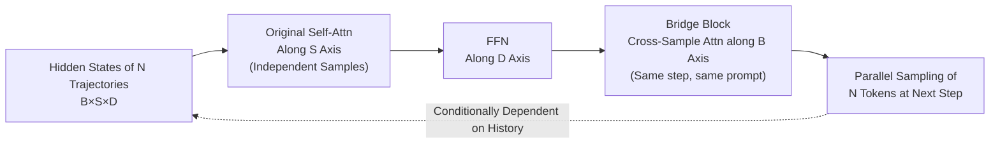

# Generalized Parallel Scaling with Interdependent Generations

**Conference**: ICLR 2026  
**OpenReview**: [https://openreview.net/forum?id=suU6kAP6c2](https://openreview.net/forum?id=suU6kAP6c2)  
**Code**: TBD  
**Area**: LLM Inference / Test-time Scaling  
**Keywords**: Parallel Sampling, Test-time Scaling, RLVR, Cross-sample Attention, Tensor Perspective  

## TL;DR
This paper proposes **Bridge**: treating $N$ parallel sampling trajectories of a single prompt as a unified 3-D tensor rather than independent slices. By performing "cross-sample attention" along the batch axis at each time step, $N$ generations exchange information. Adding only 2.8%–5.1% parameters improves the relative gain of RLVR by up to 39%, with a single training session generalizing to any generation width.

## Background & Motivation
- **Background**: LLM scaling during inference has two main axes—scaling generation length (long CoT) and increasing the number of generation paths (best-of-N, majority voting, synthetic data). The former allows each token to utilize the entire computational history, whereas the latter involves independent sampling.
- **Limitations of Prior Work**: The $N$ responses in parallel sampling are typically generated **independently**. Computational resources are fragmented into $N$ isolated parts, preventing useful intermediate information in one trajectory from being utilized by others, which makes parallel scaling much less efficient than length scaling.
- **Key Challenge**: Existing "mid-generation interaction" methods (Hogwild! Inference, Group Think, ParScale, etc.) converge the computational power of $N$ parallel processes into **a single output**, which is suitable for producing one answer but fails to generate a high-quality **set of responses** (which is precisely what best-of-N and synthetic data scenarios require).
- **Goal**: Develop a **fully parallel** method where $N$ threads simultaneously generate $N$ **interdependent** responses without requiring heavy post-training.
- **Key Insight**: **Tensor Perspective**—the hidden states in each LLM layer forward pass are essentially a $B\times S\times D$ 3-D tensor. Attention mixes information along the $S$ axis, and FFN along the $D$ axis, while the $B$ (batch) axis is intentionally kept independent. However, the batch in parallel sampling is **homologous and homogeneous** (originating from the same prompt), making it naturally suitable for information sharing. Thus, one only needs to append an attention module **along the batch axis** to allow tokens from the same prompt at the same time step to attend to each other.

## Method

### Overall Architecture
Bridge (Batch Reasoning with Interdependent Generations) inserts a lightweight "Bridge block" plus an input normalization layer after each FFN block, mirroring the original transformer block structure (with residuals). While standard self-attention performs $S\times S$ attention independently for each sample $b$, the Bridge block transposes the tensor to perform $B\times B$ attention independently for each token position $s$. This allows different generation trajectories of the same prompt to exchange information at every time step. Training occurs in two steps: first, an SFT "warmup" for the new blocks, followed by RLVR using GRPO.

### Key Designs

**1. Cross-sample Attention: Turning the batch axis from "independent" to "interdependent".** This is the core step. Given hidden states $X \in \mathbb{R}^{B\times S\times D}$, standard self-attention operates on each sample slice $[X]_{b,\cdot,\cdot}$ in the sequence dimension. The Bridge block does the opposite, using independent projections $W_{B,Q},W_{B,K},W_{B,V},W_{B,O}$ on each token position slice $[X]_{\cdot,s,\cdot}$ to compute $\text{Softmax}(\text{Mask}_B(Q_{B,s}K_{B,s}^\top))V_{B,s}W_{B,O}$, where the attention matrix is $B\times B$. Three deliberate differences from self-attention include: using a mask that **blocks cross-prompt and completed trajectory** information (unlike causal decoder masks); omitting **positional encodings** to ensure permutation invariance; and **not maintaining a KV cache** since it does not attend to historical tokens. This design allows horizontal information flow across homologous trajectories without introducing new memory bottlenecks.

**2. Markovian Interaction maintains parallel samplings.** Shared information poses a risk: if the current token depends on the current tokens of other trajectories at the same time step, parallel sampling becomes impossible. Bridge restricts interaction to a **Markovian** style—each time step only shares "features of currently generated tokens" to predict the next step. Consequently, the next token distribution changes from independent sampling $p(o_{b,s+1}\mid q, o_{b,1:s})$ to $p(o_{b,s+1}\mid q, \{o_{b',1:s}\}_{b'=1}^{B})$. Given all history, the next tokens of different trajectories remain **conditionally independent**: $(o_{b_1,s+1}\perp\!\!\!\perp o_{b_2,s+1})\mid\{o_{b',1:s}\}$, allowing $N$ tokens to still be sampled in one parallel pass. This echoes **axial attention** in computer vision—treating the batch tensor like an image and "generating new columns" autoregressively.

**3. SFT Warmup + RLVR: Zero-initialization, then train.** Bridge blocks are initialized to contribute zero, allowing direct application of RLVR; however, an SFT warmup is found to improve downstream performance. Warmup data is synthesized by sampling 8 trajectories per GSM8K problem using the original model, filtering out incorrect ones and problems with $\le 1$ correct paths, then placing multiple **correct** trajectories of the same problem into one batch. Only Bridge parameters are updated. Subsequently, RLVR is performed using GRPO (a token-level normalized variant from Yu et al. 2025), where advantage is $\hat A_i = \frac{r_i-\text{mean}(r)}{\text{std}(r)}$. Notably, the objective function remains unchanged, but because Bridge couples the logits of samples within the same group, the importance ratio $R_{i,s}(\theta)$ and the KL term naturally incorporate **cross-sample dependencies**, breaking the "trajectory independence" assumption of GRPO—gradients from one trajectory propagate through Bridge blocks to others in the group.

**4. Width Agnostic: Single training for any parallel width.** By omitting positional encodings, Bridge imposes no limits on the number of interacting trajectories $w$ (generation width). A model trained at one width (e.g., 4) can be tested with wider (8) or narrower (even $w=1$, which degrades to independent generation) widths. Results consistently outperform independent sampling when $w>1$; at $w=1$, performance sits between RLVR-only and P-Match, indicating the Bridge block **does not harm independent inference**. This allows seamless integration with any post-processing aggregation (Majority Voting, Best-of-N, Synthesis).

## Key Experimental Results

### Main Results (Pass@1 on 7 Math Benchmarks, Excerpts)

| Model / Method | MATH | AIME24/25 | AMC | Avg | ↑∆ |
|---|---|---|---|---|---|
| DS-Qwen-7B Base | 82.15 | 23.44 / 21.88 | 66.02 | 33.55 | 0.00 |
| RLVR only | 88.15 | 29.06 / 23.85 | 74.30 | 37.75 | 4.20 |
| P-Match (Equi-param MLP) | 86.80 | 28.85 / 25.73 | 70.47 | 36.68 | 3.13 |
| **Bridge** | 88.15 | **32.19 / 25.41** | **77.65** | **39.40** | **5.85** |
| DS-Qwen-1.5B Bridge | 81.30 | 20.11 / 20.00 | 60.55 | **31.25** | **5.32** |
| DS-Llama-8B Bridge | 80.15 | 24.76 / 18.18 | 66.36 | **32.47** | **5.83** |

Bridge improves the relative gain over the base model by **26% / 39% / 34%** more than the "next best method" across three models; returns increase with model size.

### Ablation Study

| Dimension | Result |
|---|---|
| **Width Generalization** (DS-Qwen-7B trained at $w=4$) | Test widths 2/4/8/16 all outperform P-Match; $w=1$ degrades to independent generation, outperforming P-Match (safe for independent inference). |
| **P-Match Comparison** | While an MLP with equal parameters can slightly improve RLVR, it is highly unstable (performance dropped on DS-Qwen-7B), proving Bridge's gains are **not just from added parameters**. |
| **Set Quality G-Pass@8τ** | Coverage and consistency lead across almost all $\tau$; on DS-Qwen-7B, the ratio of "all 8 paths correct for a competition problem" rose from 15.0% to 17.8%. |
| **Non-math Tasks** (Trained only on math) | No degradation and mostly improvements on XSum/CNN-DM, GPQA, ZebraLogic, and Countdown, showing capability transfer. |

### Key Findings
- Significant amplification of RLVR gains by adding only **2.8%–5.1%** parameters at minimal cost.
- Cross-sample information sharing simultaneously improves **single-path accuracy** and **set coverage/consistency**—making correct answers both more likely to appear and more frequent.
- Width Robustness: Training and testing widths do not need to match for stable gains.

## Highlights & Insights
- **Elegant Perspective Shift**: Reimagining the "parallel sampling batch" as a homogeneous 3-D tensor justifies "batch-axis attention." This is a dimension long "avoided" by the replacement of BatchNorm with LayerNorm, which the authors exploit via the specialized homogeneity of parallel sampling.
- **Architecture-Driven Objective Shift**: The GRPO objective remains untouched, yet Bridge naturally couples the logits/gradients of grouped trajectories. This "breaks" the independent trajectory assumption for free—a clever way to "use structure to change the algorithm."
- **Plug-and-play**: Focuses on the generation stage, remaining completely transparent to post-processing aggregation; it integrates seamlessly with majority voting, best-of-N, and synthetic data pipelines.

## Limitations & Future Work
- Evaluation is **concentrated on mathematical reasoning** (plus minimal non-math tasks); broader domains (code, agents, dialogue) remain unverified.
- Models tested only up to 8B; the scaling of gains for **larger models** needs verification.
- Training used GRPO + a single correctness reward; **RLHF / Preference Alignment** is only listed as a future direction.
- While cross-sample attention is lightweight, its actual VRAM and throughput overhead at extreme widths/sequence lengths, and its combination with early-exit/pruning methods, are left for future work.

## Related Work & Insights
- **Mid-generation Interaction**: Hogwild! Inference and Group Think share KV caches for collaboration; ParScale trains from scratch to fan-out and then aggregate—both converge to one output. Bridge maintains "N-in, N-out" full parallelism.
- **Post-processing Synthesis**: Majority voting, weighted voting, and distilling multiple responses via LLM—Bridge focuses on the generation stage and can be stacked with these.
- **High-order Tensors**: Borrowing axial attention and tensor decomposition ideas from CV to diffuse information throughout the entire hidden state tensor.
- **Insight**: When samples within a batch are homologous, the default "batch axis independence" assumption is worth revisiting; "using minimal parameters + architectural changes to amplify RL gains" is a cost-effective research paradigm.

## Rating
- **Novelty**: ⭐⭐⭐⭐⭐ Reformulating parallel sampling as a 3-D tensor and applying batch-axis attention is a fresh and self-consistent perspective, opening the relatively unexplored direction of "interdependent parallel scaling."
- **Experimental Thoroughness**: ⭐⭐⭐⭐ Covers 3 models × 12 benchmarks, including equi-param P-Match controls, width generalization, length extrapolation, set quality, and non-math transfer. Comprehensive but limited to $\le 8B$ and math-centric tasks.
- **Writing Quality**: ⭐⭐⭐⭐ Motivation—Tensor Perspective—Method progresses clearly. Figures 1 and 2 effectively convey core intuitions; formulas and mask details are well-documented.
- **Value**: ⭐⭐⭐⭐ Low cost, width-generalizable, and orthogonal to post-processing, providing direct practical value to best-of-N, synthetic data, and RLVR pipelines.

<!-- RELATED:START -->

## Related Papers

- [\[ACL 2026\] Parallel Test-Time Scaling for Latent Reasoning Models](../../ACL2026/llm_reasoning/parallel_test-time_scaling_for_latent_reasoning_models.md)
- [\[ICLR 2026\] Continuous Chain of Thought Enables Parallel Exploration and Reasoning](continuous_chain_of_thought_enables_parallel_exploration_and_reasoning.md)
- [\[ICLR 2026\] Mode-conditioning unlocks superior test-time compute scaling](mode-conditioning_unlocks_superior_test-time_compute_scaling.md)
- [\[ICLR 2026\] Think in Parallel, Answer as One: Logit Averaging for Open-Ended Reasoning](think_in_parallel_answer_as_one_logit_averaging_for_open-ended_reasoning.md)
- [\[ICLR 2026\] Test-Time Scaling with Reflective Generative Model](test-time_scaling_with_reflective_generative_model.md)

<!-- RELATED:END -->
