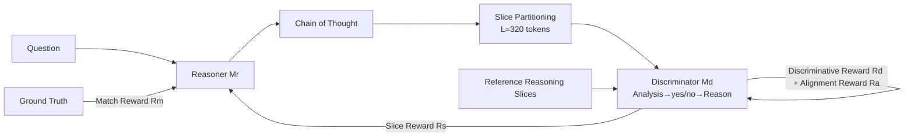

# Generative Adversarial Reasoner: Enhancing LLM Reasoning with Adversarial Reinforcement Learning

**Conference**: ICLR 2026  
**OpenReview**: [https://openreview.net/forum?id=ihucMuRXcY](https://openreview.net/forum?id=ihucMuRXcY)  
**Code**: TBD  
**Area**: LLM Reasoning / RL Post-training  
**Keywords**: Adversarial RL, Process Reward, Slice-level Evaluation, GRPO, Mathematical Reasoning  

## TL;DR
GAR places an LLM discriminator and an LLM reasoner into a GAN-like online adversarial reinforcement learning framework for joint training. By using "slice-level" dense process rewards to supplement sparse final answer rewards, it achieves stable improvements across the DeepSeek-R1-Distill series on multiple mathematical reasoning benchmarks.

## Background & Motivation
**Background**: LLMs with explicit Chain-of-Thought (CoT) have reached expert levels in mathematical reasoning but still frequently commit procedural errors—calculation mistakes, logical skips, or derivations that look plausible but are invalid. To score intermediate steps, the community primarily relies on two paths: Process Reward Models (PRM) and prompted LLM-as-a-critic.

**Limitations of Prior Work**: PRMs depend on expensive fine-grained human annotations, where labels are subjective and prone to calibration biases (over/under-rewarding). Prompt-based LLM evaluation is cheaper but often noisy, inconsistent, and lacks discriminative power. Both paths share a structural problem: **the evaluator is static and drifts out of alignment as the policy updates**, failing to keep pace with the evolving capabilities of the reasoner.

**Key Challenge**: One must either pay a high price for high-quality fixed annotations (expensive and prone to obsolescence) or use cheap but unreliable fixed evaluators (noisy). Neither can provide dense, online, on-policy process rewards aligned with current model behavior.

**Goal**: To provide dense, well-calibrated, on-policy step-level rewards without significantly increasing the computational budget, improving credit assignment and sample efficiency while avoiding reward hacking.

**Core Idea**: [Adversarial Joint Training] Maintain a step-level evaluator (discriminator), but allow it and the reasoner to **co-evolve** through GAN-like adversarial RL. The reasoner seeks logical consistency that the discriminator continuously validates, while the discriminator constantly recalibrates to the reasoner's current step distribution, ensuring reward signals remain aligned with model capability.

## Method

### Overall Architecture
GAR consists of two LLMs: a reasoner $M_r$ (generating CoT and final answers) and a discriminator $M_d$ (evaluating reasoning quality slice-by-slice). Training occurs in two stages: first, SFT is used to adapt the discriminator to an "Analysis-Score-Reason" output format, followed by joint optimization of the reasoner and discriminator under adversarial RL using GRPO. During inference, only the reasoner is used.

### Key Designs

**1. Computationally Efficient Sliced Evaluation: Decomposing long chains into verifiable short slices.** A full CoT often exceeds a thousand tokens; global scoring by a discriminator is slow, unreliable, and fails to localize errors. GAR partitions the reasoning trajectory based on delimiters and merges adjacent segments until a new semantic starting point appears or a preset length $L=320$ tokens is reached, resulting in slices of comparable length and semantic completeness. The discriminator provides a binary reward $r^s_i\in\{0,1\}$ (1 for logical consistency) for each slice $i$. The overall process reward is the mean $R_s=\frac{1}{n}\sum_{i=1}^{n} r^s_i$. This achieves two goals: short slices are easier to judge accurately, and $R_s$ becomes a continuous value—even if the final answer is wrong, the model can distinguish and reinforce better reasoning paths in RL, mitigating reward sparsity.

**2. GAN-like Dual-Reward Adversarial Joint Training.** The reasoner is optimized using GRPO with a reward that linearly combines exact matches with discriminator process terms: $R_{rea}=\lambda_1 R_m+\lambda_2 R_s$. The discriminator maximizes two complementary signals: a discriminative reward following the standard GAN objective $R_d=\mathbb{E}_{x\sim p_{ref}}[\log M_d(x)]+\mathbb{E}_{x\sim p_{gen}}[\log(1-M_d(x))]$, forcing it to distinguish between model-generated and reference slices; and an alignment reward $R_a$, measuring the consistency between slice-level judgments and final answer correctness, based on the assumption that "correct answers are more likely supported by logically consistent reasoning." The total discriminator reward is $R_{dis}=\lambda_3 R_d+\lambda_4 R_a$. In each batch, generated slices and an equal number of reference slices are mixed into a balanced set to train the discriminator, whose scores are then used to update the reasoner. The two models update alternately—embedding the adversarial dynamics of the discriminator into the training process to provide on-policy, fine-grained credit assignment.

**3. Truncated Discriminator with Analysis-Score-Reason to Suppress Overhead and Reward Hacking.** Directing the discriminator to generate a full CoT for every slice would introduce massive overhead. GAR modifies the discriminator workflow to "brief analysis → yes/no score $r^s_i$ → short reason" and limits the maximum generation length to $K=128$ tokens (the reason is primarily for interpretability; truncation occurs beyond this). Experiments show that truncating to 128 tokens results in almost no performance drop while significantly accelerating training. Additionally, a discriminator SFT stage is introduced: using GPT-o4-mini to annotate yes/no judgments and short reasons for 10% of the training data. After balancing positive and negative classes 1:1, the discriminator is fine-tuned to adapt to the new format while preserving native model capabilities. The alignment reward also acts as a regularizer—preventing the discriminator from drifting toward biased positive evaluations or the reasoner from learning "plausible but empty" steps.

## Key Experimental Results

### Main Results
Pass@1 across seven mathematical benchmarks (average of 30 samples per benchmark):

| Model | AIME24 | AIME25 | MATH500 | GSM8K | AMC23 | Olympiad | LiveMath-Hard |
|------|--------|--------|---------|-------|-------|----------|---------------|
| DS-R1-Distill-Qwen-7B | 54.0 | 38.0 | 94.3 | 90.6 | 90.3 | 52.5 | 18.4 |
| + GAR | **61.3** (+7.3) | **44.3** (+6.3) | 94.8 | 92.2 | 92.5 | 54.8 | **24.9** (+6.5) |
| DS-R1-Distill-Llama-8B | 43.7 | 30.3 | 88.1 | 82.9 | 84.5 | 48.2 | 18.5 |
| + GAR | **53.7** (+10.0) | 36.2 | 91.3 | 85.2 | 90.0 | 50.9 | 22.4 |

Qwen-7B uses a 1.5B discriminator, while Llama-8B uses itself as the discriminator due to the lack of smaller variants.

### Ablation Study
Ablation of components (Baseline: DS-R1-Distill-Qwen-7B):

| Configuration | AIME24 | AIME25 |
|------|--------|--------|
| 1 Baseline | 54.0 | 38.0 |
| 2 + Standard RL (Exact Match only) | 56.3 | 40.7 |
| 3 + Fixed Standard Critic | 56.7 | 40.4 |
| 4 + Fixed GAR Discriminator (Slice-level) | 58.6 | 42.0 |
| 5 + Trainable Discriminator (incl. Alignment Reward) | 59.4 | 42.8 |
| 6 + Trainable Discriminator (incl. Discriminative Reward) | 60.2 | 43.3 |
| 7 + Full GAR (Alignment + Discrimination + Joint) | **61.3** | **44.3** |

Efficiency ablation: The truncated GAR (19h) approaches the accuracy of the non-truncated version (43h) (61.3 vs 60.8) while being significantly faster; standard RL takes 16h for only 56.3.

### Key Findings
- **Slice-level evaluation is the primary driver of gain**: As seen in rows 2→4, restructuring the evaluator from "global scoring" to "slice-level consistency + short reason" provides stable gains, proving that dense process rewards improve credit assignment.
- **Dual discriminator rewards are complementary**: Both alignment and discriminative rewards are effective individually, but the combination is optimal—the former sharpens the distinction between right and wrong but is noisy due to reliance on final answer correctness, while the latter pulls the discriminator toward reference judgments to stabilize training.
- **Joint training raises the ceiling**: Performance jumps from row 4 (fixed discriminator) to row 7 (online joint training) suggest that as the reasoner improves, the discriminator learns to detect more subtle errors.
- **Selective entropy mechanism without entropy collapse**: While accuracy increased by +7.3, average entropy remained stable (5.20% vs 5.27%), indicating that entropy is pushed down on deterministic slices but exploration is preserved on critical decision slices.
- **Viability of removing final answer rewards**: Using only the discriminator to score the first 3 slices (without final-answer rewards) achieves 57.7 in just 6h of training (vs 56.3/16h for standard RL), unlocking tasks without verifiable answers like open-ended proofs.

## Highlights & Insights
- **Turning the reward model drift problem into a feature**: Whereas traditional methods fear the evaluator falling behind the policy, GAR allows the evaluator and policy to co-evolve adversarially. Drift becomes an "automatic curriculum"—the stronger the reasoner, the more critical the discriminator becomes.
- **Slices provide a clever granularity for CoT readability and dense rewards**: They are neither as fragmented and noisy as token-level rewards nor as sparse as global rewards. The $L=320$ length threshold balances semantic integrity with evaluative reliability.
- **The engineering insight of 128-token truncation is practical**: Reasons contribute little to the training signal (used only for interpretability); truncating them yields over 2x speedup, representing a high-ROI design choice.
- **Extensibility of the modular discriminator**: The discriminator could be replaced with teacher distillation, preference alignment, or reward shapers for formal logic, making the framework applicable far beyond mathematical reasoning.

## Limitations & Future Work
- **Discriminator SFT depends on GPT-o4-mini annotations**: Cold-starting format adaptation still requires a strong external model to generate yes/no labels, meaning it has not fully escaped reliance on high-quality supervision.
- **Noise source in alignment rewards**: $R_a$ depends on the correctness of the final answer for that trajectory. When the final answer is correct but the process is wrong (or vice versa), it provides misleading signals. The paper mitigates this with the discriminative reward but does not solve it fundamentally.
- **Experiments focused on mathematics**: While potential for code generation (appendix) and formal proofs is mentioned, the main text remains focused on math benchmarks; cross-domain generalization requires further validation.
- **Slice partitioning heuristics**: Partitioning based on delimiters and length thresholds is rule-based. Robustness to different writing styles and the stability of "semantic starting point" detection merit further study.

## Related Work & Insights
- **Process Supervision / PRM**: Compared to human PRMs (Lightman et al.) and MC automatic labeling (Math-Shepherd), GAR replaces static labels with online joint training, bypassing annotation costs and drift mismatch.
- **Self-play / Multi-agent / Game-theoretic Training**: Unlike "external opponent" routes like SPIN, SPAG, or Debate-style training, GAR embeds adversarial dynamics within a single training pipeline where the discriminator and policy co-evolve to provide on-policy credit assignment.
- **Transferring GAN concepts to RL Post-training**: Applying the discriminator objective from Goodfellow et al. to the real/fake distinction of reasoning slices is a direct and effective realization of the "generative adversarial" paradigm for LLM reasoning.
- **Insight**: In any post-training scenario where "reward model vs. policy drift" is an issue, allowing the reward model to co-evolve through online adversarial training may be more economical and stable than repeatedly retraining fixed reward models.

## Rating
- **Novelty**: ⭐⭐⭐⭐ Implementing GAN-style adversarial joint training via slice-level process rewards is clear and turns "evaluator drift" into an advantage; the combination is novel.
- **Experimental Thoroughness**: ⭐⭐⭐⭐ Solid results across two backbones, seven benchmarks, 30-sample averages, and multi-angle ablations (components, efficiency, entropy). However, predominantly restricted to the math domain; cross-task evidence is relatively thin.
- **Writing Quality**: ⭐⭐⭐⭐ The correspondence between motivation, challenge, and method is clear. The logic chain for charts and ablations is complete and readable.
- **Value**: ⭐⭐⭐⭐ Provides stable improvements on strong baselines with comparable training costs. The modular discriminator is highly extensible and offers practical reference value for the RL post-training community.

<!-- RELATED:START -->

## Related Papers

- [\[ICLR 2026\] Temperature as a Meta-Policy: Adaptive Temperature in LLM Reinforcement Learning](temperature_as_a_meta-policy_adaptive_temperature_in_llm_reinforcement_learning.md)
- [\[ICLR 2026\] TRAPO: Enhancing LLM Reasoning with Semi-supervised Reinforcement Learning](trapo_a_semi-supervised_reinforcement_learning_framework_for_boosting_llm_reason.md)
- [\[ICLR 2026\] NFT: Bridging Supervised Learning and Reinforcement Learning in Math Reasoning](nft_bridging_supervised_learning_and_reinforcement_learning_in_math_reasoning.md)
- [\[ICLR 2026\] Process-Verified Reinforcement Learning for Theorem Proving via Lean](process-verified_reinforcement_learning_for_theorem_proving_via_lean.md)
- [\[ICLR 2026\] Stabilizing Policy Gradients for Sample-Efficient Reinforcement Learning in LLM Reasoning](stabilizing_policy_gradients_for_sample-efficient_reinforcement_learning_in_llm_.md)

<!-- RELATED:END -->
