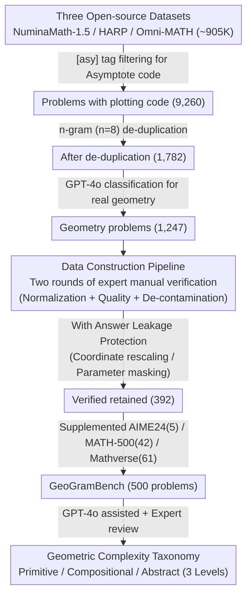

# GeoGramBench: Benchmarking the Geometric Program Reasoning in Modern LLMs

**Conference**: ICLR 2026  
**arXiv**: [2505.17653](https://arxiv.org/abs/2505.17653)  
**Code**: [GitHub](https://github.com/LiAuto-DSR/GeoGramBench)  
**Area**: LLM Reasoning  
**Keywords**: Geometric Reasoning, Program-to-Geometry, Benchmark, Spatial Reasoning, Asymptote Code

## TL;DR

This work formalizes the Program-to-Geometry task and introduces GeoGramBench (500 problems). Using a three-level geometric complexity taxonomy, it evaluates the ability of 19 state-of-the-art LLMs to construct geometric representations and reason from procedural plotting code. The study reveals that even GPT-5 achieves only 39.26% accuracy at the highest abstraction level, highlighting a fundamental weakness in LLM spatial abstraction.

## Background & Motivation

**Background**: Spatial reasoning is a foundational capability in human cognition and AI, supporting applications like robotics, autonomous navigation, and automated design. While LLMs have gained attention for interpreting geometric transformations and spatial relationships, their ability to perform geometric reasoning from procedural code has been largely overlooked.

**Limitations of Prior Work**: Existing benchmarks (e.g., MathVerse, GeoSense, Euclid) focus on visual geometric understanding. Although MATH-500 and AIME24 include a few problems with Asymptote code, they lack a systematic Program-to-Geometry evaluation. Crucially, current benchmarks fail to identify the **answer leakage** problem, where code parameters directly or indirectly expose the solution.

**Key Challenge**: Preliminary research indicates a significant performance drop in LLMs during the transition from code to spatial reasoning. DeepSeek-R1's accuracy on geometric problems with Asymptote code ($\mathbb{P}_{TC}$) plummeted by 23.5% (AIME24) and 10.9% (MATH-500) compared to text-only problems ($\mathbb{P}_T$). GPT-o1 and QwQ-32B show similar trends.

**Goal**: To formalize the Program-to-Geometry task definition and propose GeoGramBench—a curated set of 500 geometric problems featuring procedural plotting code, accompanied by a three-level geometric complexity taxonomy rather than traditional reasoning difficulty metrics.

## Method

### Overall Architecture

GeoGramBench formalizes "Program-to-Geometry" as a task: given a textual description and a segment of geometric plotting code (Asymptote or matplotlib), a model must internally parse the code, reconstruct the corresponding geometric representation, and then reason the numerical answer (length, area, volume, angle, ratio, or count) based on that representation. The methodology essentially comprises a **data construction pipeline**: it filters 900,000 candidate problems from three open-source math datasets to find real geometric problems containing plotting code. During the manual verification phase, it implements **answer leakage protection** to prevent shortcuts, finally labeling the retained 500 problems with **geometric complexity categories**.

### Key Designs

**1. Data Construction Pipeline: Filtering 500 reliable geometry problems from 900,000 candidates**

Since no off-the-shelf Program-to-Geometry benchmark existed, the authors extracted "high-quality geometry problems with plotting code" from massive mathematical datasets. The pipeline started with ~905K candidates from NuminaMath-1.5, HARP, and Omni-MATH. It first used `[asy]`/`[/asy]` tags to filter problems with Asymptote code (~1%, 9,260 problems), then applied n-gram ($n=8$) similarity for de-duplication to 1,782 problems. GPT-4o was then used as a classifier to identify 1,247 true geometry problems. Following two rounds of manual expert verification (4 experts with Master's degrees or higher), 392 problems were retained. Finally, additions from AIME24 (5), MATH-500 (42), and MathVerse Solid Geometry (61, manually converted to matplotlib) resulted in a total of 500 problems. This multi-source, multi-language approach makes GeoGramBench the largest and most diverse Program-to-Geometry benchmark to date.

**2. Answer Leakage Protection: Blocking shortcuts from code to answer**

The authors discovered that in MATH-500, many Asymptote code snippets directly or indirectly encode the answer in their parameters. Without intervention, models can retrieve the answer without geometric reasoning. Two types of leakage were addressed: **Direct Leakage**, where the answer is explicitly encoded as a coordinate (e.g., radius, segment length), was solved by rescaling coordinates to maintain the shape while erasing numerical clues. **Indirect Leakage**, where the answer is derivable from code parameters, was solved by modifying or masking those key parameters. Every problem underwent two rounds of verification by four experts to ensure answers cannot be obtained solely by inspecting the code. This makes "visualizing" the code a mandatory step.

**3. Geometric Complexity Taxonomy: Grading by "Visual Abstraction Difficulty"**

Traditional math benchmarks grade difficulty by reasoning chain length. However, the authors found this does not capture the bottleneck of Program-to-Geometry tasks. GeoGramBench uses three levels of geometric complexity: **Primitive Recognition** (1-2 geometric primitives like points/lines/circles, focusing on basic properties), **Local Relation Composition** (multiple local elements requiring spatial relationship integration), and **Global Abstract Integration** (involving spatial orientation, parameterization, recursion, 3D objects, rotation, folding, or projection). Taxonomy was completed via GPT-4o assistance followed by expert review.

A validation experiment on QwQ-32B using MATH-500 confirmed this: for text-only problems ($\mathbb{P}_T$), accuracy dropped as reasoning complexity increased (traditional pattern). However, for problems with code ($\mathbb{P}_{TC}$), accuracy was **nearly independent of reasoning complexity** but dropped significantly as geometric complexity increased. This proves that for "constructing geometric representations from code," the difficulty stems from visual abstraction rather than the reasoning chain.

## Key Experimental Results

### Main Results: 19 LLMs on GeoGramBench

| Model | Primitive | Compositional | Abstract | Overall Avg |
|------|-----------|--------------|----------|-------|
| **GPT-5** | **90.44%** | **84.59%** | 39.26% | **75.01%** |
| Qwen3-235B-Think | 89.09% | 79.12% | **49.05%** | 74.00% |
| GPT-o1 | 85.92% | 76.12% | 44.67% | 70.92% |
| GPT-o3-mini | 83.49% | 76.10% | 42.67% | 70.00% |
| DeepSeek-R1 | 84.68% | 75.13% | 40.86% | 69.17% |
| QwQ-32B | 85.17% | 73.12% | 37.92% | 67.12% |
| GPT-4o | 40.02% | 21.36% | 4.51% | 21.40% |
| DeepScaleR-1.5B | 65.44% | 47.89% | 15.76% | 43.83% |

**All models scored below 50% on the Abstract level**, with GPT-5 at only 39.26%.

### Ablation Study: Impact of Plotting Language

| Benchmark | Asymptote Code | Matplotlib Code | Difference |
|------|-------------|---------------|------|
| AIME24 (QwQ-32B) | ~X% | ~X% | < 1% |
| MATH-500 (QwQ-32B) | ~X% | ~X% | < 1% |

The choice of plotting language has almost no impact on performance; the bottleneck lies in spatial abstraction rather than code syntax understanding.

### Key Findings

- **Most Difficult Subtypes**: Angles were the hardest in Primitive/Compositional levels (requiring reconstruction of implicit spatial relations); Area and Volume were hardest at the Abstract level (requiring complete 3D spatial understanding).
- **Limited Effect of CoT**: Token Budget Forcing increased the token count by 77.4% (10,544 $\rightarrow$ 18,710) but only improved accuracy by 0.30% (54.60% $\rightarrow$ 54.90%), suggesting the bottleneck is not reasoning length but spatial representation construction.
- **Saturation in Domain Fine-tuning**: Adding 100 GeoGramBench training samples improved performance by 3.02%, but increasing from 100 to 300 samples only added 0.58%, indicating a bottleneck in model architecture rather than data volume.
- **Common Failure Modes**: (1) Preference for algebraic methods over geometric construction; (2) Rare use of auxiliary lines/points; (3) Difficulty judging spatial orientation (clockwise vs. counter-clockwise); (4) Confusion in mapping symbols to geometric elements.

## Highlights & Insights

- First to formalize the Program-to-Geometry task and build a dedicated large-scale benchmark.
- The validation of the geometric complexity taxonomy is highly persuasive—proving the difficulty source of this task differs from traditional mathematical reasoning.
- Identification and systematic protection against answer leakage is a major contribution, enhancing evaluation validity.
- Behavioral analysis (RQ1-3) provides deep insights into the internal geometric reasoning mechanisms of LLMs.
- The hypothetical "multi-stage internal geometric representation process" (Appendix H) provides a valuable framework for future research.

## Limitations & Future Work

- Currently only covers 2D and simple 3D geometry, excluding real-world 3D scenes.
- Failure mode analysis is primarily based on qualitative observation, lacking automated systematic diagnostic tools.
- While the 500-problem count makes it the largest Program-to-Geometry benchmark, the distribution across subtypes is uneven (e.g., only 27 problems for Volume).
- Only zero-shot settings were tested; the potential of few-shot or in-context learning remains unexplored.
- Fine-tuning experiments were conducted on a single model (s1.1-32B).

## Related Work & Insights

- **SGP-Bench** (Qiu et al., 2024) and **SVGenius** (Chen et al., 2025): Focus on SVG code understanding; GeoGramBench extends focus to geometric reasoning beyond mere code parsing.
- **s1: Simple Test-time Scaling** (Muennighoff et al., 2025): Token Budget Forcing shows limited effectiveness on GeoGramBench, suggesting test-time scaling offers little help for spatial reasoning.
- Insights for Multimodal Model Design: The current spatial abstraction capability of LLMs is a fundamental bottleneck; simply increasing data or reasoning length will not solve it, necessitating architectural innovations.

## Rating

- Novelty: ⭐⭐⭐⭐ First dedicated Program-to-Geometry benchmark with a theoretically supported taxonomy.
- Experimental Thoroughness: ⭐⭐⭐⭐⭐ Extensive evaluation of 19 models, including behavioral analysis, fine-tuning ablations, CoT analysis, and language comparisons.
- Writing Quality: ⭐⭐⭐⭐ Well-structured, research-question-driven analysis, with clear and abundant visualizations.
- Value: ⭐⭐⭐⭐ Reveals a fundamental weakness in LLM spatial reasoning, providing important guidance for future model design.

<!-- RELATED:START -->

## Related Papers

- [\[ICLR 2026\] USTBench: Benchmarking and Dissecting Spatiotemporal Reasoning Capabilities of LLMs as Urban Agents](ustbench_benchmarking_and_dissecting_spatiotemporal_reasoning_capabilities_of_ll.md)
- [\[ICLR 2026\] ShinkaEvolve: Towards Open-Ended and Sample-Efficient Program Evolution](shinkaevolve_towards_open-ended_and_sample-efficient_program_evolution.md)
- [\[ICLR 2026\] VisioMath: Benchmarking Figure-based Mathematical Reasoning in LMMs](visiomath_benchmarking_figure-based_mathematical_reasoning_in_lmms.md)
- [\[ICLR 2026\] LEXam: Benchmarking Legal Reasoning on 340 Law Exams](lexam_benchmarking_legal_reasoning_on_340_law_exams.md)
- [\[ICLR 2026\] FaithCoT-Bench: Benchmarking Instance-Level Faithfulness of Chain-of-Thought Reasoning](faithcot-bench_benchmarking_instance-level_faithfulness_of_chain-of-thought_reas.md)

<!-- RELATED:END -->
