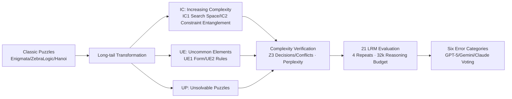

# HardcoreLogic: Challenging Large Reasoning Models with Long-tail Logic Puzzle Games

**Conference**: ICLR 2026  
**OpenReview**: [https://openreview.net/forum?id=8USxc43D3I](https://openreview.net/forum?id=8USxc43D3I)  
**Code**: [https://github.com/ljcleo/hardcore-logic](https://github.com/ljcleo/hardcore-logic)  
**Area**: LLM Reasoning / Logical Reasoning Benchmark  
**Keywords**: Large Reasoning Models (LRM), Logic Puzzles, Long-tail Variants, Reasoning Robustness, Memorization Shortcut, Unsolvable Puzzles  

## TL;DR
HardcoreLogic constructs a benchmark of 5,000+ atypical logic puzzles across 10 types by applying three long-tail transformations: "Increasing Complexity," "Uncommon Elements," and "Unsolvable Puzzles." It reveals that even state-of-the-art models like GPT-5 rely heavily on memorized patterns of classic problems, suffering significant performance drops when encountering these variants.

## Background & Motivation
**Background**: Logic puzzle games (Sudoku, Zebra Logic, etc.) have become mainstream testbeds for Large Reasoning Models (LRMs) due to their clear rules, controllable difficulty, and objective evaluation. SOTA models have consistently achieved high scores on benchmarks like Enigmata and ZebraLogic.

**Limitations of Prior Work**: Existing corpora almost exclusively cover classic problem types (e.g., standard 9×9 Sudoku), creating a severe imbalance between typical and atypical puzzles. Models may simply be "memorizing" solving patterns for classic formats rather than truly understanding rules. High scores potentially mask two defects: an inability to recognize non-classic forms of a puzzle, and a tendency to apply mismatched old strategies to new variants even when rules are understood.

**Key Challenge**: Genuine logical reasoning requires "flexibly applying appropriate rules to current conditions." However, existing benchmarks fail to distinguish between "actual reasoning" and "template memorization"—atypical variants in the long-tail distribution are blind spots for testing such flexibility.

**Goal**: Construct a benchmark that systematically deviates from classic puzzle types to push models out of their memorization comfort zone, thereby accurately exposing the real shortcomings of LRMs in rule understanding and strategy adaptation.

**Core Idea**: **Long-tail transformation**—instead of inventing new games, systematic perturbations are applied to common puzzles across three dimensions (increasing complexity, substituting rare elements, and creating unsolvability). This ensures problems are unlikely to appear in training data, stripping away "memorization gain" to isolate "reasoning gain."

## Method

### Overall Architecture
The construction of HardcoreLogic follows a pipeline: "Classic Problems → Three-Dimensional Transformation → Complexity Quantification & Verification → Multi-model Evaluation → Error Attribution." Base problems are sourced from Enigmata (8 sub-tasks), ZebraLogic, and a self-synthesized Tower of Hanoi, covering 10 puzzle types in 6 categories (ZebraLogic, Sudoku, Skyscraper, Kakurasu, Crypto, Navigation, Binario, Minesweeper, Hanoi, Hitori). Each puzzle undergoes one or more transformations, resulting in 5,250 problems. Complexity is verified using symbolic solvers (Z3 / Dijkstra) and perplexity metrics. Finally, 21 LRMs are evaluated with six types of error attribution.

### Key Designs

**1. Three-Dimensional Long-tail Transformation Taxonomy.** Transformations are categorized into three families. **Increasing Complexity (IC)** occurs via two paths: Search Space Expansion (IC1) inflates candidate states by reducing initial hints or enlarging boards—for instance, in Binario, emptying cells while maintaining a unique solution leads to a search space of $|S|=2^N$ for $N$ empty cells. Constraint Entanglement (IC2) lengthens reasoning chains by complicating interactions; for example, in Zebra Logic, replacing exact equalities like "Pet Dog = Soccer + 1" with relaxed inequalities like "Pet Dog > Soccer" forces the model to explore longer branches. **Uncommon Elements (UE)** modifies the surface rather than the logic: Form Variants (UE1) change symbols or board shapes (e.g., using letters in Sudoku or irregular grids); Rule Variants (UE2) rewrite or hybridize underlying rules (e.g., adding diagonal constraints to Sudoku). **Unsolvable Puzzles (UP)** intentionally construct problems with no solution to test if models can identify contradictory or insufficient information instead of hallucinating a plausible but incorrect answer.

**2. Quantifying Complexity via Multi-dimensional Metrics.** To prove variants are genuinely harder, objective metrics are used. For CSP puzzles (Zebra Logic, Binario), instances are encoded into a Z3 SMT solver to count **Decisions** (branches) and **Conflicts** (backtrack events); higher values indicate stronger constraint interaction. For graph-based puzzles (Navigation), Dijkstra’s algorithm tracks **Generated Peaks** and **Expanded Nodes**. These statistics confirm that IC2 and UE2 variants incur systematically higher solver costs. For UE1 (surface changes without logic difficulty changes), **Perplexity** is used to measure how "abnormal" a problem appears to a pre-trained LRM, reflecting the representation understanding burden.

**3. Evaluation Protocol and Error Attribution.** 21 LRMs (from small distilled models to GPT-5) are tested with a 32,768 token reasoning budget. A response is correct only if it provides a valid Reasoning segment followed by a correct final answer in a JSON schema within the budget. Error attribution defines six failing modes: Puzzle Misunderstanding, Solution Framework Misuse, Brute-Force, Factuality Error (hallucinating steps), Over-Verification, and Infinite Repetition. GPT-5, Gemini-2.5-Pro, and Claude-Sonnet-4.5 act as annotators for error labeling, with human adjudication for ties.

## Key Experimental Results

### Main Results

| Dimension | Key Findings |
|------|----------|
| Scale | 10 puzzle types, 6 categories, **5,250 problems** (1,389 original for control) |
| Best Models | Open-source `gpt-oss-120b` leads; closed-source `GPT-5` is best; `Minimax-M1` performs worst |
| Largest Drop | Kimi-K2-Instruct shows the most severe performance degradation on HardcoreLogic |
| General Trend | All SOTA models, including GPT-5, show significant performance drops on HardcoreLogic |
| Evaluation Size | 21 open/closed models, 4 repeats per problem, 32k reasoning budget |

### Impact of Transformations (Regression coefficients, more negative is more fatal)

| Transformation | Phenomenon |
|------|------|
| IC1 (Search Space) | Has the largest overall negative impact, directly taxing memory and reasoning capacity |
| UE1 (Form Variant) | Highest impact on Sudoku; models struggle to identify irregular grids |
| UE2 (Rule Variant) | Minesweeper "Cluster" rule significantly impacts even strong models |
| IC2 (Constraint Entanglement) | Reasoning chains are significantly lengthened in Skyscraper puzzles |

### Key Findings
- **Memorization is a universal pathology**: Some large models with mediocre original scores performed extremely poorly on HardcoreLogic, exposing reliance on pattern recognition. Stronger models generally show smaller relative drops.
- **Divergent Error Patterns**: Factuality errors are most common (fabricating steps to fill gaps). Strong models (`gpt-oss-120b`, `Qwen3-235B`) are more prone to Brute-Force (28% of errors), where generation capability induces inefficient exhaustive searching.
- **Unsolvable Puzzles reveal true reasoning**: Models performing well on solvable problems are generally better at identifying unsolvable ones. Weaker models like `Minimax-M1` often output "unsolvable" simply because they give up, rather than identifying logical unsatisfiability.
- **Complexity suppresses over-verification**: Over-Verification errors actually decrease on HardcoreLogic—as problems get more complex, it becomes harder for models to fabricate coherent but false explanations.

## Highlights & Insights
- **Smart Design**: Systematic long-tail transformation maintains the evaluability and controllable difficulty of classic rules while cleanly stripping away memorization gains.
- **Rigorous Quantification**: Using Z3 decisions/conflicts combined with LRM perplexity proves that "harder" is an objective fact rather than a subjective claim.
- **Value of Unsolvable Puzzles (UP)**: This dimension distinguishes "actual identification of unsatisfiability" from "giving up," a diagnostic capability missing in most reasoning benchmarks.
- **Mechanistic Attribution**: The six failure modes translate accuracy drops into actionable optimization directions like "rule misunderstanding" or "brute-force," rather than just reporting numbers.

## Limitations & Future Work
- **Closed-source sampling constraints**: Due to budget limits, closed-source models were only tested on 600 cases, meaning per-game statistical strength for these models is lower than for open-source ones.
- **Limited transformation dimensions**: Current transformations focus on logic puzzles; generalization to mathematical proofs, coding, or planning remains unverified.
- **Perplexity dependency**: UE1 representation difficulty is measured by specific LRM perplexity, which might vary across different model architectures.
- **Lack of mitigation strategies**: The study provides diagnosis and attribution but does not implement or test specific techniques to improve robustness (e.g., symbolic solver integration or specific RLFH).

## Related Work & Insights
- **Logic Benchmarks**: Unlike Enigmata or ZebraLogic, this work treats "long-tail atypical variants" as first-class citizens specifically to attack memorization shortcuts.
- **Memorization vs. Generalization**: Confirms observations that models overfit to standard formats, quantifying this overfitting through performance deltas.
- **Evaluation Design**: Suggests that any benchmark claiming to measure "reasoning" should include homologous variants (changing form / adding constraints / introducing unsolvability) to identify memorization.

## Rating
- **Novelty**: ⭐⭐⭐⭐ The long-tail transformation approach and the use of perplexity to bridge symbolic solver blind spots are highly effective.
- **Experimental Thoroughness**: ⭐⭐⭐⭐ Evidence is comprehensive across 21 models with rigorous quantification and multi-agent error voting.
- **Writing Quality**: ⭐⭐⭐⭐ Clear taxonomy, logical progression from quantification to attribution, and rich visualizations.
- **Value**: ⭐⭐⭐⭐ Exposes the "memorization inflation" in LRM reasoning scores and provides a diagnostic framework for future reasoning research.

<!-- RELATED:START -->

<!-- RELATED:END -->

## Related Papers

- [\[ICLR 2026\] InftyThink: Breaking the Length Limits of Long-Context Reasoning in Large Language Models](inftythink_breaking_the_length_limits_of_long-context_reasoning_in_large_languag.md)
- [\[ICLR 2026\] Pruning Long Chain-of-Thought of Large Reasoning Models via Small-Scale Preference Optimization](pruning_long_chain-of-thought_of_large_reasoning_models_via_small-scale_preferen.md)
- [\[ICLR 2026\] DeepMath-103K: A Large-Scale, Challenging, Decontaminated, and Verifiable Mathematical Dataset for Advancing Reasoning](deepmath-103k_a_large-scale_challenging_decontaminated_and_verifiable_mathematic.md)
- [\[ICLR 2026\] Towards Safe Reasoning in Large Reasoning Models via Corrective Intervention](towards_safe_reasoning_in_large_reasoning_models_via_corrective_intervention.md)
- [\[ICLR 2026\] A Balanced Neuro-Symbolic Approach for Commonsense Abductive Logic](a_balanced_neuro-symbolic_approach_for_commonsense_abductive_logic.md)

<!-- RELATED:END -->
