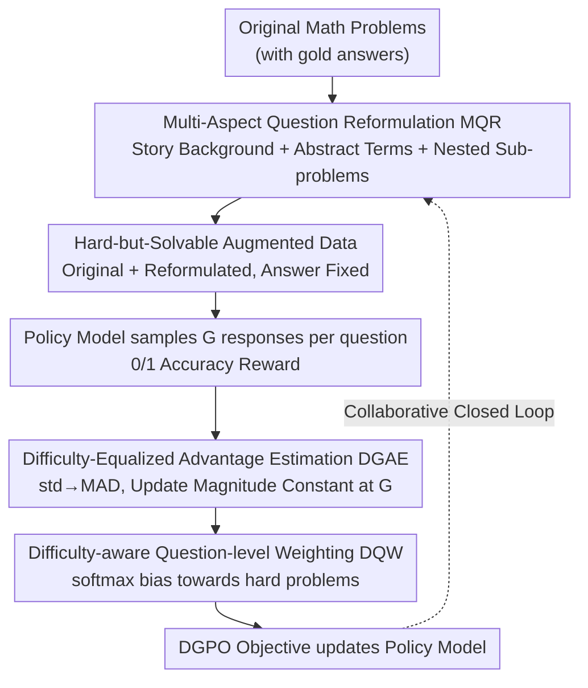

# Harder Is Better: Boosting Mathematical Reasoning via Difficulty-Aware GRPO and Multi-Aspect Question Reformulation

**Conference**: ICLR 2026  
**arXiv**: [2601.20614](https://arxiv.org/abs/2601.20614)  
**Code**: [GitHub](https://github.com/AMAP-ML/MathForge)  
**Area**: LLM Reasoning / Reinforcement Learning  
**Keywords**: GRPO, difficulty-aware, mathematical reasoning, RLVR, data augmentation

## TL;DR

Reveals that the advantage function of GRPO (standard deviation normalization) results in the largest update magnitudes for medium-difficulty problems while implicitly suppressing hard and easy ones. Proposes the MathForge framework: DGPO (replaces std with MAD for difficulty equalization + softmax difficulty weighting) and MQR (reformulates questions via story backgrounds, abstract terms, and nested sub-problems to increase difficulty while preserving original answers). Achieves an average +4.56% improvement over GRPO across 6 mathematical reasoning benchmarks using Qwen2.5-Math-7B.

## Background & Motivation

**Background**: RLVR (Reinforcement Learning from Verifiable Rewards) has become a mainstream paradigm for enhancing the mathematical reasoning capabilities of LLMs (e.g., DeepSeek-R1). GRPO is one of the most representative algorithms, estimating relative advantages within a group to replace the value network.

**Limitations of Prior Work**:

1.  **Algorithmic Level**: The advantage function of GRPO $\hat{A}_{GR,i} = \frac{r_i - \text{mean}}{\text{std}}$ uses standard deviation normalization, which causes the relationship between the update magnitude $\sum|A|$ and the accuracy $p$ to follow $2G\sqrt{p(1-p)}$. This peaks at $p=0.5$ and decays as $p$ approaches 0 or 1. Consequently, harder problems ($p$ is small but non-zero) receive smaller updates than medium-difficulty ones.

2.  **Data Level**: Existing RLVR data augmentation (e.g., Liang et al. 2025) primarily focuses on question paraphrasing to increase diversity but does not systematically increase problem difficulty. A lack of challenging training data limits the upper bound of the model's reasoning capabilities.

**Key Challenge**: Problems that are difficult yet solvable are the ideal training materials (exposing model weaknesses with learnable correct answers), yet GRPO applies the smallest update magnitudes to exactly these types of problems.

**Key Insight**: Address the "neglect of hard problems" simultaneously at the algorithmic and data levels—DGPO corrects the intrinsic imbalance of GRPO and weights hard problems, while MQR generates more challenging training questions.

## Method

### Overall Architecture

MathForge addresses the "neglect of hard problems" by tackling both the data and algorithmic fronts. On the data side, MQR (Multi-Aspect Question Reformulation) uses large reasoning models to reformulate original questions into harder versions while strictly preserving the original answers, expanding the set of "hard-but-solvable" augmented data. On the algorithmic side, DGPO (Difficulty-aware Group Policy Optimization) first fixes the intrinsic defect of unbalanced update magnitudes across different difficulties in GRPO, then actively weights hard problems to learn efficiently from this data. The two form a closed loop: MQR pushes the difficulty frontier, and DGPO ensures the model masters it. The pipeline is as follows: original questions are reformulated by MQR to obtain augmented data; the policy model samples a group of responses for each question and assigns 0/1 accuracy rewards; these are processed via DGAE to decouple update magnitude from difficulty and DQW to weight towards hard problems; finally, the policy model is updated using the DGPO objective.

### Key Designs

**1. MQR Multi-Aspect Question Reformulation: Systematically Upgrading Difficulty without Changing Answers**

Existing data augmentation often focuses on paraphrasing, which increases diversity but not true difficulty. MQR instead utilizes large reasoning models (default OpenAI o3, though smaller open-source models suffice) to harden original problems across three orthogonal dimensions: **Adding story backgrounds** to introduce narrative noise, forcing the model to extract key mathematical quantities from irrelevant plots; **Introducing abstract terms** to abstract concrete concepts, testing the understanding of abstract mathematical objects; and **Nested sub-problems** to increase reasoning steps and interdisciplinary knowledge requirements. These correspond to "identifying key info in noise," "grasping abstract concepts," and "multi-step cross-domain reasoning." All reformulations are strictly constrained to keep the original gold answer, ensuring MQR maintains mathematical logic while eliminating the cost of re-solving and verifying answers. Augmented data naturally carries labels and is mathematically equivalent to the original, and combined they form the training set for DGPO.

**2. Difficulty-Equalized Advantage Estimation (DGAE): Decoupling Update Magnitude from Difficulty**

The root of the problem lies in GRPO's advantage function $\hat{A}_{GR,i} = (r_i - \text{mean})/\text{std}$ using standard deviation normalization. Theorem 1 of this paper derives that the total update magnitude for a single problem $\sum|\hat{A}_{GR,i}| = 2G\sqrt{p(1-p)}$ follows a bell curve relative to accuracy $p$—updating most aggressively at $p=0.5$ and being suppressed at harder ($p$ smaller) or easier levels. DGAE makes one replacement: substituting the standard deviation with Mean Absolute Deviation (MAD), $\text{MAD} = \frac{1}{G}\sum|r_i - \text{mean}|$, resulting in:

$$\hat{A}_{DG,i} = \frac{r_i - \text{mean}(\{r_i\})}{\text{MAD}(\{r_i\})}$$

Theorem 2 proves that under this formulation, the total update magnitude per question is constant at $G$. This decouples the magnitude from difficulty and completely flattens the bell-curve bias. Furthermore, the derivation does not rely on the binary reward assumption and holds true for general reward distributions.

**3. Difficulty-aware Question-level Weighting (DQW): Biasing Towards Hard Problems Beyond Equalization**

DGAE only brings all problems to the same starting line; highlighting hard problems further requires explicit weighting. DQW uses the negative mean reward within a group $D_s = -\text{mean}(\{r_{si}\})$ as a difficulty metric (worse performance implies higher difficulty), then calculates a weight for each question using softmax $\lambda_s = B_v \cdot \frac{\exp(D_s/T)}{\sum \exp(D_s/T)}$. With a temperature of $T=2.0$, this keeps the max/min weight ratio within a batch below $e^{0.5} \approx 1.65$—prioritizing hard problems without starving easier problems of gradients. The "equalize then weight" two-step sequence is crucial: applying difficulty weighting directly on un-equalized GRPO (as in GRPO-AD) leaves the underlying bell-curve bias intact, yielding limited results.

### Loss & Training

Combining DGAE advantages, DQW weights, and effective token-level averaging results in the full DGPO objective:

$$\mathcal{J}_{DGPO}(\theta) = \frac{1}{\sum_{s=1}^{B_v}\sum_{i=1}^{G}|o_{si}|}\sum_{s=1}^{B_v}\lambda_s\sum_{i=1}^{G}\sum_{t=1}^{|o_{si}|}\min[I_{sit}\hat{A}_{DG,si}, \text{clip}(I_{sit}, 1-\varepsilon, 1+\varepsilon)\hat{A}_{DG,si}]$$

The outer normalization performs token-level averaging only across effective queries ($B_v$ queries that are neither all correct nor all incorrect), preventing uninformative samples from disrupting the gradients. Training utilizes pure accuracy rewards $r \in \{0,1\}$ without KL divergence, implemented via the Open-R1 codebase on 8×NVIDIA H20 GPUs.

## Key Experimental Results

### Main Results

Qwen2.5-Math-7B trained on the MATH dataset, average performance across 6 benchmarks:

| Method | AIME24 | AIME25 | AMC23 | MATH500 | Minerva | Olympiad | Avg. | Gain ($\Delta_{GRPO}$) |
| :--- | :--- | :--- | :--- | :--- | :--- | :--- | :--- | :--- |
| Base | 12.19 | 4.79 | 35.23 | 48.60 | 15.07 | 16.33 | 22.04 | - |
| GRPO | 20.94 | 8.44 | 58.98 | 72.20 | 27.76 | 37.33 | 37.61 | - |
| Dr.GRPO | 21.04 | 8.23 | 58.59 | 72.05 | 28.58 | 35.89 | 37.40 | -0.21 |
| DAPO | 21.25 | 8.75 | 58.20 | 72.70 | 29.50 | 37.22 | 37.94 | +0.33 |
| GRPO-AD | 21.56 | 9.48 | 59.06 | 73.25 | 29.14 | 37.07 | 38.26 | +0.65 |
| DGPO | 23.85 | 10.21 | 61.02 | 74.25 | 31.07 | 38.33 | 39.79 | **+2.18** |
| MQR | 25.00 | 11.77 | 59.38 | 77.85 | 31.43 | 40.81 | 41.04 | +3.43 |
| **MathForge** | 24.58 | 12.60 | 59.84 | 79.95 | 33.36 | 42.67 | **42.17** | **+4.56** |

### Ablation Study

Ablation of DGPO components (Qwen2.5-Math-7B):

| Setting | Avg. | Gain ($\Delta_{GRPO}$) |
| :--- | :--- | :--- |
| GRPO | 37.61 | - |
| + Effective Token Averaging | 37.71 | +0.10 |
| + DGAE | 38.65 | +1.04 |
| + DGAE + DQW (full DGPO) | 39.79 | +2.18 |

DQW Temperature Sensitivity: $T=1.0$ → 39.03, $T=2.0$ → **39.79**, $T=5.0$ → 39.53, $T=10.0$ → 39.27

Cross-model Generalization (all exceeding GRPO): Qwen2.5-Math-1.5B +4.45, Qwen2.5-3B +3.54, DeepSeek-Math-7B +2.86

### Key Findings

- DGAE and DQW contribute +0.94% and +1.14% respectively, showing complementarity.
- MathForge consistently outperforms GRPO across all 4 tested models, proving model-agnosticism.
- DGPO is compatible with other methods: +GPG → +0.99, +DAPO → +1.97, +GSPO → +1.61.
- Models trained with DGPO produce more concise outputs (Fig. 1b), indicating the discovery of more efficient reasoning paths.

## Highlights & Insights

- Solid theoretical contribution: Theorems 1 and 2 strictly prove the bell-curve update bias of GRPO and the constant equalization of DGAE with clear mathematical derivation.
- "Equalize then weight" two-step design (DGAE→DQW) is more effective than directly adding difficulty weights to GRPO (e.g., GRPO-AD).
- The "answer-preservation constraint" in MQR is a key design: it increases difficulty while bypassing answer re-generation, significantly reducing data augmentation costs.
- Synergy between DGPO and MQR is observed (42.17 > 39.79 + 41.04 - 37.61), rather than a simple additive effect.

## Limitations & Future Work

- MQR relies on large reasoning models (o3) as reformulators, which increases the cost of data augmentation.
- Validated only in the mathematical reasoning domain; not yet tested on other reasoning tasks like code generation or logical reasoning.
- The temperature hyperparameter in DQW requires tuning (though $T=2.0$ performed robustly across all experiments).
- MAD normalization is equivalent to std normalization when the reward distribution is symmetric; theoretical advantages under non-binary rewards are significant but not fully explored.

## Related Work & Insights

- **vs GRPO**: GRPO's std normalization causes a bell-curve update bias. DGPO uses MAD to achieve a constant update magnitude—a simple but effective correction.
- **vs GRPO-AD (Zhang & Zuo 2025)**: GRPO-AD applies difficulty weights on top of GRPO without correcting the underlying imbalance, resulting in limited performance (+0.65 vs. DGPO's +2.18).
- **vs DAPO/GPG**: These methods focus on aspects like sampling and KL divergence, which are orthogonal to DGPO and can be combined.
- **Data Augmentation Insight**: The "answer-preservation constraint" of MQR is a practical design principle—ensuring the mathematical equivalence of augmented data.

## Rating

- Novelty: ⭐⭐⭐⭐ Theoretical insights (Theorems 1/2) are profound, and the MAD-for-std correction is theoretically well-supported.
- Experimental Thoroughness: ⭐⭐⭐⭐⭐ 6 benchmarks × 4 models × comprehensive ablations + dynamic analysis + additive experiments.
- Writing Quality: ⭐⭐⭐⭐ Theory and experiments are tightly integrated with comprehensive ablations.
- Value: ⭐⭐⭐⭐ A general optimization for RLVR training; DGPO can be directly integrated into existing pipelines.

<!-- RELATED:START -->

## Related Papers

- [\[ACL 2026\] GanitLLM: Difficulty-Aware Bengali Mathematical Reasoning through Curriculum-GRPO](../../ACL2026/llm_reasoning/ganitllm_difficulty-aware_bengali_mathematical_reasoning_through_curriculum-grpo.md)
- [\[ICLR 2026\] Hybrid Reinforcement: When Reward Is Sparse, Better to Be Dense](hybrid_reinforcement_when_reward_is_sparse_better_to_be_dense.md)
- [\[ICLR 2026\] MathFimer: Enhancing Mathematical Reasoning by Expanding Reasoning Steps through Fill-in-the-Middle Task](mathfimer_enhancing_mathematical_reasoning_by_expanding_reasoning_steps_through_.md)
- [\[ICLR 2026\] CORE: Concept-Oriented Reinforcement for Bridging the Definition–Application Gap in Mathematical Reasoning](core_concept-oriented_reinforcement_for_bridging_the_definitionapplication_gap_i.md)
- [\[ICLR 2026\] THOR: Tool-Integrated Hierarchical Optimization via RL for Mathematical Reasoning](thor_tool-integrated_hierarchical_optimization_via_rl_for_mathematical_reasoning.md)

<!-- RELATED:END -->
