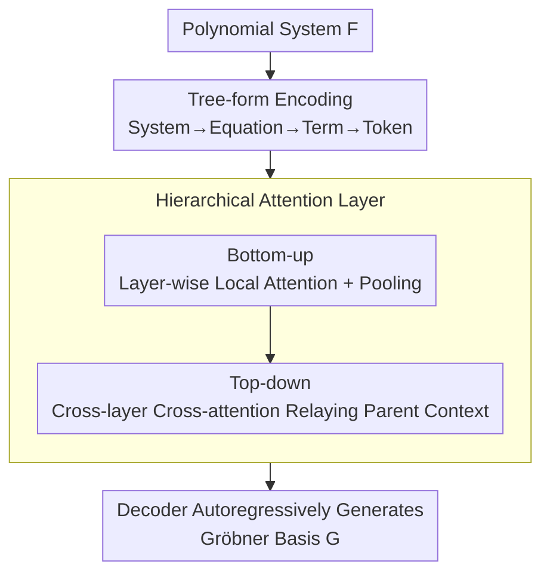

# HATSolver: Learning Gröbner Bases with Hierarchical Attention Transformers

**Conference**: ICLR 2026  
**OpenReview**: [https://openreview.net/forum?id=5C3LljOEGC](https://openreview.net/forum?id=5C3LljOEGC)  
**Code**: To be confirmed  
**Area**: Neuro-symbolic Mathematics / Transformer Architecture / LLM Reasoning  
**Keywords**: Gröbner Bases, Hierarchical Attention, Polynomial System Solving, Curriculum Learning, Computational Algebra

## TL;DR
The authors replace the expensive flat self-attention in a Transformer encoder with hierarchical attention consisting of "bottom-up local attention + top-down cross-layer attention." By leveraging the natural tree structure of polynomial systems, the $O(L^2)$ sequence cost is reduced to approximately $O(L^{1+1/n})$. This scales neural Gröbner base prediction from 5 variables to 13 variables with 100% density, outperforming classical symbolic tools like STD-FGLM and Msolve on hard instances.

## Background & Motivation

**Background**: Solving systems of multivariate nonlinear equations (the PoSSo problem) is a fundamental operation in cryptography, coding theory, and computer vision. **Gröbner bases** are the primary tools for solving such systems—they provide a canonical set of generators for a polynomial ideal, transforming the system into a triangular structure (shape position) suitable for variable-by-variable back-substitution. Classical algorithms like Buchberger and F4/F5 are implemented in systems like Maple, Magma, and Msolve, but Gröbner base computation exhibits double exponential worst-case complexity and remains extremely slow in practice. Kera et al. (NeurIPS'24) introduced a new approach by reframing it as a **supervised learning** task, training a seq2seq Transformer on pairs of "random systems $F$ → their Gröbner bases $G$," and solving the "backward Gröbner problem" to generate training data.

**Limitations of Prior Work**: The method by Kera et al. (2024) is bottlenecked by **scale**—it can only handle up to $n \le 5$ variables and requires very sparse polynomials (density $\rho \ll 1$) for $n=3,4,5$. This is because the memory and computational cost of standard Transformer attention is quadratic relative to the sequence length. A polynomial system expanded as tokens leads to sequence explosion: for $n=5$ and total degree $d \le 10$, there are $\binom{d+n}{d}=3003$ possible monomials. A system of $n+2$ equations can easily exceed 140,000 tokens, making it impossible to process.

**Key Challenge**: Polynomial systems are highly **structured** (System → Equation → Term → Symbol, forming a tree), but flat attention flattens them into a 1D sequence. This allows every token to attend to all others indiscriminately, wasting computation and discarding hierarchical priors. The $2L^2 d$ quadratic term arises from this lack of structure.

**Goal**: To reduce the attention cost from quadratic to near-linear without sacrificing accuracy, enabling the model to handle more variables and higher-density systems.

**Key Insight**: Since the data itself is a tree, the attention mechanism should follow the tree structure—a token primarily attends to its siblings (nodes with the same parent), while cross-layer information is passed indirectly through parent nodes. This adopts the logic of Hierarchical Attention Networks used in document classification and adapts it for computational algebra.

**Core Idea**: Replace the multi-head self-attention in the Transformer encoder with **hierarchical attention layers**. This involves "bottom-up local aggregation" and "top-down contextual relay," combined with **curriculum learning** to gradually increase difficulty, pushing neural Gröbner solving to 13 variables.

## Method

### Overall Architecture

HATSolver maintains an encoder-decoder Transformer structure: the encoder reads a non-Gröbner polynomial system $F$, and the decoder autoregressively generates the corresponding reduced Gröbner base $G$ (where $\langle F \rangle = \langle G \rangle$). The key modification is specifically in the **encoder's attention layers**: standard flat multi-head attention is replaced by hierarchical attention layers. The process begins by **tree-encoding** the system into a multi-layer tensor (System → Equation → Term → Token). The hierarchical attention then operates in two phases: **bottom-up**, performing local attention at each level and pooling to the layer above; and **top-down**, using cross-layer cross-attention to relay global context from parent nodes back to leaf nodes. Finally, the decoder generates $G$ as usual. On the training side, **curriculum learning** is applied to transition from small, simple systems to hard 13-variable instances.

### Key Designs

**1. Tree-form Encoding: Integrating Structural Priors into Tokenization**

The efficiency of hierarchical attention depends on the data having a hierarchical structure. The authors follow the tokenization from Kera et al. (2024): over a finite field $k = \mathbb{F}_q$ (with $q=7$ in experiments), the vocabulary consists of coefficient tokens $\{C_1, \dots, C_{q-1}\}$, exponent tokens $\{E_0, \dots, E_d\}$, and structural tokens $\{\texttt{<bos>}, +, \texttt{<sep>}\}$. A term $a_u x_1^{u_1} \cdots x_n^{u_n}$ is encoded as $C_{a_u} E_{u_1} \cdots E_{u_n}$, terms are joined by $+$, and equations by $\texttt{<sep>}$. The resulting sequence naturally forms a four-layer tree: **System** containing **Equations**, each containing **Terms**, each containing $n+2$ **Symbol tokens**. Positional encoding is also adapted: each axis $j$ is assigned a learnable embedding table $E^{(j)}$, and the positional embedding for a token at $(i_{n-1}, \dots, i_0)$ is the sum $\mathrm{PE} = \sum_j E^{(j)}_{i_j}$, capturing hierarchical dependencies efficiently. This step explicitly defines the tree structure in the tensor shape $(\ell_{n-1}, \dots, \ell_0, d)$.

**2. Hierarchical Attention Layer: Bottom-up Aggregation + Top-down Context Relay**

This is the core contribution addressing the $O(L^2)$ bottleneck. **Bottom-up Phase**: Starting from the leaf level ($\ell=0$, symbol tokens), the model performs local self-attention only within each parent node $Y^{(0)} = \mathrm{Att}(X^{(0)}W_q^{(0)}, X^{(0)}W_k^{(0)}, X^{(0)}W_v^{(0)})$. Then, pooling $p(\cdot)$ (e.g., mean pooling or selecting the first child) compresses each group of children into a parent representation $X^{(i)} = p(Y^{(i-1)})$, repeating until the system level. **Top-down Phase**: Information is relayed back down. Nodes refine their representations using cross-layer cross-attention to extract global context from "parent + upper-level siblings":

$$Z^{(i)} = Y^{(i)} + \mathrm{Att}\big(Y^{(i)}, Z^{(i+1)}U_k^{(i)}, Z^{(i+1)}U_v^{(i)}\big)$$

Here, the query is the current node $Y^{(i)}$, while keys and values come from the already-refined parent level $Z^{(i+1)}$. This differs from methods like Hi-Transformer by using **cross-attention** for finer distribution of context. Each token acquires global information indirectly, but the attention sequence length is restricted to "siblings," breaking the quadratic term.

**3. Generalization & Cost Analysis: Reducing Cost to $L^{1+1/n}$**

The authors generalize hierarchical attention to $n$ levels. Let $L_i = \prod_{k \ge i} \ell_k$ and $L = L_0$ be the total flattened length. Embedding dimensions $(d_0, \dots, d_{n-1})$ can vary (typically increasing as we move up). The total complexity is:

$$C = 3L_0 d_{-1} d_0 + \sum_{i=1}^{n-1} 5L_i d_{i-1} d_i + \sum_{i=0}^{n-1} 2L_i d_i (\ell_i + \ell_{i+1})$$

Compared to $3Ld^2 + 2L^2 d$ for flat attention: when the sequence length is much larger than the embedding dimension $d$, the dominant term drops from $L^2 d$ to $(\ell_0 + \ell_1)Ld$. For a regular $\ell$-ary tree ($\ell = L^{1/n}$), the cost is $O(L^{1+1/n}d)$, enabling the scaling to 13 variables. The paper implements HATSolver-2 (2 layers: symbols → all terms) and HATSolver-3 (3 layers: tokens → terms → equations).

**4. Curriculum Learning: Incremental Scale and Density**

While hierarchical attention provides the capacity for 13 variables, training directly on the most difficult distribution is ineffective. The authors note that baseline models "fail to learn anything meaningful" without this strategy. Curriculum learning uses datasets of increasing difficulty (scale $\sigma=2, v=\frac{1}{2}$) to allow the model to build basic capabilities before tackling 13-variable dense systems. The gain is significant: on $n=13, \rho=0.9$, accuracy rises from 33.85% to 61.2% when curriculum learning is added.

## Key Experimental Results

### Main Results

The core comparison is performed on $n=13$ variables over $\mathbb{F}_7$, comparing HATSolver-3 (with curriculum learning) against classical symbolic tools STD-FGLM and Msolve across various densities. "Success" refers to the exact match ratio (proportion of test samples where the generated Gröbner basis is entirely correct).

| Density | Metric | HATSolver-3 | STD-FGLM | Msolve |
| :--- | :--- | :--- | :--- | :--- |
| 30% | Success / Runtime (s) | **52.5** / 224 | 33.5 / 652 | 32.8 / 787 |
| 70% | Success / Runtime (s) | **55.2** / 280 | 8.2 / 1068 | 7.1 / 1010 |
| 90% | Success / Runtime (s) | **61.2** / 292 | 6.1 / 1012 | 4.5 / 1232 |
| 100% | Success / Runtime (s) | **60.8** / 300 | 6.5 / 1129 | — |

The model peaks at 61.2% success for 90% density (Support Acc. for monomials is 94%), while classical algorithms suffer from frequent timeouts (timeout rate reaches 93.5% at full density). The model's runtime is 3–5 times faster than classical tools.

### Ablation Study

To decouple the contributions of the architecture and curriculum learning, HATSolver-3 was trained **without curriculum learning** on $n=13, \rho_{\text{train}}=0.9$ and evaluated across different test densities.

| Configuration | $\rho=0.4$ | $\rho=0.9$ (Train) | Note |
| :--- | :--- | :--- | :--- |
| HATSolver-3 + Curriculum | — | **61.2** | Full Method |
| HATSolver-3 w/o Curriculum | 14.72 | 33.85 | Hierarchical Only |
| Baseline (same setting) | — | Failed | Complete Failure |

### Key Findings
- **Hierarchical structure alone enables $n=13$**: Even without curriculum learning, HATSolver-3 achieves 14–34% accuracy, whereas the baseline fails entirely. This proves the architecture provides the necessary representation capacity.
- **Curriculum learning is a strong additive boost**: It nearly doubles accuracy at $\rho=0.9$.
- **Difficulty is not monotonic with density**: Success rates do not follow a simple trend with density; hard instances exist across all sparsity levels.
- **Backward generation flexibility**: The method works with both Kera et al. (2024) and the newer random matrix generation methods (2025).

## Highlights & Insights
- **Structure-Driven Efficiency**: Unlike pure algorithmic approximations of attention, this method utilizes the "System=Tree" domain structure. Aligning the attention mechanism with the hierarchy provides both efficiency and precision.
- **Analytical Controls**: The $L^{1+1/n}$ complexity analysis allows for a configurable "knob" (via $d_i$) to distribute compute between different levels of the tree based on the problem type.
- **Beating Symbolic Algorithms on Hard Cases**: On high-density 13-variable systems, classical tools frequently timeout. The neural model provides correct bases in hundreds of seconds—demonstrating that "learning a solver for a distribution" is a viable path for computational algebra.

## Limitations & Future Work
- **Restricted Setting**: Only handles 0-dimensional radical ideals where the Gröbner basis is in shape position.
- **Distributional Dependence**: Success is highest on the trained distribution; out-of-distribution (OOD) generalization is still relatively weak.
- **Lack of Verification**: As a black-box predictor, the model provides no mathematical guarantees of correctness. In practice, outputs should be verified using classical algorithms (verification is typically faster than computation).

## Related Work & Insights
- **Comparison with Kera et al. (2024)**: Scales from $n=5$ (sparse) to $n=13$ (dense) by replacing flat attention with hierarchical attention.
- **Comparison with HAN/Hi-Transformer**: While those models are designed for 2-layer document structures (Sentence → Word), this work extends to **arbitrary tree depth** and replaces "global token concatenation" with **top-down cross-attention**, which is more suitable for algebraic structures.
- **Comparison with Symbolic Algorithms**: While symbolic tools are exact, they face the double exponential bottleneck. Neural predictors offer a complementary approach: fast, data-driven "approximations" that can be formally verified.

## Rating
- Novelty: ⭐⭐⭐⭐ 
- Experimental Thoroughness: ⭐⭐⭐⭐ 
- Writing Quality: ⭐⭐⭐⭐ 
- Value: ⭐⭐⭐⭐ 

<!-- RELATED:START -->

## Related Papers

- [\[ICLR 2026\] Emergent Hierarchical Reasoning in LLMs through Reinforcement Learning](emergent_hierarchical_reasoning_in_llms_through_reinforcement_learning.md)
- [\[ICLR 2026\] FROST: Filtering Reasoning Outliers with Attention for Efficient Reasoning](frost_filtering_reasoning_outliers_with_attention_for_efficient_reasoning.md)
- [\[ICLR 2026\] Echoes as Anchors: Probabilistic Costs and Attention Refocusing in LLM Reasoning](echoes_as_anchors_probabilistic_costs_and_attention_refocusing_in_llm_reasoning.md)
- [\[ICLR 2026\] THOR: Tool-Integrated Hierarchical Optimization via RL for Mathematical Reasoning](thor_tool-integrated_hierarchical_optimization_via_rl_for_mathematical_reasoning.md)
- [\[ICLR 2026\] MoDr: Mixture-of-Depth-Recurrent Transformers for Test-Time Reasoning](modr_mixture-of-depth-recurrent_transformers_for_test-time_reasoning.md)

<!-- RELATED:END -->
