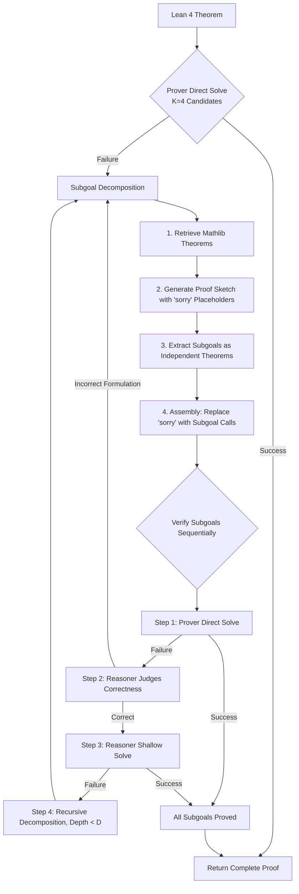

# Hilbert: Recursively Building Formal Proofs with Informal Reasoning

**Conference**: ICLR 2026  
**OpenReview**: [https://openreview.net/forum?id=GN8OdkTo3B](https://openreview.net/forum?id=GN8OdkTo3B)  
**Code**: [https://github.com/Rose-STL-Lab/ml-hilbert](https://github.com/Rose-STL-Lab/ml-hilbert)  
**Area**: LLM Reasoning / Formal Theorem Proving / Agent Framework  
**Keywords**: Formal Theorem Proving, Lean 4, Recursive Decomposition, Retrieval-Augmented Generation, Agents, miniF2F, PutnamBench  

## TL;DR
HILBERT constructs an agent using a quartet of "General Reasoning LLM + Specialized Proving LLM + Verifier + Theorem Retriever." By recursively decomposing difficult problems into subgoals, proving them layer-by-layer, and reassembling them, it increases the success rate of formal proof from the teens to 70% on PutnamBench and 99.2% on miniF2F, allowing open-source models to approach informal reasoning levels for the first time.

## Background & Motivation
- **Background**: Formal systems like Lean 4 allow 100% automatic verification of proofs, leading to specialized prover LLMs (DeepSeek-Prover, Goedel-Prover, Kimina, etc.) that achieve over 90% pass rates on miniF2F.
- **Limitations of Prior Work**: Specialized provers excel at generating syntactically correct independent proofs but are fragile in language-intensive tasks like "invoking existing theorems, error correction, and long-chain reasoning." Conversely, general reasoning LLMs (GPT-5, Gemini 2.5 Pro) have strong informal reasoning but fail at complete formal program synthesis—each has distinct weaknesses.
- **Key Challenge**: Empirical tests show general LLMs can informally solve ~83% of PutnamBench problems, while the best open provers only formally prove 13%, representing a **massive gap between formal and informal reasoning**.
- **Goal**: To bridge this gap by stitching the strengths of both paradigms together using an inference-time orchestration framework without retraining models.
- **Core Idea**: **[Recursive Decomposition + Role Specialization]** Orchestrate a general reasoner, specialized prover, verifier, and retriever into a multi-agent system. Hard problems are attempted directly; if failed, the reasoner decomposes them into subgoals. Subgoals are first given to the inexpensive prover; if that fails, the reasoner attempts a "shallow solve," and if that remains unsolved, the system **continues to decompose recursively**, using verifier feedback for error correction throughout the process.

## Method

### Overall Architecture
HILBERT is a multi-turn agent system orchestrating four components: **Reasoner** (Gemini 2.5 Pro/Flash or gpt-oss-120b for informal reasoning and sketching), **Prover** (DeepSeek-Prover-V2-7B / Goedel-Prover-V2-32B for Lean 4 generation), **Verifier** (Kimina Lean Server for correctness checking), and **Retriever** (sentence-transformer + FAISS for retrieving theorems from Mathlib). Given a Lean 4 theorem, the system first attempts a direct solve with the Prover (generating $K_{\text{initial}}=4$ candidates). If this fails, it enters the main loop of "subgoal decomposition → subgoal verification → recursion."

### Key Designs

**1. Subgoal Decomposition: Thinking before formalizing by slicing problems into `have` blocks**
After direct proof failure, HILBERT does not blindly retry. Instead, the Reasoner retrieves Mathlib theorems (generating $s=5$ queries, taking top $m=5$ results, and filtering out irrelevant terms) to draft a detailed **informal proof** as a conceptual roadmap. Based on this, the Reasoner generates a Lean 4 **proof sketch**—decomposing the original problem into several `have` statements, with subgoals initially filled by the `sorry` keyword. The sketch is validated by the Verifier with feedback-driven correction (up to $K_{\text{sketch}}=4$ times). The Reasoner then extracts each `have` into an **independent theorem statement** with context, ensuring no omissions via counting. Finally, it replaces the `sorry` tags in the sketch with calls to these subgoals, ensuring structural correctness: "if all subgoals are proved, the original theorem holds."

**2. Three-tier Subgoal Verification Funnel: Cheap first, expensive as backup**
Subgoals are processed in order of increasing cost. First, the **Prover attempts a direct solve** ($K_{\text{formal}}=4$ candidates), as it is computationally cheap and automatically confirms mathematical correctness. If that fails, the **Reasoner judges** if the subgoal is mathematically sound and provable; if errors are found (e.g., missing premises or Lean type system quirks), the system returns to the decomposition step. If correct, the **Reasoner attempts a "shallow solve"**: retrieving theorems and writing short proofs, iterating up to $K_{\text{proof}}=6$ times based on Verifier feedback, with a 30-line threshold—anything longer triggers further decomposition. This "Prover-then-Reasoner" sequence allocates compute where most effective.

**3. Recursive Decomposition: Overcoming context limits with hierarchical structures**
Subgoals that still fail the shallow solve are **recursively processed through the entire decomposition workflow**, continuing until solved or it reaches the maximum depth $D$ (set to $D=5$). Once all subgoals are proved, their proofs are concatenated with the assembly skeleton. If any subgoals remain unsolved, the current decomposition level is restarted. This hierarchy allows HILBERT to synthesize extremely long proofs (the hardest problems consumed 22.8M tokens, far exceeding any LLM context window), bypassing long-context reasoning issues.

**4. Retrieval-Augmented Generation: Improving accuracy and saving compute**
The Retriever provides more than just aesthetic value. By using cosine similarity between query embeddings and pre-computed embeddings of informal descriptions in the `mathlib_informal` dataset, it feeds relevant theorems to the Reasoner. This prevents hallucinated theorem names and significantly reduces inference compute—ablations show that for the Goedel-Prover variant, enabling retrieval reduced average Reasoner calls from 862 to 548 and tokens from 4.0M to 2.3M, **improving both accuracy and efficiency**.

## Key Experimental Results

### Main Results: miniF2F-Test (244 problems)

| Method | Pass Rate |
|------|-----------|
| Gemini 2.5 Pro (pass@16384) | 49.1% |
| Goedel-Prover-V2-32B (pass@4 baseline) | 74.6% |
| DeepSeek-Prover-V2-7B non-CoT (pass@4) | 61.3% |
| Delta Prover (Proprietary, pass@16384) | 95.9% |
| Seed Prover (Proprietary) | 99.6% |
| **Ours (Gemini 2.5 Pro) + Goedel-V2-32B** | **99.2% [+24.6%]** |
| **Ours (Gemini 2.5 Pro) + DS-Prover-V2-7B** | **98.4% [+37.1%]** |
| Ours (gpt-oss-120b) + Goedel-V2-32B | 90.8% [+16.2%] |

The strongest configuration failed on only 2 problems, outperforming the best open method by 6.6 percentage points.

### Main Results: PutnamBench (660 problems)

| Method | Solved | Pass Rate |
|------|------|-----------|
| DeepSeek-Prover-V2 671B (pass@1024) | 47/657 | 7.1% |
| Goedel-Prover-V2-32B (Self-correction) | 86/644 | 13.4% |
| SeedProver (Proprietary) | 331/657 | 50.4% |
| **Ours (Gemini 2.5 Pro) + Goedel-V2-32B** | **462/660** | **70.0%** |
| Ours (gpt-oss-120b) + Goedel-V2-32B | 88/660 | 13.3% |

This outperforms the proprietary SeedProver by nearly 20 percentage points and solves over 5 times more problems than the strongest open baseline (Goedel-V2-32B), a ~422% improvement.

### Ablation Study

| Configuration | Pass Rate | Reasoner Calls | Reasoner Tokens |
|------|-----------|--------------|-----------------|
| HILBERT + DS-Prover-V2-7B (w/ Retrieval) | 98.4% | 420 | 1.9M |
| Same (w/o Retrieval) | 97.1% | 426 | 2.1M |
| HILBERT + Goedel-V2-32B (w/ Retrieval) | 99.2% | 548 | 2.3M |
| Same (w/o Retrieval) | 97.9% | 862 | 4.0M |

**Depth Ablation**: $D=0$ (pure Prover pass@4) achieved only 75%, while full HILBERT reached 98.36% at $D=2$ and 98.7% at $D=3$. Variants without shallow solving required deeper recursion to match performance, proving the effectiveness of both layered decomposition and shallow solving.

### Key Findings
- **Reasoner choice is more critical than Prover strength**: Gemini 2.5 Pro consistently outperformed Flash by 3-4%, a gap larger than that between different provers.
- **Adaptive compute allocation**: HILBERT spreads compute across interconnected stages. The best configuration uses 11.3K total calls, significantly fewer than DeltaProver's 16384 attempts.
- **Breaking the context window**: The most difficult problems consumed up to 22.8M / 27.0M tokens, far exceeding any LLM context length, demonstrating that agent frameworks allow models to transcend their own context limitations.

## Highlights & Insights
- **"Divide and Conquer" recursion is the core lever**: Replacing a single long proof with a verifiable subgoal tree bypasses long-context challenges and handles many simple subgoals with cheap models, reserving expensive reasoning for truly difficult parts.
- **Role specialization matches comparative advantages**: The reasoner handles "strategy, decomposition, and error analysis," the prover handles "formal tactic generation," the verifier provides hard feedback, and the retriever prevents Hallucination—each component does what it does best.
- **Retrieval is a rare "win-win" improvement**: Accuracy improvements usually come at a compute cost, but here, avoiding dead ends actually saves compute.
- **Plugging in off-the-shelf models**: Achieving SOTA without training makes reproduction easy and allows the system to improve automatically as base models upgrade.

## Limitations & Future Work
- **High compute cost**: The most difficult problems require tens of millions of tokens. The cost of running PutnamBench remains a barrier to broader utility.
- **Strong dependence on closed reasoners**: The best results rely on Gemini 2.5 Pro; switching to the open gpt-oss-120b causes PutnamBench performance to plummet to 13.3%, indicating a significantly lower ceiling for current open ecosystems.
- **Incomplete success**: Not yet reaching 100% on miniF2F and having 30% left on PutnamBench, with specific failure modes identified by the authors.
- **Future Work**: The authors plan to use the proofs and reasoning trajectories generated by HILBERT to train stronger provers/reasoners, creating a "self-bootstrapping" cycle for mathematical reasoning.

## Related Work & Insights
- **Sketch-based methods (DSP / LEGO-Prover / DSP+)**: These use LLMs for proof sketches and ATPs/provers for filling gaps but rely on single-layer decomposition, failing on difficult subgoals—HILBERT’s recursive decomposition directly addresses this limitation.
- **Agentic methods (COPRA / Prover-Agent / ProofCompass / DeltaProver)**: These use informal reasoning and verifier feedback but have lagged behind general LLM performance; HILBERT proves that with proper orchestration, specialized provers are extremely powerful tools.
- **Insight**: Between "strong but unverifiable" and "verifiable but weak" systems, the combination of recursive decomposition, tiered funnels, and hard verification feedback offers a universal paradigm to approach upper bounds without retraining, transferable to code generation and formal verification.

## Rating
- **Novelty**: ⭐⭐⭐⭐ While recursive decomposition exists in POETRY/ProD-RL, combining "tiered funnels + retrieval + multi-agent orchestration" into a pure inference-time framework to hit SOTA is a solid system-level innovation.
- **Experimental Thoroughness**: ⭐⭐⭐⭐⭐ Comprehensive coverage of two major benchmarks, multiple configurations, and deep ablations on depth, retrieval, and scaling curves. The 70% mark on PutnamBench is highly convincing.
- **Writing Quality**: ⭐⭐⭐⭐ Algorithms, component roles, and hyperparameters are clearly explained. Figures 1 and 2 effectively visualize the recursive logic.
- **Value**: ⭐⭐⭐⭐⭐ For the first time, formal proof performance of open models approaches informal levels, closing a core gap in the field with a plug-and-play approach that scales with base models.

<!-- RELATED:START -->

## Related Papers

- [\[ICLR 2026\] Mathesis: Towards Formal Theorem Proving from Natural Languages](mathesis_towards_formal_theorem_proving_from_natural_languages.md)
- [\[ICLR 2026\] ProofBridge: Auto-Formalization of Natural Language Proofs in Lean via Joint Embeddings](proofbridge_auto-formalization_of_natural_language_proofs_in_lean_via_joint_embe.md)
- [\[ICLR 2026\] ProofOptimizer: Training Language Models to Simplify Proofs without Human Demonstrations](proofoptimizer_training_language_models_to_simplify_proofs_without_human_demonst.md)
- [\[ICLR 2026\] Let's Explore Step by Step: Generating Provable Formal Statements with Deductive Exploration](lets_explore_step_by_step_generating_provable_formal_statements_with_deductive_e.md)
- [\[CVPR 2026\] Hilbert-Geo: Solving Solid Geometric Problems by Neural-Symbolic Reasoning](../../CVPR2026/llm_reasoning/hilbert-geo_solving_solid_geometric_problems_by_neural-symbolic_reasoning.md)

<!-- RELATED:END -->
