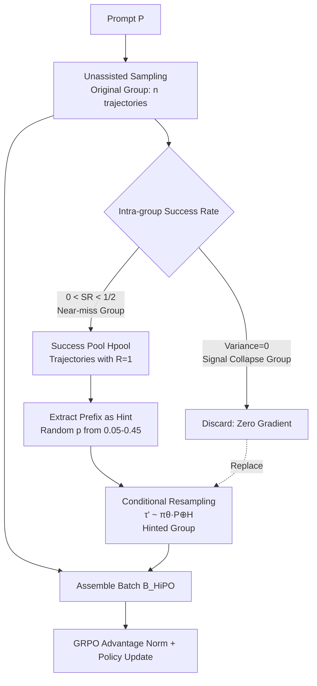

# HiPO: Self-Hint Policy Optimization for RLVR

**Conference**: ICLR 2026  
**OpenReview**: [https://openreview.net/forum?id=rcb20pHmT1](https://openreview.net/forum?id=rcb20pHmT1)  
**Code**: To be confirmed  
**Area**: LLM Reasoning / Reinforcement Learning with Verifiable Rewards (RLVR)  
**Keywords**: RLVR, GRPO, Sparse Reward, Self-hint, Exploration Stagnation, Tool-integrated Reasoning  

## TL;DR
HiPO extracts "prefixes" from accidentally successful trajectories within a training batch to serve as on-policy self-hints for resampling. This transforms sparse 0/1 rewards into dense contrastive learning signals, specifically addressing the "near-miss" problem and exploration stagnation in RLVR.

## Background & Motivation
**Background**: RLVR (Reinforcement Learning with Verifiable Rewards) is a mainstream approach for enhancing the complex reasoning capabilities of LLMs, particularly in tasks requiring long-range reasoning and tool calls (e.g., Python interpreters), such as math competition problems. The representative algorithm, GRPO, eliminates the critic network and uses group-relative reward normalization of concurrent sampled trajectories to estimate advantages.

**Limitations of Prior Work**: Correct solutions for complex math problems depend on a fragile sequence of reasoning steps; a single error leads to total failure, making successful trajectories extremely rare. This exposes two fatal flaws in GRPO—the **near-miss problem**: an almost correct trajectory is given a 0 reward just like a complete failure, and group normalization spreads this negative feedback across all tokens, effectively punishing correct intermediate steps; and **signal collapse**: when all rewards in a group are identical (most commonly all failures), the advantage numerator and denominator both become zero ($\hat{A}=0$), causing the policy gradient to vanish.

**Key Challenge**: The model is not inherently "incapable of reasoning" but rather "unable to find the correct path." A motivational experiment shows that providing a baseline with a correct solution prefix as a hint causes the success rate to soar from near-certain failure to high probability—the bottleneck lies in **discovery** of effective paths rather than intrinsic reasoning capability. The question then becomes: can the model generate hints for itself from its own rare successes to learn in a self-bootstrapping manner?

**Goal**: To transform sparse rewards into dense, self-generated learning signals without relying on external teacher models or expert data.

**Core Idea**: **Endogenous Self-Hint**—capturing initial correct steps from an accidentally sampled successful trajectory to serve as an on-policy hint. This allows the policy to form a contrast between "unhinted exploration" and "hinted exploration," thereby rewarding effective reasoning prefixes while providing credible landmarks for exploration.

## Method

### Overall Architecture
HiPO inserts a "hint mechanism" into the standard GRPO training loop. For each prompt, it first samples an "Original Group" of $n$ trajectories without assistance to identify "Near-miss" groups and "Signal Collapse" groups. For near-miss groups, it extracts prefixes from rare successful trajectories as hints to resample a high-signal "Hinted Group," which then replaces the zero-gradient collapsed groups before updating the policy with the GRPO objective. The entire process introduces no external data; hints originate entirely from the policy's own current successes.

### Key Designs

**1. On-policy Self-hint Generation: Turning success prefixes into landmarks.** HiPO is triggered only on "Near-miss groups" where the success rate is greater than 0 but less than half—the critical moment when the model is "close but unstable." It collects all successful trajectories ($R(\tau)=1$) into a hint pool $H_{pool,j}=\{\tau \in T_{near\text{-}miss,j} \mid R(\tau)=1\}$. To generate each hinted trajectory, it performs a two-stage sampling: uniformly drawing a source trajectory $\tau_{source}$ from the pool, and randomly selecting a prefix ratio $p$ from $[0.05, 0.45]$ with a step of 0.05 to determine the length $k=\lfloor p\cdot|\tau_{source}|\rfloor$ for the prefix $H_{j,i}=\text{Prefix}(\tau_{source}, k)$. The new trajectory is sampled by appending this hint to the original prompt: $\tau'_i \sim \pi_\theta(\cdot \mid P_j \oplus H_{j,i})$. Crucially, because hints come from the policy's own current successes, they are on-policy, avoiding the distribution mismatch between $\pi_\theta$ and $\pi_E$ often found with external expert data, ensuring stability without manual labels or stronger teachers.

**2. Contrastive Signal: Resolving near-misses through Hinted vs. Original Group contrast.** Hints are not for direct copying but for creating a high-success "Hinted Group" to be juxtaposed with the low-success "Original Group." This contrast generates highly informative advantage signals: when the model completes "embryonic but promising" paths, it receives positive advantage, thereby **rewarding effective reasoning prefixes**—directly addressing the near-miss problem where these steps were previously penalized. Conversely, trajectories that still fail despite credible hints receive negative advantage, **precisely punishing stubborn failure modes**. Theoretically, this is interpreted as value-guided exploration: while the optimal value function $V^*$ is unknown, intermediate states from empirically successful trajectories serve as effective proxies for high-value states, reducing the dimensionality of the problem from "discovering solutions from scratch" to "completing from high-value states."

**3. Strategic Batch Replacement: Substituting zero-gradient groups with high-signal groups.** HiPO does not just add Hinted Groups; it performs a replacement to ensure the entire batch contributes to the gradient. Let $B_{orig}$ be the set of original unassisted groups. The signal-collapsed $T_{null\text{-}signal}$ groups are removed and replaced by $T_{hint}$ groups generated from near-miss successes:
$$B_{HiPO} \triangleq (B_{orig} \setminus T_{null\text{-}signal}) \cup T_{hint}$$
The gradient is then calculated using the standard GRPO clipped objective on this augmented batch:
$$\hat{g}_{HiPO} = \mathbb{E}_{\tau \sim B_{HiPO}}\Big[\sum_t \nabla_\theta \min\big(r_t^{(\tau)}\hat{A}_\tau,\ \text{clip}(r_t^{(\tau)}, 1-\epsilon, 1+\epsilon)\hat{A}_\tau\big)\Big]$$
This decomposes the learning objective into four types of high-value signals: rare successful trajectories in $B_{orig}$ anchor the policy; failed trajectories in $B_{orig}$ are penalized; successful trajectories in $T_{hint}$ provide core signals by salvaging near-misses; and most importantly, trajectories in $T_{hint}$ that still fail provide high-quality negative signals as they deviate from a known feasible path. By actively injecting reward diversity into the batch, HiPO fundamentally prevents gradient vanishing and exploration stagnation.

## Key Experimental Results

### Main Results
Using Qwen3-8B as the base, trained on the DAPO dataset (17K math problems with integer answers) using VeRL + ReTool (Python interpreter, max 8-turn interaction); avg@32 performance on five math benchmarks:

| Model | AIME 2024 | AIME 2025 | BRUMO 2025 | HMMT 2025 | CMIMC 2025 | **Average avg@32** |
|------|:---------:|:---------:|:----------:|:---------:|:----------:|:---------------:|
| Qwen3-8B (base) | 54.7 | 47.6 | 30.3 | 14.0 | 37.0 | 36.7 |
| GRPO | 72.1 | 63.0 | 41.7 | 28.6 | 43.5 | 49.8 |
| DAPO | 76.0 | 63.7 | **47.8** | **31.4** | 49.9 | 53.7 |
| **Ours (HiPO)** | **76.7** | **66.1** | 46.6 | 30.8 | **53.8** | **54.8** |

HiPO achieves an average avg@32 gain of **+5.0 pp** over GRPO and outperforms it on all five benchmarks; the largest gain is on CMIMC 2025 (**+10.3 pp**). Notably, while DAPO achieves similar results through dynamic sampling, it requires approximately **4×** the prompt compute, which HiPO avoids.

### Ablation Study

| Dimension | Variant | Phenomenon / Conclusion |
|----------|------|-------------|
| Hint Ratio | Fixed p=0.05 (too short) | High entropy but tool call counts stagnate: exploration occurs but lacks scaffolding to discover complex trajectories. |
| Hint Ratio | Fixed p=0.80 (too long) | Low entropy, few turns: over-guidance traps the model in local optima, resulting in simple completion only. |
| Hint Ratio | **HiPO Dynamic [0.05, 0.45]** | Highest tool call frequency with healthy entropy, balancing exploration and exploitation. |
| Hint Source | Off-Policy Hint (Top 20% successful trajectories from base model) | Performs worse than HiPO and even GRPO, with tool call counts collapsing—proving efficacy comes from **on-policy** nature, not just hint content. |

### Key Findings
- **Training Dynamics**: HiPO maintains higher policy entropy than GRPO throughout training, proving it alleviates exploration stagnation. Furthermore, tool call counts increase significantly, whereas they barely grow for GRPO—suggesting that GRPO's incorrect credit assignment makes long reasoning chains "risky," causing the model to degenerate into simple strategies. HiPO provides a scaffold, enabling the model to learn longer, more complex reasoning chains.
- **Sample Efficiency**: pass@k curves show HiPO has higher success rates even at small $k$. On the most difficult Apex 2025, HiPO's pass@32 is nearly double the baseline, indicating that its signal reshaping mechanism yields the highest returns when successful trajectories are extremely sparse.

## Highlights & Insights
- **"Success is a curriculum, not just an endpoint"**: HiPO reinterprets an accidental success from a "rewarded terminal" to a "reusable high-value starting pool," a clever shift in perspective to maximize the value of sparse successes.
- **Empirical evidence of On-policy > Off-policy**: The ablation study decouples "hint content" from "hint source," cleanly proving that the real effectiveness stems from the hint being in-distribution with the current policy, rather than just the information contained in the hint—a valuable methodological insight for future self-improvement research.
- **Zero External Dependency**: Pure bootstrapping without teacher models or expert labels. It is more scalable than schemes like QuestA/StepHint that rely on external data.
- **Precise Triggering**: The mechanism activates only in the "0~50% success rate" near-miss zone, focusing computational resources on the critical point where the model is on the verge of a breakthrough.

## Limitations & Future Work
- **Domain Scope**: Validated only in math reasoning + tool integration scenarios with a single base model (Qwen3-8B). Generalization to code generation or theorem proving remains unverified.
- **Dependency on "At Least One Success"**: If a prompt yields zero successes in an entire batch (no near-miss), HiPO defaults to standard behavior. While appendix methods address this for cold starts, the "absolute zero success" dilemma is not fundamentally solved.
- **Hyperparameter Sensitivity**: The dynamic interval $[0.05, 0.45]$ and step 0.05 appear empirical; whether the optimal interval is consistent across different difficulty distributions requires further study.
- **Hint Quality Filtering**: Prefixes of successful trajectories are not guaranteed to be "good landmarks" (success could be a fluke). Lack of quality screening for source trajectories might introduce noisy landmarks.

## Related Work & Insights
- **GRPO** (Shao et al., 2024): The direct baseline for HiPO. Its signal collapse under sparse rewards is exactly what HiPO aims to fix.
- **DAPO** (Yu et al., 2025): Uses dynamic sampling to force non-zero advantages, but it is "reactive" and computationally expensive (4× prompt compute). HiPO achieves similar or better results with a more efficient hint mechanism.
- **QuestA / StepHint** (Li et al., 2025a; Zhang et al., 2025): Also use hints to enrich reward signals but rely on external teachers or static datasets (OpenR1-Math), making them off-policy. HiPO’s core distinction is **endogenous + on-policy** hints.
- **Insight**: The strategy of "extracting on-policy success prefixes as curriculum" can be transferred to any RL scenario involving sparse rewards and long-range combinations (agent tool chains, multi-step retrieval, code repair). The core is using empirical success states as proxies for high-value states to guide exploration.

## Rating
- **Novelty**: ⭐⭐⭐⭐ — "Endogenous on-policy self-hinting" as a self-generated curriculum is a clean and systematic perspective. The decoupling of on/off-policy in the ablation is particularly convincing.
- **Experimental Thoroughness**: ⭐⭐⭐⭐ — Five benchmarks + pass@k + training dynamics + dual ablations (ratio, source) are fairly complete. Computational overhead comparison with DAPO is included. However, it lacks multi-model/multi-domain verification.
- **Writing Quality**: ⭐⭐⭐⭐ — Problem characterization (near-miss/signal collapse/stagnation) is logical. Motivation experiments are intuitive, and Algorithm 1 is clear.
- **Value**: ⭐⭐⭐⭐ — Directly addresses a core pain point of RLVR (sparse rewards) with a compute-friendly, data-free bootstrapping path. highly practical for researchers working on LLM reasoning RL.

<!-- RELATED:START -->

## Related Papers

- [\[ICLR 2026\] Reference-guided Policy Optimization for Molecular Optimization via LLM Reasoning](reference-guided_policy_optimization_for_molecular_optimization_via_llm_reasonin.md)
- [\[ICLR 2026\] Inpainting-Guided Policy Optimization for Diffusion Large Language Models](inpainting-guided_policy_optimization_for_diffusion_large_language_models.md)
- [\[ICLR 2026\] DRPO: Efficient Reasoning via Decoupled Reward Policy Optimization](drpo_efficient_reasoning_via_decoupled_reward_policy_optimization.md)
- [\[ICLR 2026\] Slow-Fast Policy Optimization: Reposition-Before-Update for LLM Reasoning](slow-fast_policy_optimization_reposition-before-update_for_llm_reasoning.md)
- [\[ICLR 2026\] Quantile Advantage Estimation: Stabilizing RLVR for LLM Reasoning](quantile_advantage_estimation_stabilizing_rlvr_for_llm_reasoning.md)

<!-- RELATED:END -->
