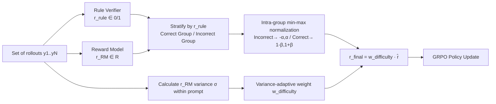

# Hybrid Reinforcement: When Reward Is Sparse, Better to Be Dense

**Conference**: ICLR 2026  
**OpenReview**: [https://openreview.net/forum?id=0CajQNVKyB](https://openreview.net/forum?id=0CajQNVKyB)  
**Code**: TBD  
**Area**: LLM Reasoning / RLVR Post-training  
**Keywords**: Verifiable Reward, Reward Model, Hybrid Reward, GRPO, Mathematical Reasoning  

## TL;DR
HERO uses rule verifiers as "gates" to hierarchically normalize continuous Reward Model (RM) scores (scaling the correct and incorrect groups separately) and applies variance-adaptive weighting to amplify difficult prompts. By fusing sparse binary verification rewards with dense RM rewards into a stable and fine-grained hybrid reward, it out-performs both "verifier-only" and "RM-only" baselines in mathematical reasoning.

## Background & Motivation
**Background**: Reinforcement Learning for LLM reasoning (RLVR) currently relies almost entirely on **verifiable rewards**—using deterministic checkers (exact match, symbolic equivalence, unit tests) to provide 0/1 correctness signals. Systems like DeepSeek-R1 have scaled this paradigm effectively.

**Limitations of Prior Work**: Strict 0/1 verification is both coarse and fragile. Many reasoning problems allow for partial correctness, equivalent but differently formatted answers, or open-ended solutions; symbolic verifiers often suffer from **false negatives** or fail to provide useful signals. Empirical results on HardVerify-Math (Table 1) show that `math_reward.py` has almost no false positives (FPR=0.3%) but a recall of only 10.1%. Worse, when all rollouts for a prompt receive the same label (all 0s or all 1s), the intra-group relative advantage in GRPO drops to zero, causing gradient vanishing, stalled training, and optimization biased toward easily verifiable simple problems.

**Key Challenge**: Reward Models (RMs) can provide continuous scores to capture nuances in partial correctness and reasoning quality, offering dense supervision. However, **naively mixing continuous RM scores with binary verifier scores breaks training stability**—RM signals might assign high scores to incorrect answers or low scores to correct ones, misaligning with the "correctness" semantics. Thus, the problem becomes: how to design a hybrid framework that preserves the reliability of the verifier while leveraging the granularity of the RM?

**Goal / Core Idea**: **Let rule rewards dominate the overall reasoning dynamics while using RM as a supplementary signal**. HERO achieves this through two mechanisms: (1) **Stratified Normalization**, which constrains RM scores within the correct/incorrect groups defined by the verifier; (2) **Variance-Adaptive Weighting**, which allocates training compute to difficult prompts that provide the richest signals.

## Method

### Overall Architecture
HERO reshapes the "reward" term within the GRPO framework. For a set of rollouts from each prompt, the rule verifier first categorizes them into "correct" and "incorrect" groups. Within each group, RM continuous scores are compressed into a controlled small interval using min-max normalization—this ensures the semantics that "any correct answer ≥ any incorrect answer" is preserved, while injecting subtle intra-group gradients into groups that were originally all 0s or all 1s. Subsequently, the variance of RM scores for each prompt is used to measure its "information gain," weighting high-variance (difficult, discriminative) prompts more heavily and down-weighting low-variance (trivial) ones. This two-step process produces the final shaped reward for standard GRPO updates.

### Key Designs

**1. Stratified Normalization: Anchoring dense signals to correctness using the verifier as a "gate."** This is the core difference between HERO and naive mixing. Given rule outputs $\{r_{\text{rule}}^{(i)}\}\subseteq\{0,1\}$ and corresponding RM scores $\{r_{\text{RM}}^{(i)}\}$ for $N$ rollouts, the responses are first partitioned by $r_{\text{rule}}$, and then $r_{\text{RM}}$ is normalized within each group:

$$
\hat r(x,y)=
\begin{cases}
-\alpha + 2\alpha\cdot\dfrac{r_{\text{RM}}-\min r_{\text{RM}}}{\max r_{\text{RM}}-\min r_{\text{RM}}+\epsilon}, & r_{\text{rule}}=0,\\[2ex]
(1-\beta) + 2\beta\cdot\dfrac{r_{\text{RM}}-\min r_{\text{RM}}}{\max r_{\text{RM}}-\min r_{\text{RM}}+\epsilon}, & r_{\text{rule}}=1.
\end{cases}
$$

Here, $\alpha,\beta\in(0,1]$ control the fluctuation range for the incorrect and correct groups respectively, and $\epsilon>0$ prevents division by zero. Incorrect responses are constrained within $[-\alpha,\alpha]$ and correct ones within $[1-\beta,1+\beta]$, ensuring that **correct responses are always ranked higher than incorrect ones** (preserving correctness semantics), while the RM still differentiates quality within a group. The key benefit is that when a verifier assigns all 0s or all 1s to a set of rollouts—where pure RLVR would provide no relative advantage—HERO creates reward differences in these "collapsed" intervals, allowing gradients to flow. This is the root cause of its success on hard-to-verify tasks. Setting $\epsilon$ to a small value ensures that training dynamics are primarily dominated by rule rewards, with RM serving as a supplement.

**2. Variance-Adaptive Weighting: Focusing compute on informative difficult prompts.** Standard GRPO treats all prompts equally, which can lead to optimization being dominated by simple prompts (where rollouts are nearly all correct or all incorrect) that offer little new information. HERO uses the standard deviation $\sigma_u$ of RM scores for each prompt to measure "disagreement/uncertainty," and defines a bounded monotonic sigmoid weight based on the running mean $\bar\sigma$:

$$
w_{\text{difficulty}}(\sigma_u)=w_{\min}+(w_{\max}-w_{\min})\cdot\frac{1}{1+\exp\!\big(-k(\sigma_u-\bar\sigma)\big)}
$$

The final shaped reward is $r_{\text{final}}(x,y)=w_{\text{difficulty}}(\sigma_u)\cdot\hat r(x,y)$. With defaults $w_{\min}=0.5, w_{\max}=2.0, k=5$, difficult prompts are amplified by up to $2\times$, while trivial ones retain at least half their weight. High-variance prompts are emphasized for their information value, while low-variance ones are down-weighted to avoid wasting capacity. The entire process is anchored in the verifiable correctness of $\hat r$ while shifting the learning focus toward the most discriminative data.

**3. Asymmetric Reward Intervals: The range of negative samples is more critical than positive ones.** Ablation studies (Figure 2) show that injecting dense signals into the incorrect group (negative samples) is more important than in the correct group. Densitizing only the negative group improved performance on verifiable tasks from 59.4 to 61.4 and on hard-to-verify tasks from 62.2 to 68.4. The intuition is that negative samples provide a broader feedback surface by punishing various reasoning errors. The interval size $\alpha$ should be tuned based on data distribution: smaller intervals (e.g., $\alpha=0.05$) are more stable for data with accurate verifiers and few all-correct/all-wrong groups, while larger intervals ($\alpha=0.1\sim0.2$) are better for mixed data.

## Key Experimental Results

### Main Results (Qwen3-4B-Base, Table 2)
Higher average scores are better. "Easy" represents the mean pass@1 (8 seeds) across 4 verifiable test sets; "Hard" represents the mean (LLM-as-judge) for HVM/TBR.

| Training Data | Method | Easy-to-verify Avg | Hard-to-verify Avg |
|---|---|---|---|
| Easy-to-verify | AceMath-7B-RM (RM-only) | 56.4 | 54.6 |
| Easy-to-verify | math verify (verifier-only) | 58.3 | 57.1 |
| Easy-to-verify | **HERO (Ours)** | **62.0** | **66.3** |
| Hard-to-verify | RM-only | 55.1 | 53.7 |
| Hard-to-verify | verifier-only | 47.4 | 54.2 |
| Hard-to-verify | **HERO (Ours)** | **56.8** | **56.5** |
| Mixed | RM-only | 55.1 | 54.0 |
| Mixed | verifier-only | 56.1 | 58.9 |
| Mixed | **HERO (Ours)** | **58.8** | **64.1** |

A key highlight: training on easy-to-verify data and testing on hard-to-verify tasks, HERO (66.3) outperforms RM-only by +11.7 and verifier-only by +9.2. Verifier-only training on hard-to-verify data scores only 47.4, lower than the SFT cold start (47.1), confirming the failure of GRPO due to zero gradients from all 0/all 1 labels.

### Weak Model Validation (OctoThinker-8B-Hybrid-Base, Table 3)
Starting from a weaker baseline (16.9 verifiable / 23.6 hard), HERO maintains a lead of 4–6 points across all three training regimes, for example reaching 40.2 / 33.2 in mixed training—comprehensively outperforming both RM-only and verifier-only. This indicates that hybrid rewards ensure stability for strong models and provide even greater relative gains for weaker ones.

### Ablation Study (Figure 2 / Table 4)
- **Positive/Negative Dense Intervals (Pos/Neg)**: None $\rightarrow$ Pos+Neg improved hard tasks from 62.2 to 73.2; densifying only negative groups reached 68.4, confirming **negative groups contribute more than positive ones**.
- **Interval Size $\alpha$**: Verifiable tasks prefer smaller intervals (0.05 is optimal at 73.2), while mixed tasks prefer larger ones (0.1 yields 71.4).
- **Variance Weighting**: Table 4 confirms that variance-adaptive re-weighting contributes positively to both stability and efficiency.

### Key Findings
1. **Anchoring** dense RM signals within the verifier’s correctness groups is a prerequisite for stable hybrid training; naive mixing leads to divergence (Appendix A.3).
2. Large gains on hard-to-verify tasks primarily stem from "breaking the zero-gradient state in all 0/all 1 groups."
3. The magnitude of gain varies naturally with the quality of the training data rewards (larger gains on easy-to-verify data, smaller on hard-to-verify data), rather than being unstable.

## Highlights & Insights
- The division of labor—**"Verifier as gate, RM as ruler"**—is minimalist yet effective. This single operation (grouping + intra-group normalization) simultaneously solves the RM misalignment and verifier zero-gradient issues.
- Explicitly quantifying "which prompts are worth learning" as RM score variance is a pragmatic correction to the "equal treatment" assumption in GRPO.
- The empirical finding that **negative sample densification is more important than positive** provides direct guidance for future reward design—errors contain more learnable signals.
- The cross-evaluation design (3 training regimes $\times$ 2 test set types) clearly isolates generalization capabilities across verifiable vs. hard-to-verify ranges.

## Limitations & Future Work
- The method relies on a **reasonable quality math RM** (AceMath-7B-RM); the RM itself can still drift on hard-to-verify tasks. HERO constrains rather than eliminates this noise, and its performance with weaker RMs in other domains is unknown.
- Hyperparameters like $\alpha, \beta, k, w_{\min/\max}$ are sensitive to the interval and must be tuned according to data distribution (e.g., proportion of all-correct/all-wrong groups), lacking an automated selection mechanism.
- The experiments are concentrated on **mathematical reasoning**; whether the benefits transfer to code, proof, or open-ended generation remains to be tested.
- Hard-to-verify evaluation relies on GPT-4o/GPT-4.1 as judges; judge bias may amplify or mask true performance differences.

## Related Work & Insights
- **RLVR / GRPO** (Shao et al. 2024; DeepSeek-R1): HERO acts as a "patch" fixing the zero-gradient issue in GRPO during label collapse.
- **Reward Models** (AceMath-RM, various math RMs): This work demotes the RM from an "independent signal" to a "supplementary signal constrained by a verifier," establishing a clean paradigm for hybrid reward design.
- **Hard-to-Verify Benchmarks** (HardVerify-Math, TextBookReasoning): Provides a testbed for evaluating reasoning capabilities beyond strict verifiability.
- Insight: In any RL scenario where rewards are sparse or binary labeling collapses, the "stratified anchoring + intra-group densification" approach may be applicable—provided one can find a coarse but reliable hard constraint (verifier) and a fine-grained but noisy soft signal (RM).

## Rating
- Novelty: ⭐⭐⭐⭐ The combination of stratified normalization and variance weighting is simple yet effective, addressing both label collapse and RM misalignment. While components are straightforward, the integration is highly targeted.
- Experimental Thoroughness: ⭐⭐⭐⭐ Uses two backbones, three training datasets, and two evaluation types, supported by thorough ablations on intervals and weighting.
- Writing Quality: ⭐⭐⭐⭐ The logic from motivation to method to experiment is fluid. The verifier analysis in Table 1 and signal comparison in Figure 1 are particularly persuasive.
- Value: ⭐⭐⭐⭐ Provides a reusable hybrid reward paradigm for RLVR on hard-to-verify tasks, directly useful for the practical training of reasoning models.

<!-- RELATED:START -->

## Related Papers

- [\[ICLR 2026\] Harder Is Better: Boosting Mathematical Reasoning via Difficulty-Aware GRPO and Multi-Aspect Question Reformulation](harder_is_better_boosting_mathematical_reasoning_via_difficulty-aware_grpo_and_m.md)
- [\[ICLR 2026\] Temperature as a Meta-Policy: Adaptive Temperature in LLM Reinforcement Learning](temperature_as_a_meta-policy_adaptive_temperature_in_llm_reinforcement_learning.md)
- [\[ICLR 2026\] MAGO: Beyond Fixed Hyperparameters with Multi-Objective Pareto Optimization for Hybrid LLM Reasoning](mago_beyond_fixed_hyperparameters_with_multi-objective_pareto_optimization_for_h.md)
- [\[ICLR 2026\] Generative Adversarial Reasoner: Enhancing LLM Reasoning with Adversarial Reinforcement Learning](generative_adversarial_reasoner_enhancing_llm_reasoning_with_adversarial_reinfor.md)
- [\[ICML 2026\] When the Chain of Thought Knows Better: Failure Modes in Multi-Turn Reasoning Models](../../ICML2026/llm_reasoning/when_the_chain_of_thought_knows_better_failure_modes_in_multi-turn_reasoning_mod.md)

<!-- RELATED:END -->
