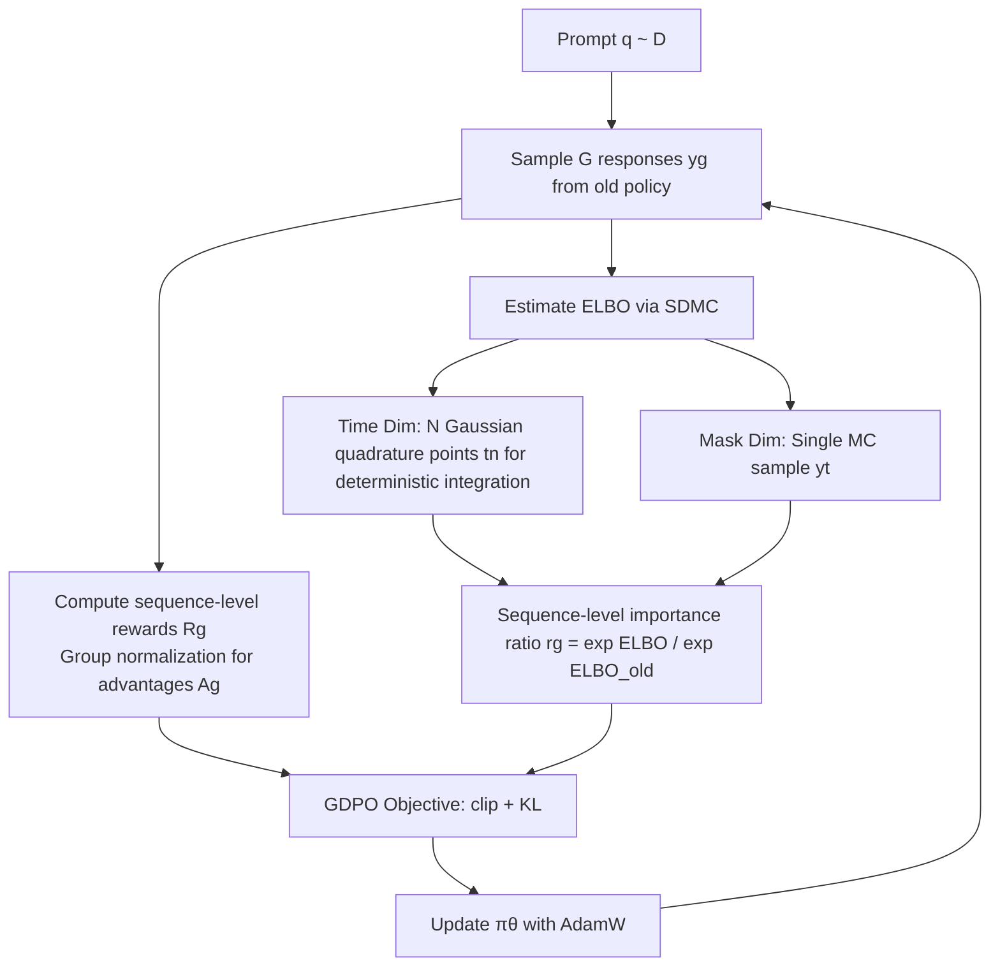

# Improving Reasoning for Diffusion Language Models via Group Diffusion Policy Optimization

**Conference**: ICLR 2026  
**OpenReview**: [https://openreview.net/forum?id=JaqvespRBP](https://openreview.net/forum?id=JaqvespRBP)  
**Code**: TBD  
**Area**: LLM Reasoning / RL Post-training / Diffusion Language Models  
**Keywords**: Diffusion Language Models, GRPO, ELBO, Variance Reduction, Semi-deterministic Monte Carlo, Sequence-level Likelihood  

## TL;DR
This paper proposes **GDPO** (Group Diffusion Policy Optimization), utilizing a low-variance, low-cost "Semi-deterministic Monte Carlo" scheme to efficiently estimate the sequence-level ELBO of diffusion language models. This allows GRPO-style RL post-training to be effectively applied to diffusion language models, consistently outperforming the previous diffu-GRPO across mathematical, planning, and coding reasoning tasks.

## Background & Motivation
Diffusion Language Models (DLMs, such as LLaDA) generate text through parallel, order-independent, iterative denoising, providing a more flexible generation paradigm compared to autoregressive LLMs. However, applying RL post-training (like GRPO/PPO) to DLMs faces a fundamental obstacle: **the sequence likelihood of DLMs cannot be computed analytically**, whereas the importance sampling ratio $r_g$ in GRPO specifically requires the likelihood ratio under new and old policies.

- **Background**: GRPO has become a mainstream method for LLM reasoning post-training by replacing the value network with relative advantages from group-based multi-sampling; however, it assumes that likelihood can be calculated token-by-token.
- **Limitations of Prior Work**: The pioneering work diffu-GRPO bypasses the unsolvable likelihood by using a mean-field approximation of "single-step unmasking" to estimate **token-level** likelihood. This is computationally cheap but **severely biased**, and the semantics of token-level ratios are questionable within an order-independent diffusion framework.
- **Key Challenge**: A more principled approach is to use the **sequence-level** ELBO as a proxy for $\log\pi(y|q)$ (due to its clean mathematical relationship). However, ELBO estimation requires double Monte Carlo integration over "random time $t$" and "random mask $y_t$", leading to **exploding variance and evaluation costs too high for practical use**—the "variance-cost dilemma."
- **Goal**: To provide a low-variance and accurate sequence-level ELBO estimator under an extremely tight evaluation budget (only 2~3 network forward passes per likelihood), making sequence-level RL feasible.
- **Key Insight**: **Analyze the variance first**. The authors found that the vast majority of ELBO variance stems from the "random time $t$" rather than the "random mask," and the curve of loss versus $t$ is smooth and monotonically convex. Thus, by **replacing the random sampling of the time dimension with deterministic numerical integration (Gaussian quadrature) while keeping a single Monte Carlo sample for the mask dimension**, they derive the "Semi-deterministic Monte Carlo" (SDMC) estimator, which is proven to have lower variance under tight budgets.

## Method

### Overall Architecture
GDPO maintains the original GRPO training loop (group sampling → calculate rewards and relative advantages → policy gradient update with clip and KL). The unique replacement is the step for "calculating likelihood/importance ratios": replacing the token-level mean-field approximation of diffu-GRPO with the **sequence-level ELBO** estimated by SDMC. The entire pipeline is "Sample G responses → Estimate ELBO for each response using N quadrature points → Construct sequence-level importance ratios and advantages → Update with AdamW."

### Key Designs

**1. Variance Anatomy: Identifying the true source of variance.** The definition of ELBO (Eq. 2) contains two stochastic sources—the choice of mask ratio (random time $t$) and the choice of which tokens are masked given the ratio (random mask $y_t$). The authors decompose the loss variance by these sources, leading to a counter-intuitive but crucial conclusion: **Almost all variance comes from the random time** $t$, because the loss magnitude varies significantly across different $t$; however, the mean curve of the loss with respect to $t$ is **strictly increasing and convex**, appearing similar across different prompts with relatively constant variance across most noise levels. This observation directly informs the design: "The dimension that is most random is actually the one that should be made deterministic to eliminate the majority of the variance."

**2. Semi-deterministic Monte Carlo (SDMC): Replacing time integration with numerical quadrature.** Since time is the culprit for variance and the curve is smooth, instead of treating ELBO as a "double Monte Carlo" sample, it is written as an integral over time $L_{\text{ELBO}}(y|q)=\int_0^1 \mathbb{E}_{y_t\sim\pi_t(\cdot|y)}\big[\tfrac{1}{t}\sum_i \mathbf{1}[y_t^i=M]\log\pi_\theta(y^i|y_t,q)\big]\,dt$, and approximated using $N$-point Gaussian quadrature:

$$L_{\text{ELBO}}(y|q)\approx \sum_{n=1}^{N} w_n \underbrace{\frac{1}{K}\sum_{k=1}^{K}\frac{1}{t_n}\sum_{i=1}^{L}\mathbf{1}[(y_{t_n}^{[k]})^i=M]\log\pi_\theta(y^i|y_{t_n}^{[k]},q)}_{\ell(\pi_\theta;\,y,q,t_n)}.$$

"Semi-deterministic" refers to: **the time dimension $\{t_n\}$ uses deterministic quadrature points** (fixed to eliminate large variance from random timing), while **the mask dimension still uses random sampling** (and based on variance analysis, $K=1$ is sufficient). Thus, the number of network forward passes per likelihood equals the number of quadrature points $N$. Empirically, $N=2\!\sim\!3$ points capture almost all benefits—the fast convergence of Gaussian quadrature and the monotonic convexity of the integrand make it significantly superior to double Monte Carlo with the same budget in terms of bias and variance (Fig. 3).

**3. GDPO Objective: Moving importance ratios and advantages to the sequence level.** With an affordable sequence-level ELBO, the GRPO objective is largely retained, but its likelihood terms are replaced with sequence-level ones:

$$\mathcal{L}_{\text{GDPO}}(\theta)=\mathbb{E}\Big[\frac{1}{G}\sum_{g=1}^{G}\frac{1}{|y_g|}\min\big(r_g A_g,\ \mathrm{clip}(r_g,1-\epsilon,1+\epsilon)A_g\big)-\beta\,\mathrm{KL}(\pi_\theta\|\pi_{\text{ref}})\Big],$$

where the sequence-level importance ratio $r_g=\exp(L_{\text{ELBO}}(y_g|x))/\exp(L_{\text{ELBO}}^{\text{old}}(y_g|x))$, and the advantage $A_g=R_g-\mathrm{mean}(R_1,\dots,R_G)$ (using **unnormalized** advantages to avoid biases noted by Liu et al.). Lifting the ratio from token-level to sequence-level has two benefits: first, it aligns with the fact that "rewards are only given at the sequence level," preserving the semantics of advantage estimation; second, ELBO naturally fits the discrete diffusion framework, aligning in spirit with GSPO.

**4. Mechanism: Bias-variance decomposition of MSE.** The MSE of classic double Monte Carlo decays as $O(1/NK)$. This paper proves that the MSE of the SDMC estimator can be decomposed into "Monte Carlo variance + squared integration bias"—the variance term is similarly $O(1/NK)$, while the squared integration bias under a general quadrature scheme is $O(1/N^2)$, which can be even faster under additional smoothness assumptions on the log-likelihood. This theoretically explains why SDMC exhibits lower variance and more stable convergence than double Monte Carlo under tight budgets.

## Key Experimental Results

The base model is LLaDA-8B-Instruct, covering Mathematics (GSM8K, MATH500), Planning (Countdown, Sudoku), and Code (HumanEval, MBPP). The table below shows accuracy under best-of-128/256/512 generation.

### Main Results (Math & Planning, N=3 Quadrature Points)

| Model | GSM8K (512) | MATH500 (512) | Countdown (512) | Sudoku (128) |
|---|---|---|---|---|
| LLaDA-8B-Instruct | 78.2 | 36.2 | 16.0 | 11.7 |
| + diffu-GRPO | 81.9 | 39.2 | 37.1 | 18.4 |
| + SFT + diffu-GRPO | 82.1 | 40.2 | 42.2 | 22.1 |
| + wD1 | 82.3 | 39.0 | 46.1 | — |
| **+ SFT + GDPO** | **84.99** | **41.4** | **80.86** | **27.69** |

The improvement on Countdown is most dramatic (16.0 → 80.86), and Sudoku, GSM8K, and MATH500 also comprehensively lead over token-level baselines.

### Ablation Study (Code Tasks + ELBO Estimator Comparison)

| Model | HumanEval (512) | MBPP (256) |
|---|---|---|
| LLaDA-8B-Instruct | 37.8 | 41.2 |
| + diffu-GRPO | 34.8 | 45.5 |
| + GDPO | **39.0** | **50.6** |

| ELBO Estimator (Countdown-256) | Relative Performance |
|---|---|
| Double-MC-4 (4 evaluations) | Poor |
| SDMC-1 / SDMC-2 / SDMC-3 | Better accuracy as N increases; SDMC-3 beats Double-MC-4 despite fewer evaluations |

### Key Findings
- **Estimator "precision" is more important than "number of evaluations"**: SDMC-3 consistently outperforms naive double Monte Carlo with fewer function evaluations, indicating that cutting variance in the right dimension is key.
- **Better length extrapolation**: Sequence-level likelihood allows for more uniform improvement across token positions. GDPO leads comprehensively on 512-token long sequences, whereas token-level methods still carry generation order bias.
- **Computationally friendly**: Training is possible using only 2 H100 GPUs, making it accessible to practitioners with limited compute.
- On MBPP, even without SFT, pure RL can gain about 10 points over the pretrained base.

## Highlights & Insights
- **The methodology of "analyzing variance before designing the estimator" is elegant**: Rather than blindly increasing sampling, identifying "random time" as the variance culprit and observing that the loss is smooth and monotonically convex with respect to $t$ led to the decision to determinize the time dimension—a prime example of grafting numerical integration (Gaussian quadrature) into RL likelihood estimation.
- **Semi-determinism is the optimal trade-off**: Fixed time points + random masks allow for the fast convergence of quadrature without losing the stochasticity of the integrand. $N=2\!\sim\!3$ points are sufficient.
- **Sequence-level rather than token-level** fundamentally aligns with the fact that "rewards are only sequence-level" and avoids the unreliability of token-level ratios caused by the order-independence of diffusion models.

## Limitations & Future Work
- Experiments were only validated on the LLaDA-8B base. The authors acknowledge that stronger pretrained checkpoints should yield greater gains but these were not covered.
- Gaussian quadrature points and weights are currently fixed/general schemes; the authors suggest using **data-driven adaptive quadrature positions and weights** to further reduce variance.
- Stability of sequence-level ELBO estimation for extremely long sequences or more complex rewards (process rewards, multi-step tool calls) has not yet been explored.
- The theoretical faster convergence rate depends on additional smoothness assumptions of the log-likelihood, which needs further validation across diverse actual tasks.

## Related Work & Insights
- **GRPO / GSPO**: GDPO is a "sequence-level" extension of GRPO for diffusion language models. The move to sequence-level importance ratios is spiritually aligned with GSPO.
- **diffu-GRPO (Zhao et al., 2025)**: The most direct comparison, which uses a token-level mean-field approximation of single-step unmasking. GDPO identifies its bias and replaces it with the sequence-level ELBO.
- **Diffusion Language Models (LLaDA, etc.)**: This paper converts the core obstacle of "unsolvable likelihood" in DLM RL into a problem of "efficient low-variance estimation of ELBO," providing a reusable estimator tool for future DLM alignment research.
- **Insight for Autoregressive RL**: When likelihood/ratio estimation itself is noisy, **instead of increasing sampling, it is better to first perform variance decomposition and determinize the dimension with the highest variance**.

## Rating
- **Novelty**: ⭐⭐⭐⭐ — Introducing variance decomposition and semi-deterministic Monte Carlo for DLM ELBO estimation is a novel and cleanly implemented idea.
- **Experimental Thoroughness**: ⭐⭐⭐⭐ — Covers six benchmarks across math, planning, and code, including estimator ablations and length extrapolation; however, limited to a single base model without larger-scale validation.
- **Writing Quality**: ⭐⭐⭐⭐ — The chain of motivation-observation-method-theory is clear, and Figs. 2/3/4 explain the variance intuition well.
- **Value**: ⭐⭐⭐⭐ — Provides a theoretically sound and computationally affordable paradigm for RL post-training of diffusion language models with low barriers to entry (2x H100).

<!-- RELATED:START -->

## Related Papers

- [\[ICLR 2026\] Inpainting-Guided Policy Optimization for Diffusion Large Language Models](inpainting-guided_policy_optimization_for_diffusion_large_language_models.md)
- [\[ICLR 2026\] On the Reasoning Abilities of Masked Diffusion Language Models](on_the_reasoning_abilities_of_masked_diffusion_language_models.md)
- [\[ICLR 2026\] Scaf-GRPO: Scaffolded Group Relative Policy Optimization for Enhancing LLM Reasoning](scaf-grpo_scaffolded_group_relative_policy_optimization_for_enhancing_llm_reason.md)
- [\[ICLR 2026\] Test-Time Scaling in Diffusion LLMs via Hidden Semi-Autoregressive Experts](test-time_scaling_in_diffusion_llms_via_hidden_semi-autoregressive_experts.md)
- [\[ICLR 2026\] Reference-guided Policy Optimization for Molecular Optimization via LLM Reasoning](reference-guided_policy_optimization_for_molecular_optimization_via_llm_reasonin.md)

<!-- RELATED:END -->
