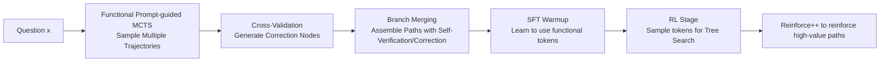

# Incentivizing LLM Reasoning via Reinforcement Learning with Functional Monte Carlo Tree Search

**Conference**: ICLR 2026  
**OpenReview**: [https://openreview.net/forum?id=lHbhzxiVI9](https://openreview.net/forum?id=lHbhzxiVI9)  
**Code**: [https://github.com/sastpg/RFTT](https://github.com/sastpg/RFTT)  
**Area**: LLM Reasoning / Reinforcement Fine-tuning  
**Keywords**: functional tokens, Monte Carlo Tree Search, reinforcement learning, self-improvement, learn-to-reason  

## TL;DR
RFTT embeds a set of learnable "functional tokens" such as `<analyze>`, `<verify>`, and `<refine>` directly into the model's vocabulary. It first generates annotated SFT data using functional prompt-guided MCTS for warmup, and subsequently enables the model to directly sample functional tokens for tree search exploration during the RL stage. This allows 7B/8B small models to acquire human-like multi-step reasoning without any prompting.

## Background & Motivation
- **Background**: Works like DeepSeek-R1 demonstrate that RLVR (RL with Verifiable Rewards) can spontaneously trigger complex reasoning and "aha moments," while tree search methods (ToT, GoT, MCTS, rStar) utilize structured exploration to find optimal reasoning paths.
- **Limitations of Prior Work**: On one hand, learning-to-reason depends heavily on high-quality CoT data, which is expensive and difficult to scale via stronger models or manual annotation, particularly for 7B/8B small models. On the other hand, research suggests that pure RL may not introduce entirely new reasoning capabilities but rather increases the probability of sampling known correct answers, potentially **sacrificing reasoning diversity and compressing the exploration space**.
- **Key Challenge**: Effective learning-to-reason requires both "sufficient initial reasoning capability" and "sustained exploration diversity"—insufficient initial capability prevents useful feedback during self-play, while lacking exploration diversity leads to premature convergence on sub-optimal reasoning patterns.
- **Goal**: Enable small-parameter LLMs to simultaneously acquire initial reasoning ability and exploration diversity through self-training, without relying on manual CoT or external prompt constraints.
- **Key Insight**: **Functional token internalization**—unlike rStar, which treats functional prompts as external constraints during inference, this approach embeds them as new special tokens in the vocabulary. This allows the model to learn "how to choose the appropriate reasoning behavior" during training, upgrading prompt-guided reasoning to token-guided reasoning.

## Method

### Overall Architecture
RFTT (Reinforced Functional Token Tuning) models complex reasoning as a tree search where the question is the root, "reasoning behaviors" are edges, and sub-steps are nodes. The action space consists of 8 human-like functional tokens (`<clarify>`, `<analysis>`, `<subquestion>`, `<next_step>`, `<direct_answer>`, `<verify>`, `<refine>`, `<output>`). The process involves two stages: first, using functional prompt-guided MCTS to generate token-annotated data for SFT warmup; second, an RL stage where the model directly samples functional tokens for tree search and reinforces high-value paths.

### Key Designs

**1. Functional MCTS Data Generation: Stitching correct and incorrect trajectories into self-correcting samples.** SFT data does not simply retain correct chains but deliberately contrasts a correct trajectory with an incorrect one to teach the model to reflect. Specifically, a process reward model picks the correct trajectory with the highest average reward $\tau_c = \arg\max_{\tau_i \in T_c} \bar{R}(\tau_i)$ and the incorrect trajectory with the lowest reward $\tau_w = \arg\min_{\tau_i \in T_w} \bar{R}(\tau_i)$ from those sharing an intersection. Overlapping nodes are denoted as $\tau^+ = \tau_c \cap \tau_w$. A **cross-validation node** $s_v$ is then generated using the prompt "Compared to similar correct steps before, where does the current step go wrong?" to identify the error in the incorrect branch $\tau_w^-$. Finally, **branch merging** is performed $\tau_f = \tau^+ \cup \tau_w^- \cup \{s_v\} \cup \tau_c^+$, and functional tokens are used to concatenate steps into a trainable path $D_{\text{SFT}} = \otimes_{s_i \in \tau_f}(\langle a_i\rangle s_i \langle/a_i\rangle)$. This synthetic data naturally possesses a "failure → self-verification → correction" structure, internalizing self-correction behaviors during SFT.

**2. Conversion from Prompt-guided to Token-guided: Sampling functional tokens as actions.** SFT embeds the 8 functional tokens as new special tokens. Following training, the model can explicitly select a functional token like any regular token and then generate the corresponding reasoning step. This is the fundamental difference from rStar—whereas rStar's functional prompts are external constraints, here reasoning behaviors become internal learnable decisions optimizable by RL, upgrading external search to endogenous tree search and improving exploration efficiency.

**3. Functional Tree Search RL: Token selection via UCT, driven by Reinforce++ with rule-based rewards and KL constraints.** The RL stage follows an AlphaZero-like approach: if unexplored functional tokens exist, they are chosen via log-likelihood $\arg\max_{a\in U(s_t)}\pi_\theta(a\mid s_{0:t})$; otherwise, UCT balances exploitation and exploration $\text{UCT}(s_t,a)=\frac{Q(s_t,a)}{N(s_t,a)} + c\cdot\sqrt{\frac{\ln N(s_t)}{N(s_t,a)}}$. Rewards are provided by a rule-based answer extractor $\text{ANS}(\cdot)$—1 for correct, 0.1 for incorrect but present, and process reward $\sigma$ if no answer (where $\sigma=0$ for outcome-only rewards, or provided by a PRM). KL punishment against the SFT reference model is applied $R_t = \text{RM}(\cdot) - \beta\cdot\text{KL}(t)$. Optimization uses the Reinforce++ clipped objective $L_{\text{RL}}(\theta)=-\mathbb{E}_t[\min(r_t\hat{A}_t,\ \text{clip}(r_t,1-\epsilon,1+\epsilon)\hat{A}_t)]$.

**4. Why it is stronger: High-entropy exploration and discriminative advantage attribution.** Unlike independent rollouts in GRPO, RFTT branches based on functional token probabilities at each node. Concentrated distributions (low entropy) inhibit branching, while dispersed distributions (high entropy) encourage it, thereby **adaptively allocating exploration resources to regions with higher uncertainty**. The tree search generates trajectories with "shared prefixes and diverging continuations": shared tokens receive aggregated advantage signals, while diverging tokens receive specific path advantages, allowing the model to distinguish between different reasoning behaviors at critical steps.

## Key Experimental Results

### Main Results
Training utilized only the MATH training set (~1k SFT samples with functional tokens + RL). Evaluation covered 5 math benchmarks. Pass@1 accuracy (partial):

| Model | Method | MATH-500 | GSM8K | Olympiad | AMC | Average |
|------|------|----------|-------|----------|-----|------|
| Qwen-3-4B-Base | Zero-shot CoT | 58.6 | 80.6 | 31.4 | 50.0 | 59.90 |
| | GRPO | 75.6 | 92.7 | 42.9 | 67.5 | 73.42 |
| | TreeRL | 82.2 | 95.3 | 46.5 | 70.0 | 77.36 |
| | **RFTT** | **83.4** | **96.1** | **48.1** | **75.0** | **79.46** ↑19.56 |
| Qwen-2.5-7B-Instruct | Zero-shot CoT | 72.0 | 91.1 | 35.1 | 45.0 | 66.34 |
| | TreeRL | 78.4 | 94.8 | 39.6 | 62.5 | 73.52 |
| | **RFTT** | **79.8** | **95.2** | **40.3** | **70.0** | **75.66** ↑9.32 |
| LLaMA-3.1-8B-Instruct | Zero-shot CoT | 50.6 | 84.5 | 18.6 | 17.5 | 49.88 |
| | TreeRL | 57.8 | 92.6 | 26.7 | 47.5 | 62.14 |
| | **RFTT** | **60.2** | 91.9 | **29.8** | **55.0** | **64.88** ↑15.0 |

Qwen-2.5-7B-Instruct with RFTT reached 79.8% on MATH-500, approaching the 80% of Qwen-2.5-14B-Instruct. In efficiency comparisons, RFTT achieved 72.0% on MATH-500 in 131s/question, while rStar took 526s for 61.0% and LLaMA-Berry took 674s for 69.4%, making RFTT **both more accurate and ~4–5x faster**.

### Ablation Study
Component ablation (Qwen-2.5-7B-Instruct, Average):

| Setting | MATH-500 | AMC | Average |
|------|----------|-----|------|
| RFTT w/o SFT Warmup | 74.8 | 52.5 | 69.40 |
| RFTT w/o MCTS (Random Sampling) | 75.2 | 62.5 | 72.34 |
| RFTT w/o PRM (Outcome-only) | 77.2 | 67.5 | 73.92 |
| **RFTT (Full)** | **79.8** | **70.0** | **75.66** |

Functional token masking showed that `<verify>` (a6), `<refine>` (a7), and `<next_step>` (a4) are the most critical; removing them dropped accuracy from 79.8% to 72.8%, 72.6%, and 73.4% respectively.

### Key Findings
- **Scaling Test-time Compute**: Accuracy continuously increases with the number of rollouts. With 8 rollouts on MATH-500 and 20 on AMC, it surpasses o1-preview.
- **Strong Generalization**: Although trained only on math, improvements were observed in out-of-domain benchmarks like MMLU-Pro, GPQA, CommonsenseQA, FOLIO, and TableBench. Sampling DeepSeek-R1 on MMLU-Pro showed that ~98.4% of reasoning steps map to these 8 functional tokens, indicating a compact yet expressive action space.

## Highlights & Insights
- Transitioning reasoning behaviors from external prompt constraints to internal learnable tokens is a paradigm shift from prompt-guided to token-guided reasoning.
- Synthesizing SFT data with self-verification/correction structures via "correct chain × incorrect chain" cross-validation cleverly circumvents the cost of manual CoT annotation.
- Adaptive exploration budget allocation based on token entropy and discriminative advantage attribution provides a clear intuition for why this is more effective than GRPO.

## Limitations & Future Work
- Training used only the MATH dataset and models under 10B; scalability to larger models and broader domains remains to be verified.
- The data generation phase relies on the math-shepherd PRM for process rewards, and the 8 functional tokens were designed based on human heuristics. Whether this token set needs redesigning for non-math/STEM tasks is an open question.
- While MCTS sampling is faster than rStar/LLaMA-Berry, it still introduces overhead from tree search and PRM scoring compared to pure GRPO independent rollouts.

## Related Work & Insights
- **learn-to-reason**: Long CoT synthesis for SFT, preference optimization (DPO variants), RLVR (DeepSeek-R1). RFTT mitigates the diversity compression issues of RLVR using functional tree search.
- **Tree Search Reasoning**: ToT, GoT, MCTS, rStar, ResT-MCTS*, LLaMA-Berry, TreeRL. RFTT is closest to rStar but differs by internalizing functional tokens during training.
- **Insight**: Embedding control/structural signals as learnable special tokens and using RL to optimize their usage policy might generalize to tool use, retrieval decisions, and multi-agent role switching.

## Rating
- **Novelty**: ⭐⭐⭐⭐ Internalizing functional prompts as learnable tokens and optimizing via functional tree search RL is a compelling paradigm advancement over rStar/RLVR.
- **Experimental Thoroughness**: ⭐⭐⭐⭐ Covers 3 backbones, 5 math + 6 out-of-domain benchmarks, with multidimensional ablations. However, training data is limited and larger models were not tested.
- **Writing Quality**: ⭐⭐⭐⭐ Formulas and diagrams are clear; the analysis of two-stage motivation and "high-entropy exploration/discriminative advantage attribution" is insightful.
- **Value**: ⭐⭐⭐⭐ Enabling 7B/8B small models to approach 14B/o1-preview performance via self-training is practically valuable for low-cost reasoning enhancement.

<!-- RELATED:START -->

## Related Papers

- [\[ICLR 2026\] RL of Thoughts: Navigating LLM Reasoning with Inference-Time Reinforcement Learning](rl_of_thoughts_navigating_llm_reasoning_with_inference-time_reinforcement_learni.md)
- [\[AAAI 2026\] RPM-MCTS: Knowledge-Retrieval as Process Reward Model with Monte Carlo Tree Search for Code Generation](../../AAAI2026/llm_reasoning/rpm-mcts_knowledge-retrieval_as_process_reward_model_with_monte_carlo_tree_searc.md)
- [\[ICLR 2026\] Curriculum Reinforcement Learning from Easy to Hard Tasks Improves LLM Reasoning](curriculum_reinforcement_learning_from_easy_to_hard_tasks_improves_llm_reasoning.md)
- [\[ICLR 2026\] NFT: Bridging Supervised Learning and Reinforcement Learning in Math Reasoning](nft_bridging_supervised_learning_and_reinforcement_learning_in_math_reasoning.md)
- [\[ICLR 2026\] Emergent Hierarchical Reasoning in LLMs through Reinforcement Learning](emergent_hierarchical_reasoning_in_llms_through_reinforcement_learning.md)

<!-- RELATED:END -->
