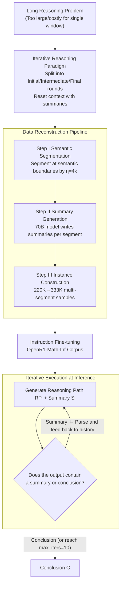

# InftyThink: Breaking the Length Limits of Long-Context Reasoning in Large Language Models

**Conference**: ICLR 2026  
**arXiv**: [2503.06692](https://arxiv.org/abs/2503.06692)  
**Code**: [Project Page](https://zju-real.github.io/InftyThink)  
**Area**: Model Compression  
**Keywords**: Long-Context Reasoning, Iterative Reasoning, Summarization Compression, Computational Efficiency, Reasoning Paradigm

## TL;DR
Ours proposes InftyThink, a new paradigm that transforms monolithic long reasoning into iterative short reasoning with intermediate summaries. It achieves theoretically unbounded reasoning depth and significantly reduces computational costs without modifying model architectures, showing an 11% improvement for Qwen2.5-Math-7B on AIME24.

## Background & Motivation
Reasoning models represented by DeepSeek-R1 and o1 achieve superior performance through long Chain-of-Thought (CoT), but long-context reasoning faces three fundamental issues:

**Quadratic Computational Scaling**: The computational complexity of decoder-based LLMs grows quadratically with sequence length, causing massive resource consumption during inference.

**Context Length Ceiling**: The reasoning process is constrained by `max_length`, often leading to truncation before reaching a conclusion.

**Performance Degradation Beyond Training Window**: Most models are pre-trained with windows of only 4k-8k tokens, and performance drops significantly when reasoning exceeds this range.

**Limitations of Prior Work**: Existing solutions (such as CoT-Valve for reasoning chain compression, TokenSkip for removing redundant tokens, and LightThinker for dynamic compression via special tokens) still optimize within the "single continuous reasoning" paradigm and do not address the root cause of computational scaling.

**Key Insight**: Mimicking human cognition—decomposing complex problems into manageable parts and summarizing intermediate progress. Ours splits the overall reasoning into multiple segments of bounded length, generates a summary after each segment, and continues reasoning based on that summary in the next segment, forming a "sawtooth" memory pattern.

## Method

### Overall Architecture
InftyThink aims to solve the "quadratic computation + context ceiling" problem of single-pass long reasoning by splitting a long chain into multiple rounds of bounded reasoning, compressing each segment into a summary before proceeding. The framework consists of two pipelines: offline, a data reconstruction pipeline translates existing long reasoning corpora into a "segmented reasoning + intermediate summary" format for instruction fine-tuning; online, the model executes following the iterative reasoning paradigm—generating a reasoning path $RP_1$ and its summary $S_1$ in the first round; from the second round onwards, the model uses only the previous summary $S_{i-1}$ as historical context to generate $RP_i$ and a new summary $S_i$; until the final round, where a conclusion $C$ is produced instead of a summary. Because only the "current segment + one summary" enters the attention mechanism in each round, the context length is always kept at the scale of $\eta$, and overall memory usage exhibits a periodic "sawtooth" pattern rather than monotonic expansion.

### Key Designs

**1. Iterative Reasoning Paradigm: Compressing unbounded chains into bounded segments via periodic summaries**

Addresses the pain point where long reasoning is neither computationally feasible nor fits within a single window. InftyThink splits reasoning into three types of rounds using fixed sequence templates: the initial round is `<|U|>Q<|A|><think>RP₁</think>
S₁
`, intermediate rounds insert the previous summary into history—`<|U|>Q<|A|><history>Sᵢ₋₁</history><think>RPᵢ</think>
Sᵢ
`, and the final round replaces the summary with a conclusion—`<|U|>Q<|A|><history>Sₙ₋₁</history><think>RPₙ</think>C`. Crucially, the input length for every round is "reset" to a bounded level by the summary, allowing reasoning depth to stack infinitely without context overflow. This paradigm is also naturally backward compatible: simple problems can reach a conclusion in the first round, degrading the process to traditional one-shot reasoning without extra switches.

**2. Data Reconstruction Pipeline: Translating existing long reasoning data into multi-segment format offline**

To learn "summarizing after each segment," the model needs training data in the corresponding format. Since generating this from scratch is expensive, the authors transform high-quality existing long reasoning corpora. The pipeline has three steps: **Step I Semantic Segmentation**, which cuts the original long reasoning into multiple segments at semantic boundaries (like sentences or paragraphs) based on a hyperparameter $\eta$ (maximum segment length) to avoid breaking semantics; **Step II Summary Generation**, where Meta-Llama-3.3-70B-Instruct writes a summary for each segment, ensuring the model sees all previous context to maintain the entire reasoning thread; **Step III Training Instance Construction**, which assembles segments into independent samples—initial segment $(Q, RP_1, S_1)$, intermediate segments $(Q, S_{i-1}, RP_i, S_i)$, and the final segment $(Q, S_{n-1}, RP_n, C)$. Through this pipeline, the authors reconstructed 220K original samples from OpenR1-Math into 333K InftyThink-formatted samples ($\eta$=4k), effectively reusing high-quality reasoning data.

**3. Iterative Execution during Inference: On-the-fly summary parsing and self-convergence**

This step enables the paradigm during inference without requiring architectural changes. Each round's output is parsed for `
`, which is fed back as historical context for the next round, repeating until the model outputs a conclusion instead of a summary. To prevent infinite loops during insufficient training, a `max_iters=10` fallback is set; experiments show well-trained models naturally converge within reasonable rounds. Since only the concatenation of inputs and outputs is modified, any decoder-only model can adopt this directly.

### A Complete Example
Consider an AIME problem requiring approximately 10k tokens and $\eta$=4k: In round 1, the model reads the question, writes the first ~4k tokens of reasoning $RP_1$, and compresses it into a summary $S_1$ of a few hundred tokens (recording established equations and intermediate results). In round 2, the model discards the full $RP_1$, places only $S_1$ into `<history>`, continues with $RP_2$, and summarizes into $S_2$. In round 3, starting from $S_2$, the reasoning approaches the answer, so the model provides conclusion $C$ directly without a summary. In each of the three rounds, only "one summary + current 4k segment" enters the attention mechanism. Peak context is compressed from ~10k to ~4k, with the memory curve repeatedly dropping between rounds, forming a sawtooth pattern where the total reasoning chain length is not limited by the single-round window.

### Loss & Training
Instruction fine-tuning is performed on OpenR1-Math-Inf (InftyThink format corpus) across various base models. Key hyperparameters include segment length $\eta = 4k$ and an inference limit of `max_iters = 10`.

## Key Experimental Results

### Main Results (Base Models, pass@16, temperature=0.7)

| Model | Format | MATH500 ACC | AIME24 ACC | GPQA ACC | Avg ACC |
|------|------|------------|-----------|---------|---------|
| Qwen2.5-Math-1.5B | Vanilla | 75.24 | 16.04 | 26.48 | 59.54 |
| Qwen2.5-Math-1.5B | InftyThink | **79.57** | **26.04** | **35.89** | **65.48** |
| Qwen2.5-Math-7B | Vanilla | 89.51 | 32.92 | 43.94 | 74.78 |
| Qwen2.5-Math-7B | InftyThink | **91.29** | **43.96** | **52.97** | **78.92** |
| Llama-3.1-8B | Vanilla | 82.10 | 20.83 | 41.35 | 68.49 |
| Llama-3.1-8B | InftyThink | **82.28** | **34.17** | **47.51** | **70.84** |

### Latency Comparison (Inference Time)

| Model | MATH500 Latency Vanilla→InftyThink | AIME24 Latency |
|------|------|------|
| Qwen2.5-Math-7B | 1.26s→0.76s | 4.15s→4.66s |
| Qwen2.5-14B | 1.49s→1.43s | 11.30s→7.11s |

### Key Findings
- Qwen2.5-Math-7B shows an 11% gain on AIME24 (32.92→43.96) and a 9% gain on GPQA (43.94→52.97).
- Smaller models (1.5B) benefit more: +10% on AIME24 and +9.4% on GPQA.
- MATH500 latency dropped from 1.26s to 0.76s, showing significantly improved computational efficiency (smaller area under the curve).
- As model scale increases (14B/32B), the accuracy gains of InftyThink tend to plateau, though latency benefits remain significant.
- The scale of the summary generation model has little impact on final performance (limited difference between 70B vs. smaller models).

## Highlights & Insights
- The "sawtooth memory pattern" concept is intuitive and powerful—periodic compression makes computational complexity manageable.
- No architectural modifications or specialized training infrastructure required; significant gains are achieved only through data reconstruction and SFT.
- Challenges the assumption that reasoning depth and computational efficiency must be traded off—both can be improved simultaneously.

## Limitations & Future Work
- Lack of systematic analysis on how summary quality affects reasoning correctness—information loss might accumulate across long reasoning chains.
- $\eta$ (segment length) is fixed at 4K; dynamic adjustments might be superior (simple segments may not need 4K, difficult ones might need more).
- Relies on SFT; combining with Reinforcement Learning (e.g., GRPO) might unlock greater potential.
- Reliability of multi-round summarization may vary between numerical reasoning and linguistic reasoning.

## Related Work & Insights
- **vs CoT-Valve**: CoT-Valve requires a preset compression ratio, while InftyThink adaptively determines when to conclude.
- **vs LightThinker**: LightThinker compresses into implicit representations, whereas InftyThink maintains textual explainability.
- **vs TokenSkip**: TokenSkip loses reasoning performance by deleting tokens, while InftyThink retains key information through summaries.

## Rating
- Novelty: ⭐⭐⭐⭐ The iterative reasoning paradigm is simple yet effective with a clear concept.
- Experimental Thoroughness: ⭐⭐⭐⭐⭐ Covers 5 base models, multiple benchmarks, latency analysis, and rich ablation studies.
- Writing Quality: ⭐⭐⭐⭐⭐ Excellent illustrations; the sawtooth comparison diagram is highly intuitive.
- Value: ⭐⭐⭐⭐⭐ High practical value; can be directly applied to existing models.

<!-- RELATED:START -->

## Related Papers

- [\[ICLR 2026\] PERK: Long-Context Reasoning as Parameter-Efficient Test-Time Learning](perk_long-context_reasoning_as_parameter-efficient_test-time_learning.md)
- [\[ICLR 2026\] The Limits of Inference Scaling Through Resampling](the_limits_of_inference_scaling_through_resampling.md)
- [\[ICLR 2026\] On the Thinking-Language Modeling Gap in Large Language Models](on_the_thinking-language_modeling_gap_in_large_language_models.md)
- [\[ICLR 2026\] HardcoreLogic: Challenging Large Reasoning Models with Long-tail Logic Puzzle Games](hardcorelogic_challenging_large_reasoning_models_with_long-tail_logic_puzzle_gam.md)
- [\[ACL 2026\] Long-Context Reasoning Through Proxy-Based Chain-of-Thought Tuning](../../ACL2026/llm_reasoning/long-context_reasoning_through_proxy-based_chain-of-thought_tuning.md)

<!-- RELATED:END -->
