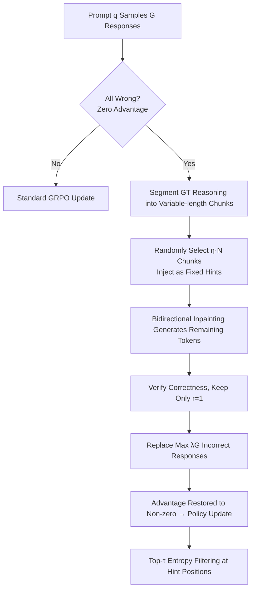

# Inpainting-Guided Policy Optimization for Diffusion Large Language Models

**Conference**: ICLR 2026  
**OpenReview**: [https://openreview.net/forum?id=haVf5e4Q6C](https://openreview.net/forum?id=haVf5e4Q6C)  
**Code**: [https://github.com/facebookresearch/igpo](https://github.com/facebookresearch/igpo)  
**Area**: LLM Reasoning / Diffusion Language Models / Reinforcement Learning  
**Keywords**: diffusion LLM, GRPO, inpainting, RLVR, exploration, LLaDA  

## TL;DR
By leveraging the unique "inpainting" capability of diffusion language models (dLLMs), partial ground-truth reasoning segments are injected to guide exploration when GRPO training encounters "all-wrong groups with zero advantage." This restores gradient signals and improves sample efficiency, achieving new SoTA results for full-attention masked dLLMs on four mathematical reasoning benchmarks.

## Background & Motivation
- **Background**: Masked diffusion large models (dLLMs, such as LLaDA and Dream) decode in parallel through iterative unmasking, with performance now competitive with similarly sized autoregressive LLMs. They naturally support bidirectional "inpainting"—filling in missing content within existing text—which is impossible for autoregressive models. Reinforcement Learning from Verifiable Rewards (RLVR) is a mainstream post-training technique to enhance their reasoning capabilities.
- **Limitations of Prior Work**: Existing dLLM post-training methods directly copy practices from autoregressive LLMs (e.g., DiffuGRPO, UniGRPO), but all face the **exploration challenge** of RL: on difficult problems, the policy struggles to sample correct solutions, and binary rewards provide almost no learning signal, leading to wasted sampling and low training efficiency.
- **Key Challenge**: In Advantage-based methods like GRPO that use group-relative normalization, if all $G$ responses in a group are **all wrong**, there is no intra-group reward variance. The advantage $A_i = r(o_i) - \frac{1}{G}\sum_j r(o_j) = 0$, causing the gradient to collapse to zero. In difficult domains, such "all-wrong groups" occur with alarming frequency, wasting significant computation.
- **Goal**: Specifically alleviate the zero-advantage dilemma of all-wrong groups, restore meaningful gradients without introducing distribution shift, and transform the bidirectional structure of dLLMs into an exploration advantage.
- **Core Idea**: **[Inpainting as Exploration]** Since dLLMs are trained under random masking, they naturally accept external hints. When a group is all-wrong, ground-truth reasoning trajectories are sliced into segments and **only partially injected** as fixed hints, requiring the model to "inpaint" the remaining reasoning and answer. Replacing some incorrect answers with successfully verified inpainting samples artificially creates reward variance and restores gradients, while retaining self-generated reasoning to avoid the distribution drift of pure SFT.

## Method

### Overall Architecture
IGPO strictly limits modifications to the **sampling layer** of GRPO. Inpainting is triggered only when a group of responses is all-wrong (zero advantage). Partial ground-truth segments are injected to generate supplementary responses, and incorrect responses are replaced with verified correct inpainting samples to restore non-zero advantages. All other GRPO objectives, advantage calculations, and log-prob estimations remain unchanged. The full recipe also includes a Length-Aligned SFT phase before RL to provide better initialization.

### Key Designs

**1. Elastic Inpainting-Triggered Sampling: Intervening only during zero advantage.** The elegance of IGPO lies in "on-demand triggering." Inpainting starts only when all $\{o_1,\dots,o_G\}$ in a group have $r(o_i)=0$, avoiding additional bias for groups that already have gradients. After triggering, the ground-truth trajectory $y^*$ is segmented into variable-length chunks $\{c_1,\dots,c_N\}$ (where $|c_j|\sim U[s_{min},s_{max}]$; **final answer tokens are intentionally excluded** to prevent reward hacking where the model skips reasoning). For each supplementary response $\tilde o_i$, an injection ratio $\eta_i \sim U[\eta_{low},\eta_{high}]$ is independently sampled to ensure hint density diversity. Injection is controlled by a binary mask $m$: $z_{hint}[i]=y^*_i$ (if $m[i]=1$) else mask, and fixed hints remain unchanged throughout the denoising process. Finally, only $K=\min(|\{\tilde o_i:r=1\}|,\lfloor\lambda G\rfloor)$ incorrect responses are replaced to obtain the augmented group $\{o_1,\dots,o_{G-K},\tilde o_1,\dots,\tilde o_K\}$.

**2. Partial Injection vs. Full Injection: Interpolating between on-policy and supervision.** This is a critical finding: **Partial hint injection ($\eta\sim U[0.2,0.6]$) significantly outperforms full ground-truth injection ($\eta=1.0$)**. Full injection is equivalent to pure supervision, where the generated trajectory deviates entirely from the current policy distribution. Partial injection provides "signposts," requiring the model to coherently stitch discrete hint chunks together using its own reasoning. Non-hint tokens remain on-policy, forming a smooth interpolation between SFT and RL—guiding the policy to high-reward regions without the distribution shift of pure SFT. Formally, the IGPO objective is identical to GRPO:
$$\mathcal{L}_{\text{IGPO}}(\theta)=\mathbb{E}\Big[\tfrac{1}{G}\sum_{i=1}^{G}\tfrac{1}{L_i}\sum_{k=1}^{L_i}\min\big(\rho_i^k A_i^k,\ \mathrm{clip}(\rho_i^k,1-\varepsilon,1+\varepsilon)A_i^k\big)-\beta D_{KL}[\pi_\theta\|\pi_{ref}]\Big]$$

**3. Entropy-based Gradient Filtering: Learning only where the model is "unsure."** Injected ground-truth chunks come from a distribution different from the current policy $\pi_\theta$, forming off-policy learning. Forcing ground-truth at positions where the model is already confident (low entropy) conflicts with existing beliefs and causes instability. The solution is to calculate entropy for each hint token position and **apply gradient updates only to the top-$\tau$ percentile of highest-entropy positions**. High-entropy positions represent "true decision boundaries" where the distribution is flatter and more stable when absorbing external guidance.

**4. Length-Aligned SFT: Aligning lengths with refined concise trajectories.** A serious **generation length mismatch** exists between SFT, RL sampling, and evaluation. Full-attention dLLMs (like LLaDA) naturally lack KV cache, restricting RL rollouts to 256 tokens; however, reasoning SFT corpora like OpenR1 often exceed 10,000 tokens. Using LLaMA-4-Maverick, long trajectories are **systematically rewritten into concise, structured versions**—removing redundant reflections and compressing prose into mathematically rigorous statements—aligning SFT data length with RL/evaluation.

## Key Experimental Results

### Main Results

Base model: LLaDA-8B-Instruct. Gains are absolute percentage points over baseline:

| Model | GSM8K | MATH500 | AMC (avg@16) | Minerva | Average |
|---|---|---|---|---|---|
| LLaDA-Instruct (baseline) | 81.5 | 39.0 | 14.5 | 9.2 | 36.0 |
| LLaDA-1.5 | 83.3 | 42.6 | 13.6 | 8.8 | 37.1 |
| + UniGRPO | 82.2 | 39.2 | 15.0 | 11.0 | 36.9 |
| + DiffuGRPO | 82.4 | 40.2 | 15.5 | 10.3 | 37.1 |
| **+ IGPO (Ours)** | 83.1 (+1.6) | 42.8 (+3.8) | 17.5 (+3.0) | 12.1 (+2.9) | **38.9 (+2.9)** |
| + Length-aligned SFT | 83.6 | 45.2 | 22.3 | 10.3 | 40.4 (+4.4) |
| **+ SFT + IGPO (Ours)** | **86.8 (+5.3)** | **47.4 (+8.4)** | **25.9 (+11.4)** | **13.2 (+4.0)** | **43.3 (+7.3)** |

- The full two-stage pipeline achieves cumulative gains of GSM8K +5.3 / MATH500 +8.4 / AMC +11.4, establishing a new SoTA for full-attention dLLMs.

### Ablation Study

| Dimension | Setting | Conclusion |
|---|---|---|
| Hint Ratio | $\eta=1.0$ vs $\eta\sim U[0.2,0.6]$ vs None | **Partial > Full > None**, validating the value of self-generated reasoning |
| All-wrong groups | IGPO vs GRPO | IGPO **reduces the ratio of all-wrong groups by ~60%** |
| Entropy Filtering | Top-τ filtering | Mitigates off-policy distribution mismatch and stabilizes training |

### Key Findings
- **The zero-advantage dilemma is a hidden bottleneck for dLLM RL**: All-wrong groups appear frequently in difficult domains, consuming sampling computation; IGPO transforms these "wasted samples" into valid gradients.
- **Partial > Full**: Providing signposts rather than the whole path allows the model to maintain on-policy self-reasoning.
- The method is **robust to imperfect reasoning trajectories** in the hint pool.

## Highlights & Insights
- **Translating architecture-specific capabilities into algorithmic design**: Inpainting is usually treated as an inference-time feature; this paper is a prime example of "model structure → algorithm design" by integrating it into the RL training loop.
- **Minimalist Intervention**: Modifies only the sampling layer, keeping the rest of GRPO intact, making it easy to migrate to other group-based methods.
- **Robust Engineering**: Prevents reward hacking (excluding answer tokens), mitigates off-policy conflicts (entropy filtering), and prevents distribution mismatch (length-aligned SFT).

## Limitations & Future Work
- Experiments are limited to mathematical reasoning and the LLaDA-8B model; generalization to code or general reasoning is unverified.
- The method **depends on ground-truth reasoning trajectories** for slicing hints, making it inapplicable to tasks lacking step-level annotations.
- Only addresses "all-wrong" zero-advantage cases; "all-correct" cases are not handled.
- Escalating to longer reasoning scenarios is constrained by the compute bottleneck of full-attention dLLMs without KV cache.

## Related Work & Insights
- **dLLM RL Post-training**: IGPO builds upon the log-prob estimation of DiffuGRPO and is orthogonal to works like LLaDA-1.5.
- **SFT/RL Interpolation**: Aligns with the philosophy of using demonstrations to guide RL exploration, but achieves this via dLLM bidirectionality and inpainting for the first time.
- **Entropy-Guided Updates**: Matches recent observations that high-entropy tokens dominate RL learning.

## Rating
- Novelty: ⭐⭐⭐⭐ First to use dLLM inpainting for RL training; partial injection observation has broad value.
- Experimental Thoroughness: ⭐⭐⭐⭐ Four benchmarks with 3-seed averages and complete ablations.
- Writing Quality: ⭐⭐⭐⭐ Clear logic regarding the zero-advantage dilemma and partial injection.
- Value: ⭐⭐⭐⭐ Sets new SoTA for dLLM reasoning and provides a clear path for dLLM post-training.

<!-- RELATED:START -->

## Related Papers

- [\[ICLR 2026\] Improving Reasoning for Diffusion Language Models via Group Diffusion Policy Optimization](improving_reasoning_for_diffusion_language_models_via_group_diffusion_policy_opt.md)
- [\[ICLR 2026\] Reference-guided Policy Optimization for Molecular Optimization via LLM Reasoning](reference-guided_policy_optimization_for_molecular_optimization_via_llm_reasonin.md)
- [\[ICLR 2026\] HiPO: Self-Hint Policy Optimization for RLVR](hipo_self-hint_policy_optimization_for_rlvr.md)
- [\[ICLR 2026\] On the Reasoning Abilities of Masked Diffusion Language Models](on_the_reasoning_abilities_of_masked_diffusion_language_models.md)
- [\[ICLR 2026\] DRPO: Efficient Reasoning via Decoupled Reward Policy Optimization](drpo_efficient_reasoning_via_decoupled_reward_policy_optimization.md)

<!-- RELATED:END -->
