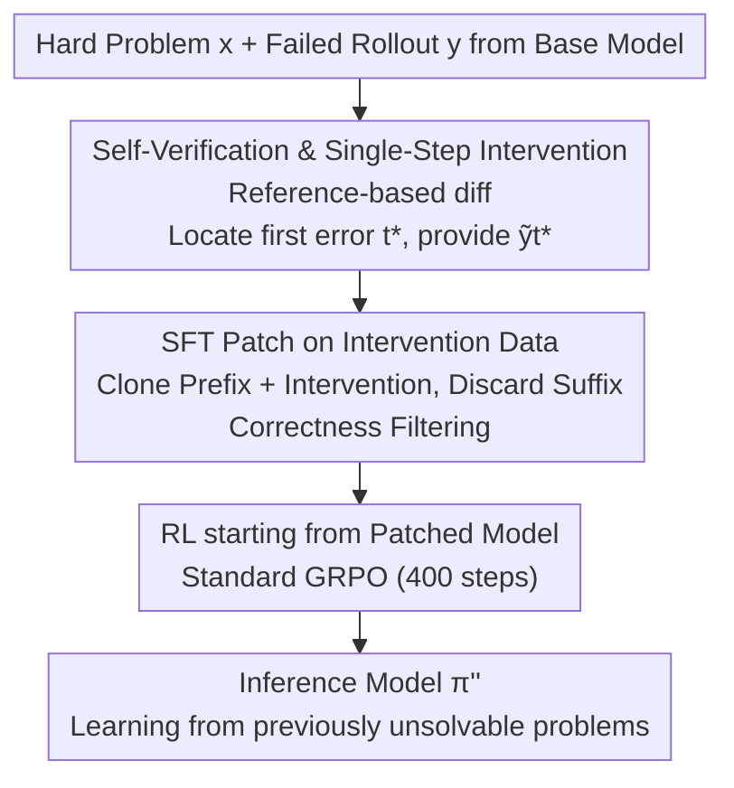

# InT: Self-Proposed Interventions Enable Credit Assignment in LLM Reasoning

**Conference**: ICLR 2026  
**OpenReview**: [https://openreview.net/forum?id=YAhTj2VgBw](https://openreview.net/forum?id=YAhTj2VgBw)  
**Area**: LLM Reasoning  
**Keywords**: Credit Assignment, Reinforcement Learning, Self-verification, One-step Intervention, Mathematical Reasoning

## TL;DR
Addressing the credit assignment challenge in outcome-reward RL where "entire trajectories are rewarded or punished together, failing to distinguish correct from incorrect steps," this paper has the model self-verify against a reference answer to propose a **single-step corrective intervention** for the first error in a failed trajectory. By "patching" these interventions into the base model via SFT followed by RL, the 4B model's accuracy on IMO-AnswerBench increased by nearly 14%, surpassing gpt-oss-20b.

## Background & Motivation

**Background**: Post-training with outcome-reward reinforcement learning (outcome-reward RL, such as GRPO) has proven to significantly enhance the reasoning capabilities of large models. It only considers whether the final answer is correct, providing a binary reward $r(x,y)\in\{0,1\}$, and then calculates the advantage $A(x,y_i)=r(x,y_i)-\frac{1}{n}\sum_j r(x,y_j)$ based on the average within a prompt group.

**Limitations of Prior Work**: This reward treats the "entire trajectory as a single unit." When the advantage is positive, **every step in the response is reinforced uniformly**; when negative, **every step is suppressed uniformly**. Consequently, correct intermediate steps in failed trajectories are unfairly penalized, while irrelevant or even speculative steps in successful trajectories are reinforced. In long reasoning scenarios involving hundreds of steps and ~7k tokens per rollout, this noise can drown out real learning signals, causing training rewards to plateau early and leading to increasingly verbose or prematurely truncated responses. Worse, on sufficiently difficult problems, there may be no correct rollouts at all (the authors noted that in Olympiad-level problems, >80% of rollout groups fail to produce a single correct answer), causing the advantage to collapse to 0 and leaving RL with no signal to learn from.

**Key Challenge**: Solving this problem requires **credit assignment**—precisely locating where a trajectory diverts and punishing only that step while preserving preceding correct steps. Traditional approaches either involve training step-level value functions/process reward models (PRM), which is extremely costly and unstable (Qwen2.5-Math-PRM used approximately 3 million rollouts), or using branched rollouts to estimate the value of each step, which is also prohibitively expensive. Moreover, even with an accurate value function, "searching for a better alternative step in a vast subsequent step space" remains a challenge.

**Goal**: To achieve fine-grained credit assignment for failed trajectories without training value functions, modifying RL objectives, or relying on stronger external models—specifically to extract usable signals from difficult problems where "all answers are wrong."

**Key Insight**: The authors leverage an **asymmetry in task difficulty**—"generating a correct solution from scratch" is much harder than "verifying where an error occurred against a reference solution." Base models often fail to solve a problem themselves but can identify where their reasoning diverged when provided with the standard answer. Thus, the difficult problem of credit assignment is reduced to a "text diff" style self-verification of the model's own trajectory.

**Core Idea**: The model is asked to compare its trajectory against a reference solution to identify the **first erroneous step** $y_{t^*}$ and propose a **single-step corrective intervention** $\tilde{y}_{t^*}$ to replace it. These interventions are then internalized via SFT to clone the "prefix + intervention" as an initialization for subsequent standard RL. This is termed **InT (Intervention Training)**.

## Method

### Overall Architecture
The goal of InT is to "patch" the base model: teaching it to avoid its original erroneous steps to provide a better starting point for subsequent RL. The pipeline consists of three serial stages: offline data collection → SFT patching → RL. For each difficult problem $x$, a rollout is sampled using the base model $y\sim\pi(\cdot|x)$. If the answer is incorrect, the same model performs self-verification against a reference solution to locate the first error $t^*$ and propose a single-step intervention $\tilde{y}_{t^*}$. The "error prefix + intervention" $(y_{<t^*},\tilde{y}_{t^*})$ is collected into an intervention dataset $\mathcal{D}_{\text{InT}}$. SFT is then used to internalize these interventions into the model to obtain $\pi'$, and finally, standard GRPO is run starting from $\pi'$. The key is that interventions are short (mostly under 200 tokens, while full rollouts are ~7k tokens), so the vast majority of tokens in InT training trajectories still come from the base model itself, making it **highly on-policy**. This makes it a far superior RL initialization compared to "directly cloning reference solutions."

### Key Designs

**1. Self-Proposed Intervention: Replacing Value Functions with "Verification is Easier than Generation" Asymmetry**

This step addresses the twin challenges of "locating erroneous steps" and "searching for optimal alternatives." Instead of training a PRM, the authors use a two-stage prompting approach for the base model. Stage 1: Given its own failed trajectory (split into steps $y=(y_0,\dots,y_T)$ by `\n\n`) and a reference solution, the model verifies each step's logic and explicitly outputs the index of the first error. Stage 2: It generates an alternative step $\tilde{y}_{t^*}$ only for that **first error**. Fixing only the first error is intentional—to salvage a wrong answer, the first mistake must be corrected; subsequent errors are often cascades of the initial one, and once the early error is fixed, the trajectory likely deviates from the original path, making individual fixes for later errors unnecessary. This process is completed in one query $\sim\pi(\cdot\,|\,x,y,p_{\text{InT}})$, using no stronger models. It relies entirely on the difficulty gap of the base model across "instruction following / verification / generation." Leakage protection is also implemented: interventions containing the final answer are discarded to prevent "memorizing the answer" rather than "completing the reasoning." This step is highly effective: continuing sampling after the intervention $\pi(\cdot|x,y_{<t^*},\tilde{y}_{t^*})$ increased average rewards from 0.0713% to 1.56% (approx. 22×) and increased unique problems solved from 29/334 to 80/334.

**2. SFT Patch on Intervention Data: Cloning "Prefix + Intervention," Discarding Suffix, and Correctness Filtering**

Given an intervention, how to use the intervention-guided trajectory for SFT is a core design question. The authors determined the strategy via ablation. First, **the error prefix $y_{<t^*}$ must be cloned** along with the intervention—failing to reinforce the prefix might cause the fine-tuned model to generate different prefixes and commit different errors, rendering the original intervention $\tilde{y}_{t^*}$ irrelevant (removing prefix cloning resulted in 40 fewer problems solved out of 235). Second, **the correct suffix $\tilde{y}_{>t^*}$ must be discarded**: cloning an already correct suffix narrows the sequence space for subsequent RL exploration. Experiments showed that including the suffix nearly halved the number of solved problems (202 vs. 111). Third, **only interventions that result in at least one correct answer in 32 completions are kept** (correctness filtering), solving 6 more problems. The final SFT objective maximizes likelihood only for the prefix and intervention step:

$$\nabla_\pi J(\pi)\approx\mathbb{E}_{x\sim\mathcal{D}_{\text{train}},\,y\sim\tilde\pi(\cdot|x)\;\text{s.t.}\;r(x,y)=0}\Big[\nabla_\pi\log\pi(\tilde{y}_{t^*}\,|\,y_{<t^*})+\sum_{t=0}^{t^*}\nabla_\pi\log\pi(y_t\,|\,y_{<t})\Big].$$

This step essentially suppresses the likelihood of the original error and shifts probability mass toward superior steps. After patching, the pass@k ($k=16,\dots,1024$) improves across train/test sets, and the likelihood of intervention tokens increases significantly, indicating that the model learns to spontaneously generate "intervention-style" corrections even on unseen test problems.

**3. RL from Patched Model: Enabling GRPO via On-Policy + Low-Entropy Initialization**

Standard outcome-reward RL (400 steps of GRPO) follows the patch, but from a different starting point: the model likely avoids the errors the base model would have made while preserving originally correct behaviors. RL from this checkpoint further amplifies corrective behavior, suppresses ineffective reasoning segments, and extracts signals from problems that previously yielded zero correct rollouts. InT outperforms other "reference-solution-based" schemes because its training trajectories are the **most on-policy**. Since interventions are short, most tokens come from the base model, resulting in the lowest negative log-likelihood (NLL) and next-token entropy closest to the base distribution (InT 0.29 vs base 0.26). In contrast, directly cloning reference solutions pushes entropy to 1.66. High-entropy initialization is disastrous for RL—it makes rollouts too random, hindering exploration, and distorts the model's existing reasoning patterns (off-policy trajectories are often memorized). InT avoids the memorization traps of off-policy SFT while maintaining explorability, allowing continuous gains during the RL stage.

### Loss & Training
The SFT stage uses Equation (2): maximizing likelihood only for the prefix $y_{<t^*}$ and intervention step $\tilde{y}_{t^*}$ of failed trajectories ($r(x,y)=0$), discarding suffixes. The RL stage uses standard GRPO with binary outcome rewards for 400 steps. The base model is Qwen3-4B-Instruct-2507. The initial problem pool consists of ~4500 hard problems from Polaris / AceReason-Math / Omni-MATH / IMO-AnswerBench filtered for "zero accuracy" (0 correct out of 64~128 rollouts), yielding 1076 problems with valid interventions after filtering.

## Key Experimental Results

### Main Results
Pass@1 / Pass@8 (estimated from 128 rollouts) on four Olympiad-level math benchmarks (all released after the base model, reducing contamination risk):

| Method (Qwen3-4B-Instruct-2507) | IMO-AnswerBench | HMMT'25 Nov | AMO-Bench | Apex Shortlist | Average |
|--------|------|------|------|------|------|
| Base | 11.68 | 41.61 | 26.24 | 20.79 | 21.17 |
| + RL (Standard GRPO) | 23.46 | 46.46 | 35.21 | 22.72 | 28.26 |
| + Hint-guided RL | 16.89 | 47.27 | 33.34 | 22.23 | 28.56 |
| + SFT (Ref) + RL | 11.56 | 27.45 | 25.19 | 20.51 | 20.76 |
| + SFT (Reflect) + RL | 15.53 | 38.65 | 36.72 | 23.93 | 27.60 |
| **+ InT + RL (Ours)** | **25.62** | **49.77** | 36.16 | **28.22** | **33.72** |

InT's average of 33.72 is a ~59% improvement over the base (21.17) and a ~19% improvement over standard RL (28.26). Its 25.62 score on IMO-AnswerBench is more than double the base score and surpasses gpt-oss-20b (23.36, 32K budget) and DeepSeek-R1-0528-Qwen3-8B (18.44) within a 16K token budget.

### Ablation Study
SFT design choices (subset of 235 problems from DeepScaleR):

| Configuration | Coverage | Accuracy | Note |
|------|---------|---------|------|
| Prefix + No Suffix + Filtering (Final) | 202/235 | 7.71% | Full Config |
| - Correctness Filtering | 196/235 | 5.06% | 6 fewer solved |
| - Prefix Cloning | 162/235 | 2.87% | 40 fewer solved (Most significant drop) |
| + Prefix Cloning + Suffix Cloning | 111/235 | 2.31% | Problems solved nearly halved |

Effectiveness of the intervention itself (334 problems): Appending the intervention during continuation increased average rewards from 0.0713% to 1.56% (22×) and coverage from 29/334 to 80/334.

### Key Findings
- **Prefix cloning is the largest contributor**: Removing it resulted in 40 fewer solved problems out of 235, validating the hypothesis that "without strengthening the prefix, the intervention won't match new errors generated later."
- **Suffixes are harmful**: Cloning correct suffixes limits RL exploration space, nearly halving the solved count—consistent with the intuition of "leaving room for RL exploration."
- **On-policy degree determines success**: Post-RL performance correlates with the NLL of SFT trajectories under the base distribution. InT has the lowest NLL and an entropy closest to the base (0.29 vs 1.66 for Ref-SFT). Directly SFTing reference solutions + RL resulted in 20.76, lower than the **un-tuned base** (21.17), showing that blind cloning of off-policy solutions inhibits downstream exploration.
- **Significant drop in zero-advantage ratio**: InT+RL produces higher training rewards and the lowest percentage of "problems resulting in zero correct rollouts," allowing learning from previously silent problems.

## Highlights & Insights
- **Reduction of Credit Assignment to "Text Diff"**: The core insight is that verification (finding errors against a reference) is easier than generation (solving from scratch). This uses the weak model's verification skill to replace expensive PRMs. This "difficulty asymmetry" is transferable to any task with reference answers that the model cannot solve.
- **Short Interventions → Natural On-Policy**: A clever engineering nuance—modifying only one step and keeping the model's own prefix ensures training trajectories naturally adhere to the base distribution. This avoids the "high entropy / memorization / skill distortion" pitfalls of off-policy SFT. It turns "what to clone in SFT" from an empirical question into a quantifiable design principle (NLL/entropy).
- **Fixing Only the First Error**: Based on the structural assumption that "later errors are cascades of early ones," multi-step correction is simplified to a single step. This saves computation and avoids redundant supervision, a useful insight for other chain-of-reasoning correction scenarios.

## Limitations & Future Work
- **Dependency on Reference Solutions**: The method assumes each training problem has a human-written or Gemini-generated reference. It is not directly applicable to open tasks without standard answers (e.g., proofs, open-ended generation), where the authors filtered such tasks out.
- **Verification Ceiling**: Intervention quality is limited by the base model's self-verification capacity; the authors observed that a 30B model's interventions were twice as accurate as those from a 4B model. If the base model fails at reference-based verification, the pipeline degrades.
- **Evaluation Limited to Math**: Experiments focused solely on Olympiad-level math; generalizability to code or scientific QA remains to be tested.
- **Detection of "First Error" Can Fail**: Both locating the first error and assuming subsequent errors are cascades are performed by the model, risking misjudgment. Correctness filtering mitigates but does not eliminate this.

## Related Work & Insights
- **vs. Process Reward Models (PRM)**: PRM requires training step-level value functions and massive rollout collection (e.g., 3M for Qwen2.5-Math-PRM) and often fails on hard problems. InT bypasses value functions entirely via self-verification and SFT.
- **vs. Direct SFT on Reference Solutions**: Reference solutions are highly off-policy; cloning them increases entropy and distorts base reasoning patterns. InT maintains on-policy alignment via "short interventions + prefix preservation."
- **vs. Self-Reflection Baseline**: Self-reflection has the model rewrite the entire error. InT proposes only one step. Self-reflection shows poorer generalization (15.53 vs. 25.62 on IMO-AnswerBench) because full rewrites remain relatively off-policy.
- **vs. Hint-guided RL**: Hint-guided RL performs similarly on easy benchmarks but falls behind on averages (28.56 vs. 33.72), with a significant gap on IMO-AnswerBench (16.89 vs. 25.62).

## Rating
- Novelty: ⭐⭐⭐⭐⭐ Reduces credit assignment to self-diff + one-step intervention using "verification vs generation" asymmetry, bypassing PRM.
- Experimental Thoroughness: ⭐⭐⭐⭐ Solid usage of four new benchmarks and strong baselines. Comprehensive analysis of on-policy/entropy/pass@k and SFT design; however, limited to the math domain.
- Writing Quality: ⭐⭐⭐⭐ Clear motivation, good use of diagrams and takeaways; some experimental details are relegated to the appendix.
- Value: ⭐⭐⭐⭐⭐ Surpassing 20B models with a 4B model provides a simple, reproducible paradigm for extracting signals from unsolvable "hard" problems.

<!-- RELATED:START -->

## Related Papers

- [\[NeurIPS 2025\] Stop Summation: Min-Form Credit Assignment Is All Process Reward Model Needs for Reasoning](../../NeurIPS2025/llm_reasoning/stop_summation_minform_credit_assignment_is_all_process_rewa.md)
- [\[ICLR 2026\] Are Reasoning LLMs Robust to Interventions on Their Chain-of-Thought?](are_reasoning_llms_robust_to_interventions_on_their_chain-of-thought.md)
- [\[NeurIPS 2025\] Segment Policy Optimization: Effective Segment-Level Credit Assignment in RL for Large Language Models](../../NeurIPS2025/llm_reasoning/segment_policy_optimization_effective_segment-level_credit_assignment_in_rl_for_.md)
- [\[ICLR 2026\] Linking Process to Outcome: Conditional Reward Modeling for LLM Reasoning](linking_process_to_outcome_conditional_reward_modeling_for_llm_reasoning.md)
- [\[ICLR 2026\] Slow-Fast Policy Optimization: Reposition-Before-Update for LLM Reasoning](slow-fast_policy_optimization_reposition-before-update_for_llm_reasoning.md)

<!-- RELATED:END -->
