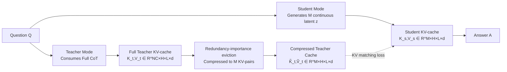

# KaVa: Latent Reasoning via Compressed KV-Cache Distillation

**Conference**: ICLR 2026  
**OpenReview**: [https://openreview.net/forum?id=ePrhcLbtGv](https://openreview.net/forum?id=ePrhcLbtGv)  
**Code**: To be confirmed  
**Area**: LLM Inference / Implicit Reasoning / KV-Cache Compression Distillation  
**Keywords**: latent reasoning, KV-cache distillation, continuous thought, CoT compression, self-distillation  

## TL;DR
KaVa compresses the KV-cache generated by a teacher model through explicit Chain-of-Thought (CoT) using redundancy-importance eviction, then distills it directly into the student's continuous implicit reasoning trajectory. By introducing "step-by-step KV alignment" as a new supervision signal, it provides internal step-wise supervision that has long been missing in implicit reasoning, achieving CoT-level accuracy with implicit reasoning efficiency on natural language reasoning traces.

## Background & Motivation
**Background**: Explicit Chain-of-Thought (CoT) enables LLMs to excel in multi-step reasoning across mathematics, science, and coding. However, long traces lead to massive KV-cache growth and inference overhead, often including stylistic noise or "logically incorrect but plausible-sounding" content. Latent reasoning has emerged to internalize the reasoning process into a continuous latent space, replacing explicit text traces with a sequence of continuous latent tokens to significantly compress generated token counts and KV-cache usage.

**Limitations of Prior Work**: The primary weakness of implicit reasoning is the **lack of direct supervision for internal thoughts**. Latent traces are unobservable during training, and existing methods rely on indirect remedies: iCoT uses curriculum learning to gradually remove CoT; Coconut feeds the previous hidden state back as input; CODI uses a single distillation token to align the hidden activation just before the answer (supervising only the "endpoints" rather than the trajectory); PCCoT uses Jacobi iterations to refresh latent tokens in parallel. These methods work for "formulaic" short template traces but suffer from fragile internal readout and poor generalization when applied to longer natural language traces closer to real-world workloads.

**Key Challenge**: CoT information is highly redundant—prior work (R-KV, KeyDiff) has demonstrated that KV-cache can be reduced to 10–30% with almost no loss in accuracy, suggesting the "essential dynamics" of reasoning reside in compressible structures rather than indispensable text. Can this compressed cache be used as a supervision signal for implicit students? The difficulty lies in the fact that KV compression eviction is done **independently per layer and per head**. The compressed KV vectors lose their correspondence with specific input tokens, rendering traditional distillation methods that align token activations or layer-wise hidden states ineffective.

**Goal**: To enable an implicit reasoning student to successfully absorb the abstract, token-independent knowledge within the "compressed teacher KV-cache," providing step-by-step internal supervision for implicit trajectories.

**Key Insight**: **[KV Space Supervision]** Continuous high-dimensional representations of implicit tokens possess the expressive capacity to absorb "abstract cache structures." Since compressed KV cannot be aligned at the token level, KaVa **directly matches them in the KV space layer-by-layer and step-by-step**: the student's K/V generated at each step is forced to approximate the compressed teacher K/V. This teaches the student to "think like a compact cache of its own explicit reasoning" while fully preserving the efficiency of implicit reasoning during inference.

## Method

### Overall Architecture
KaVa employs **self-distillation**: the same backbone switches between teacher mode (consuming full CoT to build layer-wise and head-wise KV-cache) and student mode (generating continuous latent thoughts). During training, the teacher cache undergoes "redundancy-importance aware eviction" to match the latent budget length $M$, followed by a KV-matching loss to align the student's K/V at each step with the compressed target. During inference, the student directly generates this compressed cache without outputting the full CoT. The total objective = Student Answer Loss + Teacher Loss + CODI Distillation + KV Distillation.

### Key Designs

**1. KV-cache Distillation: Compressed Cache as Step-wise Supervision** — This is the core innovation. Implicit reasoning replaces the explicit trace $C$ with $M$ continuous latent tokens $Z=\{z_i\}_{i=1}^M$, starting with `<bot>` and ending with `<eot>`, where a trainable projection layer maps continuous embeddings back to the input embedding space to predict the next token. The training objective overlays KV distillation onto CODI self-distillation:

$$\mathcal{L}_{\text{KaVa}}=-\tfrac{1}{N_A}\log p(A|Z,Q)-\tfrac{1}{N_A+N_C}\log p(A,C|Q)+\alpha_1\mathcal{L}_{\text{CODI}}+\alpha_2\mathcal{L}_{\text{KV}}$$

The first two terms are cross-entropy for the student (latent-only) and teacher (full trace); $\mathcal{L}_{\text{CODI}}$ follows Shen et al. for L1 alignment of the hidden state before the answer token; $\mathcal{L}_{\text{KV}}$ is the newly added core term. The key insight is that while CODI provides sparse supervision at a single "endpoint token," KV distillation provides much denser supervision at **every layer and every step**. Notably, on the longer MetaMathQA dataset where CODI loss often causes training instability, the authors set $\alpha_1=0$ and rely entirely on KV distillation.

**2. Length Alignment + Redundancy-Importance Eviction: Compressing Teacher Cache to Latent Budget** — As the teacher cache length $N_C$ is much larger than the student latent count $M$, it must be compressed. KaVa adapts R-KV to calculate a fused score for each token $i$, head $h$, and layer $l$, selecting the top-$M$ KV-pairs:

$$S_{i,h,l}=\lambda\,\underbrace{I_{i,h,l}}_{\text{Importance}}+(1-\lambda)\,\underbrace{R_{i,h,l}}_{\text{Redundancy}},\quad \lambda\in[0,1]$$

Importance $I$ is derived from the attention scores of answer tokens toward teacher keys $A=\mathrm{softmax}(Q\cdot K_t^\top/\sqrt{d})$, aggregated along the answer dimension—cleverly, these scores are computed during the teacher's forward pass with nearly zero overhead. Redundancy $R$ is the mean cosine similarity between all key vectors, normalized via softmax. Eviction is used **only during training** (students generate compressed caches directly during inference), allowing the use of answer tokens from training data to calculate importance. Ablations show $\lambda=0.1$ (combining importance and redundancy) outperforms pure cosine ($\lambda=0$), pure attention ($\lambda=1$), or a naïve "crop" baseline.

**3. Direct K/V Matching Instead of Token Activations + Jacobi Parallel Decoding** — Since layer-wise and head-wise independent eviction destroys token correspondence, traditional activation alignment is no longer applicable. KaVa instead **distills keys and values directly**, with K and V weighted equally:

$$\mathcal{L}_{\text{KV}}=\tfrac{1}{2M}\big(\|\,\mathrm{sg}[\tilde K_t]-K_s\|_p^p+\|\,\mathrm{sg}[\tilde V_t]-V_s\|_p^p\big)$$

Where $\mathrm{sg}$ denotes stop-gradient, $p=1$ for L1, and $p=2$ for MSE. To solve the sequential training bottleneck of latent tokens, KaVa adopts Jacobi iterations from PCCoT: $T$ iterations refresh all latent tokens simultaneously (using the cache from the final iteration $T$ for distillation), reducing forward passes from $M$ to $T$ (experimentally $M=24, T=3$). $T=M$ reverts to CODI, while $T=0$ reverts to Pause Token.

## Key Experimental Results

### Main Results
LoRA fine-tuning on LLaMA3.2-1B/3B and Qwen2.5-0.5B compares strong implicit baselines (CODI, PCCoT, iCoT, Coconut), with Full CoT as the upper bound and No-CoT as the lower bound. Accuracy (in-distribution GSM8k + zero-shot GSM8k-Hard/SVAMP):

| Model / Dataset | Method | GSM8k (AUG) | GSM8k (AUG-NL) |
|---|---|---|---|
| Qwen2.5-0.5B | Full CoT (Upper Bound) | 50.6 | 48.5 |
| | CODI | 37.5 | 20.2 |
| | PCCoT | 20.5 | 19.1 |
| | **KaVa (Ours)** | **46.9** | **44.4** |
| LLaMA3.2-1B | Full CoT (Upper Bound) | 63.4 | 53.2 |
| | CODI | 53.9 | 50.1 |
| | PCCoT | 54.2 | 51.1 |
| | **KaVa (Ours)** | **56.5** | **55.7** |
| LLaMA3.2-3B | Full CoT (Upper Bound) | 73.2 | 68.4 |
| | CODI | 61.0 | 55.9 |
| | PCCoT | 54.7 | 47.6 |
| | **KaVa (Ours)** | **65.7** | **60.0** |

Key observation: KaVa consistently outperforms implicit baselines and shows the **smallest performance drop when switching from formulaic traces (AUG) to natural language traces (AUG-NL)**. On Qwen-0.5B, CODI plunged from 37.5 to 20.2, while KaVa only dropped from 46.9 to 44.4. On LLaMA-1B, KaVa's performance in the NL setting (55.7) even approached its AUG-only upper bound, indicating that longer traces (more aggressive compression) highlight KaVa's KV supervision advantages and better scalability. Efficiency-wise, using $T=3$ iterations, KaVa reduces forward passes per question by **62%–92%** compared to Full CoT.

### Ablation Study
Mean over three random seeds on LLaMA3.2-1B:

| Ablation | Setting | GSM8k |
|---|---|---|
| Components | Full (KV Distillation + Projection) | 56.5 |
| | w/o CODI Distillation Loss | 52.8 |
| | w/o Projection Layer | 52.2 |
| Trace Step | Drop Last (KV Match + Distill) | 56.5 |
| | All Steps (KV Match + Distill) | 51.2 |
| | All Steps (Distill only, no KV) = PCCoT | 47.2 |

Further findings: R-KV ($\lambda=0.1$) eviction is superior to cosine-only, attn-only, or cropping; results are sensitive to KV loss coefficients and L1/MSE types; for larger $M$ (12/24), iterations $T$ beyond a certain threshold lead to performance drops; training data volume significantly impacts performance.

### Key Findings
- **KV distillation automatically compensates for "unreliable endpoint tokens"**: CODI relies on "dropping the last trace step" to ensure information richness in the distilled token. When forced to train on all steps, pure distillation (PCCoT) dropped to 47.2, whereas KaVa with KV matching maintained 51.2, proving step-wise KV supervision remains robust even without optimal endpoints.
- **Compressed cache is a rich supervision signal**: Even without the projection layer or CODI loss, KaVa significantly exceeds No-CoT, proving that "layer-wise and head-wise compressed KV" carries usable step-wise reasoning knowledge.
- **Importance + Redundancy are both essential**: Using either attention or similarity alone is inferior to their combination.

## Highlights & Insights
- **Repurposing "KV-cache Compression" from an inference acceleration tool to a supervision source**: While R-KV/KeyDiff are traditionally used to save memory during inference, KaVa uses "learning-free compressed cache" as training labels—a novel idea that leverages existing compressors with zero training cost.
- **Addressing the "loss of token correspondence" head-on**: Instead of avoiding the fact that eviction destroys token alignment, the authors argue that the high-dimensional expressivity of continuous latents is suited for absorbing such abstract structures and use "direct K/V matching" to bypass the failure of traditional activation alignment.
- **Step-wise Supervision > Endpoint Supervision**: Compared to CODI's single-token distillation, KaVa provides higher density signals at every layer and step, explaining its superior performance on long natural language traces.
- **Zero-overhead Importance Scores**: Since answer token attention is calculated during the teacher's forward pass, reusing it is computationally efficient.

## Limitations & Future Work
- **Evaluation limited to mathematical reasoning**: Experiments focus on GSM8k, MetaMathQA, and MATH500; transferability to code, common sense, or multi-hop QA remains unknown.
- **Model scale**: Experiments are limited to LLaMA3.2-3B with LoRA fine-tuning; the effectiveness of KV supervision on larger backbones or full-parameter training is unverified.
- **Compressor dependency and hyperparameter sensitivity**: Performance is sensitive to eviction methods, $\lambda$, KV loss types, coefficients, and $M/T$ configurations, requiring per-dataset tuning.
- **Full CoT required during training**: Teacher mode still requires full traces to build the cache, meaning training overhead is not reduced—the gains are purely for inference. It is not directly applicable to tasks without existing CoT annotations.
- **Interpretability**: While a section attempts to decode latent traces, the readability and controllability of implicit thought remain open questions.

## Related Work & Insights
- **Implicit Reasoning Lineage**: Pause/Filler tokens (implicit computation) → iCoT (curriculum removal) → Coconut (continuous thought feed-back) → CODI (endpoint self-distillation) → PCCoT (Jacobi parallelism). KaVa differentiates itself via "step-wise KV space supervision" to address the core lack of internal supervision.
- **KV-cache Compression Lineage**: R-KV, KeyDiff, HeadKV, PyramidKV, etc. KaVa flips these "vRAM-saving tools" into "supervision-generating tools."
- **Comparison with KV-Distill**: KV-Distill learns an adaptor to compress long-context caches with output-level KL alignment; KaVa uses a learning-free compressor and injects the compressed cache directly into latent trajectories, allowing the student to skip expensive full CoT during inference.
- **Inspiration**: When two representation spaces cannot achieve token-level alignment, "matching a more abstract intermediate representation (like KV)" is a promising distillation path; this logic could extend to cross-modal or cross-architecture distillation.

## Rating
- Novelty: ⭐⭐⭐⭐⭐ First to prove that "token-independent, layer-wise compressed KV-cache" can serve as a step-wise supervision signal for implicit reasoning.
- Experimental Thoroughness: ⭐⭐⭐⭐ Solid across three backbones, multiple datasets, and efficiency-accuracy Pareto analysis; however, limited to math tasks and models ≤3B with LoRA.
- Writing Quality: ⭐⭐⭐⭐ Clear motivation, well-described formulas, and effective diagrams explaining why traditional distillation fails and why direct KV matching works.
- Value: ⭐⭐⭐⭐ Balances CoT accuracy with implicit reasoning efficiency, offering practical significance for edge deployment and opening a scalable direction for "compression as supervision."

<!-- RELATED:START -->

## Related Papers

- [\[ICLR 2026\] Beyond Speedup - Utilizing KV Cache for Sampling and Reasoning](beyond_speedup_-_utilizing_kv_cache_for_sampling_and_reasoning.md)
- [\[ICLR 2026\] Bottlenecked Transformers: Periodic KV Cache Consolidation for Generalised Reasoning](bottlenecked_transformers_periodic_kv_cache_consolidation_for_generalised_reason.md)
- [\[ICLR 2026\] SkillFactory: Self-Distillation for Learning Cognitive Behaviors](skillfactory_self-distillation_for_learning_cognitive_behaviors.md)
- [\[ICML 2026\] ForesightKV: Optimizing KV Cache Eviction for Reasoning Models by Learning Long-Term Contribution](../../ICML2026/llm_reasoning/foresightkv_optimizing_kv_cache_eviction_for_reasoning_models_by_learning_long-t.md)
- [\[ICLR 2026\] Probing to Refine: Reinforcement Distillation of LLMs via Explanatory Inversion](probing_to_refine_reinforcement_distillation_of_llm_reasoners_via_explanatory_in.md)

<!-- RELATED:END -->
