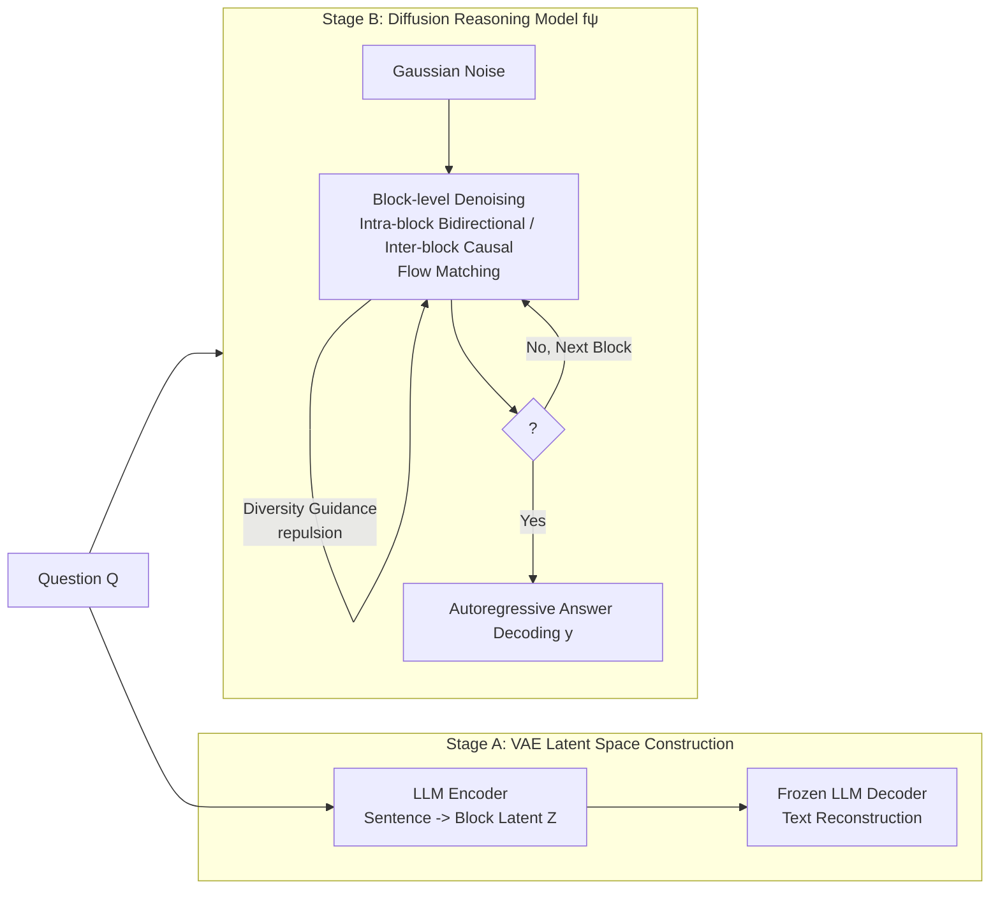

# LaDiR: Latent Diffusion Enhances LLMs for Text Reasoning

**Conference**: ICLR 2026  
**OpenReview**: [https://openreview.net/forum?id=z5cPEZ4n6i](https://openreview.net/forum?id=z5cPEZ4n6i)  
**Code**: To be confirmed  
**Area**: LLM Reasoning / Latent Diffusion Reasoning  
**Keywords**: Latent Space Reasoning, Diffusion Models, Flow Matching, VAE, Thought Tokens, Diversity Guidance, Test-time Compute  

## TL;DR
LaDiR utilizes a VAE to compress each reasoning step into a "block" of continuous thought tokens, then applies block-level latent diffusion (flow matching) to iteratively denoise and refine these tokens. This allows LLMs to perform iterative correction and parallel diverse exploration at a semantic level, consistently outperforming autoregressive, discrete diffusion, and latent reasoning baselines across math, code, and planning tasks.

## Background & Motivation
**Background**: LLMs exhibit reasoning capabilities through Chain-of-Thought (CoT), primarily using autoregressive (AR) token-by-token decoding. Diffusion language models have recently been introduced for text generation, emphasizing parallelization and global coherence. Latent diffusion (e.g., LD4LG, PLANNER) applies diffusion within the latent space of text autoencoders, but these works focus almost exclusively on "fluent generation."

**Limitations of Prior Work**: 
1. The sequential nature of AR generation cannot inherently revisit and rewrite earlier tokens, making self-correction inefficient and difficult.
2. Discrete CoT generates a single linear chain of thought, limiting diversity and complicating the exploration of multiple valid solutions.
3. While discrete diffusion language models allow for parallelization, they essentially convert `[MASK]` to discrete text tokens and fail to perform self-refinement at a semantic level.
4. Existing latent reasoning methods (e.g., Coconut) even underperform relative to AR CoT fine-tuning on math benchmarks due to problems like latent space collapse and error accumulation.

**Key Challenge**: Token-level refinement at the surface does not equal deep semantic-level reasoning correction. There is a need for both the expressiveness of continuous representations (allowing for iterative refinement and diverse trajectory exploration) and the preservation of interpretability and controllable reasoning steps.

**Goal**: To leverage the iterative refinement capabilities of diffusion models to truly "enhance LLM reasoning" rather than just achieving fluent generation.

**Core Idea**: **"Semantic Latent Space + Block-level Diffusion"**. First, a $\beta$-VAE encodes each reasoning sentence into a block of continuous thought tokens, constructing a structured and interpretable latent reasoning space. Then, a latent diffusion model is trained to denoise these blocks block-by-block, utilizing intra-block bidirectional attention and inter-block causal attention. During inference, multiple mutually exclusive reasoning trajectories are generated in parallel within a batch through increased initial noise and diversity gradient guidance, followed by autoregressive decoding into text answers.

## Method

### Overall Architecture
LaDiR decouples "reasoning" from "answering" into two components and two training stages: (1) a **VAE** that segments CoT into sentences and encodes each into $L_b$ continuous latent thought tokens $Z$, establishing a semantic latent space; (2) a **latent diffusion reasoning model** $f_\psi$ initialized from the same pretrained LLM, which denoises latent blocks via flow matching and generates the final answer text using an LM head autoregressively. During reasoning, latent blocks are restored iteratively from Gaussian noise using an ODE solver; reasoning terminates when an `<SOA>` special token is encountered, transitioning to answer generation.

### Key Designs

**1. One-Sentence-One-Block Structured Latent Space: Encoding reasoning steps with $\beta$-VAE.** The authors split data into CoT $c$ and answer $y$ using the prefix "The answer is," then segment $c$ into $N$ blocks. Each block $Z^{(b)}=\{z^{(b)}_1,\dots,z^{(b)}_{L_b}\}$ localizes reasoning steps in the latent space. The VAE encoder, initialized from a pretrained LLM and fully fine-tuned with $L_b$ learnable embeddings, maps the last hidden state of the final layer through two linear projections to obtain mean and variance, sampling $Z^{(b)}\sim\mathcal{N}(\mu,\sigma^2)$. The decoder is a **frozen** pretrained LLM that reconstructs text conditioned on latent blocks. Training uses the $\beta$-VAE objective $L_{\beta\text{-VAE}}=\mathbb{E}_{q_\phi(z|x)}[-\log p_\theta(x|z)]+\beta\,\mathrm{KL}(q_\phi(z|x)\|p(z))$, where a larger $\beta$ yields a more structured space. To ensure smoothness and robustness, latent tokens are injected with isotropic Gaussian noise $z'^{(b)}_i=z^{(b)}_i+\eta_i,\ \eta_i\sim\mathcal{N}(0,k^2 I)$ ($k=3$ is optimal), and input tokens are randomly replaced ($p=0.3$) to force the encoder to learn semantics invariant to paraphrasing or typos.

**2. Block-level Latent Diffusion + Mixed Attention: Incorporating CoT causality into the denoising process.** The reasoning model, initialized from the same LLM, uses flow matching to learn denoising. Flow matching constructs an interpolation path $z_t=(1-t)z_0+t\epsilon$ between clean data $z_0$ and noise $\epsilon$, targeting a velocity field $u^\star(z_t,t)=\epsilon-z_0$. The network $u_\theta$ minimizes $L_{FM}=\mathbb{E}\|u_\theta(z_t,t)-u^\star(z_t,t)\|^2$. During inference, $z_1\sim\mathcal{N}(0,I)$ is restored via ODE solvers $z_{t-\Delta t}=z_t-\Delta t\,u_\theta(z_t,t)$. The key is the attention mask $M$: question $Q$ is followed by each block wrapped in `<BOT>`/`<EOT>`, with a timestep embedding inserted before the predicted block. **Intra-block bidirectional attention** allows the model to reason holistically and capture local dependencies within the block size, while **strict inter-block causality** ensures subsequent steps depend on previous ones, maintaining autoregressive logical order—a compromise between AR (cannot look back) and fully parallel diffusion (lacks causality).

**3. Two-stage Training + Answer/Special Token Supervision: Backpropagating correctness signals to latent tokens.** The model uses the same backbone and an LM head to predict answers autoregressively with cross-entropy $L_{Ans}=-\sum_w \log p_\psi(y_w\mid q,Z^{(\le B)},y_{<w})$. A binary classification head at each `<EOT>` predicts if the next block is `<SOA>` or `<BOT>`, enabling **explicit control over the number of reasoning blocks** with $L_{Spec}=-\sum_{\tau}\log p_\psi(s_\tau\mid q,Z^{(\le B)})$. Total objective $L=\lambda_{FM}L_{FM}+\lambda_{Ans}L_{Ans}+\lambda_{Spec}L_{Spec}$. **Stage 1 (teacher forcing)** uses oracle latent blocks from the VAE encoder. However, since the model only sees its own generated blocks during inference, resulting in training/inference mismatch and error accumulation, **Stage 2 (rollout)** allows the model to self-generate latent blocks $\tilde Z^{(1:B)}$ (reducing denoising steps from 50 to 10, similar to FlowGRPO). Gradients are preserved along the denoising trajectory, allowing answer supervision to directly shape latent predictions; flow matching loss is retained to prevent latent space collapse observed in uncurriculated methods like Coconut. Ablations show that removing Stage 2 causes the math Pass@1 average to plummet from 43.5 to 27.9.

**4. Parallel Diversity Guidance: Repelling trajectories within a batch to explore different solutions.** Unlike AR single-trajectory generation, LaDiR generates multiple distinct trajectories in parallel within a batch. Two mechanisms are used: ① **Enlarged Initial Noise**: Using a larger variance $\tilde\sigma^2$ for the first step to widen the starting distribution. ② **Diversity Gradient Guidance**: Applying a repulsive force to latent tokens in the batch during each denoising step. The median distance between trajectories in the batch is used as the bandwidth $\sigma=\mathrm{median}_{i<j}\|z_i-z_j\|_2$. The repulsive field $F(z_i)=\sum_{j\ne i}2\left(1-\frac{\|z_i-z_j\|^2}{\sigma^2}\right)\exp\!\left(-\frac{\|z_i-z_j\|^2}{\sigma^2}\right)(z_i-z_j)$ is applied with intensity $\gamma_t=\gamma_{max}(t/T)$, starting strong and decaying over time. Final predictions merge this in a form similar to classifier-free guidance: $\hat z_{t-1}=f_\psi(x_t,t,x)+\gamma_t F(z)$. Ablations suggest $\gamma_{max}=0.3\sim0.5$ is optimal for the accuracy/diversity tradeoff; over-guidance ($\ge 1.0$) causes excessive divergence and hurts accuracy.

## Key Experimental Results

### Main Results: Mathematical Reasoning (7 Benchmarks, LLaMA 3.1 8B; Pass@1 / Pass@100, Average)

| Method | Category | Avg. P@1 / P@100 |
|---|---|---|
| LLaDA CoT SFT | Masked Diffusion 8B | 35.8 / 44.3 |
| SFT ($\alpha=1$) | AR CoT | 39.3 / 47.1 |
| Coconut | AR Latent Reasoning | 31.9 / 34.8 |
| Discrete Latent | AR Latent Reasoning | 40.8 / 46.4 |
| Soft Think | AR Latent Reasoning | 41.0 / 43.5 |
| TaH+ (Prev. SOTA) | AR Latent Reasoning | 42.0 / 45.5 |
| LD4LG | Latent Diffusion | 15.7 / 21.7 |
| PLANNER | Latent Diffusion | 13.6 / 20.3 |
| **LaDiR** | **Ours** | **43.5 / 52.0** |

The P@1 is 1.5% higher than the previous best TaH+, and P@100 is 6.1% higher than AR CoT SFT (the highest across all benchmarks). It significantly outperforms previous latent diffusion methods (LD4LG/PLANNER) that only focused on fluent generation.

### Code Generation (Qwen3-8B-Base, Pass@1, Average)

| Method | MBPP+ | HumanEval+ | Avg. |
|---|---|---|---|
| AR SFT | 52.8 | 76.5 | 69.3 |
| Soft Thinking | 53.1 | 75.2 | 69.4 |
| TaH+ | 56.5 | 79.3 | 71.8 |
| Ouro 2.6B (Recurrent Latent) | 66.6 | 70.7 | 74.0 |
| **LaDiR** | **59.5** | **84.2** | **74.5** |

Under the same backbone, it achieves a +5.2% average gain over AR SFT, with HumanEval+ nearly 8% higher.

### Planning Task: Countdown (Pass@1 / Pass@100 / Diversity)

| Model | CD-4 P@1 | CD-4 Div. | CD-5 P@1 | CD-5 P@100 |
|---|---|---|---|---|
| LLaMA 8B SFT | 46.7 | 3.0 | 8.9 | 15.4 |
| LLaDA 8B SFT | 51.2 | 5.4 | 34.4 | 45.2 |
| MGDM (Sp. Diffusion) | 91.5 | 3.2 | 46.6 | 70.4 |
| **LaDiR** | 76.6 | **7.3** | 38.5 | **75.2** |

On CD-4, it is over 25% higher in Pass@1 than LLaMA SFT and achieves the highest diversity. On CD-5, it is nearly 30% higher than AR in Pass@1 and over 30% higher in P@100.

### Key Findings
- **Stage 2 Rollout is Indispensable**: Without it, math P@1 drops from 43.5 to 27.9, confirming its role in mitigating error accumulation.
- **Diversity Parameters**: Increasing initial noise from 1 to 2 improves both diversity and accuracy, though exceeding 3 hurts convergence. $\gamma_{max}=0.3\sim0.5$ is optimal.
- **Iterative Self-Refinement**: Decoding latent blocks at different timesteps reveals that reasoning is gradually corrected from "arithmetically flawed drafts" to stable correct answers starting from $t=0.25$, proving diffusion executes semantic-level self-correction.
- **Adaptive Test-time Compute**: Increasing denoising steps from 5 to 10 adds +11.7 points, to 30 adds +4.8, and to 50 results in a total +9.8 gain, allowing for flexible compute-to-accuracy scaling.

## Highlights & Insights
- **Scaling "Iterative Refinement" from Pixels/Tokens to "Semantic Reasoning Steps"**: The visualization of reasoning being corrected step-by-step across timesteps is rare and convincing evidence of a "thinking process."
- **Unifying Three Capabilities**: Continuous latent space (expressiveness) + block-level causal diffusion (logical order) + VAE decoding (interpretability). This fills the gaps found in prior latent reasoning and discrete diffusion models.
- **Diversity as a First-class Citizen**: Using batch repulsion and classifier-free guidance to explicitly create diverse trajectories directly addresses the needs for high Pass@k and future RL post-training.
- **Honest Comparison**: By explicitly showing that Coconut fails against AR SFT in math and that LD4LG/PLANNER collapse in reasoning tasks, the paper highlights the categorical difference between "designing for reasoning" and "designing for fluency."

## Limitations & Future Work
- **Training Complexity**: Two components and two stages (VAE + Diffusion) with gradient preservation during rollout makes the pipeline more complex than standard AR fine-tuning.
- **Scaling Test-time Compute**: Iterative denoising coupled with parallel trajectories introduces additional inference overhead. End-to-end efficiency tradeoffs compared to AR require more comprehensive evaluation.
- **Hyperparameter Sensitivity**: Noise scale $k$, initial variance $\tilde\sigma^2$, $\gamma_{max}$, and block size $L_b$ all require tuning; excessive diversity guidance can degrade accuracy.
- **OOD Performance**: Gains on the hardest benchmarks like Olympia remain limited (12.9 P@1), suggesting that generalization of semantic latent spaces for ultra-hard proof problems needs reinforcement.
- **Future Direction**: The high Pass@k results suggest a natural fit with RL post-training, pointing toward a path for stronger self-improving latent diffusion reasoning.

## Related Work & Insights
- **Latent Reasoning**: Coconut, CODI, Soft Thinking, and TaH+ place reasoning in continuous/soft tokens but are mostly AR and prone to collapse; LaDiR provides a more stable semantic space via diffusion and VAE.
- **Discrete/Masked Diffusion LMs**: LLaDA, Dream, and Diffu-Coder emphasize parallelization but operate by converting `[MASK]` on discrete tokens, lacking semantic self-refinement.
- **Text Latent Diffusion**: LD4LG and PLANNER target fluent generation; this paper demonstrates they collapse when applied directly to reasoning, necessitating specialized design.

## Rating
- **Novelty**: ⭐⭐⭐⭐⭐ Systematic integration of "semantic latent space + block-causal diffusion + diversity guidance" for LLM reasoning is pioneering and clearly distinguished from generation-focused diffusion.
- **Experimental Thoroughness**: ⭐⭐⭐⭐ Covers math, code, and planning across over ten benchmarks with extensive baselines. However, latency/efficiency analysis is relegated to the appendix, and hard OOD performance is still a weakness.
- **Writing Quality**: ⭐⭐⭐⭐ Clear motivation, intuitive diagrams, and persuasive decoding examples of iterative refinement. Complete mathematical and training details provided.
- **Value**: ⭐⭐⭐⭐⭐ Improves accuracy, diversity, and interpretability simultaneously. The high Pass@k directly benefits RL post-training, offering a principled new path beyond autoregressive reasoning.

<!-- RELATED:START -->

## Related Papers

- [\[ICLR 2026\] Improving Reasoning for Diffusion Language Models via Group Diffusion Policy Optimization](improving_reasoning_for_diffusion_language_models_via_group_diffusion_policy_opt.md)
- [\[ICLR 2026\] Test-Time Scaling in Diffusion LLMs via Hidden Semi-Autoregressive Experts](test-time_scaling_in_diffusion_llms_via_hidden_semi-autoregressive_experts.md)
- [\[ICLR 2026\] Latent-Guided Reasoning: Empowering Small LLMs with Large-Model Thinking](latent-guided_reasoning_empowering_small_llms_with_large-model_thinking.md)
- [\[ICLR 2026\] On the Reasoning Abilities of Masked Diffusion Language Models](on_the_reasoning_abilities_of_masked_diffusion_language_models.md)
- [\[ICLR 2026\] Inpainting-Guided Policy Optimization for Diffusion Large Language Models](inpainting-guided_policy_optimization_for_diffusion_large_language_models.md)

<!-- RELATED:END -->
