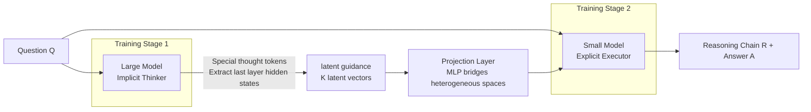

# Latent-Guided Reasoning: Empowering Small LLMs with Large-Model Thinking

**Conference**: ICLR 2026  
**OpenReview**: [https://openreview.net/forum?id=jqGWLxbghD](https://openreview.net/forum?id=jqGWLxbghD)  
**Code**: To be confirmed  
**Area**: LLM Reasoning / Reasoning Distillation / Efficient Inference  
**Keywords**: Latent Guidance, Cognitive Distillation, Decoupled Cognitive Planning, Small Model Reasoning, Information-Theoretic Training Objectives  

## TL;DR
The proposed method allows a large model to handle "cognitive planning" by compressing problem-solving strategies into a few latent guidance vectors. These vectors are then passed to a small model responsible for "linguistic realization" to generate reasoning chains. This approach outfits small models with the thinking capabilities of large models, pushing the reasoning performance-cost trade-off to a new equilibrium.

## Background & Motivation
- **Background**: Chain-of-Thought (CoT) empowers LLMs in multi-step reasoning, but the combination of "massive parameter scale + long-chain text generation" leads to high inference costs, making real-time or resource-constrained deployment difficult.
- **Limitations of Prior Work**: There are two main paths for cost reduction, both with significant flaws: ① **Large model CoT compression / Latent space reasoning** (shortening chains or computing in hidden space) sacrifices the readability and interpretability of CoT, which is a critical defect in fields requiring transparent problem-solving processes. ② **Knowledge distillation to small models** (transferring capabilities via SFT or higher-order objectives) is limited by the parameter capacity of small models, resulting in poor generalization on complex, unseen tasks.
- **Key Challenge**: In standard autoregressive frameworks, **high-level cognitive planning (strategizing)** and **low-level linguistic realization (writing)** are tightly coupled. High-level planning requires the expensive channel of token-by-token generation. Distilling "final text" forces a small model to replicate the entire complex reasoning process from scratch, which it lacks the capacity to do.
- **Goal**: Efficiently transfer the reasoning capabilities of large models to small models while achieving high performance and low inference costs.
- **Core Idea**: **[Decoupling Cognitive Labor]** Separate "strategizing" from "writing." The large model serves as an **Implicit Thinker**, compressing the problem-solving strategy into compact latent guidance vectors in a single forward pass. The small model acts as an **Explicit Executor**, taking these guidance vectors to generate concise and effective reasoning chains. What is distilled is not the final text, but the **high-level problem-solving strategy itself (Cognitive Distillation)**.

## Method

### Overall Architecture
The framework decomposes reasoning into two specialized stages coupled with two-stage training. The large model (Implicit Thinker) encodes the strategy for question $Q$ into $K$ compact latent vectors $H_{\text{guidance}}$ (latent guidance, acting as high-level cognitive planning) via special thought tokens in a single forward pass. These vectors are bridged to the small model (Explicit Executor) through a lightweight projection layer. The small model then autoregressively generates a complete, readable reasoning chain $R$ and answer $A$ conditioned on the question and the guidance vectors. During inference, the large model step involves no autoregressive text generation and is extremely fast; the small model is only responsible for "linguistic realization," achieving a superior balance between accuracy and cost.

### Key Designs

**1. Dual-loss Training for the Implicit Thinker: Ensuring Latent Vectors are "Correct" and "Complete".** In Stage 1, the target sequence is rewritten as `<start_thought><thought_1>...<thought_K><end_thought> A`, using $K$ placeholder thought tokens as explicit anchors for latent representations. The training objective is the sum of task loss and reconstruction loss: $L_{\text{LLM}} = L_{\text{task}} + L_{\text{recon}}$. The task loss is a standard autoregressive LM loss predicting only the final answer $A$, $L_{\text{task}} = -\sum_{j=1}^{L}\log P(a_j \mid Q, \{\text{thought}_k\}_{k=1}^{K}, a_{<j}; \theta_{\text{LLM}})$, anchoring cognitive planning to the goal of "solving the problem correctly." The reconstruction loss is the cornerstone: $H_{\text{guidance}}$ is formed from the last layer hidden states $\{h_1,\dots,h_K\}$ of the thought tokens, which are then forced to reconstruct the full original reasoning chain $R$: $L_{\text{recon}} = -\sum_{i=1}^{M}\log P(r_i \mid H_{\text{guidance}}, r_{<i}; \theta_{\text{LLM}})$.

**2. Information-Theoretic Support: Reconstruction Loss Equals Mutual Information Maximization.** The reconstruction loss is essential because minimizing it is information-theoretically equivalent to maximizing the mutual information between the guidance vectors and the reasoning chain. The paper provides an explicit lower bound $I(R; H_{\text{guidance}} \mid Q) \ge H(R \mid Q) - L_{\text{recon}}$, ensuring that the latent guidance encodes a complete and high-fidelity cognitive plan rather than ambiguous hidden states. The appendix further utilizes rate-distortion theory and Fano’s inequality to argue for the robustness of this cognitive plan. Diagnostic experiments estimate that latent guidance captures approximately 3.1 nats of reasoning chain information—a key differentiator from pure latent reasoning methods that lack supervision of internal thoughts.

**3. Projection Layer Bridging Heterogeneous Hidden Spaces.** Since large and small models have different hidden dimensions and incompatible latent spaces, Stage 2 uses the trained Implicit Thinker to generate and store $H_{\text{guidance}}$ offline for each training item. These are aligned to the small model's space via a lightweight projection layer $H'_{\text{guidance}} = \text{MLP}(H_{\text{guidance}})$. The MLP consists of two linear layers with an intermediate dimension of 2048, GELU activation, 0.1 dropout, and a final LayerNorm, balancing capacity and regularization to ensure stable information transfer.

**4. Stage 2 Linguistic Realization + Decoupled Inference.** The small model is fine-tuned with a standard LM objective to generate the concatenated sequence $(R, A)$ conditioned on the question and the projected guidance vectors: $L_{\text{SLM}} = -\sum_{i=1}^{M+L}\log P(t_i \mid Q, H'_{\text{guidance}}, t_{<i}; \theta_{\text{SLM}})$. This essentially teaches the small model to perform linguistic realization on a "pre-computed cognitive plan." Inference follows two steps: ① Cognitive Planning—the large model produces $H_{\text{guidance}}$ in a single forward pass (no autoregression, extremely fast); ② Linguistic Realization—the small model autoregressively writes the final reasoning chain and answer. The heavy lifting of planning is left to the large model, while the speed of generation is handled by the small model.

## Key Experimental Results

### Main Results
The authors evaluate 8 reasoning benchmarks across 4 scales of small models (0.5B–8B) using Qwen2.5-32B-Instruct as the teacher. Comparisons include Std-CoT, MT-CoT, Step-by-step, KARD, CasCoD, and NesyCD (selected Overall Avg. and OOD Avg. in %):

| Small Model | Method | BBH-test (ID) | GSM8K (ID) | OOD Avg. | Overall Avg. |
|-------------|--------|---------------|------------|----------|--------------|
| LLaMA-3-8B  | NesyCD (Strongest Baseline) | 82.2 | 64.9 | 68.1 | 70.3 |
| LLaMA-3-8B  | **Ours** | **82.5** | **67.4** | **71.9** | **73.1** |
| Qwen2-0.5B  | NesyCD | 68.7 | 32.2 | 37.3 | 42.6 |
| Qwen2-0.5B  | **Ours** | **71.0** | **34.8** | **38.6** | **44.3** |
| Qwen2-1.5B  | NesyCD | 74.6 | 55.8 | 55.6 | 59.5 |
| Qwen2-1.5B  | **Ours** | **78.4** | **56.0** | **58.0** | **61.7** |
| Qwen2-7B    | NesyCD | 80.9 | 76.3 | 74.9 | 76.4 |
| Qwen2-7B    | **Ours** | **82.1** | **77.5** | **78.5** | **79.0** |

On LLaMA-3-8B, the OOD Avg. of 71.9% is 3.8 points higher than the next best (NesyCD); for Qwen2-7B, OOD leads by 3.6 points. Gains primarily stem from OOD generalization, confirming that "decoupling cognitive planning and linguistic realization" is a universally effective strategy.

### Ablation Study
Using instruct-tuned Qwen2.5-7B as the small model to evaluate accuracy and average token count (selected):

| Type | Dataset | Metric | SFT | KD | **Ours** |
|------|---------|--------|-----|----|----------|
| In-Domain | GSM8K | Accuracy (%) | 77.3 | 73.0 | **80.5** |
| In-Domain | GSM8K | Avg. Tokens | 235.4 | 253.7 | **128.9** |
| OOD | Odyssey-Math | Accuracy (%) | — | Baseline | **+7.2 vs KD** |

Latent Guidance on GSM8K improves accuracy from SFT's 77.3% to 80.5% while nearly halving the reasoning chain token count from 235.4 to 128.9—achieving higher precision with shorter chains.

### Key Findings
- **Synergy of Accuracy and Conciseness**: High-level cognitive planning allows the small model to follow a "direct strategy" rather than verbose exploration. This results in fewer tokens and higher accuracy on OOD tasks, avoiding stylometric artifacts overfitted to training data.
- **Generalization in Long-form QA across 12+ Domains**: On the entirely OOD ELI5-Test, GPT-4o judged this method as consistently superior to SFT and KD in Correctness and Relevance, indicating the distilled cognitive planning is a general reasoning structure rather than task-specific.
- **Interpretable Latent Planning**: t-SNE and quantitative probes show $H_{\text{guidance}}$ vectors cluster into different "high-level reasoning strategy clusters," proving the small model executes structured abstract plans rather than learning surface feature correlations.

## Highlights & Insights
- **Correct Diagnosis of Root Causes**: Attributing weak small model reasoning to the "coupling of cognitive planning and linguistic realization" leads to a clean and powerful framework for decoupling.
- **Distilling "Strategy" instead of "Text"**: Cognitive Distillation offloads the planning burden to the large model and leaves the generation burden to the small model, bypassing the capacity bottleneck inherent in forcing small models to replicate full reasoning processes. This is a fundamental upgrade over traditional outcome distillation.
- **Theoretic and Supervisory Loop**: The equivalence between reconstruction loss and mutual information maximization provides a strong supervisory signal for "latent thinking" that pure latent space reasoning methods lack. The 3.1 nats information estimate quantifies that "the latent vectors actually contain substance."
- **Preserved Interpretability**: The final output remains human-readable CoT, avoiding the loss of transparency found in latent space reasoning.

## Limitations & Future Work
- **Dependency on Strong Teacher**: The effectiveness depends on the 32B model's ability to produce high-quality cognitive plans. Gains may be limited if the teacher lacks capacity or domain coverage.
- **Two-stage + Offline Caching Overhead**: Requires training the Implicit Thinker first, then generating and storing $H_{\text{guidance}}$ for the entire dataset, making the training pipeline heavier than simple SFT.
- **Latent Capacity $K$ as a Hyperparameter**: The trade-off between the number of thought tokens $K$ and reconstruction fidelity requires tuning; while the paper provides a capacity-fidelity bound, the optimal configuration varies by task.
- **Teacher Model Availability at Inference**: Although the large model only performs a single forward pass, deployment still requires the presence of both the large and small models, which may not suit pure on-device small model scenarios.

## Related Work & Insights
- **vs CoT Knowledge Distillation (Std-CoT/MT-CoT/Step-by-step/CasCoD/NesyCD)**: These are outcome distillation methods training small models to replicate final text. Ours distills high-level strategies, allowing the small model to focus on "linguistic realization of a set plan."
- **vs Latent Space Reasoning (COCONUT, LightThinker, pause token, self-distillation)**: These aim to speed up reasoning in a single large model, often sacrificing accuracy or interpretability. This work uses latent computation in reverse—to empower small models while using reconstruction loss to add strong supervision for internal thinking.
- **Insights**: ① The concept of "compressing strategy instead of text" can be extended to agent planning, multimodal reasoning, and other scenarios requiring high-level intent transfer to lightweight executors. ② Using information-theoretic reconstruction objectives to explicitly constrain latent representation fidelity is a general recipe for adding verifiable supervision to implicit intermediate representations.

## Rating
- **Novelty**: ⭐⭐⭐⭐ —— The perspective of "decoupling cognitive planning and linguistic realization + distilling strategy instead of text" is refreshing, and the mutual information interpretation of reconstruction loss grounds intuition in theory.
- **Experimental Thoroughness**: ⭐⭐⭐⭐ —— 8 benchmarks × 4 scales (0.5B–8B) × multiple baselines, with separate ID/OOD evaluations, token efficiency, long-form QA, t-SNE/probing, and mechanism analysis provide solid coverage.
- **Writing Quality**: ⭐⭐⭐⭐ —— The logic from motivation to method to theory to experiments is coherent. Figures 1 and 2 clearly explain the division of labor and dual-loss mechanism.
- **Value**: ⭐⭐⭐⭐ —— Significantly improves the reasoning performance-cost trade-off (up to +13.9%) while maintaining CoT interpretability, which is practically meaningful for deploying complex reasoning on small models.

<!-- RELATED:START -->

## Related Papers

- [\[ICLR 2026\] Predicting LLM Reasoning Performance with Small Proxy Model](predicting_llm_reasoning_performance_with_small_proxy_model.md)
- [\[ICLR 2026\] Adaptive Thinking: Large Language Models Know When to Think in Latent Space](adaptive_thinking_large_language_models_know_when_to_think_in_latent_space.md)
- [\[ICLR 2026\] AgentMath: Empowering Mathematical Reasoning for Large Language Models via Tool-Augmented Agent](agentmath_empowering_mathematical_reasoning_for_large_language_models_via_tool-a.md)
- [\[ICLR 2026\] DAG-Math: Graph-of-Thought Guided Mathematical Reasoning in LLMs](dag-math_graph-of-thought_guided_mathematical_reasoning_in_llms.md)
- [\[ICLR 2026\] LaDiR: Latent Diffusion Enhances LLMs for Text Reasoning](ladir_latent_diffusion_enhances_llms_for_text_reasoning.md)

<!-- RELATED:END -->
