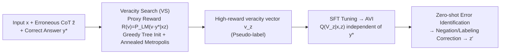

# Latent Veracity Inference for Identifying Errors in Stepwise Reasoning

**Conference**: ICLR 2026  
**OpenReview**: [https://openreview.net/forum?id=eux1cp8GqC](https://openreview.net/forum?id=eux1cp8GqC)  
**Code**: [https://github.com/alstn12088/veracity_inference](https://github.com/alstn12088/veracity_inference)  
**Area**: LLM Reasoning / Process Verification  
**Keywords**: Chain-of-Thought, Error Detection, Latent Variable Models, Posterior Inference, MCMC, Process Reward Model, Self-Correction  

## TL;DR
The study models "stepwise correctness in CoT" as a set of latent veracity variables. It uses the joint likelihood of "veracity + final answer" from a language model as a proxy reward to perform posterior inference via discrete MCMC search (Veracity Search) for error localization. The search results are then distilled into a zero-shot verifier (AVI) that operates without the ground truth answer, requiring no stepwise human annotation throughout the process.

## Background & Motivation

**Background**: Chain-of-Thought (CoT) has significantly enhanced the reasoning capabilities and interpretability of language models. However, CoT often contains erroneous intermediate steps. These errors hinder interpretability and propagate through the reasoning chain, contaminating the final answer. Consequently, automatically localizing errors within reasoning chains is a critical problem for improving model reliability.

**Limitations of Prior Work**: Existing solutions have significant drawbacks: 1) Training Process Reward Models (PRMs) requires stepwise human annotation, which is costly and scarce. 2) Step rewards trained solely using the final answer (outcome supervision) learn "usefulness" (value/advantage) for reaching the correct answer rather than "correctness" itself, often rewarding steps that are "useful but actually wrong." 3) Fact verifiers based on external evidence retrieval are limited by retrieval complexity and evidence coverage. 4) Directly prompting LMs as zero/few-shot verifiers is extremely sensitive to prompts and exhibits fragile performance.

**Key Challenge**: The desired supervision signal is the "correctness (veracity) of the step itself," which is expensive to annotate manually and cannot be directly distilled from the final answer (as outcome supervision captures a different objective).

**Goal**: Automatically identify erroneous steps in CoT without any stepwise supervision.

**Core Idea (Latent Variable Posterior Inference)**: Error identification is reformulated as a posterior inference problem within a Latent Variable Model (LVM). Each step $z_i$ in the CoT is assigned a binary latent variable $V_{z_i} \in \{0, 1\}$ representing its veracity. Treating the CoT $z$ and the final answer $y$ as observations, the model infers the posterior $\mathbb{P}(V_z \mid x, z, y^*)$. The joint likelihood $P_{\text{LM}}(vy^* \mid xz)$ of the LM serves as a proxy reward for this posterior. Thus, identifying errors becomes a search problem for a high-reward vector in $\{0, 1\}^N$.

## Method

### Overall Architecture

The method progresses through three layers. First, the CoT is parsed into $N$ atomic statements $z = (z_1, \dots, z_N)$, and a conditional latent variable model is defined as $\mathbb{P}(V_z=v, Y=y \mid x, z) := P_{\text{LM}}(vy \mid xz)$. Error localization is equivalent to inferring the unobserved $V_z$ given $Y$. Since the exact posterior requires summing over $2^N$ configurations, the second layer introduces **Veracity Search (VS)**: when the correct answer $y^*$ is known, joint likelihood is used as a proxy reward to approximate the posterior using Metropolis search with simulated annealing. The third layer, **Amortized Veracity Inference (AVI)**, uses the high-reward vectors found by VS as pseudo-labels to SFT-tune a zero-shot verifier that does not rely on $y^*$ or search during inference.

### Key Designs

**1. Latent Variable Modeling: Explicitly separating veracity to avoid the "CoT implies correctness" assumption.** Standard practices treat the CoT $z$ as a condition, implicitly assuming each step's veracity is 1. This work instead keeps the identity of the CoT $Z=z$ fixed and introduces binary vectors $V_z$ to characterize its correctness. The posterior is expressed as:

$$\mathbb{P}(V_z=v \mid Y=y, x, z) = \frac{P_{\text{LM}}(v \mid xz) P_{\text{LM}}(y \mid xzv)}{\sum_{v' \in \{0, 1\}^N} P_{\text{LM}}(v' \mid xz) P_{\text{LM}}(y \mid xzv')}$$

The key insight is the factorization order: the desired posterior corresponds to the generation sequence $X \to Z \to V_z \to Y$, whereas a naive in-context baseline $P_{\text{LM}}(v \mid xzy)$ corresponds to $X \to Z \to Y \to V_z$. These are generally not equal, explaining why direct prompting performs poorly.

**2. Veracity Search: Discrete MCMC with simulated annealing using joint likelihood as proxy reward.** Given $x$, a potentially erroneous $z$, and the correct answer $y^*$, the proxy reward is defined as $R(v) := P_{\text{LM}}(vy^* \mid xz) \propto \mathbb{P}(V_z=v \mid Y=y^*, x, z)$. The search employs single-bit **Metropolis + Simulated Annealing**. At each step, a coordinate $j$ is flipped to obtain $v'_z = v^{(t)}_z \oplus e_j$. The acceptance probability is:

$$\alpha_t = \min\Big\{1, \big(R(v'_z) / R(v^{(t)}_z)\big)^{\beta_t}\Big\}$$

The inverse temperature $\beta_t$ increases according to an annealing schedule to balance exploration and exploitation.

**3. Greedy Tree Initialization: High-quality starting points for random search.** Before running the stochastic search, a depth-first greedy process selects the initial vector $v^{(0)}_z$. Steps are fixed one by one from $1$ to $N$ by maximizing partial scores $\tilde{R}(v_{1:i}) = P_{\text{LM}}(\cdot \mid xz_{1:i}v_{1:i}y^*)$, where the LM marginalizes over unassigned bits.

**4. Amortized Veracity Inference: Distilling search into a zero-shot verifier.** The high-reward vectors from VS are treated as pseudo-labels to fine-tune $P_{\text{LM}}$ into an amortized sampler $Q(V_z \mid x, z)$. Crucially, $Q$ does not condition on the final answer $Y$, allowing for zero-shot verification during testing and direct use as feedback for self-correction.

## Key Experimental Results

### Main Results (Hamming Similarity, 1000 samples/dataset)

| Dataset | Method | Qwen-4B | Qwen-8B | Llama-3B | Llama-8B |
|---|---|---|---|---|---|
| PRONTOQA | CoT | 0.591 | 0.384 | 0.459 | 0.515 |
| PRONTOQA | Voting | 0.603 | 0.692 | 0.514 | 0.536 |
| PRONTOQA | **VS (ours)** | **0.910** | **0.945** | **0.948** | **0.964** |
| GSM8K | CoT | 0.614 | 0.695 | 0.496 | 0.496 |
| GSM8K | **VS (ours)** | **0.711** | **0.751** | **0.614** | **0.646** |
| COMMONSENSEQA | CoT | 0.695 | 0.590 | 0.507 | 0.535 |
| COMMONSENSEQA | **VS (ours)** | **0.935** | **0.931** | **0.836** | **0.903** |

### Ablation Study

| Dimension | Conclusion |
|---|---|
| Simulated Annealing (SA) | Linear/Cosine annealing ($T$ from 2 to 0.1) outperforms constant temperature. |
| Greedy Tree Init | Significantly improves sample efficiency; provides faster convergence. |
| Search Algorithms | SA-Metropolis significantly outperforms random search and Best-of-N. |

**Downstream Correction (Reasoning Accuracy)**:

| Method | Qwen 4B (3/4/5-hop) | Qwen 8B (3/4/5-hop) |
|---|---|---|
| No Correction | 0.60 / 0.52 / 0.59 | 0.54 / 0.65 / 0.52 |
| Self Correction | 0.54 / 0.60 / 0.48 | 0.54 / 0.58 / 0.46 |
| **AVI (ours)** | **0.68 / 0.72 / 0.77** | **0.87 / 0.85 / 0.81** |

## Key Findings
- **Robustness to Reasoning Length**: In the 1–5 hop range, Hamming similarity remains stable above 0.85 for VS, outperforming baselines by 20–25 points.
- **AVI Cross-length Generalization**: Models fine-tuned on 4-hop data generalize well to 3/5-hop scenarios.
- **Correction Improves Reasoning**: Negating steps identified as incorrect by AVI increases the conditional probability of the correct answer by up to 25% on Qwen-8B.
- **Verification is Not the Only Bottleneck**: While AVI improves self-refine performance, the increase in reasoning accuracy is smaller than the increase in verification accuracy, suggesting other bottlenecks exist in the refinement stage.

## Highlights & Insights
- **Problem Redefinition**: Reformulating error detection as posterior inference in an LVM provides a clean theoretical framework and explains why direct prompting is suboptimal.
- **Effective Proxy Reward**: Using $P_{\text{LM}}(vy^* \mid xz)$ targets veracity directly, avoiding the need for stepwise labels and distinguishing between veracity and utility.
- **EM-style Distillation**: The VS $\to$ AVI pipeline removes the requirement for ground truth answers and search at test time.
- **Efficiency in Low-dimensional Search**: Searching in the $\{0, 1\}^N$ veracity space is much more efficient than searching in the token-level CoT space.

## Limitations & Future Work
- **Reliance on $y^*$ for VS**: This is mitigated by AVI distillation, but AVI's upper bound is limited by VS pseudo-labels.
- **Limited Gains in Math Reasoning**: Identifying a calculate error on GSM8K does not equal fixing it; recalculation is necessary.
- **Artificial Error Distributions**: Evaluation relies on corrupted ground-truth CoTs; performance under real-world error distributions requires more validation.

## Related Work & Insights
- **vs. PRM**: PRMs require human annotation and often learn value rather than correctness. LVM targeted posterior inference targets step veracity without process supervision.
- **vs. Self-Correction**: This method acts as a reliable feedback module that can be integrated into any self-improvement pipeline (e.g., replacing zero-shot verifiers).
- **Mechanism Insight**: When signals are expensive, using a joint likelihood that the LM already implicitly understands as a proxy reward for MCMC inference is a powerful paradigm.

## Rating
- **Novelty**: ⭐⭐⭐⭐⭐ Reformulation of error detection as LVM posterior inference is highly original.
- **Experimental Thoroughness**: ⭐⭐⭐⭐ Solid coverage across tasks and models, though dependent on synthetic error distributions.
- **Writing Quality**: ⭐⭐⭐⭐ Clear derivations and insights; math-heavy notation requires some background in graphical models.
- **Value**: ⭐⭐⭐⭐ High utility as a general-purpose feedback module for improving LLM reasoning reliability.

<!-- RELATED:START -->

## Related Papers

- [\[ICLR 2026\] TRIM: Hybrid Inference via Targeted Stepwise Routing in Multi-Step Reasoning Tasks](trim_hybrid_inference_via_targeted_stepwise_routing_in_multi-step_reasoning_task.md)
- [\[ACL 2025\] ProcessBench: Identifying Process Errors in Mathematical Reasoning](../../ACL2025/llm_reasoning/processbench_identifying_process_errors_in_mathematical_reasoning.md)
- [\[ICLR 2026\] RL of Thoughts: Navigating LLM Reasoning with Inference-Time Reinforcement Learning](rl_of_thoughts_navigating_llm_reasoning_with_inference-time_reinforcement_learni.md)
- [\[ICLR 2026\] VoG: Enhancing LLM Reasoning through Stepwise Verification on Knowledge Graphs](vog_enhancing_llm_reasoning_through_stepwise_verification_on_knowledge_graphs.md)
- [\[ICLR 2026\] The Limits of Inference Scaling Through Resampling](the_limits_of_inference_scaling_through_resampling.md)

<!-- RELATED:END -->
