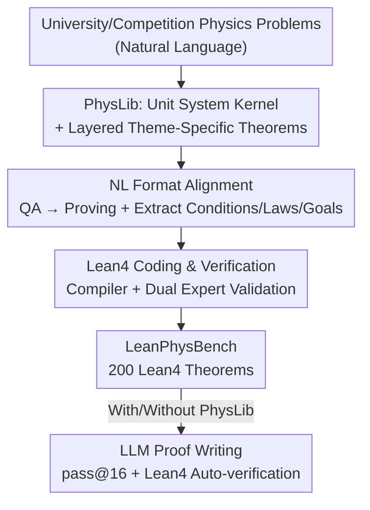

# Lean4PHYS: Comprehensive Reasoning Framework for College-level Physics in Lean4

**Conference**: ICLR 2026  
**OpenReview**: [https://openreview.net/forum?id=wQ2jyFz18H](https://openreview.net/forum?id=wQ2jyFz18H)  
**Code**: https://github.com/ShirleyLIYuxin/Lean4PHYS (To be open-sourced)  
**Area**: LLM Reasoning / Formal Reasoning / Benchmark  
**Keywords**: Formal Physical Reasoning, Lean4, Unit Systems, Theorem Library, University Physics Benchmark

## TL;DR
This paper introduces Lean4PHYS—the first Lean4 formal reasoning framework for college physics. It consists of PhysLib, a community-driven physics theorem library with a unit system, and LeanPhysBench, an evaluation set containing 200 expert-formalized problems. The experiments reveal an overfitting phenomenon where "mathematical expert provers do not outperform general LLMs in the physics domain," while demonstrating that providing PhysLib in the context yields an average performance improvement of 11.90%.

## Background & Motivation

**Background**: "Formalizing" reasoning to achieve machine-verifiable correctness is a major direction in recent LLM reasoning research. Among formal languages like Lean, Coq, Isabelle, and HOL, Lean4 has become the most studied due to high interest from both academia and industry, leading to significant accumulation of benchmarks (e.g., miniF2F), datasets, and expert provers (e.g., DeepSeek-Prover, Kimina-Prover, Goedel-Prover).

**Limitations of Prior Work**: Existing works focus almost exclusively on **mathematics**. Physics—a natural science that can be formalized but relies more on empirical laws—has remained largely unexplored. There is a lack of available Lean4 physics theorem libraries and benchmarks. More importantly, expert provers claim formal reasoning capabilities by "achieving high scores on math benchmarks," but it has never been tested whether this capability represents **true mastery of formal reasoning** or merely **overfitting to the mathematical domain**.

**Key Challenge**: The fundamental difference between physics and mathematics is that every basic building block in math comes from pure definition, while physics is supported by empirical laws induced from experiments, naturally lacking the clear definitions found in math. To prove physics propositions in Lean4, one must first identify an "invariant core" that supports cross-domain reasoning; otherwise, even basic checks like unit consistency and dimensional homogeneity cannot be strictly expressed.

**Goal**: (1) Lay the foundation for Lean4 physics reasoning by creating an extensible, community-maintained physics theorem library; (2) Create the first Lean4 physics benchmark; (3) Verify whether the capabilities of existing expert provers can transfer across domains.

**Key Insight**: The authors identify the **unit system** as the "core" of physics formalization. The seven SI base units are the common foundation for all physical dimensional derivations. Once established in Lean4, theme-specific theorems can grow bottom-up.

**Core Idea**: Build the physics theorem library PhysLib using a bottom-up approach with the "unit system as the core and theme-layered theorem stacks." Then, construct the benchmark LeanPhysBench through a strict "NL → Proving Proposition → Lean4" formalization pipeline to extend formal reasoning from mathematics to the more general domain of physics.

## Method

### Overall Architecture
Lean4PHYS consists of two main components aligned by the same "bottom-up" principle: **first build the library (PhysLib), then use the library to construct the benchmark (LeanPhysBench), and finally evaluate models on the benchmark**. PhysLib starts from a unit system of seven SI base units, followed by layered theme-specific units (Mechanics, Waves & Acoustics, Thermodynamics, Electromagnetism, Optics, Modern Physics), constants, experimental physical rules (written as definitions), and reusable theorems. LeanPhysBench aligns natural language physics problems into "proving propositions" and then into verifiable Lean4 theorems, with each problem formalized by at least one expert and verified by two others. During evaluation, LLMs are prompted to write proofs under "with PhysLib / without PhysLib" contexts, which are automatically verified by the Lean4 compiler using pass@16.

### Key Designs

**1. PhysLib Unit System Kernel: Establishing an "Invariant Root" for Physics Formalization**

The primary difficulty in physics formalization is that, unlike math where everyone starts from clean definitions, physics depends on empirical quantities with dimensions. This paper positions the "invariant core" as the unit system: extending $UnitsSystem$ on top of Mathlib to implement the seven SI base units (Time, Length, Mass, Current, Temperature, Amount of Substance, Luminous Intensity). This ensures every physical quantity carries dimensions, supporting "dimensionally consistent" symbolic computation. On this root, the authors introduce first-order derivative examples, such as length over time deriving velocity, to demonstrate how upper-level quantities derive from the unit system. This layer is designed as a stable base that is "rarely modified," serving as the prerequisite for the library to grow bottom-up: without it, even basic checks like "whether the dimensions on both sides of $\mu = f/N$ are compatible" would be impossible.

**2. Layered Theorem Library and Three-tier Extensible Architecture: Enabling Community Scaling**

A unit system alone is insufficient; solving problems requires laws from various fields. The authors organize PhysLib into a three-tier hierarchy: (1) Base Unit System (modified only when necessary); (2) Theme-specific Unit Systems (added when existing units cannot express a theme); (3) Theme-specific Theorems (the most active layer requiring continuous updates). Implementation-wise, independent namespaces and Lean files are created for six themes (Mechanics, etc.), filled sequentially with "Theme Units/Constants → Experimental Physical Rules (definitions) → Reusable Theorems (with proofs)." Mechanics serves as a complete prototype for other themes. This layering adopts the collaboration paradigm of Mathlib and is explicitly designed to be community-driven and long-term maintained.

**3. NL→Lean4 Formalization Pipeline: Transforming "Solving for Answers" into "Proving Propositions"**

There is a huge representation gap between NL physics problems (usually QA-style asking for values/expressions) and Lean4 propositions (closed-form proofs). The paper designs a two-phase pipeline. The first phase is **NL Format Alignment**: restating "find X" as "prove X equals ...", then having an LLM write step-by-step solutions to extract physical laws and initial conditions. Proof goals are categorized into three types: numerical values, physical expressions, or logical formulas describing physical states. The second phase is **Lean4 Coding & Verification**: conditions and goals are written as Lean4 hypotheses and goals. Missing physical laws are added to PhysLib, and the code is verified by the compiler and at least two experts to ensure semantic accuracy rather than mechanical translation.

### Example Walkthrough
Consider a mechanics competition problem (a block in circular motion inside a spherical shell; find the minimum friction coefficient required): The original NL problem asks "What is the minimum friction coefficient $\mu$?". After **format alignment**, it becomes "Prove $\mu = \dots$". The model writes step-by-step solutions—balancing forces horizontally and vertically: $\sin\theta\cdot N + \cos\theta\cdot f = mg$ and $\cos\theta\cdot N - \sin\theta\cdot f = m\omega^2 r$. Solving yields $N = m(g\sin\theta + \cos^2\theta\,\omega^2 R)$ and $f = m\cos\theta(g - \sin\theta\,\omega^2 R)$, then substituting into $\mu = f/N$. **Condition extraction** provides hypotheses like angle ranges and $r = R\cos\theta$, while the **goal** is the expression for $\mu$. Finally, this is written as `theorem Ch2_Q5 (... h_vert ... h_horiz ... h_fric_min : f = μ • N) : μ = (...).val / (...).val := by`, where quantities with units (e.g., `Mass`, `Length`) rely on the PhysLib unit system.

## Key Experimental Results

### Main Results
Evaluation was conducted on 8 representative LLMs (Closed: GPT-4o, Claude-Sonnet-4, Gemini-2.5-Pro; Open General: DeepSeek-R1, Qwen3-8B; Open Expert Provers: Kimina-Prover-8B, Goedel-Prover-V2-8B, DeepSeek-Prover-V2-7B) across College, Comp-Easy, and Comp-Hard difficulties. Performance was measured via pass@16 averaged over 3 runs.

| Model | PhysLib | College | Comp-Easy | Comp-Hard | Overall |
|------|---------|---------|-----------|-----------|---------|
| Gemini-2.5-Pro | ✓ | 32.69% | 74.19% | 0.00% | **40.00%** |
| Claude-Sonnet-4 | ✓ | 29.49% | 61.83% | 0.00% | 34.50% |
| DeepSeek-Prover-V2-7B | ✓ | 8.01% | 31.18% | 5.88% | 14.83% |
| Goedel-Prover-V2-8B | ✓ | 10.58% | 26.34% | 5.88% | 14.67% |
| GPT-4o | ✓ | 9.29% | 30.11% | 0.00% | 14.17% |
| Kimina-Prover-8B | ✓ | 9.94% | 23.12% | 6.86% | 13.50% |
| Gemini-2.5-Pro | ✗ | 6.09% | 11.29% | 0.00% | 6.67% |
| Claude-Sonnet-4 | ✗ | 3.21% | 5.91% | 0.00% | 3.50% |

Two core conclusions: (1) Large-scale, high-coding-capability closed-source models (Gemini, Claude) are strongest in formal physics reasoning, while expert provers that dominate in math reach only ~10%. Expert capabilities **fail to transfer from math to physics**, especially when facing new definitions like unit systems. (2) Adding PhysLib to the context consistently improves all models across all difficulties, with an average gain of +11.90%.

### Ablation Study
| Configuration | Phenomenon | Explanation |
|------|------|------|
| With PhysLib | Avg. +11.90% | Models learn advanced tactics like `simp` and `norm_num`. |
| Without PhysLib | Significantly Lower | Models restricted to basic simplifications like `rw`, `abel`, `aesop`. |
| Comp-Hard Only | Almost all 0% | Involves complex symbolic reasoning (integrals, quantifiers, etc.). |

By problem type: College problems focus on numerical calculation with units and rely heavily on PhysLib for dimensional consistency; Comp-Easy problems are closer to miniF2F-style math (short derivations using Mathlib tactics); Comp-Hard remains the "ceiling," requiring dimensional conversion mixed with calculus.

### Key Findings
- **PhysLib's gain mechanism is "unlocking advanced tactics"**: Without the library, models use basic simplification; with it, they leverage `simp` and `norm_num` based on the library's definitions.
- **Minimal gap between expert provers**: Significant math improvements do not guarantee physics improvements, supporting the "math-domain overfitting" hypothesis.
- **Expert models only lead in Comp-Hard**: This tier requires stronger complex deduction where expert provers slightly outperform closed models, though absolute scores remain very low.

## Highlights & Insights
- **Identifying "Unit Systems" as the invariant core** of physics formalization is the most critical insight, clarifying the essential difference between physics and math formalization.
- **Auditing "Expert Provers" via a new benchmark**: Highlighting the failure of math-expert models in physics provides valuable empirical evidence that "dominating math leaderboards $\neq$ mastering formal reasoning."
- **Transferable Three-tier Architecture + NL→FL Pipeline**: This methodology can be replicated in chemistry and other sciences, providing a roadmap for expanding formal reasoning across disciplines.

## Limitations & Future Work
- **Comp-Hard Performance**: Current models are largely incapable of handling physics proofs involving integrals, derivatives, and complex functional relations.
- **Limited PhysLib Coverage**: Aside from Mechanics, major themes have only frameworks without complete implementations, relying on future community contributions.
- **Data Scale**: 200 problems is relatively small and expensive to expand due to the requirement for expert formalization and multi-expert validation.
- **Future Directions**: Completing theorem themes, introducing formal support for calculus/continuity, and exploring agents that can automatically fill missing laws in PhysLib.

## Related Work & Insights
- **vs. Math Lean benchmarks (miniF2F, etc.)**: These cover only pure symbolic math; this work extends formalization to physics, requiring the resolution of dimensional/unit consistency challenges.
- **vs. Expert Lean Provers**: They claim formal capability via math; this work shows these capabilities are difficult to transfer. This paper focuses on infrastructure (libraries + benchmarks) rather than building a new prover.
- **vs. Pure NL Physics Reasoning**: Previous tasks relied on comparing final answers in NL, which cannot verify intermediate steps. This work leverages Lean4 to make every reasoning step machine-verifiable.

## Rating
- **Novelty**: ⭐⭐⭐⭐⭐ First Lean4 physics library + benchmark; establishes "unit system as core" methodology.
- **Experimental Thoroughness**: ⭐⭐⭐⭐ Covers 8 representative models across two modes and three difficulties, though the dataset size and theme coverage have room to grow.
- **Writing Quality**: ⭐⭐⭐⭐ Clear motivation and bottom-up design; effective diagrams and examples.
- **Value**: ⭐⭐⭐⭐⭐ Provides long-term maintainable infrastructure and proves that "math success $\neq$ formal reasoning mastery," opening a new direction for cross-disciplinary formal reasoning.

<!-- RELATED:START -->

## Related Papers

- [\[ICLR 2026\] A State-Transition Framework for Efficient LLM Reasoning](a_state-transition_framework_for_efficient_llm_reasoning.md)
- [\[ICLR 2026\] Structured Reasoning for LLMs: A Unified Framework for Efficiency and Explainability](structured_reasoning_for_llms_a_unified_framework_for_efficiency_and_explainabil.md)
- [\[ICML 2026\] Scientific Logicality Enriched Methodology for LLM Reasoning: A Practice in Physics](../../ICML2026/llm_reasoning/scientific_logicality_enriched_methodology_for_llm_reasoning_a_practice_in_physi.md)
- [\[ACL 2026\] MTR-Bench: A Comprehensive Benchmark for Multi-Turn Reasoning Evaluation](../../ACL2026/llm_reasoning/mtr-bench_a_comprehensive_benchmark_for_multi-turn_reasoning_evaluation.md)
- [\[ICLR 2026\] Enhancing Language Model Reasoning with Structured Multi-Level Modeling](enhancing_language_model_reasoning_with_structured_multi-level_modeling.md)

<!-- RELATED:END -->
