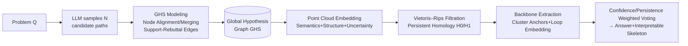

# Learning Global Hypothesis Space for Enhancing Synergistic Reasoning Chain

**Conference**: ICLR 2026  
**OpenReview**: [https://openreview.net/forum?id=9QSWEdHDnT](https://openreview.net/forum?id=9QSWEdHDnT)  
**Code**: To be confirmed  
**Area**: LLM Reasoning / Structured Reasoning Chain  
**Keywords**: Chain-of-Thought, Global Hypothesis Graph, Topological Data Analysis, Persistent Homology, Multi-agent Collaboration, Self-consistent Reasoning  

## TL;DR
This paper proposes GHS-TDA: fusing multiple reasoning paths sampled from LLMs into a "Global Hypothesis Graph," then applying Topological Data Analysis (Persistent Homology) to extract stable "logical backbones" and "self-consistent loops." By selecting reasoning chains based on structural stability rather than local confidence, the method suppresses error propagation and enhances accuracy and interpretability.

## Background & Motivation
- **Background**: CoT significantly improves LLM accuracy and interpretability by breaking complex problems into step-by-step intermediate reasoning; structured extensions like ToT / GoT / AoT further expand single paths into trees, graphs, or atomic structures to increase reasoning diversity.
- **Limitations of Prior Work**: These methods remain essentially **autoregressive and step-by-step**—each step is conditioned on the previous output, leading to: (1) early errors easily propagating and amplifying along the chain due to a lack of global coordination and correction; (2) a lack of structured analysis frameworks to prune redundancy or identify key reasoning features, resulting in unstable trajectories and poor interpretability. While ToT/GoT expand the search space, hypotheses across branches are not explicitly coordinated, potentially accumulating errors. Methods like ReAct/AFlow/ReCEval focus on "outcome optimization" rather than "structural regulation" and lack unified tools to characterize reasoning chains.
- **Key Challenge**: The reasoning space is a **high-dimensional complex structure** composed of interdependent candidate paths, which cannot be fully characterized by local metrics like confidence or shortest paths. A "global, noise-resistant" structural perspective is missing to manage error propagation and redundancy.
- **Goal**: Use structural robustness (rather than local correctness) as a criterion for reasoning reliability to automatically extract accurate, interpretable, and perturbation-robust reasoning chains.
- **Key Insight** (**Topological Modeling of Reasoning Space**): Formalize "logical backbones" and "self-consistent loops" as **topological invariants**. Use persistent homology to capture connected components (H0) and loops (H1) that are stable across scales. These correspond to primary reasoning paths and self-verification structures, providing a principled basis for path selection.

## Method

### Overall Architecture
GHS-TDA is a "Construction-Analysis" two-stage framework. **Construction**: Multiple reasoning paths sampled from LLMs are semantically aligned and merged into a unified **Global Hypothesis Graph (GHS)** to integrate diverse information and manage conflicts. **Analysis**: Persistent Homology is applied to the GHS to extract stable backbones and self-consistent loops, resulting in high-confidence, interpretable reasoning chains. Construction ensures "coherent integration," while analysis utilizes "topological stability" as a structural constraint and convergence criterion.

### Key Designs

**1. Global Hypothesis Graph Modeling (GHS): Merging Isolated Paths into a Shared Reasoning Space** — Given a problem $Q$, $N$ candidate paths $P=\{P_1,\dots,P_N\}$ are sampled, where each $P_i=(s_1^{(i)},\dots,s_{m_i}^{(i)})$ is a sequence of hypotheses. The paper merges these into a directed multigraph $G=(V,E)$. Each node $v=(\text{text},\text{canon},c,r)$ records natural language description, a normalized form for equality checking (e.g., symbolic/normalized logic), confidence $c\in[0,1]$, and a progress indicator $r\in[0,1]$ (distance to the final answer). Edges encode adjacency, explicit references, and inferred support/rebuttal relationships. Key alignment occurs on nodes with "cross-path semantic equivalence": when similarity $\mathrm{Sim}(\text{canon}(s_a),\text{canon}(s_b))>\theta_\text{merge}$, they merge into one vertex. This unifies steps like "2+2=4" and "the sum is four." Merged nodes average their confidence and take the maximum progress value to preserve downstream integrity, while recording provenance for traceability. This graph encodes the union of all paths without redundancy, allowing competitive hypotheses to be compared in a unified space.

**2. Point Cloud Representation and Hybrid Metric: Embedding Reasoning Graphs into Metric Spaces** — To perform persistent homology, nodes must be converted into a "point cloud." Each node is embedded into a joint feature vector $z_v=[\,e_v;\ \phi_\text{graph}(v);\ u_v\,]$, where $e_v$ is an L2-normalized semantic embedding, $\phi_\text{graph}(v)$ encodes graph structure (progress $r_v$, BFS position, centrality), and $u_v=-\log(c_v+10^{-6})$ is uncertainty. Distance $d(v_i,v_j)=\alpha(1-\langle e_i,e_j\rangle)+\beta\lVert\phi_\text{graph}(i)-\phi_\text{graph}(j)\rVert_1+\nu(u_i+u_j)$ merges semantic similarity, structural difference, and uncertainty. A $k$-nearest neighbor graph ($k\approx15$) is built and pruned by a global threshold $\tau$ (95th percentile distance), followed by a Vietoris–Rips filtration to retain significant H0/H1 features while reducing complexity.

**3. Persistent Homology and Skeleton Extraction: Using Topological Invariants to Identify Backbones and Verification Loops** — Persistent homology for H1 is computed to obtain barcodes for connected components (H0) and loops (H1). Significant features are selected based on lifetime $L=\text{death}-\text{birth}$ (Top-q%). H0 identifies main clusters, while H1 reflects self-consistent loops. Scale parameters $\varepsilon_{H_0}=\mathrm{median}\{\text{death}(b)\mid b\in B_0\}$ and $\varepsilon_b=0.99\cdot\text{death}(b)$ define threshold subgraphs $G(\varepsilon)$. In $G(\varepsilon_{H_0})$, components with $|C|>3$ covering at least two paths are retained. Anchors for start $s_C=\arg\min_{v\in C}r_v$ and end $g_C=\arg\max_{v\in C}r_v$ are identified. Each loop $b$ is assigned to its maximally overlapping cluster. The backbone is the shortest path $s_C\to g_C$; if a primary loop $b_C$ exists, it is diverted through a pivot near median progress $s_C\to v\to(\text{detour}\ b_C)\to v\to g_C$, **explicitly embedding a verification loop** (instantiated via Horton’s algorithm or splicing heuristics). Clusters are prioritized by "Presence of Loop > Loop Lifetime > Cluster Size > Backbone Cost."

**4. Adaptive Convergence and Answer Aggregation: Topological Stability as Selection and Stopping Criteria** — The final answer is aggregated via **confidence/persistence weighted voting** along the skeleton. If loops exist, numerical substitution or entailment checks are performed. The output provides the answer, the skeleton structure, and statistics (contributing paths, edge weights, loop lifetime). This mechanism combines "reasoning diversity" (sampling) and "topological stability" (TDA) for adaptive convergence—stopping based on structural stability rather than fixed steps. Implementation uses `text-embedding-3-large`, `GUDHI` for TDA, 5 random seeds, temperature 0.7, top-p 0.95, and up to 16 LLM calls per instance.

## Key Experimental Results

### Main Results: Eight Reasoning Benchmarks (EM %, three backbones)
Comparison with 9 baselines (CoT, CoT-SC, Self-Refine, Analogical Prompting, AFlow, ToT, GoT, FoT, AoT) across chain, tree, graph, forest, and atomic paradigms.

| Backbone | Method | MATH | OlympiadBench | GSM8K | BBH | MMLU-CF | LongBench | HotpotQA | MuSiQue | Avg |
|---|---|---|---|---|---|---|---|---|---|---|
| GPT-4o-mini | CoT | 78.3 | 9.3 | 90.9 | 78.3 | 69.6 | 57.6 | 67.2 | 34.1 | 60.7 |
| GPT-4o-mini | AoT (Best Baseline) | 83.6 | 12.1 | 95.0 | 86.0 | 70.9 | 68.5 | 80.6 | 38.4 | 66.9 |
| GPT-4o-mini | **GHS-TDA** | **83.9** | **14.5** | **95.2** | **88.4** | **71.6** | **69.5** | **81.4** | **39.8** | **68.0** |
| Qwen-Turbo | AoT | 83.5 | 12.6 | 94.7 | 85.4 | 70.5 | 68.1 | 80.0 | 39.2 | 66.8 |
| Qwen-Turbo | **GHS-TDA** | **83.7** | **14.4** | **94.8** | **87.9** | **71.2** | **68.6** | **80.3** | **39.6** | **67.6** |
| DeepSeek-V3 | AoT | 84.0 | 13.1 | 95.1 | 86.1 | 70.8 | 68.7 | 80.6 | 39.6 | 67.3 |
| DeepSeek-V3 | **GHS-TDA** | **84.5** | **14.7** | **95.2** | **88.7** | **71.6** | **69.9** | **81.7** | **40.1** | **68.3** |

GHS-TDA exceeds the strongest baseline AoT across all backbones (Avg EM: 68.0 vs 66.9, 67.6 vs 66.8, 68.3 vs 67.3), with most significant gains in OlympiadBench (complex math) and BBH.

### Path Selection Strategy + Robustness (MATH Dataset)
This verifies "Topological Selection > Local Confidence Selection" and includes human interpretability scores (1–5 scale).

| Selection Strategy | Accuracy % | Avg. Steps | Avg. Conf. | Conf. Var. ↓ | Clarity | Coherence | Trust | Brevity |
|---|---|---|---|---|---|---|---|---|
| Shortest Path (GHS) | 75.2 | 5.8 | 0.81 | 0.12 | 3.6 | 2.9 | 3.4 | 4.3 |
| Max Conf. Path (GHS) | 82.1 | 11.5 | 0.93 | 0.21 | 4.1 | 4.2 | 4.3 | 3.9 |
| Human Selection (GHS) | 83.6 | 9.2 | 0.88 | 0.07 | 4.5 | 4.6 | 4.7 | 4.4 |
| **TDA Skeleton (Ours)** | **83.9** | 8.7 | 0.90 | **0.07** | 4.4 | 4.5 | 4.7 | 4.3 |

| Adversarial Robustness | Pre-Perturb % | Post-Perturb % | Ans. Change Rate |
|---|---|---|---|
| Max Conf. Path | 82.1 | 77.1 | 7.4% |
| **GHS-TDA** | 83.9 | 81.5 | **2.9%** |

TDA skeletons match or slightly exceed human selection performance. Under semantic adversarial perturbations, the answer change rate is only 2.9%, far lower than Max Confidence Path (7.4%).

### Key Findings: H1 Persistence Predicts Reasoning Correctness

| Analysis Metric | Value | Interpretation |
|---|---|---|
| Global Spearman ρ | 0.349 (p≈0) | Moderate positive correlation |
| Logistic Reg. (Std. H1) | 1.247 (OR≈3.48) | +1 SD ⇒ ~3.5× Odds |
| ROC–AUC (H1 only) | 0.74 | Good discriminative power |
| Dataset Specific AUC | 0.70–0.78 (HotpotQA 0.778 max) | Robust across benchmarks |

H1 persistence is systematically higher for correct reasoning chains—topological persistence serves as a "task-agnostic" signal for reasoning reliability.

## Highlights & Insights
- **First Systematic Application of TDA to Reasoning Chains**: Uses scale-invariance and structural robustness of Persistent Homology to formalize "logical backbones" and "self-consistent loops" as H0/H1 invariants, providing a noise-resistant global answer to path reliability beyond local heuristics.
- **Clean "Construction-Analysis" Decoupling**: Merges multiple paths into a global hypothesis graph (with semantic alignment and support/rebuttal edges) before analysis, preventing the cross-branch error accumulation seen in ToT/GoT.
- **H1 Persistence as a Reliability Signal**: A significant empirical finding (AUC 0.74, OR≈3.5) that is robust across 8 benchmarks. This allows predicting chain reliability **without gold answers**, which is valuable for adaptive stopping and calibration.
- **Quantifiable Interpretability**: TDA skeletons approach human selection quality in 1–5 scale evaluations while being more concise (8.7 vs 11.5 steps), balancing accuracy, robustness, and brevity.

## Limitations & Future Work
- **Computational and Call Overhead**: Requires multi-path sampling, embeddings, persistent homology (GUDHI), and up to 16 LLM calls, making it significantly heavier than single-path CoT. End-to-end latency/cost quantification is missing.
- **Marginal Gains**: Improvements over AoT are often between +0.3~1.5 points; gains are saturated in simple arithmetic (GSM8K).
- **Hyperparameter and Threshold Dependency**: Relies on merging threshold $\theta_\text{merge}$, $k$-NN, filtration threshold $\tau$, and lifetime quantiles without extensive sensitivity analysis.
- **Lack of Component-wise Ablation**: No granular experiments removing specific features (e.g., support-rebuttal edges or H1 loops) to isolate their individual contributions.
- **Future Work**: Integrating topological persistence as an online confidence signal for decoding or early stopping, extending to H2+ invariants, and combining with RL-based reasoning optimization.

## Related Work & Insights
- **Structured Reasoning**: The evolution from CoT to ToT / GoT / AoT expanded reasoning into trees/graphs/forests. This work goes beyond "expanding search space" by providing **global structural analysis tools** (topology) to address branch coordination issues.
- **Workflow Optimization**: Complements ReAct (action), AFlow (MCTS workflows), and ReCEval (evaluation) by emphasizing "structural regulation" through a unified analytical framework.
- **TDA Applications**: Traditionally used in bioinformatics and neural network analysis. Transitioning TDA to "LLM reasoning chains" is a creative cross-over that may inspire more geometric/topological tools for reliability metrics.

## Rating
- Novelty: ⭐⭐⭐⭐ — First to systematically use Persistent Homology (H0/H1) for reasoning chain analysis; H1 persistence as a predictor of correctness is an original empirical finding.
- Experimental Thoroughness: ⭐⭐⭐ — Covers 8 benchmarks, 3 backbones, and 9 baselines with adversarial and correlation analysis; however, lacks component-level ablation and cost-benefit analysis.
- Writing Quality: ⭐⭐⭐⭐ — Clear motivation-method-experiment logic; topological concepts are well-explained; minor typos in figure references (Fig. ??).
- Value: ⭐⭐⭐⭐ — Introduces a paradigm of using structural stability over local confidence. H1 persistence as an unsupervised signal has practical potential for interpretability and robustness.

<!-- RELATED:START -->

## Related Papers

- [\[ICLR 2026\] Generative Adversarial Reasoner: Enhancing LLM Reasoning with Adversarial Reinforcement Learning](generative_adversarial_reasoner_enhancing_llm_reasoning_with_adversarial_reinfor.md)
- [\[ICLR 2026\] ∇-Reasoner: LLM Reasoning via Test-Time Gradient Descent in Latent Space](nabla-reasoner_llm_reasoning_via_test-time_gradient_descent_in_latent_space.md)
- [\[ICLR 2026\] MathFimer: Enhancing Mathematical Reasoning by Expanding Reasoning Steps through Fill-in-the-Middle Task](mathfimer_enhancing_mathematical_reasoning_by_expanding_reasoning_steps_through_.md)
- [\[ICLR 2026\] Learning to Reason over Continuous Tokens with Reinforcement Learning (HyRea)](learning_to_reason_over_continuous_tokens_with_reinforcement_learning.md)
- [\[ACL 2026\] Revisiting the Uniform Information Density Hypothesis in LLM Reasoning](../../ACL2026/llm_reasoning/revisiting_the_uniform_information_density_hypothesis_in_llm_reasoning.md)

<!-- RELATED:END -->
