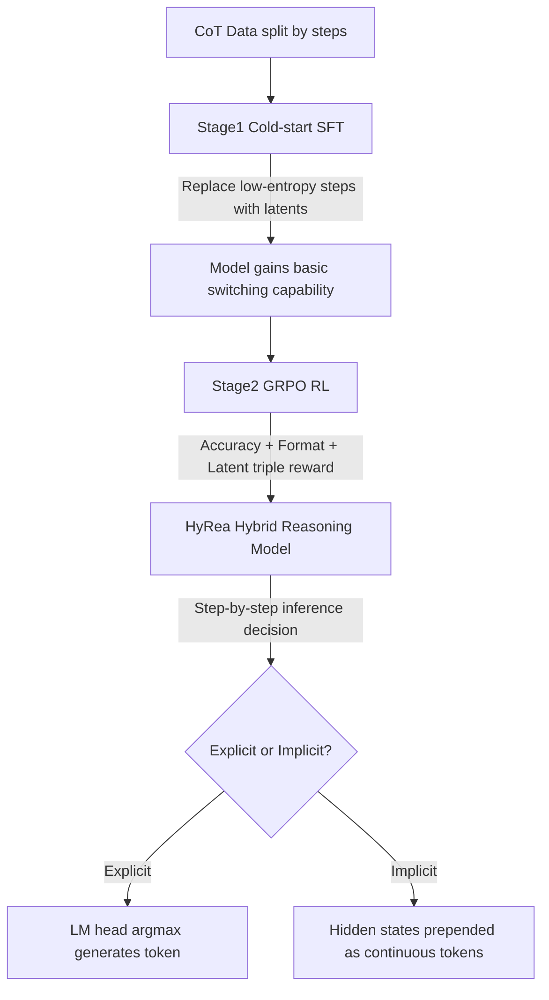

# Learning to Reason over Continuous Tokens with Reinforcement Learning (HyRea)

**Conference**: ICLR 2026  
**OpenReview**: [https://openreview.net/forum?id=lebJ6wz1vj](https://openreview.net/forum?id=lebJ6wz1vj)  
**Code**: [https://github.com/zhaoyiran924/HyRea](https://github.com/zhaoyiran924/HyRea)  
**Area**: LLM Reasoning / Efficient Inference / Latent Reasoning  
**Keywords**: Hybrid Reasoning, Latent Reasoning, Continuous Token, Chain-of-Thought, GRPO, Reinforcement Learning  

## TL;DR
HyRea enables LLMs to **autonomously and dynamically switch between "explicit token reasoning" and "implicit embedding reasoning"** during inference. By replacing low-entropy CoT steps with continuous embeddings through entropy-guided cold-start SFT, and training the model with GRPO reinforcement learning to learn optimal switching timing, it reduces output tokens by approximately 50% in mathematical reasoning while maintaining near-identical accuracy.

## Background & Motivation
- **Background**: Chain-of-Thought (CoT) significantly enhances complex reasoning in LLMs by generating intermediate steps explicitly. however, since all reasoning occurs in discrete token space, long intermediate steps incur high computational and memory overhead, especially in long-context scenarios and RL-based mathematical training (e.g., DeepSeek-R1 style) where token costs are high and convergence is slow.
- **Limitations of Prior Work**: Recent works (Coconut, Soft Thinking, etc.) attempt "implicit reasoning" directly in the embedding space by feeding hidden states from the last layer back into the first layer, bypassing tokenization to achieve significant compression. However, pure implicit reasoning suffers from **obvious accuracy loss**—certain tokens encoding complex, precise symbolic information (especially in math/code) lose semantic fidelity when compressed into embeddings, leading to errors. Furthermore, existing models can only apply **uniform/fixed heuristic compression** and cannot judge which tokens should be compressed versus preserved.
- **Key Challenge**: Explicit reasoning is interpretable and accurate but inefficient; implicit reasoning is efficient but sacrifices clarity and performance. There is a lack of a unified mechanism allowing models to **adaptively choose between them based on content**.
- **Goal**: To build a unified framework allowing the model to autonomously decide whether to use token space or embedding space at each decoding step, significantly reducing the number of generated tokens while maintaining accuracy.
- **Core Idea**: **[Hybrid Reasoning + Learnable Switching]** Use special tokens to mark latent space segments and model "when to switch" as a reinforcement learning problem—**[Entropy-guided Compression]** replace only low-entropy steps (high certainty, easy to represent in latent space) with continuous embeddings, then use GRPO reinforcement learning to let the model learn the switching strategy based on downstream rewards.

## Method

### Overall Architecture
HyRea consists of a "Reasoning Paradigm" and a "Two-stage Training" process. During inference, the model decodes step-by-step: if **explicit mode** is chosen, it generates the next token via argmax from the regular LM head; if **implicit mode** is chosen, it directly prepends the hidden state from the previous layer back into the input sequence for the next forward pass (Coconut style), using `<start-latent>` / `<end-latent>` to mark the latent span. To enable autonomous switching, training is divided into two stages: first, entropy-guided cold-start SFT is used to inject the basic capability of "replacing low-entropy steps with latents," followed by GRPO reinforcement learning to optimize the switching strategy for accuracy and efficiency.

### Key Designs

**1. Hybrid Reasoning Paradigm: Interleaving tokens and embeddings in a single trajectory.** HyRea defines the ideal reasoning sequence as `[Question][Step1]...<start-latent>[latent]<end-latent>...[StepN][Answer]`. Explicit steps follow standard autoregression—hidden states $h_t$ pass through the LM head to obtain logits, followed by $\hat{x}_{t+1}=\arg\max_V \mathrm{LMhead}(h_t)$. Implicit steps mirror Coconut, skipping decoding and prepending the final layer's hidden state back to the sequence: $H_{t+1}=\mathrm{Transformer}(E\|h_t)$. This allows the model to maintain interpretable explicit tokens for **uncertain intermediate reasoning steps** while switching to compact continuous representations for **confident, compressible segments**.

**2. Entropy-guided Cold-start: Compressing only "high-certainty" steps.** Learning to switch directly is difficult, so HyRea performs supervised cold-start to inject priors. It splits original CoT sequences into independent steps using `\n` and `.`, and **prioritizes replacing steps with the lowest entropy** into latent segments `<start-latent> c×[latent] <end-latent>` (where $c$ is the number of latent tokens). The intuition is that low-entropy steps are more deterministic and easier to represent faithfully in latent space, whereas high-entropy steps often encode critical/complex information that would be lost if compressed. The entropy threshold thus naturally prevents the model from compressing important content. Training loss is calculated only on visible non-latent tokens $\mathcal{L}_{\text{cold}}=-\log \mathrm{LLM}(C\setminus[\text{Latent}])$, with the number of replaced steps gradually increasing from 0 to a limit $S$ (introducing 10% new data incrementally each round) to form a curriculum. Ablations show this entropy guidance converges faster and saves more tokens than random replacement.

**3. GRPO Reinforcement Learning: Learning "when to switch" via rewards.** Cold-start provides basic capability, but the actual switching timing is determined by RL. HyRea employs Group Relative Policy Optimization—sampling a group of $G$ outputs for each query and using group-normalized advantage $A_i=\frac{r_i-\mathrm{mean}(\{r\})}{\mathrm{std}(\{r\})}$ for critic-less policy optimization, aiming for a clipped $\mathcal{L}_{\text{GRPO}}(\theta)=\mathbb{E}\big[\frac{1}{G}\sum_i \min(\frac{\pi_\theta(o_i|q)}{\pi_{\theta_{\text{old}}}(o_i|q)}A_i,\ \mathrm{clip}(\cdot,1-\varepsilon,1+\varepsilon)A_i)\big]$. The reward consists of three parts: **accuracy reward** (correct answer), **format reward** (structural compliance), and a specific **latent reward** (encouraging the generation of `[Latent]` to guide latent space usage). Loss calculation also excludes `[Latent]` tokens. This step **eliminates the need for manually constructed switching data**, as the model learns self-supervised under reward-driven incentives.

## Key Experimental Results

### Main Results
On Qwen2.5-7B/32B-Instruct across four math benchmarks (pass@1), compared with CoT (SFT+RL), Coconut, and Soft Thinking, reporting Accuracy / Avg. Tokens / Avg. Switches:

| Model | Method | MATH-500 Acc/#Tok | Minerva Acc/#Tok | AMC23 Acc/#Tok | Olympiad Acc/#Tok |
|---|---|---|---|---|---|
| Qwen2.5-7B | SFT+RL | 84.2 / 698 | 26.8 / 671 | 48.2 / 892 | 40.0 / 854 |
| | Coconut | 70.4 / 106 | 22.1 / 174 | 33.7 / 217 | 26.8 / 296 |
| | Soft Thinking | 66.4 / 617 | 16.9 / 604 | 24.1 / 784 | 24.7 / 595 |
| | **HyRea** | **83.6 / 387** | **27.2 / 425** | **48.2 / 526** | **39.6 / 583** |
| Qwen2.5-32B | SFT+RL | 85.2 / 588 | 39.7 / 608 | 61.4 / 905 | 49.5 / 899 |
| | **HyRea** | **84.4 / 369** | **38.6 / 381** | 57.8 / 498 | **48.9 / 563** |

HyRea on 7B nearly matches SFT+RL on MATH-500 (83.6 vs 84.2) using about half the tokens (387 vs 698), and even outperforms it on Minerva (27.2 vs 26.8). Compared to the purely implicit Coconut, it achieves over 10 points higher accuracy (83.6 vs 70.4), proving that "compressing everything" is counterproductive.

### Ablation Study
**Entropy-guided vs. Random Replacement** (7B, removing randomness to check token compression and accuracy):

| Strategy | MATH Acc/#Tok | Minerva Acc/#Tok | AMC23 Acc/#Tok | Olympiad Acc/#Tok |
|---|---|---|---|---|
| SFT+RL (Baseline) | 84.2 / 698 | 26.1 / 619 | 48.2 / 892 | 40.0 / 854 |
| Random Replacement | 83.4 / 309 | 26.5 / 419 | 49.4 / 452 | 39.6 / 492 |
| **Entropy Replacement** | 83.6 / **287** | **27.2 / 372** | 48.2 / **426** | 39.6 / **483** |

Entropy guidance results in the fewest tokens and more stable accuracy across all benchmarks, validating the design motivation of "using entropy to identify deterministic, compressible steps." Ablations on **Latent replacement count $c$** show that increasing $c$ from 1 to 8 leads to an accuracy collapse (from 80%+ to below 10%), and for $c>4$, output length actually increases, indicating that excessive compression quickly breaks training stability.

### Key Findings
- **Generalization**: On non-mathematical tasks like MMLU / GPQA, HyRea achieved 68.6 / 27.4 accuracy using only 53 / 685 tokens, which is comparable to SFT+RL (102 / 1083 tokens) but much shorter, demonstrating cross-domain robustness.
- **Switching Patterns**: Latent steps are concentrated in low-entropy regions (where the model is confident) and often appear at the beginning or end of reasoning trajectories; each sample averages 3–5 switches, and latents tend to appear in blocks rather than isolated calls.
- **Importance of RL**: Removing RL (HyRea w/o RL) leads to a significant accuracy drop (e.g., 71.8 vs 83.6 on 7B MATH). RL is the key step in tuning the switching strategy to be both accurate and efficient.
- **Training Dynamics**: Accuracy and latent rewards rise steadily and converge during the RL phase, while format reward remains high. The model learns a balance between the three targets.
- **Cold-start Tricks**: The loss for `<start-latent>` / `<end-latent>` is magnified by 4x to emphasize switching boundaries, helping the model learn "where to cut" faster.

## Highlights & Insights
- **"Selective Compression" is smarter than "Total Compression"**: The core insight is that not all tokens belong in latent space. Using entropy to partition reasoning steps into "deterministic-compressible" and "critical-preserved" fundamentally avoids the accuracy collapse seen in purely implicit reasoning.
- **Modeling "When to Switch" as an RL Problem**: Instead of relying on human-annotated switching data, the model learns self-supervised scheduling via a triple reward (accuracy/format/latent), resulting in a clean and scalable approach.
- **A Genuine Win-Win for Efficiency and Accuracy**: Cutting tokens in half with negligible accuracy loss holds across 7B/32B scales and both mathematical and general tasks, providing clear engineering value.
- **Curriculum-based Incremental Introduction**: Gradually increasing the number of replaced steps from 0 and injecting 10% new data per round decomposes learning implicit reasoning into a curriculum, alleviating the instability of direct latent space training.

## Limitations & Future Work
- **Extreme Sensitivity to Latent Compression Volume**: Accuracy collapses when $c > 4$, indicating narrow capacity in latent segments; adaptively determining how many latent tokens to use for each segment remains unresolved.
- **Partial Sacrifice of Interpretability**: Steps compressed into embeddings are no longer readable, which is a potential risk for scenarios requiring full auditability of reasoning chains (e.g., safety-critical tasks).
- **Reliance on Entropy as a Proxy for Compression**: Low entropy does not always equate to "should be compressed." Finer measures of "information value" might further improve the compression-fidelity trade-off.
- **Task Scope**: The primary focus is mathematical reasoning; effectiveness in more complex symbolic scenarios like code, agents, or multi-hop QA still needs verification.

## Related Work & Insights
- **CoT and Efficient Inference**: By responding to the token waste of O1/R1-style deliberation, HyRea aligns with the "inference efficiency" trend, moving from prompt engineering to explicit SFT/RL optimization and test-time scaling laws.
- **Latent Reasoning Lineage**: From `<pause>` tokens, filler tokens (`...`), and implicit CoT to Coconut's replacement of discrete CoT with continuous latents, HyRea differentiates itself by **selectively replacing low-entropy tokens + learning switches with RL** rather than a blanket replacement.
- **Comparison with Soft Thinking**: Soft Thinking performs soft reasoning in a continuous concept space using probability-weighted concept tokens (training-free), whereas HyRea uses a trained "hard switch + learnable router," proving more token-efficient and accurate in experiments.

## Rating
- **Novelty**: ⭐⭐⭐⭐ — The combination of "entropy-guided selective implicit compression + RL for switching" is a clear and persuasive new point in latent reasoning.
- **Experimental Thoroughness**: ⭐⭐⭐⭐ — Covers two model scales, four math benchmarks + two general benchmarks, multiple efficient inference baselines, and comprehensive ablations (entropy vs. random, latent count, RL).
- **Writing Quality**: ⭐⭐⭐⭐ — Logical flow from motivation to method and experiment, with clear formulas and algorithmic charts.
- **Value**: ⭐⭐⭐⭐ — Direct practical value for LLM efficient inference deployment by halving tokens with almost no accuracy loss.

<!-- RELATED:START -->

## Related Papers

- [\[ICLR 2026\] NFT: Bridging Supervised Learning and Reinforcement Learning in Math Reasoning](nft_bridging_supervised_learning_and_reinforcement_learning_in_math_reasoning.md)
- [\[ICLR 2026\] Emergent Hierarchical Reasoning in LLMs through Reinforcement Learning](emergent_hierarchical_reasoning_in_llms_through_reinforcement_learning.md)
- [\[ICLR 2026\] Curriculum Reinforcement Learning from Easy to Hard Tasks Improves LLM Reasoning](curriculum_reinforcement_learning_from_easy_to_hard_tasks_improves_llm_reasoning.md)
- [\[ICLR 2026\] Learning to Reason via Mixture-of-Thought for Logical Reasoning](learning_to_reason_via_mixture-of-thought_for_logical_reasoning.md)
- [\[ICLR 2026\] Learning What Reinforcement Learning Can't: Interleaved Online Fine-Tuning for Hardest Questions](learning_what_reinforcement_learning_cant_interleaved_online_fine-tuning_for_har.md)

<!-- RELATED:END -->
