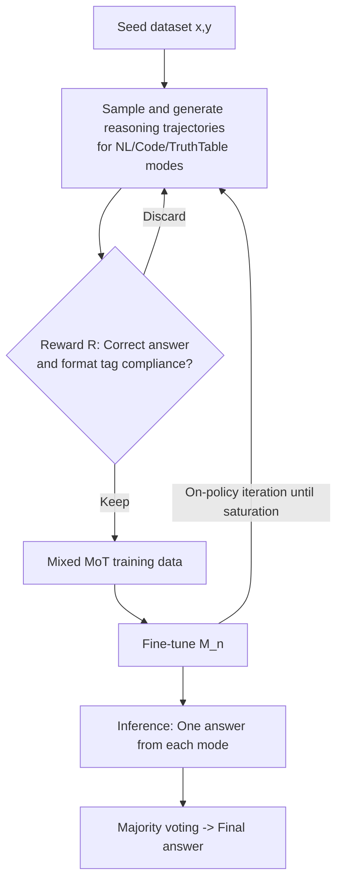

# Learning to Reason via Mixture-of-Thought for Logical Reasoning

**Conference**: ICLR 2026  
**OpenReview**: [https://openreview.net/forum?id=xhrN80hmJ9](https://openreview.net/forum?id=xhrN80hmJ9)  
**Code**: To be confirmed  
**Area**: LLM Reasoning / Logical Reasoning  
**Keywords**: Mixture-of-Thought, Logical Reasoning, Truth Table Reasoning, Self-Evolution Training, Multimodal Thought, Majority Voting  

## TL;DR
This paper proposes the Mixture-of-Thought (MoT) framework, allowing a single LLM to learn logical reasoning using three complementary paradigms: natural language, code, and the newly introduced "truth tables." Capabilities across modalities are jointly enhanced through self-evolution training, and fused via majority voting during inference, achieving a performance gain of up to +11.7pp over single Chain-of-Thought baselines on FOLIO/ProofWriter.

## Background & Motivation
- **Background**: LLMs perform logical reasoning primarily through Chain-of-Thought (CoT). Even with ensemble methods like self-consistency, the essence remains limited to a **single natural language modality**. Another line of work involves neuro-symbolic methods (e.g., Logic-LM), treating the LLM as a translator and offloading reasoning to symbolic solvers.
- **Limitations of Prior Work**: Recent works combining CoT and symbolic reasoning (e.g., HybridMind, Logic-LM series) only perform modality selection or unidirectional enhancement **at inference time**. The **training process remains "modality-blind"**—training only involves one modality, failing to learn synergies between different modalities.
- **Key Challenge**: Humans naturally switch between natural language, procedural code, and formal symbols to learn and solve logical problems. Current LLMs are trapped in unimodal training, lacking the cognitive flexibility to "process information using multiple representations." Error analysis (Figure 1c) shows that nearly two-thirds of NL CoT errors stem from **missing-branch and invalid-converse** issues, indicating insufficient exhaustive and complex reasoning capabilities.
- **Goal**: To answer "whether LLMs can acquire more robust and generalized logical reasoning capabilities by explicitly learning across multiple complementary reasoning modalities," and to address two challenges: (1) which **complementary** modalities to select; (2) how to train when high-quality aligned reasoning trajectories across modalities are missing.
- **Core Idea**: **[Complementary Multi-modality + Self-Evolution Training]** Three complementary modalities—NL, Code, and Truth Tables—are selected. Truth tables systematically enumerate all truth assignments, compensating for NL's missing-branch weakness (the union of the three covers 85% of cases). Capabilities are learned through a self-evolution cycle of model generation, filtering, and retraining, with majority voting applied across the three outputs during inference.

## Method

### Overall Architecture
MoT treats "how to reason" as a learnable object. It defines three complementary reasoning modalities (NL CoT, Code CoT, Truth Table CoT) and employs a **self-evolution training** loop to jointly strengthen a single model across all modalities. In each round, the model samples reasoning trajectories for each problem under each modality. A lightweight reward function filters trajectories that are "correct and format-compliant," which are then mixed for fine-tuning until performance plateaus. During inference, the model generates three paths based on tags and uses majority voting for the final prediction.

### Key Designs

**1. Truth Table Reasoning Modality: Using enumeration to compensate for natural language weaknesses.** This is the critical symbolic modality introduced in this work. Starting from error analysis, the two largest categories of NL CoT errors are missing branches and invalid converses, both stemming from a failure to exhaust all possibilities. Truth tables systematically list all truth assignments. Two obstacles exist for truth tables: **exponential explosion** ($2^n$ rows for many variables) and **first-order logic grounding**. A two-step strategy is designed: (i) **grounding**, instantiating first-order formulas into a finite set of propositional predicates; (ii) **reason-to-prune**, where the LLM prunes assignment rows that violate any premise, retaining only a **partial truth table**. Finally, a decision rule is applied: True if all surviving assignments satisfy the conclusion, False if none do, and Uncertain otherwise.

**2. Self-Evolution MoT Training: Jointly learning three modalities from self-generated trajectories.** Due to the lack of cross-modal annotated trajectories (especially for the new truth table mode), the model bootstraps itself. The optimization goal is to maximize the expected reward across problem $x$ and modality $t\in\{\text{NL},\text{Code},\text{TruthTable}\}$:
$$\mathbb{E}_{(x_i,y_i)\sim D,\, t\sim T,\, (z_i^t,\hat y_i^t)\sim M(\cdot|x_i,t,E_t)}\big[R(z_i^t,\hat y_i^t,y_i;t)\big]$$
where $E_t$ represents few-shot examples prepended to invoke modality $t$. Using policy gradients, the gradient form is derived to update the policy $M_n$. A key implementation detail: **few-shot prompting is used only in the first round** to evoke modalities (Line 7); once the model bootstraps these capabilities, all subsequent rounds switch to zero-shot (Line 9). Unlike STaR (restarting from the base model each round), MoT is **on-policy**—continuously learning from its own validated outputs.

**3. Binary Reward + Format Consistency Check: Simple checks to prevent cross-modal interference.** The reward function is defined as:
$$R(z,\hat y,y;t)=\begin{cases}1,& y=\hat y \wedge \text{isValid}(z,t)\\ 0,& \text{otherwise}\end{cases}$$
`isValid` performs two tasks: (a) the trajectory must include the correct structural tags for that modality (e.g., `<end_of_nl_cot>` for NL), and (b) code trajectories must contain valid `def` and `class` definitions. A counter-intuitive phenomenon was observed: **mismatches between tags and actual reasoning content cause negative interference and significant performance drops** (especially for code). Therefore, this simple format validation is crucial. They deliberately **avoid** step-level intermediate reasoning verification (which requires an LLM judge and slows down training); results show that lightweight checks like tags and basic code structure yield significant gains. With a binary reward, the framework effectively becomes "rejection sampling + supervised fine-tuning," equivalent to a STaR-style self-evolution.

**4. Majority Voting Inference: Fusing three complementary perspectives.** During inference, each problem triggers three outputs using `<nl_cot>`, `<code>`, and `<truth_table>` tags. A majority vote determines the final answer, with ties broken randomly. This simple fusion allows the advantages of different perspectives to overlap—the strengths of code and truth tables cover the blind spots of NL on specific problems. The authors also analyzed the test-time scaling of MoT: for a fixed budget $k$, distributing $k$ equally across the three modalities yields a higher pass@k upper bound than allocating all $k$ to a single modality.

## Key Experimental Results

### Main Results
Accuracy (%) on FOLIO and ProofWriter (hardest subset, depth 5), across four base models:

| Base Model | Method | FOLIO | ProofWriter | Avg |
|---|---|---|---|---|
| GPT-4 | Logic-LM (External Solver) | 78.9 | 79.7 | 79.3 |
| GPT-4 | CoT (Vanilla) | 70.6 | 68.1 | 69.4 |
| Gemma-2-2B-It | Base 3-shot (best nl) | 42.4 | 39.8 | 41.1 |
| Gemma-2-2B-It | **MoT Training + MoT Inference** | 62.6 | 65.0 | **63.8** |
| Gemma-2-9B-It | Base 3-shot (best nl) | 69.5 | 61.2 | 65.4 |
| Gemma-2-9B-It | **MoT Training + MoT Inference** | 78.9 | 70.7 | **74.8** |
| Qwen2.5-7B-Instruct | Base 3-shot (best nl) | 71.9 | 60.5 | 66.2 |
| Qwen2.5-7B-Instruct | **MoT Training + MoT Inference** | 78.3 | 71.8 | **75.1** |
| Qwen3-4B-Instruct-2507 | Base 3-shot (best nl) | 83.3 | 79.7 | 81.5 |
| Qwen3-4B-Instruct-2507 | **MoT Training + MoT Inference** | 89.2 | 86.0 | **87.6** |

Key points: MoT training alone (unimodal inference) improves the baseline by an average of +11.7pp; MoT inference adds another +2.1pp. The 9B model reaches 78.9% on FOLIO, **matching GPT-4+Logic-LM which uses an external solver.**

### Ablation Study
Different training strategies × inference modalities (Gemma-2-9B, FOLIO, %, Ensemble is majority vote of three modalities):

| Training Method | Code | NL CoT | Truth Table | Avg | Ensemble |
|---|---|---|---|---|---|
| No Training | 56.7 | 69.5 | 63.6 | 63.3 | 66.0 |
| Unimodal (NL CoT) | 52.7 | 73.9 | 69.0 | 65.2 | 73.4 |
| Unimodal (Combined 3×9B) | 61.6 | 73.9 | 71.9 | 69.1 | 77.3 |
| MoT (Code+NL) | 70.9 | 70.0 | 74.4 | 71.8 | 74.9 |
| **MoT (All Three)** | 73.9 | 76.9 | 70.0 | **73.6** | **78.9** |

Single-model MoT training (73.6 Avg / 78.9 Ensemble) outperforms the 3×9B approach of training a separate model for each modality (69.1 / 77.3), while requiring only one model for deployment.

### Key Findings
- **Modalities are complementary and necessary**: Training with any two modalities (e.g., Code+NL) outperforms all unimodal baselines, proving synergy during the training stage; using all three is optimal.
- **More useful as difficulty increases**: On ProofWriter depth 1-5 vs. 5-8, MoT provides larger gains for deeper reasoning problems.
- **Superior test-time scaling**: MoT sampling consistently outperforms unimodal sampling in pass@k, especially when the budget $k < 20$. NL is stronger than truth tables at low $k$ but they converge at higher upper bounds; code has the lowest upper bound, while MoT fusion has the highest.
- **Truth tables address blind spots**: The truth table paradigm specifically resolves a portion of the missing-branch and invalid-converse errors inherent in NL.

## Highlights & Insights
- **Deriving modality design from error analysis**: Instead of arbitrarily stacking modalities, the authors quantified failure modes of NL CoT (missing branches and invalid converses accounting for ~66%) and targeted these weaknesses by introducing truth tables.
- **"Partial Truth Table + Reasoning Pruning" avoids exponential explosion**: LLMs use reasoning to prune rows violating premises rather than enumerating $2^n$ rows, cleverly combining symbolic methods with LLM semantic reasoning.
- **Explicit utilization of training-stage synergy**: Unlike previous works that only combine modalities at inference, this paper proves that joint learning across modalities during training raises the performance ceiling for each individual modality (synergy).
- **Hidden trap of format tags**: This work reveals an overlooked issue in multimodal joint training—tag-content mismatches lead to negative interference. Simple format validation significantly recovers performance.

## Limitations & Future Work
- **No code execution**: Code CoT treats code as a structured logical description without actual execution, potentially underutilizing code's verifiability.
- **Coarse binary rewards**: The reward only checks the final answer and format, omitting step-level verification. This may lead to cases where the "answer is correct but the reasoning is wrong," a trade-off made for speed.
- **Narrow task scope**: Validation was limited to propositional and first-order logic (FOLIO, ProofWriter). Generalizability to math, common sense, or multi-hop QA remains to be verified.
- **Grounding of truth tables depends on the LLM**: Both first-order instantiation and pruning rely on model reasoning. Errors in grounding under complex premises can pollute the truth table trajectory.
- **Future Work**: Integration of truth table/code modalities with real solvers or executors for hard verification, introduction of step-level rewards, and extension to more modalities (e.g., diagrams, tables, equations) and broader reasoning benchmarks.

## Related Work & Insights
- **CoT and Ensembling**: Methods like self-consistency, best-of-N, and multi-agent debate work within a single modality. MoT elevates "ensembling" to a cross-modal level.
- **Neuro-symbolic**: Logic-LM and LINC (Olausson 2023) treat LLMs as translators for external symbolic solvers. MoT enables the LLM to internalize symbolic (truth table) reasoning, matching Logic-LM without external tools.
- **Hybrid Modality Reasoning**: HybridMind and Xiong et al. (2024) select modalities or use unidirectional enhancement (Code↔NL) at inference. MoT differs by using joint training and introducing a third modality (truth tables), pushing the union coverage from Code+NL to 85% with three modalities.
- **Self-Evolution / STaR**: Based on STaR (Zelikman 2022) concepts of rejection sampling and SFT, it utilizes on-policy iteration (no restart each round) and extends to multi-modality, providing a replicable paradigm for bootstrapping multiple thinking styles from a model's own trajectories.

## Rating
- **Novelty**: ⭐⭐⭐⭐ — Truth tables as a learnable modality + joint multi-modal self-evolution during training is a substantive breakthrough over "modality-blind training," supported by rigorous error analysis.
- **Experimental Thoroughness**: ⭐⭐⭐⭐ — Comprehensive evidence across four base models, two benchmarks, and extensive ablations (unimodal vs. MoT, partial vs. full MoT, scaling laws, difficulty levels, error distributions). However, benchmarks are limited to logical reasoning.
- **Writing Quality**: ⭐⭐⭐⭐ — Clear motivation from human cognitive flexibility to error analysis and methodology. Powerful visualizations (coverage, error distribution, scaling curves).
- **Value**: ⭐⭐⭐⭐ — Provides a plug-and-play multimodal reasoning training paradigm without external solvers. High practical value and reproducibility, with 9B models matching GPT-4+Logic-LM.

<!-- RELATED:START -->

## Related Papers

- [\[ICLR 2026\] Learning to Reason over Continuous Tokens with Reinforcement Learning (HyRea)](learning_to_reason_over_continuous_tokens_with_reinforcement_learning.md)
- [\[ICLR 2026\] ActivationReasoning: Logical Reasoning in Latent Activation Spaces](activationreasoning_logical_reasoning_in_latent_activation_spaces.md)
- [\[ICLR 2026\] MoDr: Mixture-of-Depth-Recurrent Transformers for Test-Time Reasoning](modr_mixture-of-depth-recurrent_transformers_for_test-time_reasoning.md)
- [\[ICLR 2026\] VERICOT: Neuro-Symbolic Chain-of-Thought Validation via Logical Consistency Checks](vericot_neuro-symbolic_chain-of-thought_validation_via_logical_consistency_check.md)
- [\[ACL 2026\] Logical Phase Transitions: Understanding Collapse in LLM Logical Reasoning](../../ACL2026/llm_reasoning/logical_phase_transitions_understanding_collapse_in_llm_logical_reasoning.md)

<!-- RELATED:END -->
