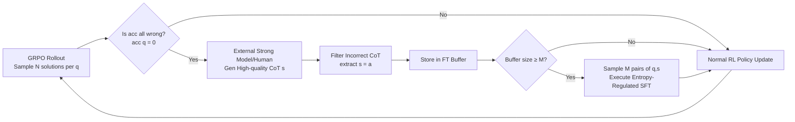

# Learning What Reinforcement Learning Can't: Interleaved Online Fine-Tuning for Hardest Questions

**Conference**: ICLR 2026  
**OpenReview**: [https://openreview.net/forum?id=LzCBLrNoyM](https://openreview.net/forum?id=LzCBLrNoyM)  
**Code**: Open-sourced (link provided in the paper abstract)  
**Area**: LLM Reasoning / Post-training (RL + SFT)  
**Keywords**: RLVR, GRPO, Supervised Fine-Tuning, Online Fine-Tuning, Mathematical Reasoning, Hard Problem Learning  

## TL;DR
By analyzing the training dynamics of RL and SFT across different difficulty levels, this work discovers that RL excels at "getting known problems right" but fails to learn "out-of-syllabus" questions. The authors propose ReLIFT, which dynamically identifies the hardest questions where the model fails all attempts during RL training, collects high-quality CoT solutions online, and interleaves sparse SFT steps. Using significantly less demonstration data and training time, ReLIFT outperforms pure RL/SFT and various hybrid methods by an average of +6.7 points across six reasoning benchmarks.

## Background & Motivation
- **Background**: Long-CoT reasoning models, represented by DeepSeek-R1, are primarily driven by RLVR (Reinforcement Learning from Verifiable Rewards, such as PPO/GRPO). Rewards are based solely on answer correctness or unit test passes, enabling scaling without demonstration data.
- **Limitations of Prior Work**: Several studies (Yue et al. 2025, Zhao et al. 2025, Cheng et al. 2025) point out that RLVR inherently **reinforces existing behaviors** of the base model rather than injecting new capabilities. Models after RLVR training might even underperform the base model in high-$k$ pass@k, indicating that the reasoning boundary has not been extended. This stems from the on-policy nature of RL: it only learns from rollouts sampled by the model itself, naturally biasing towards reasoning paths it already knows have a high probability of receiving rewards.
- **Key Challenge**: SFT can inject new knowledge and reasoning patterns via high-quality demonstrations, effectively compensating for RL's weaknesses. However, SFT relies heavily on large amounts of demonstration data, generalizes poorly to OOD (Out-of-Distribution) scenarios, and can easily damage existing capabilities (e.g., performance degradation on simple questions or excessively long responses). Balancing the strengths of both is difficult.
- **Goal**: Develop an effective combination of RL and SFT to improve reasoning and OOD generalization, reduce reliance on expensive demonstration data, and break the cognitive boundaries of base models.
- **Key Insight**: **[Difficulty-Stratified Training Dynamics Analysis]** Categorize the validation set into Easy, Medium, Hard, and Hardest based on the base model's accuracy across 8 samples. Observe the evolution of accuracy and response length for RL and SFT across these tiers to quantify the complementary pattern: "RL improves easy problems, SFT conquers hard ones." **[Demand-Driven Online Fine-Tuning]** Based on this, use RL as the primary driver and only perform online SFT for "completely failed hardest problems" exposed during training, targeting weaknesses precisely.

## Method

### Overall Architecture
ReLIFT (Reinforcement Learning Interleaved with Online Fine-Tuning) utilizes GRPO as the main training loop. During each rollout, it identifies the hardest problems where the model fails all attempts (acc(q)=0) within a group. It then acquires filtered, correct CoT solutions for these problems online and stores them in a fine-tuning buffer. Once the buffer reaches a specific batch size, an SFT step with entropy regularization is interleaved, followed by a return to RL. This process alternates adaptively: SFT is triggered more frequently in the early stages when the model is weak, while RL dominates in later stages to further stimulate learned capabilities.

### Key Designs

**1. Difficulty-Stratified Dynamic Analysis: Locating the RL Ceiling.** The authors independently ran 120 steps of SFT and RL using Qwen2.5-Math-7B on a subset of Open-R1-math-220K. They saved checkpoints every 30 steps and categorized 1,000 validation questions into Easy (≥6/8 correct), Medium (3–5/8), Hard (1–2/8), and Hardest (0/8) based on the base model's initial pass@8. The conclusion is clear: RL outperforms SFT on Easy/Medium questions and preserves existing capabilities but shows almost no improvement on Hardest questions. Conversely, SFT helps transition more Hardest questions into solvable categories but causes the model to "learn poorly" on simple questions (accuracy drops, and response lengths are stretched to mimic long demonstrations). This observation provides the methodological basis for "using SFT to learn what RL cannot."

**2. RL Main Training + Online Hardest Question Collection: A Sieve Above GRPO.** The main loop follows GRPO, sampling $N$ solutions $o_i$ for query $q$ and using group-relative rewards to estimate advantages without a value model:

$$L_{GRPO}(\theta)=\frac{1}{\sum_i|o_i|}\sum_{i=1}^{N}\sum_{t=1}^{|o_i|}\min\big[r_{i,t}(\theta)A_i,\ \mathrm{clip}(r_{i,t}(\theta);1-\epsilon,1+\epsilon)A_i\big],\quad A_i=\frac{R(o_i)-\mathrm{mean}(\{R(o_i)\})}{\mathrm{std}(\{R(o_i)\})}$$

During rollouts, $acc(q)$ is tracked. Questions with $acc(q)=0$ are sent to a stronger model (e.g., DeepSeek-R1) or humans to produce CoT solutions $s$. Only pairs where the answer is correct ($\text{extract}(s)=a$) are stored: $\text{Buffer}_{hardest}=\{(q,s)\mid acc(q)=0,\ s=M(q),\ \text{extract}(s)=a\}$. This collection is **online**, eliminating the need for pre-prepared large-scale CoT datasets and only generating solutions for problems the model actually encounters. This explains why ReLIFT requires only 8K demonstrations (vs. 46K for SFT).

**3. Interleaved Fine-Tuning with Entropy Regularization: Injecting Knowledge Without Stifling Exploration.** When $|\text{Buffer}_{FT}|\ge M$ (where $M$ is the FT batch size), one batch is sampled for a standard cross-entropy SFT step. To prevent SFT from suppressing the model's exploratory behavior, the authors add an entropy regularization term to the loss:

$$L_{FT}(\theta)=-\frac{1}{|s|}\sum_{i=1}^{|s|}\log\pi_\theta(s_i\mid q,s_{<i})-\alpha\frac{1}{|s|}\sum_{i=1}^{|s|}H(\pi_\theta(s_i\mid q,s_{<i}))$$

where $\alpha$ controls the weight of the entropy term, with $\alpha=10^{-4}$ being optimal. This term is the lubricant for mixing RL and SFT; while pure RL entropy decreases monotonically (exploration exhaustion, shorter responses), ReLIFT’s entropy remains high and fluctuates, allowing it to discover new solutions and maintain score growth in later stages.

**4. Adaptive Scheduling: Dense-to-Sparse, Focus on Hardest.** The fine-tuning frequency is not fixed. In early training, when the model is weak and hardest problems are frequent, SFT is triggered more often to inject reasoning patterns. As the model strengthens, RL takes over. Ablations show that this scheduling and the "hardest-only" selection are both essential: ReLIFT(all) (SFT after every RL step) collapses due to objective conflict; ReLIFT(uniform) (fixed every 8 steps) and ReLIFT(random) (filling buffer with non-hardest questions) both result in lower accuracy and longer responses.

## Key Experimental Results

Setup: Qwen2.5-Math-7B base model, OpenR1-Math-46k-8192 training set. Evaluated on five math benchmarks (AIME-24/25, AMC, MATH-500, OlympiadBench) and one OOD benchmark (MMLU-Pro).

### Main Results (Qwen2.5-Math-7B, Overall ACC / Avg Length)

| Method | AIME-24 | AIME-25 | AMC | MATH-500 | Olympiad | MMLU-Pro | Overall ACC | Overall LEN |
|---|---|---|---|---|---|---|---|---|
| SFT | 26.9 | 25.5 | 59.8 | 84.8 | 52.6 | 44.4 | 49.0 | 5533 |
| RL (GRPO) | 21.1 | 17.5 | 62.1 | 85.7 | 48.6 | 46.3 | 46.9 | 2175 |
| RL w/ SFT loss | 26.9 | 23.1 | 59.8 | 84.1 | 53.6 | 44.4 | 48.6 | 5508 |
| SFT then RL (v1) | 29.4 | 21.0 | 63.1 | 87.3 | 55.7 | 47.6 | 50.7 | 3845 |
| SFT then RL (v2) | 26.8 | 23.0 | 63.8 | 88.1 | 54.4 | 48.9 | 50.8 | 4534 |
| LUFFY | 27.3 | 23.0 | 63.5 | 85.6 | 53.8 | 52.6 | 50.9 | 3808 |
| **ReLIFT** | 28.3 | 22.9 | 65.1 | 87.9 | 57.3 | 53.9 | **52.6** | 3502 |

ReLIFT achieves a new SOTA of 52.6%, ranking best or second-best on every benchmark. Resource comparison (GPU hours / demos): SFT 8×8h/46K, RL 40×8h/0, RL w/SFT loss 113.5×8h/46K, SFT-then-RL v1 57×8h/46K, LUFFY 73×8h/46K. **ReLIFT requires only 52×8h and 8K demos**—higher accuracy, shorter responses, and more balanced data/compute efficiency.

### Ablation Study

| Setting | Accuracy(%) | Length |
|---|---|---|
| **ReLIFT** | **52.60** | 3502 |
| ReLIFT(all) (SFT after every RL step) | 23.80 | 6743 |
| ReLIFT(uniform) (Fixed every 8 steps) | 49.10 | 3716 |
| ReLIFT(random) (Buffer with non-hardest) | 45.50 | 5268 |

Entropy coefficient $\alpha$ ablation: Out of $\alpha=0, 1e-5, 1e-4, 1e-3$, **$\alpha=1e-4$ is optimal (52.6)**. Deviations in either direction significantly drop performance, proving entropy regularization is key to fusing SFT and RL.

### Key Findings
- **Complementary Patterns Validated**: RL improves and maintains Easy/Medium questions, while SFT is required to convert Hardest questions into solvable ones; this is the experimental foundation of ReLIFT.
- **Sustainable Exploration**: Training dynamics show that ReLIFT's rewards remain higher than RL's, response lengths gradually increase, and entropy remains high/fluctuating. Pure RL entropy decays monotonically with shortening responses, indicating ReLIFT's ability to discover new solutions late in training.
- **Cross-Model Generalization**: ReLIFT consistently outperforms SFT and RL on Qwen2.5-Math-1.5B (36.5 vs RL 34.2), Qwen2.5-7B (45.0 vs RL 43.1), and LLaMA-3.1-8B (17.3 vs RL 14.6), validating the method's universality across smaller or heterogeneous architectures.

## Highlights & Insights
- **Quantifying the RL Ceiling**: Using four difficulty levels and initial/final state transition analysis, the authors turn the abstract claim "RLVR only reinforces existing capabilities" into an actionable diagnostic signal ($acc(q)=0$), making the method evidence-based.
- **Online, On-demand, Minimal Demonstration**: Generating CoT only for hardest problems encountered during training avoids the high cost of pre-preparing massive CoT datasets, reducing demo requirements from 46K to 8K while minimizing training time.
- **Entropy Regularization is Critical**: Intuitively, SFT compresses distribution and kills RL exploration. The authors reconcile the two conflicting objectives with a lightweight entropy term, which ablations show is vital for success.

## Limitations & Future Work
- **Dependency on External Teachers/Humans**: High-quality CoT for hardest problems comes from stronger models like DeepSeek-R1 or humans. Without a stronger teacher in a specific domain, the "online knowledge injection" chain breaks.
- **Focus on Mathematical Reasoning**: Except for MMLU-Pro, experiments focus on math competitions. Effectiveness in other verifiable reward tasks like Code, Science, or Agent tasks remains to be tested.
- **Low Absolute Scores on LLaMA-3.1-8B**: While it improves over SFT/RL, the architecture's overall accuracy is much lower than the Qwen series, indicating gains are strongly correlated with base model quality.
- **Parameter Tuning for Scheduling**: FT trigger thresholds $M$, entropy coefficients $\alpha$, and frequency strategies require empirical setting and lack an automated mechanism.

## Related Work & Insights
- **RLVR Capability Boundaries**: Works like Yue et al. (2025) and Zhao et al. (2025) note that RL reinforces rather than expands capabilities. This paper uses this as a starting point and provides an actionable remedy.
- **SFT/RL Hybrids**: Unlike RL w/ SFT loss, two-stage SFT-then-RL, or LUFFY, ReLIFT differs by "online, dynamic, hardest-specific" SFT interleaving rather than fixed ratios or sequences.
- **Insight**: This paradigm—"Diagnostic signals to locate weaknesses → Inject external knowledge only for weaknesses → Regularization to protect exploration"—can be generalized to any scenario where on-policy learning hits a ceiling (e.g., Code RL, Agent RL). The core is spending expensive supervisory signals where they matter most.

## Rating
- **Novelty**: ⭐⭐⭐⭐ — "Online on-demand SFT for hardest questions" is a clear, theoretically supported new approach to the SFT/RL hybrid paradigm. The difficulty-stratified analysis is particularly solid.
- **Experimental Thoroughness**: ⭐⭐⭐⭐ — Covers six benchmarks, four base models, resource comparisons, and ablations on scheduling/entropy. A complete chain of evidence; slightly lacks non-math domain validation.
- **Writing Quality**: ⭐⭐⭐⭐ — Logic flows smoothly from diagnosis to motivation, method, and validation. Visualizations (difficulty migration, training dynamics) are informative and intuitive.
- **Value**: ⭐⭐⭐⭐ — Achieves SOTA in math reasoning with less data/compute. The transferable paradigm has direct practical utility for resource-constrained reasoning post-training.

<!-- RELATED:START -->

## Related Papers

- [\[ICLR 2026\] NFT: Bridging Supervised Learning and Reinforcement Learning in Math Reasoning](nft_bridging_supervised_learning_and_reinforcement_learning_in_math_reasoning.md)
- [\[ICLR 2026\] Temperature as a Meta-Policy: Adaptive Temperature in LLM Reinforcement Learning](temperature_as_a_meta-policy_adaptive_temperature_in_llm_reinforcement_learning.md)
- [\[ICLR 2026\] Learning to Reason over Continuous Tokens with Reinforcement Learning (HyRea)](learning_to_reason_over_continuous_tokens_with_reinforcement_learning.md)
- [\[ICLR 2026\] Generative Adversarial Reasoner: Enhancing LLM Reasoning with Adversarial Reinforcement Learning](generative_adversarial_reasoner_enhancing_llm_reasoning_with_adversarial_reinfor.md)
- [\[ICLR 2026\] Conditional Advantage Estimation for Reinforcement Learning in Large Reasoning Models](conditional_advantage_estimation_for_reinforcement_learning_in_large_reasoning_m.md)

<!-- RELATED:END -->
