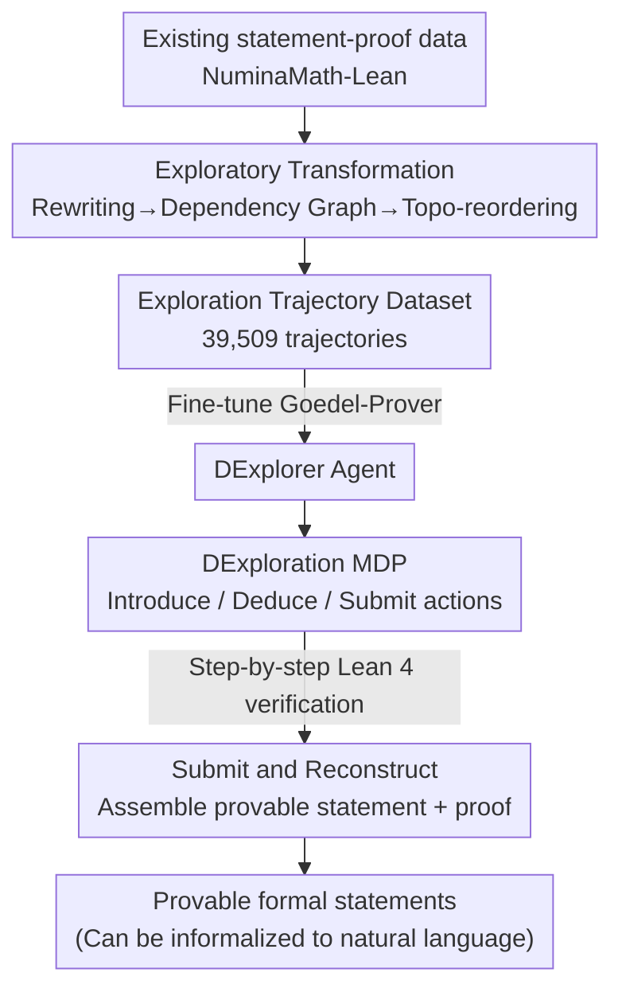

# Let's Explore Step by Step: Generating Provable Formal Statements with Deductive Exploration

**Conference**: ICLR 2026  
**OpenReview**: [https://openreview.net/forum?id=Njrkeo3DiJ](https://openreview.net/forum?id=Njrkeo3DiJ)  
**Code**: https://github.com/Purewhite2019/dexploration_main  
**Area**: LLM Reasoning / Formal Theorem Proving / Mathematical Problem Synthesis  
**Keywords**: Formal Proof, Lean 4, Problem Synthesis, Deductive Exploration, Data Distillation

## TL;DR
This paper proposes DExploration, which transforms mathematical problem synthesis from "one-shot generation" into "incremental deductive exploration in Lean 4." By using three atomic actions (introducing variables/hypotheses, deducing new facts, and submitting conclusions) with step-by-step verification, it generates naturally provable, broad-coverage, and high-difficulty formal statements. Furthermore, an Exploratory Transformation is used to distill exploration trajectories from existing proof data to train the agent, ultimately increasing the success rate from 40.70% to 54.52% and reducing token costs by 83%.

## Background & Motivation

**Background**: As LLMs rapidly consume human-generated mathematical data and evaluations suffer from data contamination, leakage, and static difficulty, "scalably synthesizing fresh, valid, and difficult mathematical problems" has become a necessity. Existing synthesis methods fall into three categories: pure LLM methods (WizardMath, MathScale, PromptCoT, etc.) where models directly generate and score problems; domain-specific methods (DyVal, geometry/first-order logic, etc.) that ensure correctness through deterministic algorithms; and formal methods that combine LLMs with Lean 4, further divided into the Autoformalizer route (informal to formal) and the Conjecture-Prover route (generating formal statements then invoking provers).

**Limitations of Prior Work**: The authors summarize the common dilemma of these methods as an **"expressivity-validity-complexity" trilemma**. Pure LLM methods are expressive but prone to errors in generation and scoring, with difficulty capped by the model's own capabilities. Domain-specific methods ensure validity but sacrifice breadth. Formal methods combine expressivity and verifiability, but the Autoformalizer route suffers from validity issues due to incorrect formalization, while the Conjecture-Prover route does not guarantee provability and requires heavy LLM calls for proof search.

**Key Challenge**: The authors identify a root cause of the trilemma: **dependency on external models (auto-formalizers / provers)**. Once a problem becomes too complex, automated formalization or proving often fails, preventing the generation of "truly challenging" problems and capping complexity at the limit of external model capabilities.

**Goal**: To break the complexity ceiling and ensure generated statements are inherently provable without relying on external provers, while maintaining expressivity and verifiability.

**Key Insight**: The authors adopt the "forward posing" concept from mathematical problem posing—instead of constructing problems backward from known concepts, one should **actively explore the mathematical world and discover interesting conclusions** like a mathematician. Each exploration step is verified in Lean 4, and the process itself serves as the prototype of a proof.

**Core Idea**: Problem synthesis is formalized as a **step-by-step deductive exploration in a deterministic MDP**. The agent uses three atomic actions to explore in Lean; upon submitting a conclusion, it assembles a provable statement and its proof. An Exploratory Transformation is then used to distill exploration trajectories from existing proof data for cold-start training.

## Method

### Overall Architecture
The approach consists of two pipelines. **Inference (DExploration)**: Mathematical exploration is modeled as a deterministic MDP. The agent iteratively executes three atomic actions on the exploration state maintained by Lean 4—introducing variables/hypotheses, deducing new facts, and submitting a derived fact as the conclusion. Once submitted, the framework assembles the introduced hypotheses and the conclusion into a formal statement, extracting the proof from the trajectory. **Data (Exploratory Transformation)**: Since DExploration is a new paradigm, existing data is distilled from statement-proof pairs. Proofs are rewritten into a deductive style, dependencies between variables and steps are analyzed to build a DAG, and steps are reordered into a trajectory of "introduce/deduce/submit" actions based on topological order to fine-tune the DExplorer agent.

### Key Designs

**1. DExploration: Modeling Problem Synthesis as a Verifiable Step-by-Step Deductive Exploration MDP**

Addressing the issue where one-shot generation limits complexity due to external provers, this paper defines a deterministic MDP: exploration state $S_t=(\Gamma_t,\Lambda_t)$, where the introduction context $\Gamma_t=[(v_i:T_i)]_{i=1}^n$ is an ordered list of variables/hypotheses, and the deduction context $\Lambda_t=[(h_i:H_i)]_{i=1}^m$ contains derived intermediate facts. The initial state is $([\,],[\,])$. The agent performs three atomic actions: $\text{Introduce}(v:T)$ adds a new variable or hypothesis to $\Gamma$; $\text{Deduce}(h:H)$ asserts and proves a new fact $H$ based on the context $\Gamma\circ\Lambda\vdash H$, adding it to $\Lambda$; $\text{Submit}(h:H)$ uses a fact $H$ as the conclusion, reconstructs the statement $\Gamma\vdash H$, and terminates. 

These actions allow complex statements to "grow" through small steps, breaking the ceiling of one-shot generation. The proof is naturally produced as a byproduct of the trajectory.

**2. Lean 4 Grounding and Provability Guarantee: Type-Checking at Every Step**

The actions are implemented via Lean 4 tactics. The union of $\Gamma$ and $\Lambda$ corresponds to the Lean state $\{\Gamma\circ\Lambda\vdash \text{False}\}$. $\text{Introduce}$ uses `obtain ⟨v, _⟩ : ∃(v:T), True := sorry` to introduce free variables/hypotheses. To avoid contradictions (where $\Gamma\circ[v:T]\vdash\text{False}$ allows any conclusion to follow trivially), a lightweight heuristic "explosion check" (using Aesop + DeepSeek-Prover) is run after introduction. $\text{Deduce}$ is restricted to "deductive tactics"—those that don't generate new goals or modify existing types (e.g., `have`, `apply ... at`). $\text{Submit}$ assembles the valid statement and proof, ensuring **full process verifiability**.

**3. Exploratory Transformation: Distilling Exploration Trajectories from Existing Proofs**

To solve the lack of training data, the authors "distill" mathematical intuition from statement-proof pairs in three steps. **Deductive Rewriting**: Given $(\Gamma\vdash U,[s_i]_{i=1}^m)$, the first non-deductive tactic is found, previous steps are kept, and remaining steps are wrapped into a `have` block to create a pure deductive proof. **Dependency Analysis**: A DAG is built where nodes are variables or steps, and edges represent usage dependencies. **Exploratory Reassembling**: To mimic the preference of "deducing as much as possible before introducing new hypotheses," steps are reordered based on inference depth $d(s)$ (topological level in the DAG). This depth-first reordering is the primary source of performance gains.

### Mechanism Example
Consider the example in Fig.1: "Find all $x>1$ such that $x^{(x^x)}=(x^x)^x$." Exploratory Transformation rewrites the tactic proof into deductive steps (`have h1 : 0 < x := ...`, `have h2 : x^x > 1 := ...`, etc.), builds a DAG for variables and steps, and reorders them into a trajectory: `Introduce(v1) -> Introduce(v2) -> Deduce(Step1) -> Deduce(Step3) -> Introduce(v3) -> ... -> Submit(hU)`. The DExplorer agent learns this rhythm to explore autonomously during inference.

### Loss & Training
The authors used Exploratory Transformation to obtain 39,509 trajectories from NuminaMath-Lean and fine-tuned Goedel-Prover-V2-8B as the DExplorer agent. During inference, each episode lasts up to $N_s=80$ steps.

## Key Experimental Results

### Main Results
5,000 episodes were sampled for each method. Comparison of Token Cost (per valid statement) and Complexity/Difficulty (Top-500):

| Method | Valid↑ | Token Cost↓ | Cplx.500↑ | Diff.500↓ | Rouge-L↓ |
|------|--------|-------------|-----------|-----------|----------|
| MUSTARD (Autoformalizer) | 3791 | — | 335 | 0.16 | 0.202 |
| PromptCoT-QwQ (Autoform.-Prover) | 1024 | >172,927 | 1231 | 0.30 | 0.187 |
| ScaleQuest-Math | 2035 | >52,915 | 599 | 0.28 | 0.220 |
| Conjecture-Prover (Ablation) | 1164 | 187,128 | 1072 | 0.51 | 0.174 |
| **DExplorer (**Ours**)** | **2726** | **8,841** | **1374** | **0.05** | **0.173** |

*Note: Lower "Diff." values indicate higher difficulty.* 

Compared to ScaleQuest-Math, the success rate increased from 40.70% to 54.52%, and token costs were reduced by 83% while achieving Pareto optimality. Among the 2,726 valid statements, SOTA provers failed on several even at Pass@64, suggesting DExplorer creates problems beyond current prover capabilities.

### Ablation Study
| Configuration | Valid | Success Rate | Cplx.500 | Description |
|------|-------|--------|----------|------|
| DExplorer (Full) | 2726 | 54.52% | 1374 | Full model |
| DExplorer (Staged) | 2340 | — | 1193 | No interleaved transformation (Forced Introduce then Deduce) |
| Conjecture-Prover | 1164 | 40.70% | 1072 | No DExploration framework (same base/data) |

The framework itself (DExploration) and the interleaved reordering (Exploratory Transformation) are both critical for success and complexity.

### Key Findings
- **Interleaved reordering is the primary driver of difficulty**: The "Staged" ablation shows that depth-first exploration, not just deductive style, is vital.
- **Efficiency and diversity gain**: Token costs are an order of magnitude lower than baselines, and Rouge-L is the lowest, indicating higher diversity.
- **Broad difficulty spectrum**: DExplorer generates more problems in high-complexity ranges (>300) than any baseline, while still being able to generate simple problems.

## Highlights & Insights
- **Revisiting problem synthesis as verifiable exploration**: Integrating verification into the generation process itself solves the validity problem while providing proofs for free.
- **Minimalist action design**: The three atomic actions (Introduce/Deduce/Submit) effectively cover mathematical exploration and remain extensible.
- **Reverse distillation for training**: Transforming static proofs into dynamic exploration trajectories provides a novel data construction strategy for process-supervised tasks.
- **Explosion checking**: Using heuristics to catch contradictions early saves the model from generating trivial "explosion" problems.

## Limitations & Future Work
- **DExplorer as a proof-of-concept**: The agent size and data are limited; performance scaling remains to be explored.
- **Tactic restrictions**: Excluding non-deductive tactics (like `constructor`) might limit some proof styles.
- **Dependency on Lean 4**: The method is bound to the Lean ecosystem and Mathlib.
- **Heuristic contradiction checks**: The explosion check is a heuristic and cannot fully guarantee non-contradiction, only that one hasn't been found yet.

## Related Work & Insights
- **vs. Autoformalizer**: Avoids the errors inherent in informal-to-formal translation by exploring directly within the formal environment.
- **vs. Conjecture-Prover**: More efficient by generating statements and proofs simultaneously, rather than separating generation and proof search.
- **vs. Domain-specific methods**: Offers much higher expressivity by leveraging the full power of Lean 4.

## Rating
- Novelty: ⭐⭐⭐⭐⭐ 
- Experimental Thoroughness: ⭐⭐⭐⭐ 
- Writing Quality: ⭐⭐⭐⭐ 
- Value: ⭐⭐⭐⭐⭐ 

<!-- RELATED:START -->

## Related Papers

- [\[ICLR 2026\] Mathesis: Towards Formal Theorem Proving from Natural Languages](mathesis_towards_formal_theorem_proving_from_natural_languages.md)
- [\[ICLR 2026\] Making Slow Thinking Faster: Compressing LLM Chain-of-Thought via Step Entropy](making_slow_thinking_faster_compressing_llm_chain-of-thought_via_step_entropy.md)
- [\[ICLR 2026\] TRIM: Hybrid Inference via Targeted Stepwise Routing in Multi-Step Reasoning Tasks](trim_hybrid_inference_via_targeted_stepwise_routing_in_multi-step_reasoning_task.md)
- [\[ICLR 2026\] Agentic Reinforcement Learning with Implicit Step Rewards](agentic_reinforcement_learning_with_implicit_step_rewards.md)
- [\[ICLR 2026\] Hilbert: Recursively Building Formal Proofs with Informal Reasoning](hilbert_recursively_building_formal_proofs_with_informal_reasoning.md)

<!-- RELATED:END -->
