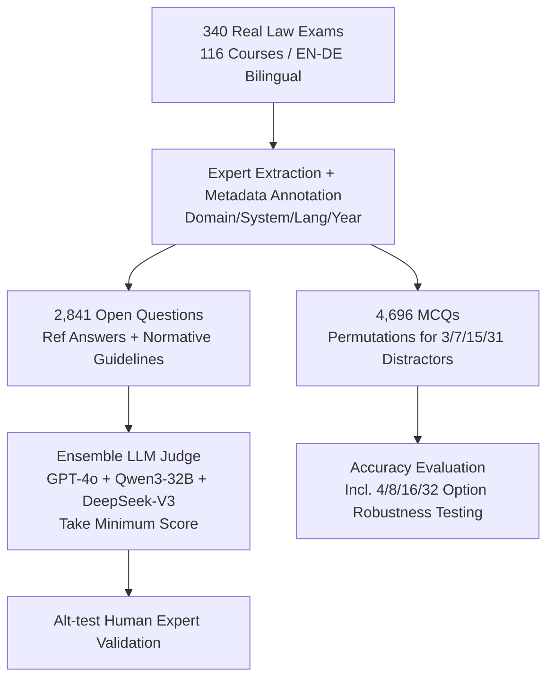

# LEXam: Benchmarking Legal Reasoning on 340 Law Exams

**Conference**: ICLR 2026  
**OpenReview**: [https://openreview.net/forum?id=xNhbMyXsJn](https://openreview.net/forum?id=xNhbMyXsJn)  
**Code**: [https://lexam-benchmark.github.io/](https://lexam-benchmark.github.io/)  
**Area**: LLM Reasoning / Legal NLP Benchmarks  
**Keywords**: Legal reasoning, Benchmarking, Long-form QA, Multilingual, LLM-as-a-Judge, Process-based evaluation  

## TL;DR
LEXam organizes 340 real law school exams from the University of Zurich into 7,537 English-German bilingual questions (open-ended + multiple-choice). It evaluates not just the final answer but also the multi-step legal reasoning process using an expert-calibrated ensemble LLM judge, revealing that current SOTA models still fail significantly in structured legal reasoning.

## Background & Motivation
**Background**: Test-time scaling has enabled reasoning models like o3 and DeepSeek-R1 to perform remarkably well in STEM tasks (e.g., math Olympiads, physics), which are dominated by deductive reasoning and deterministic rules where numerical answers or formal verifiers can determine correctness.

**Limitations of Prior Work**: Legal reasoning is a different class of problem—it requires rigorous deductive/inductive logic applied to vaguely defined real-world scenarios, making it "informal reasoning." Most existing legal benchmarks (LegalBench, LawBench, etc.) follow the STEM paradigm of **only checking final outputs**, treating the intermediate reasoning as a black box. Consequently, when a model errs, the specific step of failure remains unknown. In high-stakes legal domains, this "knowing the error but not the cause" poses substantial risks.

**Key Challenge**: The "correctness" of legal answers often has **low lexical overlap**—the same conclusion can be phrased in entirely different ways, while similar phrasing does not guarantee legal validity (e.g., citing the wrong article despite semantic proximity). This renders shallow metrics like BLEU/ROUGE/BERTScore ineffective. Furthermore, no formal verifiers exist, and process-based evaluation lacks reliable, scalable tools.

**Goal**: To create a legal reasoning benchmark that **simultaneously examines the correctness of both process and results**, covering multiple languages and legal systems, supported by a reproducible evaluation pipeline strictly validated by human experts.

**Core Idea**: ① **Use real law school exams as sources**—these naturally include professor-written reference answers and normative reasoning guidelines (issue spotting → rule recall → rule application), providing a basis for process-based scoring. ② **Replace shallow metrics with an ensemble LLM-as-a-Judge** and use statistical testing (Alt-test) to prove that this judge can stably approximate or even exceed human experts.

## Method

### Overall Architecture
The construction of LEXam follows a pipeline of "Raw Exams → Structured Database → Dual-Track Evaluation": First, legally trained annotators extract questions and domain metadata from 340 public exams (2016–2023, 116 courses) from the University of Zurich. Open-ended questions (2,841) undergo dual evaluation of "Process + Result" by ensemble LLM judges and human experts; multiple-choice questions (4,696) undergo clear accuracy evaluation with expanded distractors through permutations.

### Key Designs

**1. Real Exam Source + Normative Reasoning Guidelines: Making "Process" Evaluable**. Unlike most benchmarks that use manually crafted questions or snippets from precedents, LEXam uses real final exams from the University of Zurich Law School, covering 78 sub-domains under Private Law, Public Law, Criminal Law, and Interdisciplinary tracks. Each open-ended question includes a professor's reference answer **and** a normative guideline defining the reasoning chain (e.g., issue spotting → rule recall → rule application). This structured chain serves as the ruler for process-based scoring: judges check whether the model follows the doctrinal structure in the expert answer rather than comparing it to abstract legal theories, and penalize domain-specific errors like hallucinating articles.

**2. MCQ Permutation and Distractor Control**. True/False and Multiple-Choice Questions (MCQ) from the raw exams are parsed into a "stem + statements." Questions with 2–5 statements are randomly generated for each stem. Each question ensures exactly one correct combination, with distractors randomly drawn from all combinations where at least one statement is incorrect. These are configured into 4 / 8 / 16 / 32 options (1 correct + 3/7/15/31 wrong), unifying the number of options and fixing the baseline random guess rate (e.g., ~25% for 4 options). A perturbation subset of 385 questions keeps stems and statements identical but scales the number of options from 4 to 32 to **diagnose whether the model truly understands or relies on weak distractors**.

**3. Ensemble LLM-as-a-Judge + Alt-test Statistical Validation**. The core difficulty of open-ended scoring is judge reliability. The authors initially had two JD-trained authors draft specialized scoring prompts, iteratively calibrating penalty weights with GPT-4o. They then used the **Alternative Annotator Test (Alt-test)** to verify if candidate judges statistically exceed human annotators. Finding that only proprietary (GPT-4o, Gemini-2.5-Pro) or massive reasoning models (DeepSeek-R1) consistently outperformed humans, they proposed an **ensemble taking the minimum score**: $s = \min(s_{\text{GPT-4o}}, s_{\text{Qwen3}}, s_{\text{DSV3}})$. This minimizes self-bias from specific model families and allows open-source combinations to surpass the human-judge threshold. The average Pearson correlation for three legal experts on 50 questions reached $r = 0.70$, establishing a baseline for human agreement.

## Key Experimental Results

### Main Results: Open-ended (Ensemble Judge Score, Max 100)
Evaluation of 35 models, sorted by Judge Score (selection):

| Category | Model | Judge Score (±S.E.) |
|----------|-------|---------------------|
| Reasoning | GPT-5 | **70.20** (±0.41) |
| Reasoning | Gemini-2.5-Pro | 67.40 (±0.51) |
| Reasoning | Claude-3.7-Sonnet | 62.86 (±0.51) |
| Reasoning | DeepSeek-R1 | 55.91 (±0.51) |
| Reasoning | Qwen3-32B | 40.00 (±0.43) |
| LLM | GPT-4.1 | 57.50 (±0.51) |
| LLM | DeepSeek-V3 | 52.53 (±0.48) |
| LLM | Llama-3.3-70B-it | 41.27 (±0.41) |
| Small Model | GPT-4.1-mini | 54.58 (±0.43) |
| Small Model | Gemma-3-12B-it | 41.29 (±0.48) |
| Small Model | Llama-3.1-8B-it | 10.00 (±0.26) |

Even the strongest GPT-5 achieves only 70, indicating that structured multi-step legal reasoning remains unsolved. The smooth score distribution from 70 to 10 demonstrates high discriminative power. Notably, Gemma-3-12B-it (41.29) matches its 6×/33× larger counterparts, Llama-3.3-70B and Llama-3.1-405B, due to its multilingual expertise.

### MCQs (16 Options) and Perturbation Robustness
On MCQ-16, GPT-5.2 (52.53%) and Claude-4.6-Sonnet (52.42%) lead, while most models drop below 20%. The perturbation experiments show that accuracy systematically collapses as the number of options increases for the same stem:

| Model | 4 Options | 8 Options | 16 Options | 32 Options |
|-------|-----------|-----------|------------|------------|
| Gemini-2.5-Pro | 68.61 | 51.56 | 45.24 | 35.62 |
| Claude-3.7-Sonnet | 60.92 | 48.59 | 40.38 | 33.02 |
| DeepSeek-R1 | 57.54 | 44.11 | 36.94 | 24.93 |
| GPT-4o | 53.73 | 36.42 | 22.55 | 21.81 |
| DeepSeek-V3 | 58.57 | 36.07 | 28.92 | 16.03 |

The drop while stems remain constant suggests that 4-option MCQ scores contain significant "correct guessing" noise, and standard multiple-choice evaluations provide overly optimistic conclusions.

### Key Findings
- **Language Gap**: All models perform better in English than in German. The gap is largest for small models; as English/German questions are not parallel translations, language and legal differences are intertwined.
- **Legal System/Domain Differences**: Accuracy is higher for Common Law and International Law than for Swiss Law; Public Law and Interdisciplinary tracks outperform Criminal and Private Law.
- **Counter-intuitive Negation Collapse**: All models drop significantly when MCQs are phrased negatively ("Which statements are false?"). **Reasoning models drop most sharply**, while small models reach near-random levels.
- **Judge Reliability**: The ensemble judge taking the minimum score stably exceeds human annotators in Alt-tests, and the $r=0.70$ human agreement baseline confirms its robustness.

## Highlights & Insights
- **Using "Real Exams" is a masterstroke**: Professor-written reference answers and scoring guidelines naturally provide the gold standard for process-based evaluation, bypassing the difficulty of defining "good legal reasoning" from scratch.
- **Perturbation diagnosis addresses MCQ pain points**: Scaling option counts while fixing the stem cleanly separates "genuine understanding" from "lucky guessing," sounding an alarm for MCQ evaluations in the field.
- **Ensemble-min-score** is a practical engineering detail that solves both self-bias and accessibility. Validated by Alt-test, it is more rigorous than simply picking a "strong model" as a judge.
- The fact that negation causes reasoning models to fail harder suggests that current reasoning chains have systematic vulnerabilities when handling logical inversion.

## Limitations & Future Work
- **Single Legal System**: All questions come from one Swiss university. While including international law, it lacks Common Law (case law) questions.
- **Lack of Human Baseline**: Real student grades were unavailable due to institutional constraints, and MCQs are not in their original exam format. Human performance is only approximated in small-scale experiments.
- **Non-Parallel EN/DE**: Language and content differences are confounded, making it hard to decouple why models perform worse in German without high-quality legal translations.
- **Judges are still LLMs**: Despite Alt-test validation, the ensemble involves models evaluating models, and its ability to catch extreme long-tail doctrinal errors remains unproven.

## Related Work & Insights
LEXam follows LegalBench, LawBench, and LBOX by shifting focus from "result correctness" to "process compliance," mirroring the trend in math reasoning from final-answer accuracy to step-level rewards. It contributes to the LLM-as-a-Judge path by introducing Alt-test for statistical backing and "ensemble-min" to suppress bias—methods transferable to other open domains (medicine, policy) where final answers are hard to verify. For model developers, the negation and long-option collapses suggest that test-time scaling is currently more effective for "deterministic rule" tasks than for informal reasoning requiring rule application to fuzzy cases.

## Rating
- **Novelty**: ⭐⭐⭐⭐ Using real exam answers + normative guidelines for process-based evaluation, backed by Alt-test validated ensemble judges, is a novel and practical approach.
- **Experimental Thoroughness**: ⭐⭐⭐⭐⭐ 35 models, Open-ended + MCQ + Option Perturbation + Multi-domain metadata + Three-expert blind review + Alt-test ensure high rigor.
- **Writing Quality**: ⭐⭐⭐⭐ Clearly motivated, rich in visualization, and thoroughly explains the challenges and solutions of process-based evaluation.
- **Value**: ⭐⭐⭐⭐⭐ A high-quality, reproducible legal reasoning benchmark with a trusted judge is a scarce resource for the Legal NLP and process-eval communities.

<!-- RELATED:START -->

<!-- RELATED:END -->

## Related Papers

- [\[ICLR 2026\] VisioMath: Benchmarking Figure-based Mathematical Reasoning in LMMs](visiomath_benchmarking_figure-based_mathematical_reasoning_in_lmms.md)
- [\[ICLR 2026\] GeoGramBench: Benchmarking the Geometric Program Reasoning in Modern LLMs](geogrambench_benchmarking_the_geometric_program_reasoning_in_modern_llms.md)
- [\[ACL 2026\] Accurate Legal Reasoning at Scale: Neuro-Symbolic Offloading and Structural Auditability for Robust Legal Adjudication](../../ACL2026/llm_reasoning/accurate_legal_reasoning_at_scale_neuro-symbolic_offloading_and_structural_audit.md)
- [\[ICLR 2026\] FaithCoT-Bench: Benchmarking Instance-Level Faithfulness of Chain-of-Thought Reasoning](faithcot-bench_benchmarking_instance-level_faithfulness_of_chain-of-thought_reas.md)
- [\[ICLR 2026\] USTBench: Benchmarking and Dissecting Spatiotemporal Reasoning Capabilities of LLMs as Urban Agents](ustbench_benchmarking_and_dissecting_spatiotemporal_reasoning_capabilities_of_ll.md)

<!-- RELATED:END -->
