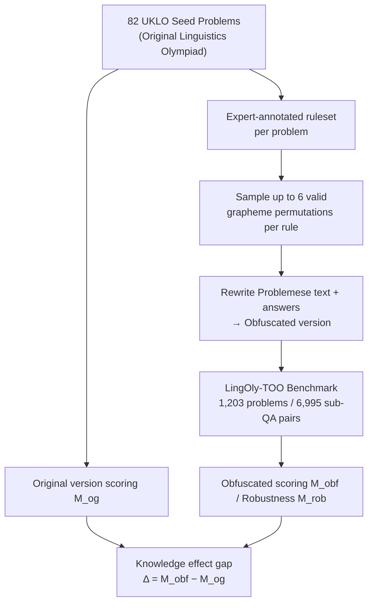

# LingOly-TOO: Disentangling Reasoning from Knowledge with Templatised Orthographic Obfuscation

**Conference**: ICLR 2026  
**arXiv**: [2503.02972](https://arxiv.org/abs/2503.02972)  
**Code**: [GitHub](https://github.com/jkhouja/LingOly-TOO)  
**Area**: LLM Reasoning / Evaluation Benchmarks  
**Keywords**: reasoning benchmark, orthographic obfuscation, linguistics olympiad, knowledge contamination, LLM evaluation

## TL;DR

The LingOly-TOO benchmark is proposed to disentangle reasoning from knowledge by applying expert-designed grapheme-level permutations to Linguistics Olympiad problems. This obfuscation preserves reasoning logic while eliminating knowledge/memory shortcuts, reducing the top score of 15 frontier models from 0.59 to 0.48 and systematically quantifying the extent to which LLM reasoning capabilities are overestimated due to knowledge effects.

## Background & Motivation

**Background**: Performance scores of LLMs on various reasoning benchmarks are rising rapidly. however, increasing evidence suggests that score inflation stems from training set contamination and knowledge memory shortcuts rather than genuine improvements in reasoning. Benchmarks such as MATH and GSM8K are approaching saturation.

**Limitations of Prior Work**:

1. The expansion of training data scales blurs the boundary between training and testing sets, exacerbating evaluation bias.

2. Existing countermeasures (synthetic data, symbolic template replacement) are small in scale and lack sufficient modification depth—obfuscated samples may still remain similar to training data.

3. Even linguistics problems in low-resource languages are covered in pre-training data, allowing models to bypass reasoning through partial contamination.

**Key Challenge**: How can the possibility of models utilizing knowledge and memory be completely eliminated while keeping the underlying problem-solving reasoning logic intact?

**Key Insight**: Apply grapheme-level orthographic obfuscation to the "Problemese" (problem language) of Linguistics Olympiad tasks. This ensures that the obfuscated character sequences do not exist in any training corpus while the original reasoning steps required for the problem are fully preserved.

## Method

### Overall Architecture

LingOly-TOO does not train any models; instead, it provides a **contamination-resistant benchmark construction and evaluation pipeline**. The starting point consists of 82 seed problems from the UKLO (UK Linguistics Olympiad), which can be solved by high school students using only the provided context without specialized knowledge. Linguistics experts manually annotated a **ruleset** for each problem, from which up to 6 distinct grapheme-level permutations were sampled to rewrite the problem text. This expanded the 82 seeds into 1,203 problems containing 6,995 sub-question-answer pairs. Evaluation involves scoring both the **original version** and the **obfuscated version**, using the performance gap to quantify how much of the model's score relies on memory/knowledge shortcuts rather than true reasoning.

### Key Designs

**1. Reasoning-equivariant Permutation: Changing Sequences without Altering Logic**

While seed problems involve low-resource languages, these languages are increasingly present in pre-training corpora, allowing models to succeed through memory. The challenge is that any modification must not break the linguistic mechanisms required for solving the problem. This work sets the minimum unit of permutation at the grapheme level (including combinations like `th` or `sh`) rather than full words. Linguistics Olympiad problems involve sub-word level symbolic reasoning; common synonym replacement or paraphrasing would destroy morphological/phonemic units. Grapheme-level permutation fundamentally alters character sequences while maintaining the reasoning structure. Each ruleset is customized by experts based on linguistic features—for example, in Turkish vowel harmony problems, vowel pairs like (e,i)/(o,u)/(ö,ü)/(a,ı) must be permuted as sets to maintain suffix patterns. Rules intentionally preserve useful clues like loanwords or cognates while removing metadata like language names or geographic locations that trigger knowledge retrieval. The resulting sequences are statistically impossible to find in training data.

**2. Multi-version Metric System: Quantifying "Knowledge Effects"**

Using multiple versions per problem allows analysis of reasoning stability beyond binary correctness. The obfuscated score is averaged across all versions of all problems:

$$M_{obf} = \frac{1}{82}\sum_{i=1}^{82}\frac{1}{n_i}\sum_{j=1}^{n_i}M_{obf}^{i,j}$$

This is compared against the original score $M_{og}$. Two additional metrics are introduced: the robustness score $M_{rob}$, which takes the **worst** performance across all permutations of each problem to characterize worst-case reasoning (e.g., GPT-5 drops from $M_{obf}=0.48$ to $M_{rob}=0.29$), and the knowledge effect $\Delta_{obf}^{i} = M_{obf}^i - M_{og}^i$, which measures the score drop per problem. A randomized controlled trial with 172 humans showed only a 5.7% drop on obfuscated versions, significantly lower than the 11%+ drop observed in models.

### Evaluation Protocol

The evaluation method ensures fairness by providing the background, context, and all sub-questions within the prompt, requiring JSON output for answers. Scoring uses strict Exact Match (EM) rather than partial credit to prevent cases where models gain points by merely repeating words from the context. Tests were conducted across 15 models including GPT-5, Claude 3.7, o3-mini, Gemini, and Llama.

## Key Experimental Results

### Main Results

Performance of 15 models on LingOly-TOO:

| Model | $M_{og}$ (Original) | $M_{obf}$ (Obfuscated) | $M_{rob}$ (Robustness) | Decrease |
|------|-----------------|-------------------|------------------|---------|
| GPT-5 | ~0.59 | **0.48** | 0.29 | -0.11 |
| Claude 3.7 (thinking) | ~0.55 | 0.44 | - | -0.11 |
| Claude 3.7 (no thinking) | ~0.40 | 0.30 | - | -0.10 |
| o3-mini (high) | ~0.45 | 0.31 | - | -0.14 |
| o3-mini (low) | ~0.25 | 0.13 | - | -0.12 |

GPT-5 performance by difficulty ($M_{obf}$): Breakthrough = 0.81, Round 2 = 0.31.

### Ablation Study

| Analysis Dimension | Result |
|---------|------|
| Zero-context setting | $M_{obf}$ drops to 0.02-0.03; obfuscation blocks knowledge shortcuts. |
| Tokenization effect | Modifying tokenization strategies does not improve performance. |
| Language resource effect | Japanese/Finnish/Italian show largest $\Delta_{obf}$ (-0.57 to -0.59). |
| Expert-guided reasoning | Providing intermediate steps increases $M_{obf}$ from 0.66 to 0.76. |
| Unseen new problems | Performance drop persists on unreleased UKLO 2025 problems. |

### Key Findings

- Reasoning-focused models consistently outperform general versions (o3-mini high vs low difference of 18%), validating the impact of reasoning training.
- Knowledge effects are highly negatively correlated with language resource volume ($\beta < 0, p < 0.01$; high-resource languages exhibit the most inflation).
- The benchmark is far from saturated: GPT-5 achieves only 0.31 on Round 2 problems, with $M_{rob}$ at 0.29.
- Reasoning trajectories often exhibit repeated analysis and self-contradictory conclusions, indicating poor reasoning consistency.

## Highlights & Insights

- Methodological elegance: Grapheme-level permutation preserves linguistic reasoning logic while generating sequences absent from training data.
- The knowledge effect metric $\Delta_{obf}$ provides an actionable solution for isolating reasoning from knowledge.
- Human RCTs confirm that the performance gap in models (11%+) vs. humans (5.7%) is due to knowledge dependence rather than cognitive penalty.
- $M_{rob}$ reveals reasoning fragility: GPT-5 performance collapses from 0.48 to 0.29 in worst-case permutations.

## Limitations & Future Work

- Strict Exact Match may underestimate partially correct reasoning, though partial credit risks inflating the baseline.
- Primarily covers inductive/deductive reasoning in natural language, excluding vision or mathematics.
- The scale of 82 seed problems is relatively limited, and rule design requires manual expert effort, limiting automation.
- The exploration of wider linguistic phenomena or more diverse competition sources is yet to be conducted.

## Related Work & Insights

- **vs LingOly**: LingOly-TOO adds orthographic obfuscation to control for knowledge variables.
- **vs GSM-Symbolic**: Numerical replacement offers minor perturbation; LingOly-TOO's grapheme permutation generates entirely novel strings.
- **vs ARC/BIG-Bench Hard**: Lacks mechanisms to explicitly control for knowledge effects.
- **Insight**: The methodology can be extended to other domains requiring symbolic reasoning, such as music theory or cryptography.

## Rating

- Novelty: ⭐⭐⭐⭐ Sophisticated design for decoupling knowledge and reasoning via orthographic obfuscation.
- Experimental Thoroughness: ⭐⭐⭐⭐ 15 models, multi-dimensional ablation, human RCTs, and validation on unreleased problems.
- Writing Quality: ⭐⭐⭐⭐ Rigorous structure and comprehensive analysis.
- Value: ⭐⭐⭐⭐⭐ Provides a milestone methodology for contamination-resistant LLM reasoning evaluation.

<!-- RELATED:START -->

## Related Papers

- [\[ICLR 2026\] VoG: Enhancing LLM Reasoning through Stepwise Verification on Knowledge Graphs](vog_enhancing_llm_reasoning_through_stepwise_verification_on_knowledge_graphs.md)
- [\[ICLR 2026\] Enhancing LLMs for Knowledge Base Question Answering by Chain-of-Decomposition](enhancing_llms_for_knowledge_base_question_answering_by_chain-of-decomposition.md)
- [\[ICLR 2026\] Explain in Your Own Words: Improving Reasoning via Token-Selective Dual Knowledge Distillation](explain_in_your_own_words_improving_reasoning_via_token-selective_dual_knowledge.md)
- [\[ICLR 2026\] Plan-Answer-Refine-on-Graph: Structured Planning and Self-Refinement for Large Language Model Reasoning on Knowledge Graphs](plan-answer-refine-on-graph_structured_planning_and_self-refinement_for_large_la.md)
- [\[ICLR 2026\] Diagnosing and Remedying Knowledge Deficiencies in LLMs via Label-free Curricular Meaningful Learning](diagnosing_and_remedying_knowledge_deficiencies_in_llms_via_label-free_curricula.md)

<!-- RELATED:END -->
