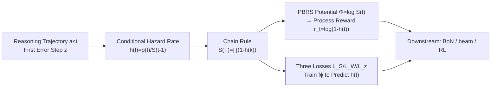

# Linking Process to Outcome: Conditional Reward Modeling for LLM Reasoning

**Conference**: ICLR 2026  
**OpenReview**: [https://openreview.net/forum?id=4DJoBOQNd0](https://openreview.net/forum?id=4DJoBOQNd0)  
**Code**: [https://foundation-model-research.github.io/CRM](https://foundation-model-research.github.io/CRM)  
**Area**: LLM Reasoning / Process Reward Models (PRM)  
**Keywords**: Process Reward Model, Conditional Probability, Credit Assignment, Reward Hacking, Reinforcement Learning  

## TL;DR
CRM models multi-step reasoning as a sequential process of "gradually approaching the correct answer." By leveraging the conditional probability chain rule, it explicitly anchors the process reward of each step to the final outcome. This addresses the issues of missing step-wise dependencies and fuzzy credit assignment, making it more stable and resistant to reward hacking across Best-of-N, beam search, and RL downstream tasks.

## Background & Motivation
**Background**: Reward models are the primary alternative to bypass the dependence on "ground-truth-dependent, hard-to-scale" verifiable rewards. They are categorized into ORMs, which score only at the endpoint, and PRMs, which score every step. PRMs provide fine-grained signals and are considered superior for guiding reasoning.

**Limitations of Prior Work**: The authors categorize the defects of existing PRMs into two types: (i) **Isolated Modeling**: Mainstream PRMs (Math-Shepherd, Lightman, etc.) treat each step as an independent classification problem, ignoring the inherent causal dependencies in the reasoning chain. (ii) **Weak Outcome Awareness**: Existing improvements have shortcomings—PQM only performs relative ranking of adjacent steps and lacks explicit modeling of the final result; IPRM parameterizes the outcome reward as the log-sum of process rewards but fails to clarify how a specific step relates to the endpoint or characterize step dependencies.

**Key Challenge**: Reward signals often fail to respect the temporal causality of sequential reasoning and face ambiguous credit assignment. This leads to **reward hacking**, where rewards soar while actual task accuracy drops (e.g., PRM/PQM being deceived by repetitive outputs in the paper's experiments).

**Goal**: Construct a reward system that incorporates step dependencies and explicit alignment between process and outcome, ensuring each step accurately reflects its contribution to the final success while remaining comparable across samples.

**Key Insight**: Rather than directly quantifying hard-to-measure concepts like "distance to the answer," it is better to model the complementary event: at which step the reasoning **first enters an error state**. The reward for each step is defined as the conditional probability of being correct given all preceding steps were correct, linked to the "full trajectory success probability" via the chain rule.

## Method

### Overall Architecture
CRM treats multi-step reasoning as a finite-horizon MDP with state $s_t=(x, a_{\le t-1})$ and action $a_t$ as the $t$-th reasoning step. The core introduces a random variable $z$ representing the index of the first step entering an "error state": if the trajectory is error-free, $z>T$ (success, $l=1$); otherwise, $z\le T$ (failure, $l=0$). The method involves three components: defining a "hazard rate" $h(t)$ via conditional probability, using the chain rule to derive the "full success probability" $S(T)$, and deriving dense process rewards $r_t$ using Potential-Based Reward Shaping (PBRS) from $S(t)$, with three losses designed to train the model to predict $h(t)$.

### Key Designs

**1. Conditional Hazard Rate $h(t)$: Characterizing Step Dependency via the "First Error Step".** The causality of reasoning implies that whether step $t$ is valid depends logically on steps $1$ to $t-1$. The authors define $W(t)=\Pr(z\le t)$ as the cumulative probability of an error occurring by step $t$, $S(t)=\Pr(z>t)=1-W(t)$ as the probability of remaining correct up to step $t$, and the hazard rate for each step:
$$h(t)=\Pr(z=t\mid z\ge t)=\frac{p(t)}{S(t-1)}$$
representing the conditional probability that the $t$-th step is the first error, given the previous $t-1$ steps were correct. Consequently, $1-h(t)$ is the probability that the step is correct given previous success. This hazard form (inspired by survival analysis) naturally conditions the current step on its predecessors, addressing the isolation defect of mainstream PRMs.

**2. Chain Rule Linking Process to Outcome: $S(T)$ as Full Trajectory Success Probability.** A critical step is using the probability chain rule to concatenate isolated $h(t)$ values into global quantities:
$$S(t)=\prod_{k=1}^{t}\big(1-h(k)\big),\qquad p(t)=h(t)\prod_{k=1}^{t-1}\big(1-h(k)\big)$$
Thus, the "final success probability" of the trajectory is $S(T)=\prod_{t=1}^{T}(1-h(t))$. This product structure **explicitly binds** intermediate steps to the final outcome: changes in any $h(t)$ propagate to $S(T)$ according to probability rules. This transforms "contribution to the endpoint" from an ambiguous concept into a traceable one, resolving credit assignment ambiguity. Furthermore, because $S(t)$ shares the same probabilistic semantics across all samples, the rewards are naturally comparable.

**3. Dense Process Reward $r_t$ via Potential-Based Reward Shaping.** With $S(T)$ aligned to the outcome, a dense reward is required. The authors set the potential function for PBRS as $\Phi(s_t)\equiv\log S(t)=\sum_{k=1}^{t}\log(1-h(k))$ (the log-likelihood of final success from the current state, encoding progress toward the goal). Substituting into the shaping formula (with original sparse reward $R=0$, $\gamma=1$):
$$r_t = R'(s_{t-1},a_{t-1},s_t)=\gamma\Phi(s_t)-\Phi(s_{t-1})=\log\big(1-h(t)\big)$$
satisfying $S(T)=\prod_{t}e^{r_t}$. The policy invariance of PBRS ensures the optimal policy trained with this shaped reward is consistent with the original task, making $r_t$ a theoretically grounded credit assignment scheme.

**4. Joint Training of $f_\phi$ with Three Losses to Predict $h(t)$.** Since $S(T)$ and $r_t$ are functions of $h(t)$, the model only needs to predict $h(t)=f_\phi(x,a_{\le t})$ (by adding a value head to the LLM). Losses are split by label: for successful samples ($l=1$), maximize $S(T)$ via $L_S=-\log S(T)$; for failure samples ($l=0$), minimize $S(T)$ via $L_W=-\log(1-S(T))$, and additionally encourage the model to identify the actual first error step $z_i$ via $L_z=-\log p(z_i)$. Total loss:
$$L=\frac{1}{|D|}\sum_i\Big[l_i\,L_S + (1-l_i)\big(L_W+L_z\big)\Big]$$
This consistent probabilistic modeling ensures that the same $S(t)$ value maintains the same meaning across different samples, which is the source of cross-sample comparability.

## Key Experimental Results
The training set is Math-Shepherd (containing step-level annotations for GSM8K+MATH). Baselines are re-implemented under the same pipeline, backbone, and data: ORM, vanilla PRM, PQM, and IPRM.

### Main Results

**Best-of-N (trajectory-level, scored by $S(T)$)**

| Model | Method | GSM-Plus@128 | MATH500@32 | MATH500@128 |
|------|------|------|------|------|
| Qwen2.5-3B-Instruct | PQM | 68.0 | 54.8 | 55.8 |
| Qwen2.5-3B-Instruct | **CRM** | **68.7** | **56.6** | **56.6** |
| LLaMA3.1-8B | PRM | 68.9 | 49.8 | 47.6 |
| LLaMA3.1-8B | **CRM** | 68.5 | **50.6** | **50.6** |

**Beam Search (step-level reward $S(t)$, including OOD data Gaokao2023)**

| Model | Method | MATH500 N=100 | GAOKAO2023 N=100 |
|------|------|------|------|
| Qwen2.5-Math-1.5B | PQM | 58.80 | 39.83 |
| Qwen2.5-Math-1.5B | **CRM** | **63.00** | **43.55** |
| Qwen2.5-Math-7B | PQM | 61.13 | 43.29 |
| Qwen2.5-Math-7B | **CRM** | **64.07** | **48.40** |

**RL Optimization (Pass@1, initialized with Qwen2.5-Math-7B, token-level RLOO)**

| Setup | Method | MATH500 | AIME24 | Olympiad |
|------|------|------|------|------|
| VR Disabled | PURE | 76.0 | 26.6 | 36.7 |
| VR Disabled | **CRM** | **77.8** | **43.3** | **39.3** |
| VR Enabled | PURE | 82.4 | 23.3 | 41.3 |
| VR Enabled | **CRM+VR** | 80.4 | 33.3 | **42.1** |

In the absence of VR, CRM outperforms PURE by +16.7 on AIME24 and approaches or exceeds VR methods without ground-truth. Combining with VR results in further gains, indicating process rewards and verifiable rewards are complementary.

### Ablation Study

**Ablation on $L_z$ Data Ratio (MATH500 BoN, Qwen2.5-3B)**

| $L_z$ Data Ratio | @8 | @32 | @128 |
|------|------|------|------|
| 0% | 47.0 | 41.6 | 38.2 |
| 10% | 52.4 | 50.6 | 47.6 |
| 50% | 54.4 | 57.2 | 55.0 |
| 100% | 53.0 | 56.6 | 56.6 |

A significant jump occurs from 0% to 10%, with 50% being near-optimal, suggesting that $L_z$ (identifying the first error) is critical yet highly data-efficient.

### Key Findings
- **Resistance to Reward Hacking (RQ1)**: During PRM/PQM training, rewards soar while accuracy drops, and repeat scores approach saturation (exploiting verbosity). CRM remains stable due to the tight coupling between rewards and outcomes.
- **Self-Reflection (RQ2)**: In RL training, CRM's self-reflection score rises synchronously with MATH500 accuracy, while PRM/PQM show almost no growth and crash early.
- **Cross-Sample Comparability**: Measured by AUPRC for global ranking across different problems, CRM outperforms PRM and PQM on GSM-Plus/MATH500.
- **Cross-Domain Generalization (RQ4)**: Evaluated on MMLU-Pro-CoT across biology, business, health, history, and physics, CRM leads in almost all domains, proving it is not limited to mathematics.

## Highlights & Insights
- **Introducing Survival Hazard + PBRS to PRM**: By using the conditional probability of the "first error step $z$" and the chain rule, the authors provide a clean probabilistic closed-form solution $r_t = \log(1-h(t))$ for aligning process rewards with outcomes, avoiding heuristic splicing.
- **Unified $S(T) = \prod e^{r_t}$**: This single formulation simultaneously solves step dependency, credit assignment, and cross-sample comparability. Three downstream tasks (BoN using $S(T)$, beam using $S(t)$, and RL using $r_t$) reuse the same quantities, ensuring architectural consistency.
- **Addressing Reward Hacking**: The ability to achieve stable improvements without relying on verifiable rewards is highly attractive for low-cost, large-scale RL.

## Limitations & Future Work
- Training still depends on step-level annotated data (e.g., labels from Math-Shepherd / VersaPRM), and $L_z$ specifically requires "first error step" labels, which represent an implicit cost.
- The assumption that "error states are irreversible" is strong ($z$ immediately defines trajectory failure). Real-world reasoning could involve self-correction, which may conflict with the self-reflection behaviors the model is encouraged to perform.
- Validation is primarily on mathematics and MMLU-Pro; applicability to open-ended reasoning without clear binary labels (e.g., long-form writing, agent decision-making) remains to be tested.
- Backbones are limited to 7-8B. Numerical stability of the product form $S(T)$ (approaching zero in extremely long chains) warrants attention for larger models and longer reasoning chains.

## Related Work & Insights
- **PRM Taxonomy**: Evolution from step-level classification (Lightman, Math-Shepherd) to Q-value ranking (PQM) to parameterized outcomes (IPRM). CRM represents a theoretical convergence toward "explicit probability chains + outcome alignment."
- **Reward Shaping**: Importing the policy invariance of classic PBRS (Ng et al. 1999) into LLM reasoning provides guarantees on why process rewards do not alter the optimal policy—a noteworthy paradigm shift.
- **Anti-Reward Hacking RL**: In contrast to PURE (min-form credit assignment) and Prime (online reward model updates), CRM's selling point is resisting hacking without a verifier, offering insights for ground-truth-free dense-reward RL.

## Rating
- **Novelty**: ⭐⭐⭐⭐ — Uses a survival-analysis-style "first error conditional probability + chain rule + PBRS" to give PRM a clean, self-consistent probabilistic framework.
- **Experimental Thoroughness**: ⭐⭐⭐⭐ — Covers BoN/beam/RL downstream tasks across multiple backbones and OOD/cross-domain scenarios, with specific analyses on reward hacking and data efficiency.
- **Writing Quality**: ⭐⭐⭐⭐ — Clear logic from motivation to formula derivation to loss and experiments. Figure 1 paradigm comparison is effective.
- **Value**: ⭐⭐⭐⭐ — Achieving resistance to hacking and stable gains without verifiable rewards has both practical and methodological value for scaling reasoning RL.

<!-- RELATED:START -->

## Related Papers

- [\[ICLR 2026\] Smarter Not Harder: Generative Process Evaluation with Intrinsic-Signal Driving and Ability-Adaptive Reward Shaping](smarter_not_harder_generative_process_evaluation_with_intrinsic-signal_driving_a.md)
- [\[ICLR 2026\] Fixing the Broken Compass: Diagnosing and Improving Inference-Time Reward Modeling](fixing_the_broken_compass_diagnosing_and_improving_inference-time_reward_modelin.md)
- [\[ACL 2026\] Efficient Process Reward Modeling via Contrastive Mutual Information](../../ACL2026/llm_reasoning/efficient_process_reward_modeling_via_contrastive_mutual_information.md)
- [\[ICLR 2026\] OR-PRM: A Process Reward Model for Algorithmic Problem in Operations Research](or-prm_a_process_reward_model_for_algorithmic_problem_in_operations_research.md)
- [\[ACL 2025\] Dynamic and Generalizable Process Reward Modeling (DG-PRM)](../../ACL2025/llm_reasoning/dgprm_dynamic_process_reward.md)

<!-- RELATED:END -->
