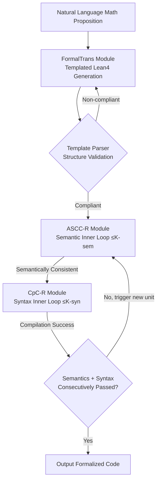

# LoC-Decomp: LLM Autoformalization via Logical Concept Decomposition and Iterative Feedback Correction

**Conference**: ICLR 2026  
**OpenReview**: [https://openreview.net/forum?id=0KFQ4F9YEH](https://openreview.net/forum?id=0KFQ4F9YEH)  
**Code**: [https://github.com/jzshischolar/auto-Formalization](https://github.com/jzshischolar/auto-Formalization)  
**Area**: LLM Reasoning / Autoformalization / Neuro-symbolic Systems  
**Keywords**: Autoformalization, Lean 4, Semantic Consistency Check, Logical Concept Decomposition, Iterative Feedback Correction  

## TL;DR
LoC-Decomp utilizes a CoT-like "Logical Concept Decomposition" template to decompose natural language mathematical propositions into modular Lean 4 components. It then employs a "divide-and-conquer back-translation" approach for fine-grained semantic consistency self-checking. By integrating semantic errors and compiler syntax errors into an alternating iterative rectification loop, it elevates the formalization success rate on PutnamBench from the previous SOTA of 75% to 93.09%.

## Background & Motivation
**Background**: Autoformalization involves translating natural language mathematical propositions into machine-verifiable formal code, such as Lean 4, Coq, or Isabelle. This is a critical step toward "verifiable" LLM mathematical reasoning. Recent LLM-based approaches—whether using general-purpose models with prompt-based candidate scoring or SFT on domain-specific data—have performed well on simple propositions.

**Limitations of Prior Work**: A valid formalization must satisfy two criteria simultaneously: syntactic correctness (passing the compiler) and semantic consistency (faithfully preserving the original meaning). While syntactic correctness is easily checked via compiler errors, there is no reliable automated means for checking semantic consistency. For complex scenarios involving probability, combinatorics, or geometry, LLMs often fail to detect subtle semantic deviations between the formal code and the original problem. Furthermore, existing methods lack the ability to convert detected inconsistencies into executable rectification signals—providing only numerical scores without suggestions or requiring human intervention for semantic feedback.

**Key Challenge**: The difficulty of autoformalization lies not in "translation" itself, but in "how to automatically detect subtle semantic inconsistencies and effectively feed that detection back to guide rectification." Simply asking an LLM to back-translate an entire block for comparison is unreliable for complex propositions, as a single pass often misses nested logical details.

**Goal**: To build a fully automated closed loop that combines semantic inconsistency feedback with compiler syntax errors to simultaneously achieve semantic consistency and syntactic correctness, removing the need for human involvement.

**Key Insight**: **"Decomposition is Checking."** Decomposition should be applied at both the generation and checking stages. A modular template forces the LLM to decompose formal code into semantically self-contained components (e.g., mathematical objects, constraints, propositions). This allows back-translation and comparison to precisely pinpoint deviations at the component level. These deviations then serve as targeted feedback to drive iterative rectification, forming a closed loop with compiler errors.

## Method

### Overall Architecture
LoC-Decomp consists of three modules forming an iterative pipeline: (1) **FormalTrans** (Templated Formal Translation) generates structured Lean 4 code according to a predefined template; (2) **ASCC-R** (Automated Semantic Consistency Checking and Rectification) detects semantic deviations via "divide-and-conquer back-translation" and provides rectification suggestions; (3) **CpC-R** (Compilation Checking and Rectification) handles syntax errors. ASCC-R and CpC-R run alternately: first, a semantic inner loop runs until consistency is reached (or up to $K_{sem}$ times), followed by a syntax inner loop until compilation passes (or up to $K_{syn}$ times). Together, they form a Sem–Syn iteration unit; multiple units form an outer loop (up to $N$ times), and a final verification constitutes a ROUND, with the entire process repeating for up to $M$ rounds.

### Key Designs

**1. Logical Concept Decomposition Template (LoC-Decomp Template): Modularizing Formalization.** Unlike previous methods that write the problem as a single Lean 4 theorem, this work provides the LLM with a structured template using placeholders. This forces the decomposition of the formal proposition into several semantically self-contained declaration segments: inductive types, mathematical structures, individual constraints (`def fst_constraint`, `def continuous_constraint`, etc.), and auxiliary functions. Finally, these "blocks" are assembled into the top-level proposition `def problem`. This mimics step-by-step reasoning in Chain-of-Thought, encouraging modular construction rather than single-shot generation, which improves accuracy. The formalization logic draws inspiration from Discourse Representation Theory. Since template constraints exceed standard Lean 4 syntax, a lightweight parser acts as a template validator. One theoretical concern is whether the template limits Lean 4's expressiveness. The authors provide Theorem 3.1, proving that **for any complete Lean 4 proposition string, there exists at least one semantically equivalent LoC-Decomp counterpart**, ensuring no loss in expressiveness.

**2. Divide-and-Conquer Back-Translation for Semantic Consistency (ASCC): Pinpointing Fine-grained Deviations.** Back-translating complex Lean 4 code in its entirety is unreliable. ASCC employs a three-step divide-and-conquer-merge strategy: first, the parser splits Lean 4 code into semantically self-contained segments (each capable of independent compilation); second, the LLM back-translates each segment into natural language; third, the segments are merged into a coherent description based on logical relationships. Consistency is then judged via a four-stage strategy: dual deviation detection (local vs. global), followed by classifying deviations as "critical" or "acceptable." An overall consistency level is assigned: Fully consistent, Consistent without loss of generality, or Inconsistent. If inconsistent, every deviation is reviewed; if confirmed, the LLM is required to provide targeted rectification suggestions for each. This step transforms "what is inconsistent" into "how to fix it."

**3. Joint Syn-Sem Rectification: Alternating Closed-Loop Errors.** Semantic errors arise from ASCC and syntax errors from the compiler. Both are handled by appending error information into the context for rewriting. For semantically inconsistent code, the semantic inner loop (rectify-then-verify, max $K_{sem}$) runs until consistent, followed by the syntax inner loop (compile-then-fix, max $K_{syn}$) until success. This Sem–Syn Iter Unit prevents the "seesaw" effect where fixing semantics breaks syntax. Knowledge accumulates through iterations, eliminating the overhead of "sampling N candidates and picking one." Parameters are set to $K_{sem}=2, K_{syn}=3, N=5, M=3$.

## Key Experimental Results

### Main Results: Comparison with Existing Formalizers (LLM-as-judge, pass rate %)

| Dataset | Ours | DeepSeek-Prover-V2-671B | Goedel-Formalizer-V2-32B | Kimina-Autoformalizer-7B |
|---|---|---|---|---|
| MATH-500 | **96.60** | 84.60 | 90.20 | 63.40 |
| miniF2F | **97.54** | 87.18 | 93.28 | 87.23 |
| PutnamBench | **93.09** | 75.41 | 78.66 | 61.99 |
| ProofNet | 73.57 | **83.10** | 71.39 | 61.31 |

On PutnamBench, the 93.09% pass rate represents a Gain of approximately 18 percentage points over the previous SOTA SFT model. The only lag occurs in ProofNet, where DeepSeek-Prover remains superior.

### Ablation Study: Contributions of Template and Iteration (DeepSeek-V3, ASCC-3-MV %)

| Configuration | MATH-500 | miniF2F |
|---|---|---|
| Template only + few-shot (pass@1, no iter) | 63.20 | 77.25 |
| + Sem Check + Compilation + Iterative Rectification (round-3) | 84.00 | 90.16 |

Human Evaluation (MATH-Level5-50, pass rate %):

| Ours-no-iter | Ours-iter | Baseline | Baseline-iter | SFT-Baseline |
|---|---|---|---|---|
| 70.00 | **84.00** | 52.00 | 54.00 | 66.00 |

The template + few-shot alone outperforms the baseline by 18%. After three rounds of iteration, performance reaches 84%, exceeding the baseline by 30% and outperforming SFT models fine-tuned via expert iteration.

### ASCC Detector Quality (MATH-ASCC-Eval-150, Alignment with Human Judgement)

| Metric | ASCC-3-MV | ASCC-3-SV | SC-Baseline | SC-Baseline-BackTrans |
|---|---|---|---|---|
| Precision | 0.90 | 0.95 | 0.68 | 0.70 |
| Recall | 0.82 | 0.56 | 0.99 | 0.98 |
| F1 | **0.86** | 0.70 | 0.81 | 0.82 |

### Key Findings
- The template itself (without iteration) provides the primary gain: pass@1 on miniF2F reaches 77.25%, indicating that CoT-like decomposition significantly improves structured generation.
- Iterative rectification offers the highest benefit on difficult problems: PutnamBench rose from 48.37% (no iteration) to 81.50% (round-3, DeepSeek-V3).
- ASCC-3-MV (three-round majority vote) achieves the best balance between precision and recall (F1=0.86), with a precision 0.22 higher than the naive SC-Baseline.
- Mechanism robustness: Performance holds across DeepSeek-V3, KIMI-K2, and Qwen3-235B.

## Highlights & Insights
- **Decomposition Reused for Checking**: Previous decomposition methods only addressed generation. This work uses the same decomposition structure to serve semantic consistency checks—component-level back-translation allows for precise deviation localization, aligning generation and verification structures.
- **Actionable Feedback vs. Numerical Scores**: Unlike training-based evaluations that only output a score, ASCC outputs "which deviation + critical/acceptable + how to fix," enabling a closed loop for rectification.
- **Eliminating Multi-candidate Sampling**: Knowledge accumulation via iteration replaces "generating N candidates and picking one," paralleling human-like refinement.
- **Theoretic Guarantee**: Concerns about template expressivity are addressed by Theorem 3.1, proving engineering constraints do not sacrifice completeness.

## Limitations & Future Work
- **Performance Gap on ProofNet**: The root cause is a low compilation success rate (74% vs. >95% elsewhere), mostly due to unresolved constructs—suggesting the template or few-shot examples cover certain advanced Lean 4 constructs poorly.
- **High LLM Call Count**: The multi-layered iteration loop ($K_{sem} \times K_{syn} \times N \times M$) combined with segment-wise back-translation results in high inference cost and latency.
- **ASCC is Not a Perfect Judge**: F1=0.86 implies about 18% of negatives are missed (recall 0.82), which may cause the pipeline to prematurely stop on semantically flawed outputs.
- **Focus on Solve-type Propositions**: The template mainly targets computational/solve problems; proof-type problems require minor adaptation, and migration to other formal provers (Coq/Isabelle) remains a topic for discussion rather than empirical testing.

## Related Work & Insights
- **Two Paths of Autoformalization**: SFT on synthetic data (e.g., DeepSeek-Prover, Kimina) and in-context prompting. This work follows the latter but pushes the prompting route to outperform SFT models using templates and checkers.
- **Back-translation Verification**: Inspired by the fact that "auto-informalization is easier than autoformalization," using back-translation for verification is common. Refining "whole-block" back-translation into "segmented" back-translation is the key improvement here.
- **Feedback Rectification**: Previous work mostly used compiler errors for syntax (Liu et al. 2024). FIMO combined semantic and syntax feedback but required human input for semantics; this work fully automates it.
- **Insight**: Using "structured decomposition during generation" as an "alignment anchor during verification" is a general paradigm applicable to other generation-verification tasks like code synthesis or SQL generation.

## Rating
- **Novelty**: ⭐⭐⭐⭐ — The combination of template decomposition, component-level back-translation self-check, and joint semantic/syntax iteration is novel. Reusing decomposition for the checking side is the key contribution.
- **Experimental Thoroughness**: ⭐⭐⭐⭐ — Covers 4 public and 2 self-built datasets across 3 open-source models, compared against 4 SOTA formalizers. ASCC is validated against human labels. Analysis of cost/latency is a missing piece.
- **Writing Quality**: ⭐⭐⭐⭐ — Modules and Algorithm 1 are clearly explained, and diagrams are well-integrated.
- **Value**: ⭐⭐⭐⭐ — Moves semantic consistency checking from human/scoring to automated actionable feedback, showing significant practical gains on PutnamBench.

## Related Papers

- [\[ICLR 2026\] Divide and Abstract: Autoformalization via Decomposition and Abstraction Learning](divide_and_abstract_autoformalization_via_decomposition_and_abstraction_learning.md)
- [\[ICLR 2026\] ProofFlow: A Dependency Graph Approach to Faithful Proof Autoformalization](proofflow_a_dependency_graph_approach_to_faithful_proof_autoformalization.md)
- [\[ICLR 2026\] ReForm: Reflective Autoformalization with Prospective Bounded Sequence Optimization](reform_reflective_autoformalization_with_prospective_bounded_sequence_optimizati.md)
- [\[ICLR 2026\] ActivationReasoning: Logical Reasoning in Latent Activation Spaces](activationreasoning_logical_reasoning_in_latent_activation_spaces.md)
- [\[ICLR 2026\] LogicReward: Incentivizing LLM Reasoning via Step-Wise Logical Supervision](logicreward_incentivizing_llm_reasoning_via_step-wise_logical_supervision.md)

<!-- RELATED:END -->

<!-- RELATED:START -->

## Related Papers

- [\[ICLR 2026\] Divide and Abstract: Autoformalization via Decomposition and Abstraction Learning](divide_and_abstract_autoformalization_via_decomposition_and_abstraction_learning.md)
- [\[ICLR 2026\] ProofFlow: A Dependency Graph Approach to Faithful Proof Autoformalization](proofflow_a_dependency_graph_approach_to_faithful_proof_autoformalization.md)
- [\[ICLR 2026\] ReForm: Reflective Autoformalization with Prospective Bounded Sequence Optimization](reform_reflective_autoformalization_with_prospective_bounded_sequence_optimizati.md)
- [\[ICLR 2026\] LogicReward: Incentivizing LLM Reasoning via Step-Wise Logical Supervision](logicreward_incentivizing_llm_reasoning_via_step-wise_logical_supervision.md)
- [\[ICLR 2026\] Enhancing LLMs for Knowledge Base Question Answering by Chain-of-Decomposition](enhancing_llms_for_knowledge_base_question_answering_by_chain-of-decomposition.md)

<!-- RELATED:END -->
