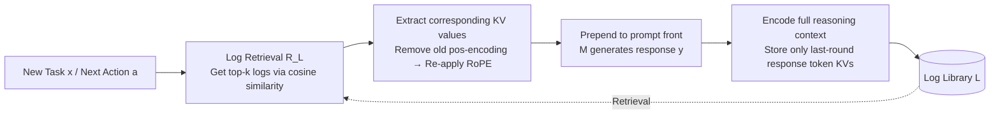

# Log-Augmented Generation: Scaling Test-Time Reasoning with Reusable Computation

**Conference**: ICLR 2026  
**OpenReview**: [https://openreview.net/forum?id=oQ3d4O8BaX](https://openreview.net/forum?id=oQ3d4O8BaX)  
**Code**: [https://peterbaile.github.io/lag/](https://peterbaile.github.io/lag/)  
**Area**: LLM Reasoning / Test-time Computation Reuse / Agents  
**Keywords**: Test-time Reasoning, KV Cache Reuse, Log-Augmented Generation, Multi-hop QA, ReAct Agents  

## TL;DR
LAG stores reasoning trajectories from past tasks as logs that "retain only a few tokens, but whose KV values encode the full context." When a new task arrives, these KV values are retrieved and concatenated for direct computation reuse. This allows LLMs to learn from historical experience like humans, simultaneously improving accuracy and efficiency in multi-hop QA and reasoning tasks.

## Background & Motivation
**Background**: When humans solve problems, they naturally remember intermediate conclusions and reuse old reasoning when encountering similar new problems. However, LLMs and their agents (e.g., ReAct) are "memoryless" by default—processing sequential tasks independently and failing to transfer reasoning from one task to the next, leading to significant redundant computation.

**Limitations of Prior Work**: Existing efforts to provide models with memory have specific drawbacks. First, **reflection/distillation-based memory** (Reflection, Dynamic Cheatsheet, etc.) distills logs into abstract components like "thought," "strategy," or "domain knowledge." Over-abstraction loses the rich context of original reasoning and requires extra extraction steps, limiting reuse value. Second, **raw text log concatenation** preserves detail but is noisy and easily exceeds context length limits. Third, **existing KV cache methods** (Block Attention, etc.) are designed only for "saving computation when content repeats," caching prompt instructions or RAG documents with efficiency rather than accuracy-improving reasoning reuse as the goal.

**Key Challenge**: The goal is to retain the full reasoning context for effective reuse while keeping stored logs compact enough to avoid noise and context overflow. Text representations cannot achieve both, and abstract representations lose both.

**Goal**: Propose a framework to directly reuse past reasoning and computation at test-time without any extraction or distillation, achieving a "win-win in accuracy and efficiency without sacrificing scalability."

**Key Insight**: **Represent logs using KV values instead of text.** The key insight is that the KV value of a single token is a weighted aggregation of all preceding token embeddings via the attention mechanism; it carries the semantics of the entire context in a "one-for-many" fashion. Thus, one can **encode the entire reasoning context but store only the KV values of the small number of tokens from the final response**, preserving the complete context while compressing storage significantly.

## Method

### Overall Architecture
LAG (Log-Augmented Generation) adds three modules on top of a base model: **Encoding & Storage** (representing past executions as reusable KV logs in a log library $L$), **Retrieval** (retrieving the most relevant historical logs based on semantic similarity when a new task arrives), and **Augmented Generation** (prefixing the retrieved KV values to the current context for generation). It integrates seamlessly into the sequential reasoning loop of ReAct-style agents—where the model chooses between "giving an answer" and "issuing a sub-query" at each step. LAG simply adds a storage step and a retrieval step to the loop, with minor adjustments to prompts and generation, remaining nearly zero-intrusive.

### Key Designs

**1. Decoupling Encoding and Storage: Encoding the full context while storing only the last round's KV—this is the critical differentiator from existing KV cache methods.** A task consists of multiple rounds of user/assistant messages. During encoding, LAG feeds **all rounds of model responses** to calculate KV values, but during storage, it retains only the KV values corresponding to the **final round of responses**, treating them as a "concentrated summary" of the entire reasoning trajectory. The final round is chosen because it typically reflects the most refined understanding of the task, and its KV values naturally attend to all prior reasoning via causal attention. In contrast, existing KV cache methods (like Block Attention) do not distinguish between "what is encoded" and "what is stored"—they encode the final round independently and store it, losing the context of early reasoning. Notably, encoding more content **does not increase KV volume**: volume is determined solely by the "number of stored tokens $\times$ number of heads $\times$ dimension per head," where the latter two are fixed by the model architecture. This superior encoding strategy is thus a "free lunch."

**2. Token Selection Strategy: Optimal storage-performance tradeoff using a small number of key tokens.** KV values are high-dimensional vectors, making per-token storage expensive. One can retain only "important token" KVs—such as tokens representing the final answer or the next action $a$ in an agent setting, as they encapsulate reasoning results. Ablations show that storing more tokens is generally more accurate but more space-intensive; the **"KV of all tokens in the last response"** was found to be the best balance, providing more information than just the answer without the redundancy of the full trajectory.

**3. RoPE Position Re-alignment: Ensuring "off-site" cached KVs function correctly in new contexts.** KV values depend on positional information. KVs in the log library are calculated based on position IDs in the original context; prepending them directly to a new context causes positional misalignment. LAG adopts the approach from Block Attention: **strip the old position encoding and re-apply position encoding adapted to the new context.** Specifically, RoPE applies a rotation matrix to 2D sub-vectors of the key vector: $\text{RoPE}(x,\theta)=\begin{bmatrix}\cos\theta & -\sin\theta\\ \sin\theta & \cos\theta\end{bmatrix}x$, where $\theta$ is determined by the position ID. To remove the old position, the inverse rotation matrix is applied to recover $x$: $\begin{bmatrix}\cos\theta & \sin\theta\\ -\sin\theta & \cos\theta\end{bmatrix}\text{RoPE}(x,\theta)=x$. Then, $x$ is re-rotated using $\theta'$ corresponding to the new position ID, and KVs from multiple logs are concatenated for generation.

**4. Semantic Retrieval and Dual Log Libraries: Deciding "what to recall" and "when to store."** The retriever $R_L$ uses standard text embedding models (Snowflake-arctic / Qwen3-Embedding) to pre-calculate log embeddings offline. At test-time, an embedding is calculated for the current action $a$, and the top-k (default top-3) are retrieved via cosine similarity. The log library operates in two modes: **Static Library**, built offline and used as read-only (used in main experiments with a 70/30 seen/unseen split), and **Dynamic Library**, where every completed task is indexed in real-time. To simulate real deployment, logs are stored **without filtering by gold answers**—even incorrect reasoning is stored to verify framework robustness.

## Key Experimental Results

### Main Results
Knowledge-intensive multi-hop QA using Llama-3.1-8B + Snowflake embeddings, 70/30 static library split (EM / F1 / Iterations↓):

| Method | Musique(unseen) EM | F1 | #Iter↓ | 2WikiMultiHop(unseen) EM | F1 | #Iter↓ |
|---|---|---|---|---|---|---|
| Standard agentic (ReAct) | 27.0 | 37.3 | 3.90 | 51.6 | 60.2 | 2.49 |
| Reflection (Dynamic Cheatsheet) | 27.5 | 38.8 | 3.67 | 50.1 | 59.2 | 2.22 |
| KV cache (Block Attention) | 28.7 | 40.7 | 3.37 | 48.3 | 57.1 | 1.89 |
| LAG_text-all | 27.8 | 37.1 | 4.30 | 56.9 | 65.0 | 2.29 |
| LAG_text-last | 30.7 | 42.1 | 3.20 | 55.0 | 63.6 | 2.00 |
| **LAG_KV (Ours)** | **32.2** | **45.0** | **2.68** | 55.2 | **64.7** | **1.84** |

Reasoning-intensive tasks (EM / Iterations↓):

| Method | GPQA(unseen) EM | #Iter↓ | MMLU-Pro(unseen) EM | #Iter↓ |
|---|---|---|---|---|
| Standard agentic | 18.5 | 1.87 | 41.3 | 1.58 |
| Reflection | 20.0 | 1.84 | 41.0 | 1.59 |
| KV cache | 19.3 | 1.68 | 40.7 | 1.51 |
| LAG_text-last | 18.5 | 1.93 | 42.0 | 1.50 |
| **LAG_KV (Ours)** | **30.4** | **1.62** | **42.3** | **1.36** |

LAG_KV leads across nearly all dimensions of accuracy and iterations (efficiency). On GPQA unseen, EM jumps from 18.5 to 30.4.

### Ablation Study
Comparison of log representations (Core Ablation):

| Variant | Encoding Content | Stored Content | Relative to LAG_KV |
|---|---|---|---|
| LAG_text-all | Full rounds text | Full rounds text | Full text is noisy → Worse |
| LAG_text-last | Only last round text | Only last round text | Loses generalized context → Worse |
| KV cache(Block Attn) | Only last round | Last round KV | Encoding lacks full history → Worse |
| **LAG_KV** | **Full reasoning context** | **Last round token KV** | **Best** |

The comparison proves that LAG_text-all is worse with "full context" (more noise), and LAG_text-last is worse with "only last round" (lost context). Only KV values allow "storing only the last round" while still encoding the full context.

### Key Findings
- **Efficiency Gains**: On Musique, LAG's EM at the 2nd iteration slightly exceeds the standard agent's 7th iteration, approximately a **3.5× efficiency improvement**. Even when both reach a performance ceiling at the 25th iteration, LAG remains more accurate, demonstrating a win-win for efficiency and accuracy.
- **Accuracy Source Decomposition**: Logs provide "Knowledge Reuse" (finding the solution in fewer steps) and "Insight Reuse" (correcting old errors or solving originally unsolvable problems). On GPQA, this resulted in +18 incorrect→correct and +15 unsolvable→correct, with a net improvement of +22. In rare cases, relevant logs misled the model, but corrections significantly outnumbered new errors.
- **Superior Encoding with Zero Extra Storage**: Encoding more content does not change the KV volume (which depends only on the number of stored tokens and fixed architecture dimensions), so the performance gain of LAG is "free."

## Highlights & Insights
- **Repositioning KV Cache from an "Efficiency Tool" to a "Memory Carrier"**: While KV caching previously only saved computation for repeated content, LAG is the first to explicitly use it to **preserve and reuse reasoning context to improve accuracy**, restructuring the teleology of KV caching.
- **The Decoupling of "Encoding $\neq$ Storage"** is the sharpest contribution: Leveraging the property that "a single token's KV is a weighted aggregation of the full context," the method achieves "encoding everything while storing only a snippet," having one's cake and eating it too without increasing storage.
- **Verbatim Reuse Outperforms Distilled Abstraction**: Directly transporting original reasoning is more effective than reflection-style "distilling into thoughts/strategies," suggesting that over-abstraction loses information—a strong counter-example to currently popular memory/reflection agents.
- **Nearly Zero Intrusion**: Only adds two steps (store/retrieve) to the ReAct loop, making it generalizable to any "Retrieve-Augmented Generation" paradigm.

## Limitations & Future Work
- **Dependency on Open-Source Models with Direct KV Access**: Since closed-source APIs do not allow KV manipulation, the method is currently unusable for them (requires Llama-3.1, Qwen3-MoE, etc.).
- **Storage Costs Scale Linearly with Tasks**: Each log stores high-dimensional KV vectors. In large-scale, long-term deployments, log library bloat and retrieval overhead are concerns; the paper provides token subsetting as a compromise but does not dive into deep compression.
- **Potential for Misleading Logs**: Relevant logs can mislead the model on previously correct problems (C→I); there is no online mechanism to determine "whether to trust this log." Not filtering incorrect logs, while realistic, allows noise injection.
- **Retrieval Quality as a Ceiling**: Performance is limited by the text embedding retriever; the top-k might recall irrelevant history during domain shifts or semantic drift. Future work could explore KV-level compression, trust-weighted fusion, and combination with continual learning.

## Related Work & Insights
- **Reflection/Memory**: Self-Refine, Reflexion, Dynamic Cheatsheet, Thought/Strategy distillation—LAG's fundamental divergence is "direct reuse vs. extraction/distillation."
- **KV Cache Reuse**: Block Attention, CacheBlend, Prompt Cache (Gim et al.) cache instructions or RAG documents to save compute. LAG changes the object to "reasoning trajectories" and the goal to "accuracy improvement," introducing "encoding/storage decoupling."
- **Test-Time Scaling**: Traditional test-time scaling relies on more sampling or longer reasoning to trade computation for accuracy. LAG provides an orthogonal path—**scaling via reuse of historical computation**, allowing models to be more accurate with fewer iterations.

## Rating
- **Novelty**: ⭐⭐⭐⭐⭐ — The decoupling insight of "encoding full history while storing one round of KV" is both simple and counter-intuitive, redefining KV cache as a reasoning memory carrier.
- **Experimental Thoroughness**: ⭐⭐⭐⭐ — Covers 4 datasets across knowledge/reasoning, 3 LLMs, 2 embedders, static/dynamic libraries, and detailed accuracy source decomposition. However, the scale is small-to-medium, lacking real-world measurements of storage growth under long-term deployment.
- **Writing Quality**: ⭐⭐⭐⭐ — Clear motivation (human memory analogy + Figure 1 multi-hop example), step-by-step methodology, and clever ablation design.
- **Value**: ⭐⭐⭐⭐ — Provides a plug-and-play, win-win solution for agent "memory reuse," with practical significance for reducing multi-step reasoning costs; limited by the requirement for KV access.

<!-- RELATED:START -->

## Related Papers

- [\[ICLR 2026\] ATTS: Asynchronous Test-Time Scaling via Conformal Prediction](atts_asynchronous_test-time_scaling_via_conformal_prediction.md)
- [\[ICLR 2026\] CaTS: Calibrated Test-Time Scaling for Efficient LLM Reasoning](cats_calibrated_test-time_scaling_for_efficient_llm_reasoning.md)
- [\[ICLR 2026\] Plan and Budget: Effective and Efficient Test-Time Scaling on Reasoning LLMs](plan_and_budget_effective_and_efficient_test-time_scaling_on_reasoning_large_lan.md)
- [\[ICLR 2026\] Efficient Test-Time Scaling for Small Vision-Language Models](efficient_test-time_scaling_for_small_vision-language_models.md)
- [\[ICLR 2026\] Strategic Scaling of Test-Time Compute: A Bandit Learning Approach](strategic_scaling_of_test-time_compute_a_bandit_learning_approach.md)

<!-- RELATED:END -->
