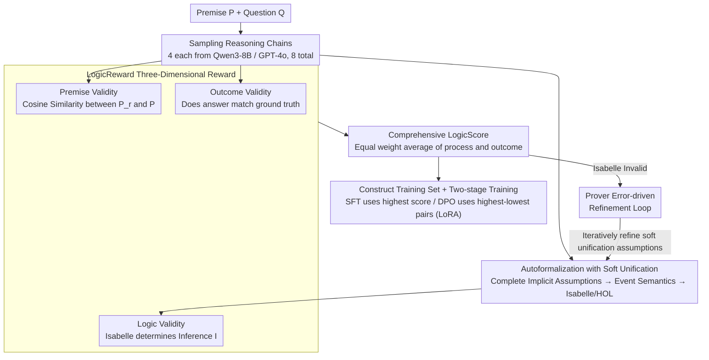

# LogicReward: Incentivizing LLM Reasoning via Step-Wise Logical Supervision

**Conference**: ICLR2026  
**arXiv**: [2512.18196](https://arxiv.org/abs/2512.18196)  
**Code**: [Project Page](https://llm-symbol.github.io/LogicReward)  
**Area**: LLM Reasoning  
**Keywords**: Logical Reasoning, Theorem Prover, Step-wise Reward, Autoformalization, Soft Unification  

## TL;DR
Ours proposes the LogicReward reward function, which utilizes the Isabelle theorem prover for step-wise logical correctness verification. By combining Autoformalization with Soft Unification to reduce natural language ambiguity, the trained 8B model outperforms GPT-4o by 11.6% and o4-mini by 2% on NLI and logical reasoning tasks.

## Background & Motivation
1. Existing training methods primarily rely on outcome-based feedback, which may lead to cases where the answer is correct despite reasoning errors.
2. Process-based supervision (such as PRM) still lacks formal guarantees of logical correctness.
3. Probabilistic feedback (token probabilities/learned reward models) is inherently non-deterministic and cannot reliably detect logical fallacies.
4. Symbolic verification methods are currently mostly restricted to structured domains (mathematics/programming), with a gap in the NLI field.
5. Natural language ambiguity and implicit assumptions make formal verification difficult (e.g., Dad $\neq$ Father but they are semantically equivalent).
6. High-stakes scenarios (medical/legal) require strict guarantees of logical consistency.

## Method

### Overall Architecture
LogicReward does not train the model directly; instead, it uses a theorem prover to transform "logical correctness" into a verifiable **data construction pipeline**, then fine-tunes with high-quality constructed data. Given a premise $P$ and a question $Q$, the method first samples a set of reasoning chains (8 per question) from an LLM. Each chain undergoes "Autoformalization with Soft Unification" to translate natural language into Isabelle-readable logic. Subsequently, scores are aggregated into a LogicScore across three dimensions: premise, logic, and outcome. Steps judged invalid by the prover enter an error-driven refinement closed-loop for recovery. Finally, responses with the highest/lowest scores per question are used for SFT and DPO. The core challenge lies in the ambiguity and implicit assumptions of natural language reasoning, where direct formalization almost inevitably fails; thus, the pipeline's emphasis is on making the theorem prover "understand" natural language.

### Key Designs

**1. LogicReward Three-Dimensional Reward: Decomposing One Step of Reasoning into Decidable Logical Propositions**

Outcome-based feedback cannot distinguish between "right answer but wrong reasoning," while probabilistic process rewards (token probabilities, learned reward models) are inherently non-deterministic and fail to detect logical fallacies. LogicReward explicitly decomposes each reasoning step $s_i$ into $(P_r, I)$—the cited premise $P_r$ and the derived inference $I$—and scores them across three dimensions. Premise Validity checks if $P_r$ actually originates from the given premise $P$: $P_r$ is split into sentences $\{q_1,\dots,q_m\}$, and the maximum cosine similarity is calculated for each $q_j$ against the given premise, with the average serving as the step's score to prevent the model from hallucinating premises. Logic Validity is the core, using Isabelle to verify if $I$ can be derived from $P_r$: a score of 1 is assigned if the syntax is correct and logic holds, 0 if syntax is correct but logic is faulty. If the formalization syntax itself is erroneous, it falls back to token confidence $\text{Conf}(I) = \frac{1}{|I|}\sum_{t \in I}\text{token\_prob}(t)$, ensuring the reward always has a value. Outcome Validity is a binary determination of whether the final answer matches the ground truth. The first two are averaged per step to form ReasoningValidity, which is then combined with Outcome Validity using equal weighting to produce the LogicScore. In this way, "process logic" and "final outcome" have independent signals, and deterministic Isabelle judgments fill the logical gaps that probabilistic methods cannot detect.

**2. Autoformalization with Soft Unification: Enabling Theorem Provers to Understand Ambiguous Natural Language**

The Logic Validity step requires feeding reasoning steps into Isabelle, but natural language words like "Dad" and "Father" are semantically identical yet literally different, and implicit commonsense assumptions are often omitted. Hard-coding such sentences into Isabelle almost always leads to failure—this is the fundamental reason symbolic verification has been confined to structured domains like math/programming and has failed to enter natural language reasoning. Soft Unification prompts the LLM to proactively complete "valid but unspoken" assumptions (synonym mapping, commonsense bridging, etc.) within each reasoning step to reduce ambiguity. Then, it parses the entire step into a structured format according to neo-Davidsonian event semantics and converts it into an Isabelle/HOL theory for verification. This effectively inserts a semantic alignment layer between natural language and formal logic, recovering steps that would otherwise be misjudged as "logical errors" due to surface differences, thereby significantly raising the success rate of formalization.

**3. Prover Error-driven Refinement Loop: Turning Verification Failures into Correctable Feedback**

Even with Soft Unification, some steps are still judged invalid by Isabelle. The authors randomly sampled 300 instances for analysis and found that one category indeed contained logical errors, while another was misjudged because an implicit assumption was still missing after Soft Unification. Simply discarding these would lose a significant amount of data. Therefore, the method feeds the error messages returned by Isabelle back into the LLM, prompting it to iteratively refine the Soft Unification assumptions until the logic passes or the maximum number of iterations is reached. Two responses per question are randomly selected for such refinement, and the scores are recalculated after correction; the resulting data is recorded as $D_{\text{refined}}$. The prover is no longer just an scoring judge but becomes a closed-loop teacher capable of pointing out "where it's wrong and how to fix it," and the salvaged samples further enrich the training set.

### Loss & Training
On the data side, approximately 6,000 instances were sampled from 8 NLI/logical reasoning datasets. Qwen3-8B and GPT-4o each generated 4 responses (8 per question), unified into the format "Step 1: …; Step 2: …; Answer: A". The comprehensive reward is the equal weight average of process and outcome: $\text{LogicScore}(r,A) = \text{avg}\big(w_1 \cdot \text{ReasoningValidity}(r),\, w_2 \cdot \text{OutcomeValidity}(A)\big)$, where $w_1=w_2=0.5$. The training set $D_{\text{final}} = D_r \cup D_{\text{refined}}$ merges original and refined data. Two-stage training: SFT uses the response with the highest LogicScore per question as the target, while DPO pairs the highest and lowest LogicScore responses as preference pairs. Baselines are Llama3.1-8B and Qwen3-8B, with LoRA fine-tuning throughout.

## Key Experimental Results

| Model | M-LogiEval | FOLIO | ProverQA | LogiQA | 8-Task Avg |
|------|-----------|-------|----------|--------|----------|
| GPT-4o | 68.0 | 63.5 | 78.4 | 69.3 | 73.9 |
| o4-mini | 82.0 | 80.8 | 78.8 | 65.7 | 83.5 |
| DeepSeek-R1-8B | 64.8 | 57.3 | 59.2 | 53.2 | 68.6 |
| **LogicReward-Qwen3-8B** | **82.0** | **79.5** | **81.2** | **72.3** | **85.5** |

### Reward System Comparison

| Reward Function | M-LogiEval | ProntoQA | ProverQA | QASC | 8-Task Avg |
|---------|:----:|:----:|:----:|:----:|:----:|
| Confidence (Avg token prob) | 76.9 | 81.0 | 52.3 | 89.8 | 64.3 |
| LLM-as-Judge (GPT-4o) | 65.8 | 84.6 | 47.5 | 95.3 | 60.2 |
| PRM (Nemotron-70B) | 66.7 | 90.6 | 62.1 | 97.0 | 66.0 |
| **LogicReward** | **79.0** | **90.3** | **60.1** | **97.8** | **71.4** |

**Generalization**: Testing on unseen tasks—CommonsenseQA and GSM8K improved by 8.2% and 4.5% respectively, proving that the rational capabilities enhanced by logical correctness rewards are transferable.

**Label-free scenarios**: Using only ReasoningValidity (independent of ground truth) as a reward remains effective, with an average improvement of +5.8%, indicating that the logical quality of the reasoning process itself is a valuable supervisory signal.

## Highlights & Insights
- First to introduce a theorem prover for step-wise rewards in the NLI domain—bridging the gap of symbolic verification from structured to unstructured data.
- Soft Unification cleverly handles natural language ambiguity, which is key to making theorem provers viable for NL reasoning.
- An 8B model outperforms o4-mini—demonstrating that logically correct training data is more important than model scale.
- Effective even in label-free scenarios—ReasoningValidity itself is a valuable signal.
- The Refinement mechanism utilizes Isabelle error messages for iterative improvement, a closed-loop design.

## Limitations & Future Work
- Falling back to token probability when Isabelle formalization fails loses the formal guarantee.
- Training and primary evaluation are restricted to NLI/logical reasoning tasks; math/commonsense are only used for generalization verification.
- Soft Unification depends on LLM capabilities and may introduce new errors.
- Training data consists of only ~6000 instances; scalability remains to be verified.
- The formalization pipeline is costly (requires Isabelle environment + multiple LLM calls).
- $w_1=w_2=0.5$ is a simple equal weighting; optimal weights have not been explored.

## Related Work & Insights
- vs PRM (Lightman et al.): LogicReward provides deterministic logical guarantees rather than probabilistic assessments.
- vs LINC/Logic-LM: These methods use provers during inference, while LogicReward uses a prover to construct rewards during training.
- vs DeepSeek-R1: Only uses outcome rewards to incentivize long reasoning, while LogicReward additionally supervises the logical validity of the reasoning process.
- vs SymbCoT/Aristotle: These let the LLM act as a symbolic prover, whereas LogicReward uses an actual theorem prover.

## Rating
- Novelty: ⭐⭐⭐⭐⭐ (First combination of theorem prover + NLI training rewards)
- Experimental Thoroughness: ⭐⭐⭐⭐ (8 benchmarks + multiple baselines + generalization + label-free experiments)
- Writing Quality: ⭐⭐⭐⭐ (Clear method description, complete formulas)
- Value: ⭐⭐⭐⭐⭐ (8B model exceeds o4-mini, possesses both practical and theoretical significance)

<!-- RELATED:START -->

## Related Papers

- [\[ACL 2026\] Logical Phase Transitions: Understanding Collapse in LLM Logical Reasoning](../../ACL2026/llm_reasoning/logical_phase_transitions_understanding_collapse_in_llm_logical_reasoning.md)
- [\[ICLR 2026\] Incentivizing LLM Reasoning via Reinforcement Learning with Functional Monte Carlo Tree Search](incentivizing_llm_reasoning_via_reinforcement_learning_with_functional_monte_car.md)
- [\[ICLR 2026\] ActivationReasoning: Logical Reasoning in Latent Activation Spaces](activationreasoning_logical_reasoning_in_latent_activation_spaces.md)
- [\[ICLR 2026\] Learning to Reason via Mixture-of-Thought for Logical Reasoning](learning_to_reason_via_mixture-of-thought_for_logical_reasoning.md)
- [\[ACL 2026\] Distilling Long-CoT Reasoning through Collaborative Step-wise Multi-Teacher Decoding (CoRD)](../../ACL2026/llm_reasoning/distilling_long-cot_reasoning_through_collaborative_step-wise_multi-teacher_deco.md)

<!-- RELATED:END -->
