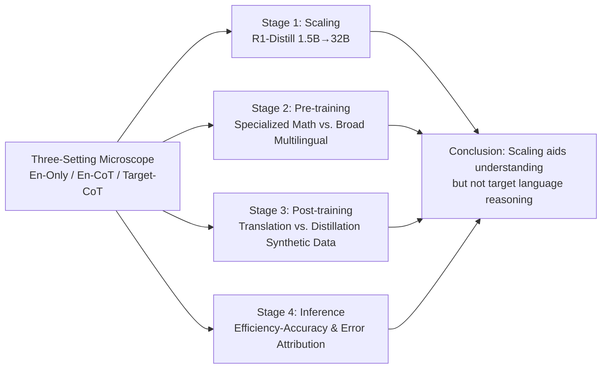

# Long Chain-of-Thought Reasoning Across Languages

**Conference**: ICLR 2026  
**OpenReview**: [https://openreview.net/forum?id=2kKXbsRhYI](https://openreview.net/forum?id=2kKXbsRhYI)  
**Code**: [https://github.com/Berkeley-NLP/Multilingual-Long-CoT](https://github.com/Berkeley-NLP/Multilingual-Long-CoT)  
**Area**: LLM Reasoning / Multilingual Reasoning  
**Keywords**: Long CoT, Multilingual, Cross-lingual Transfer, Synthetic Data, Post-training  

## TL;DR
This paper systematically decomposes the cross-lingual transfer of long Chain-of-Thought (long CoT) reasoning capabilities into four development stages: scaling, pre-training, post-training, and inference. It finds that scaling only bridges the gap in "understanding" but not in "reasoning in the target language," and offers a counter-intuitive practical conclusion: translating English reasoning trajectories into the target language for fine-tuning is more effective than direct distillation of target language trajectories.

## Background & Motivation
**Background**: Large reasoning models achieve expert-level performance in mathematics, coding, and science tasks by generating long chains of thought (often tens of thousands of tokens, including branching, backtracking, and self-verification) before answering. However, these studies are almost exclusively conducted in English. Even when evaluated on multilingual tasks, models often perform intermediate reasoning in English rather than the input language.

**Limitations of Prior Work**: Whether long-chain reasoning can transfer to the vast majority of non-English languages in the world remains systematically misunderstood. Existing multilingual reasoning work mostly stays within the short CoT (few-step reasoning) setting or treats English as a "pivot language" by translating first and then reasoning, essentially avoiding the question of "whether the model can truly reason in the target language." For billions of non-English users, outputting reasoning steps in English means they cannot audit, reproduce, or diagnose errors.

**Key Challenge**: Evaluating reasoning models requires distinguishing between two distinct capabilities: **understanding non-English input** ($L_{input}$) and **reasoning in the target language** ($L_{reason}$). Past metrics conflated these two, leading to the conclusion that "scaling improves multilingual performance," which masks where the true bottleneck lies.

**Goal**: Across nine languages (three each for high/mid/low resources) besides English, the authors systematically characterize the cross-lingual transfer of long-chain reasoning throughout the entire model development lifecycle, identifying where "English reasoning progress fails to generalize" and where "targeted multilingual intervention can bridge the gap."

**Key Insight**: **[Setting Decoupling]** The authors design three controlled settings—En-Only / En-CoT / Target-CoT—to isolate and measure the two capabilities of "understanding" and "reasoning" separately, then apply this microscope to the scaling, pre-training, post-training, and inference stages respectively.

## Method

### Overall Architecture
The paper does not propose a single model but rather a "diagnostic framework + four-stage controlled experiments." The core idea is to decompose multilingual reasoning performance into two independently observable factors using three controlled settings, then perturb the four stages of model development while fixing other variables to answer "what each stage contributes to cross-lingual long-chain reasoning."

### Key Designs
**1. Three-Setting Microscope: Separating "Understanding" and "Reasoning" into Measurable Factors**—This is the methodological cornerstone. Following the decomposition logic of Ko et al. (2025), the authors split reasoning success into two factors: understanding the input language $L_{input}$ and reasoning in a specific language $L_{reason}$. Three settings are mapped: En-Only (input and reasoning in English, as baseline), En-CoT (target language input, English reasoning), and Target-CoT (input and reasoning both in target language). The logic is that the gap between En-CoT and En-Only reflects the **understanding** barrier, while the gap between Target-CoT and En-CoT exposes the capability of **reasoning in the target language**. Nine languages are categorized into High (ZH/FR/JA), Mid (AF/TH/LV), and Low (MR/TE/SW) resources; evaluations use MATH-500, AIME-Combined, and MMLU-ProX.

**2. Controlled Scaling Experiment: Utilizing Homologous Distillation Series to Isolate Model Size**—To attribute conclusions solely to parameter count, the authors select the DeepSeek-R1-Distill series (1.5B–32B). These models share the same post-training process (800k reasoning trajectories) and the same Qwen 2.5 base, thereby eliminating corpus or tokenizer variances. Under En-CoT, all scales for high-resource languages approach the English baseline, showing that understanding is no longer the bottleneck; however, Target-CoT consistently fails to catch up even at 32B. Performance at 32B does not exceed the 7B En-Only baseline, and low-resource languages are nearly scale-insensitive with accuracy near zero. On average, switching from English to target language reasoning at 32B results in a 28.8% accuracy drop, contrasting sharply with short CoT conclusions where gaps primarily stem from understanding.

**3. Pre-training Decomposition: Broad Multilingual vs. Specialized Reasoning**—With fixed scale and post-training, the authors swap pre-training bases (Qwen2.5-7B, Qwen2.5-Math-7B, Qwen3-8B-Base, Gemma3-12B-PT), using 20k English trajectories from OpenThoughts3 for SFT. They use EPR (English Performance Recovered = AVG/EN) as the primary metric for cross-architecture comparability. Findings: Adding specialized math pre-training (Qwen2.5-Math-7B) improves En-CoT but **severely damages** Target-CoT (FR -46%, AF -39%, and even ZH -36%). Conversely, broad multilingual pre-training (Qwen3-8B-Base, Gemma3-12B-PT) improves both modes. This suggests multilingual pre-training builds the foundation for understanding, but generating long structured CoT in target languages requires further intervention.

**4. Synthetic Data Post-training: Counter-intuitive Finding that Translation Beats Distillation**—Addressing the lack of high-quality non-English reasoning trajectories, the authors derive two datasets from s1k (1000 high-quality DeepSeek-R1 English traces): Translated-s1k (using Gemini-2.0-Flash to translate, verified via FLORES-200) and Distilled-s1k (direct distillation using language forcing from DeepSeek-R1). A Qwen3-8B-Base is fine-tuned for each language. Results show **translation is generally stronger and more stable** (ZH +24.2%, FR +9.2%), with Marathi being the only exception. Practical conclusion: high-resource languages (FR/JA) benefit from cross-lingual transfer using 20k existing English traces, while mid-to-low resource languages gain significantly from just 1000 target language traces—outperforming SOTA Qwen3-8B on MR, TE, and SW.

## Key Experimental Results

### Main Results Table (Base Model Comparison, higher EPR indicates better cross-lingual transfer)

| Base Model (MATH-500) | EN | AVG (Non-Eng) | EPR-EnCoT | EPR-TargetCoT |
|---|---|---|---|---|
| Qwen2.5-7B | 90.2 | 80.4 | 89.1 | 35.8 |
| Qwen2.5-Math-7B | 92.2 | 81.4 | 88.3 | **13.7** |
| Qwen3-8B-Base | 94.6 | 90.4 | **95.6** | **65.6** |
| Gemma3-12B-PT | 76.6 | 74.4 | **97.1** | 51.8 |

> Specialized math pre-training crashed Target-CoT EPR from 35.8 to 13.7; broad multilingual pre-training (Qwen3 / Gemma3) pulled En-CoT EPR to 95+ and Target-CoT EPR to 52–66.

### Ablation Study Table (Qwen3-8B-Base Post-training, all Target-CoT, relative to 20k English baseline)

| SFT Data (Average across 3 benchmarks) | ZH | FR | MR | TE | SW |
|---|---|---|---|---|---|
| OpenThoughts3-20k (EN) MATH-500 | 75.8 | 89.2 | 45.6 | 30.0 | 21.2 |
| Translated-s1k (1k) MATH-500 | **87.2** | 87.0 | **70.8** | **72.4** | **64.4** |
| Distilled-s1k (1k) MATH-500 | 60.0 | 78.8 | 76.2 | 67.2 | 57.8 |
| Qwen3-8B (Thinking, SOTA) | 94.0 | 92.0 | 49.0 | 47.4 | 8.4 |

> Low-resource languages using 1000 translated traces (20× less data) significantly outperformed the English baseline on MATH-500 (TE +42.4, SW +43.2) and surpassed SOTA Qwen3-8B.

### Key Findings
- **Scaling fixes understanding, not reasoning**: At 32B, Target-CoT performance remains $\leq$ 7B English baseline; switching to target language reasoning drops accuracy by 28.8% on average.
- **Specialized vs. Broad Pre-training Directions**: Specialized math pre-training helps En-CoT but hinders Target-CoT; broad multilingual pre-training is a win-win for both.
- **Translation > Distillation**: Translated data is more robust; mid-to-low resource languages can bridge the gap with just 1000 target traces.
- **Cross-lingual Efficiency Gaps**: Accuracy is strongly negatively correlated with average response token count ($r=-0.824$ / $-0.915$); efficiency advantages from English SFT do not transfer, but translation SFT can level the playing field.
- **Asymmetric Error Patterns**: For En-CoT, nearly half of errors (47.6%) are reasoning steps; for Target-CoT, reasoning errors drop to 34.4%, but output generation errors (e.g., infinite loops) rise to 11.3% and conceptual errors rise to 24.9%.

## Highlights & Insights
- **Methodological contribution outweighs specific findings**: The three-setting microscope explicitly decoupling "understanding vs. reasoning" is a reusable diagnostic paradigm for future multilingual studies.
- **Full-lifecycle coverage**: Controlled experiments across scaling, pre-training, post-training, and inference provide a complete chain of evidence.
- **Practical value of "Translation > Distillation"**: In contexts where non-English reasoning data is scarce, translating English gold traces is more cost-effective and provides a direct guide for engineering.
- **Error attribution reveals failure nature**: Failures in Target-CoT are not just about "intelligence," but are often blocked by unstable generation and conceptual application barriers.

## Limitations & Future Work
- **Compute disparity in post-training**: 20k English vs. 1k target language is not an equal-compute comparison (though Appendix B.4 provides equal-compute experiments), affecting the "translation wins" conclusion.
- **RL stage omitted**: Long-chain reasoning usually involves both SFT and RL; this paper only addresses SFT, leaving reward shaping sensitivity (e.g., language compliance) unexplored.
- **Translation quality ceiling**: Translated-s1k relies on Gemini-2.0-Flash; for technical/mathematical traces, translation errors might introduce new failure modes.
- **Language coverage**: While covering major language families, some evaluations (like LV on MMLU-ProX) are missing, and generalization to extremely low-resource languages remains to be verified.

## Related Work & Insights
- **Long CoT Reasoning**: This paper extends the trajectory from CoT prompting (Wei et al., 2022) and scratchpad (Nye et al., 2021) to test-time scaling (Snell et al., 2025) and long CoT (Muennighoff et al., 2025) into the multilingual domain.
- **Multilingual Reasoning**: Complementing "English pivot" routes (Huang et al., 2023) and internal alignment studies (She et al., 2024), this work directly addresses "reasoning in target language" throughout the development cycle.
- **Insights**: (1) Distinguish understanding from reasoning in evaluations; (2) Beware of specialized pre-training's side effects on non-English reasoning; (3) Translating high-quality data is often more efficient than distillation for low-resource scenarios.

## Rating
- **Novelty**: ⭐⭐⭐⭐ — Not just a new model, but a diagnostic framework and systemic, counter-intuitive conclusions.
- **Experimental Thoroughness**: ⭐⭐⭐⭐⭐ — 9 languages × 4 stages × 3 settings, rigorous control of variables, and comprehensive error analysis.
- **Writing Quality**: ⭐⭐⭐⭐ — Clear narrative with logically structured tables and definitions.
- **Value**: ⭐⭐⭐⭐⭐ — Provides actionable guidelines for non-English reasoning and releases models/data/code.

<!-- RELATED:START -->

## Related Papers

- [\[ICLR 2026\] Uni-CoT: Towards Unified Chain-of-Thought Reasoning Across Text and Vision](uni-cot_towards_unified_chain-of-thought_reasoning_across_text_and_vision.md)
- [\[ICLR 2026\] Pruning Long Chain-of-Thought of Large Reasoning Models via Small-Scale Preference Optimization](pruning_long_chain-of-thought_of_large_reasoning_models_via_small-scale_preferen.md)
- [\[ICLR 2026\] Mathesis: Towards Formal Theorem Proving from Natural Languages](mathesis_towards_formal_theorem_proving_from_natural_languages.md)
- [\[ACL 2026\] Long-Context Reasoning Through Proxy-Based Chain-of-Thought Tuning](../../ACL2026/llm_reasoning/long-context_reasoning_through_proxy-based_chain-of-thought_tuning.md)
- [\[ICLR 2026\] Elastic Reasoning: Scalable Chain-of-Thought via Elastic Reasoning](scalable_chain_of_thoughts_via_elastic_reasoning.md)

<!-- RELATED:END -->
