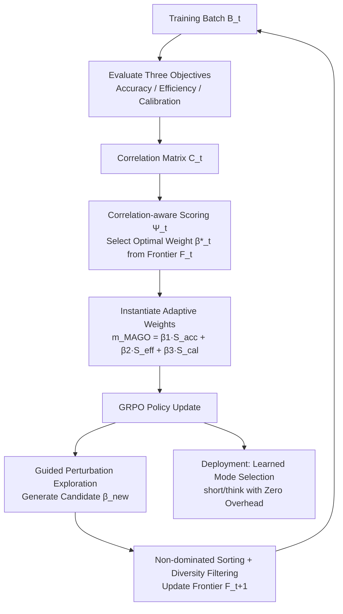

# MAGO: Beyond Fixed Hyperparameters with Multi-Objective Pareto Optimization for Hybrid LLM Reasoning

**Conference**: ICLR 2026  
**OpenReview**: [https://openreview.net/forum?id=i8vZvBFNJg](https://openreview.net/forum?id=i8vZvBFNJg)  
**Code**: To be confirmed  
**Area**: LLM Reasoning / Efficient Inference  
**Keywords**: Hybrid Reasoning, Multi-Objective Optimization, Pareto Frontier, Adaptive Weights, GRPO, token efficiency  

## TL;DR
MAGO reformulates the hybrid reasoning problem—deciding "whether to enable long-chain reasoning"—as a multi-objective optimization problem. By maintaining a Pareto frontier and using correlation-aware dynamic weights, it automatically balances accuracy, efficiency, and decision calibration during training. This eliminates manual hyperparameter tuning and achieves 2.2×–3× token savings during inference with zero extra overhead.

## Background & Motivation
**Background**: Reasoning models like DeepSeek-R1 and Claude achieve impressive performance on mathematical and logic tasks by decomposing complex problems via chain-of-thought (CoT). However, applying long-chain reasoning to all queries during deployment leads to significant waste; simple factual questions can be answered directly, yet they generate hundreds or thousands of tokens, consuming 5–20× more resources than non-reasoning paths.

**Limitations of Prior Work**: Hybrid reasoning has emerged as a solution, allowing models to dynamically choose between `<short>` (direct answer) and `<think>` (long-chain reasoning) modes. Representative methods like DeGRPO introduce a control weight $\alpha$ based on GRPO to balance mode selection and task accuracy. However, these methods rely on **fixed hyperparameters and heuristic single-objective optimization**, leading to two performance gaps identified empirically in this paper:

- **Static Weight Mismatch**: The authors swept a range of $\alpha$ values and found that when $\alpha=0.0001$, over 90% of queries choose the short mode, sacrificing accuracy on difficult tasks; when $\alpha=0.01$, over 80% choose the think mode, losing all efficiency. Furthermore, the optimal $\alpha$ varies drastically across datasets, and no single fixed value is stable across all benchmarks. Exhaustive searching for $\alpha$ requires independent training for each configuration, causing costs to explode linearly with the search space.
- **Multi-Objective Correlation Trap**: Accuracy, efficiency, and decision calibration are deeply entangled (higher accuracy often requires longer chains, conflicting with efficiency; conservative mode selection drags down both). Fixed-weight scalarization $\sum_i \lambda_i f_i$ restricts the search to a predetermined direction in the objective space, creating "cone entrapment" that misses superior solutions in other regions.

**Key Challenge**: The essence of hybrid reasoning is a **multi-objective problem with strong correlations where the optimal trade-off shifts with task complexity**, yet existing methods attempt to approximate it using fixed scalar weights.

**Goal**: To construct a hybrid reasoning training framework that requires no manual hyperparameter tuning, dynamically explores the complete trade-off space, and incurs zero overhead during inference.

**Key Insight**: Reformulate hybrid reasoning as multi-objective optimization, replacing fixed weights with **Pareto frontier maintenance** and specifically solving cone entrapment through **correlation-aware weight selection**, allowing weights to adaptively drift based on training progress and batch characteristics.

## Method

### Overall Architecture
During the training phase, MAGO replaces the static control weight in the GRPO objective with an adaptive weight function $m(x)$. This function is a linear combination of three competing objectives (accuracy, efficiency, and calibration) using dynamic weights $(\beta_1, \beta_2, \beta_3)$. Instead of being manually tuned, these weights are selected at each step from an evolving Pareto frontier using a correlation-aware scoring function. The training forms a closed loop: select weights → perform policy update → evaluate the three objectives on the batch → update the frontier. During deployment, the model has already learned to autonomously switch between `<short>` and `<think>` without any additional parameters or computation.

### Key Designs

**1. Three-Objective Reconstruction: Explicitly modeling "Accuracy-Efficiency-Calibration"**. MAGO no longer uses a single scalar $\alpha$ for vague balancing. Instead, it defines the control weight as $m_{\text{MAGO}}(x)=\beta_1 S_{\text{acc}}(x)+\beta_2 S_{\text{eff}}(x)+\beta_3 S_{\text{cal}}(x)$, where each objective has a clear definition. The accuracy objective $S_{\text{acc}}(x)=\mathbb{E}[\mathbb{I}(\phi(a)=y^*)]$ measures answer correctness. The efficiency objective $S_{\text{eff}}(x)=\mathbb{E}[1-\frac{|a|}{T_{\max}}]$ normalizes generation length into a "shorter is better" score. The calibration objective is unique—it requires the model to choose the short mode only when it is confident and the think mode when the problem is genuinely difficult. Calibration is measured by $S_{\text{cal}}(x)=1-\mathbb{E}[|P_{\text{model}}(\text{correct}|x,c)-\mathbb{I}(\phi(a)=y^*)|]$, where $P_{\text{model}}$ is not raw softmax confidence (which is often systematically over/under-confident) but is derived by discretizing raw confidence $\text{RawConf}(a)=\max(\text{softmax}(L_{\text{answer}}))$ into $N_{\text{bins}}$. It then checks the **historical empirical accuracy** $\text{HistoricalAccuracy}(c,b)$ for that mode and bin, maintaining this statistic with exponential decay $\lambda$ to favor recent performance. This calibration objective introduces no extra neural components yet remains more reliable than raw token probabilities.

**2. Pareto Frontier Maintenance: Replacing a single weight with a population of weights**. This is the core mechanism for breaking cone entrapment. MAGO maintains an evolving set of weight configurations $F_t=\{\beta^{(1)},\dots,\beta^{(k)}\}$, where each $\beta^{(i)}$ represents a different trade-off. At each step, objective vectors $S_t(\beta^{(i)})$ are calculated for each configuration on the current batch, keeping only non-dominated solutions $F_t=\{\beta^{(i)}\mid \nexists\,\beta^{(j)}: S_t(\beta^{(j)})\succ S_t(\beta^{(i)})\}$. By maintaining diverse non-dominated weights, the optimization trajectory is no longer locked into the narrow cone defined by scalarization and can instead explore the entire objective space. The frontier size grows during early stages and stabilizes at 20–25, with an upper bound $|F_{\max}|=30$; redundant vectors are pruned using cosine similarity when the limit is reached.

**3. Correlation-Aware Weight Selection: Addressing objective entanglement**. Maintaining a frontier is not enough—when objectives are highly correlated, simply picking the configuration with the highest "weighted sum" allows correlated objectives to dominate each other. MAGO first calculates the empirical correlation matrix $C_t[i,j]$ between objectives per batch, then selects weights using a correlation-adaptive scoring function: $\Psi_t(\beta)=\sum_{i=1}^3 \beta_i \hat{S}^{(i)}_t-\beta_{\text{corr}}\sum_{i<j}|C_t[i,j]|\cdot|\beta_i-\beta_j|$. The first term rewards "betting on well-performing objectives," while the second term $|\beta_i-\beta_j|$ penalizes uneven weight distribution when objectives $i$ and $j$ are strongly correlated, forcing balanced attention. Picking $\beta^*_t=\arg\max_{\beta\in F_t}\Psi_t(\beta)$ is the primary innovation over standard Pareto methods, directly addressing the second performance gap.

**4. Guided Perturbation Exploration + Closed-Loop Integration: Preventing premature convergence with zero inference cost**. To avoid premature convergence of the frontier, MAGO generates new candidates using constrained perturbations $\beta_{\text{new}}=\beta^*_t+\epsilon_t\cdot d$, where the direction $d$ is sampled from the constraint surface $\{\|d\|_2=1,\sum_i d_i=0\}$ to maintain weight normalization. The step size $\epsilon_t=\epsilon_0\exp(-D(F_t)/D_{\text{target}})$ adapts based on frontier diversity $D(F_t)$—the more diverse the frontier, the more restrained the exploration. New candidates are merged into $F_{t+1}$ after non-dominated sorting and diversity filtering. This mechanism only replaces the static weight in GRPO during the **training phase** (final objective in Eq. 22), combined with a simple reward $r(a,y^*,c)$ (1.0 for correct short, $1.0-\gamma$ for correct think, and -1.0 for incorrect; $\gamma$ prefers efficient correctness). At deployment, the model has internalized the mode selection strategy, resulting in **zero extra parameters and zero extra computation**.

## Key Experimental Results

### Main Results
Using DeepSeek-R1-Distill-Qwen-1.5B as the base, MAGO was applied after 1 epoch of SFT with 600 steps of RL. Results on 4 math reasoning benchmarks (Pass@1 / Average tokens):

| Method | Type | AIME24 Pass@1 | AIME #Tok | MATH-500 Pass@1 | MATH-500 #Tok | GSM8K Pass@1 |
|------|------|---------------|-----------|-----------------|---------------|--------------|
| DeepSeek-R1-1.5B | Base | 0.2800 | 18063 | 0.8608 | 5675 | 0.8347 |
| CoT-Valve α=4 | Short CoT | 0.2267 | 17722 | 0.8036 | 5820 | 0.8108 |
| Router Q-7B | Hybrid | 0.1480 | 9296 | 0.7781 | 2748 | 0.8587 |
| DeGRPO-1.5B | Hybrid | 0.2506 | 7262 | 0.8037 | 2644 | 0.8418 |
| **MAGO-1.5B (Ours)** | Pareto | **0.2741** | **7164** | **0.8247** | **2578** | 0.8469 |

With the same backbone, MAGO provides a 2.2×–3× token efficiency gain and a 0.6%–9.4% relative accuracy improvement over heuristic baselines. On AIME, it achieves a higher Pass@1 using only 7,164 tokens (vs. 18,063 for the base model).

### Ablation Study
When scaled to larger backbones (7B/14B/32B), Pass@1 increases monotonically while token counts slightly decrease, indicating that Pareto optimization generalizes well with scale without increasing inference costs:

| Model | AIME24 | MATH-500 | GSM8K | AIME #Tok |
|------|--------|----------|-------|-----------|
| MAGO-7B | 0.2960 | 0.8424 | 0.8611 | 6890 |
| MAGO-14B | 0.3112 | 0.8538 | 0.8723 | 6724 |
| MAGO-32B | 0.3254 | 0.8652 | 0.8834 | 6587 |

Cross-domain generalization (CommonsenseQA, zero-shot): MAGO achieves 74.9% accuracy, 1.8%/1.1% higher than DeGRPO/CoT-Valve, with tokens reduced from 312 to 152 (2.05× efficiency). Competitive accuracy and >2.0× efficiency were also observed on MedQA-USMLE.

### Key Findings
- **Prevention of Mode Collapse**: Vanilla GRPO often sees the number of think samples drop to near zero within ~120 steps (collapsing into only short mode). MAGO maintains a balanced distribution of both modes by preserving diverse weight configurations.
- **U-shaped/Stable Learning Curves**: Think mode accuracy stabilizes at 0.6–0.7, while short mode accuracy gradually rises from 0.4 to 0.5, converging smoothly around 300 steps. In contrast, DeGRPO oscillates wildly between 0.3 and 0.8. The intersection of correct think/short samples occurs later (~400 steps), suggesting MAGO conducts more thorough trade-off exploration before finalizing a strategy.

## Highlights & Insights
- **Elevating "Tuning $\alpha$" to Multi-Objective Optimization**: The most valuable perspective is the geometric explanation that fixed scalar weights equate to locking the search in a cone. This clarifies why methods like DeGRPO are unstable across datasets and provides a principled Pareto solution.
- **Calibration Objective + Historical Accuracy Binning**: Correcting system biases in raw token confidence using empirical calibration without additional network components is a lightweight yet sophisticated design.
- **Correlation-Aware Scoring**: Unlike many Pareto/MOO methods that ignore objective correlation, this paper explicitly uses a correlation matrix to penalize weight imbalances between correlated objectives, closing the logic loop for the second performance gap.
- **Trading Training for Inference**: All complexity is shifted to the training phase. Deployment remains efficient with zero additional cost, and training expenses are amortized over massive online queries, making it highly engineering-friendly.

## Limitations & Future Work
- **Dependency on Online RL and Historical Statistics**: The historical accuracy bins for the calibration objective require continuous statistical accumulation during training. Estimates may be unstable during the cold-start phase when bins are sparse, a transition period not discussed in detail.
- **Fixed Set of Three Objectives**: The framework is hardcoded for the linear combination of accuracy, efficiency, and calibration. Whether it can seamlessly extend to a fourth constraint (e.g., safety, formatting) or if the correlation matrix overhead scales poorly remains to be seen.
- **Frontier Size and Hyperparameters**: While claiming to eliminate $\alpha$, the method introduces several new hyperparameters like $\beta_{\text{corr}}$, $\epsilon_0$, $\tau_{\text{div}}$, $|F_{\max}|$, $N_{\text{bins}}$, $\lambda$, and $\gamma$. True "zero-tuning" depends on the robustness of these values.
- **Math-Heavy Evaluation**: The primary focus is mathematical reasoning. Cross-domain validation is limited to two QA tasks (CommonsenseQA/MedQA). Generalization to more complex scenarios like coding, long documents, or agentic tasks is still to be observed.

## Related Work & Insights
- **Hybrid/Efficient Inference**: Relates to DeGRPO, CoT-Valve, Model Merging, token-budget-aware reasoning, and test-time compute scaling. MAGO differentiates itself by using MOO + Pareto instead of single-objective heuristics.
- **Multi-Objective Optimization (MOO)**: Draws from Pareto-optimal trade-offs, weighted scalarization, multi-reward RL, and evolutionary algorithms, but highlights that "MOO for reasoning mode selection" is a previously unexplored sub-problem.
- **Insight**: The idea of reframing a "manual trade-off hyperparameter" as an MOO problem while explicitly modeling objective correlations is transferable to many other training challenges, such as balancing multiple rewards in RLHF, controlling output length, or multi-constraint alignment.

## Rating
- **Novelty**: ⭐⭐⭐⭐ — Reformulating hybrid reasoning as Pareto MOO and using correlation-aware scoring to break cone entrapment is a principled innovation with a clear geometric motive, not just another weight-tuning trick.
- **Experimental Thoroughness**: ⭐⭐⭐⭐ — Covers 4 math benchmarks + 2 cross-domain QA tasks, four scales from 1.5B to 32B, and includes complete analysis of training dynamics and mode collapse. However, cross-domain task variety is narrow, and stronger baseline comparisons are missing.
- **Writing Quality**: ⭐⭐⭐⭐ — The challenge-driven narrative is clear. Formulas and figures (static weight cone constraints, training dynamics) are well-integrated. Methods correspond directly to identified gaps.
- **Value**: ⭐⭐⭐⭐ — Zero inference overhead + no manual $\alpha$ + 2–3× token savings provide immediate practical value for the efficient deployment of reasoning models. The framework is also adaptable to other multi-objective training scenarios.

<!-- RELATED:START -->

## Related Papers

- [\[ICLR 2026\] TRIM: Hybrid Inference via Targeted Stepwise Routing in Multi-Step Reasoning Tasks](trim_hybrid_inference_via_targeted_stepwise_routing_in_multi-step_reasoning_task.md)
- [\[ICLR 2026\] Reference-guided Policy Optimization for Molecular Optimization via LLM Reasoning](reference-guided_policy_optimization_for_molecular_optimization_via_llm_reasonin.md)
- [\[ICLR 2026\] Beyond Markovian: Reflective Exploration via Bayes-Adaptive RL for LLM Reasoning](beyond_markovian_reflective_exploration_via_bayes-adaptive_rl_for_llm_reasoning.md)
- [\[ICLR 2026\] Hybrid Reinforcement: When Reward Is Sparse, Better to Be Dense](hybrid_reinforcement_when_reward_is_sparse_better_to_be_dense.md)
- [\[ICLR 2026\] Slow-Fast Policy Optimization: Reposition-Before-Update for LLM Reasoning](slow-fast_policy_optimization_reposition-before-update_for_llm_reasoning.md)

<!-- RELATED:END -->
