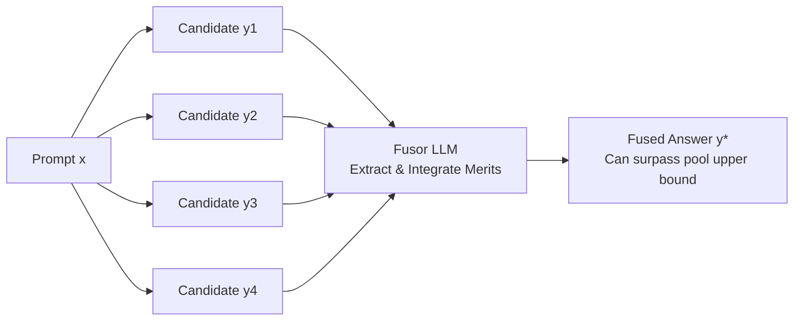

# Making, Not Taking, the Best of N

**Conference**: ICLR 2026  
**OpenReview**: [https://openreview.net/forum?id=oWDEbvEA97](https://openreview.net/forum?id=oWDEbvEA97)  
**Code**: TBD  
**Area**: LLM Inference / Test-time Scaling  
**Keywords**: Best-of-N, Generation Fusion, Test-time Scaling, Synthetic Data Generation, Multilingual, LLM-as-judge  

## TL;DR
The authors shift the paradigm of LLM output aggregation from "selecting the best one from N candidates" (Best-of-N selection) to "using a fusor model to synthesize the merits of N candidates into a superior answer" (Fusion-of-N synthesis). This approach consistently outperforms BON in both test-time scaling and synthetic data generation, even surpassing the oracle upper bound.

## Background & Motivation
- **Background**: High-quality generation in modern LLMs often relies on inference-time aggregation. The dominant approach is Best-of-N (BON), where $N$ candidates are sampled and the "best" one is chosen using reward models, majority voting, or self-consistency. This is widely used in mathematical reasoning, machine translation, open-ended generation, and synthetic data SFT, especially in multilingual contexts.
- **Limitations of Prior Work**: BON is essentially a **zero-sum game** that selects one "hard" choice and discards the remaining $N-1$ samples. This leads to three issues: (1) loss of complementary reasoning paths/segments; (2) waste of compute used to generate those samples; and (3) susceptibility to reward hacking. Crucially, the quality ceiling of BON is the best candidate in the pool (oracle); **selection can never surpass the sample pool upper bound**.
- **Key Challenge**: There is a fundamental conflict between viewing quality as a "monolithic" scalar for comparison and the reality that quality is "polylithic" (different candidates contain different high-quality/low-quality segments). This is especially evident in long-form text and complex prompts.
- **Goal**: Design an aggregation method that fully utilizes all $N$ samples and breaks the sample pool upper bound as a plug-and-play replacement for BON, requiring no additional training.
- **Core Idea**: **[From Selection to Synthesis]** Use a strong generative LLM as a "fusor" to "mix and match" the most informative segments from $N$ candidates to synthesize a brand-new answer $y^\star \notin Y$. This truly "makes" rather than "takes" the best of N.

## Method

### Overall Architecture
Given a prompt $x$ and a pool of candidates $Y=\{y_1,\dots,y_N\}$, FUSION employs a standard LLM as a fusor $F$ to directly generate a fused answer $y^\star = F(x, Y)$. Unlike the hard selection of BON $y^* = \arg\max_{y\in Y} S(y,x)$, the fused answer is conditionally dependent on the entire candidate pool. Thus, it **does not belong to the original pool** and can exceed the quality of any individual candidate. BON is naturally included as a special case: if one candidate is globally optimal, the fusor can simply replicate it.

### Key Designs

**1. Synthetic Aggregation: Deconstructing Quality as a Polylithic Entity**  
The essence of FUSION is reframing quality from a "monolithic scalar" to a "polylithic" view—acknowledging that each candidate contains both high-quality and low-quality segments. The fusor can thus "compensate for weaknesses" across token, word, or sentence granularities, stitching together the highlights of each candidate. This perspective transforms complex problems into solvable combinatorial ones: $y^\star = F(x,Y)$ is no longer bound by $\max_{y\in Y}S(y,x)$. In translation experiments, it directly **surpasses the oracle** (the best candidate chosen via ground truth). It fundamentally acts as collaborative refinement, yielding the greatest gains for long-form and complex prompts.

**2. Fusor as Prompt: Zero-Training Adaptability**  
Unlike BON, which relies on specifically trained reward models, FUSION’s core component is simply a fusor prompt. It naturally supports in-context learning and instant adaptation without training. Behaviors can be tuned by injecting constitutions for safety standards, adjusting tone/persona, or controlling the balance between "integrating all samples" and "discarding worst segments." A key empirical finding is that the model must be explicitly instructed to **actively discard the worst parts** to avoid being dragged down by low-quality segments. Using CoT prompting or reasoning models as fusors can further scale FUSION's computation as needed.

**3. Scaling Threshold for Fusor Ability**  
The "out-of-the-box" efficacy of FUSION depends on the fusor's integrated ability for "comparative evaluation-extraction-aggregation." This generative fusion capability only unlocks after **crossing a model scale threshold**. Arena win rates scale with fusor size (e.g., +5.5% gain from 27B to 111B). Conversely, using the same models as scalar scorers for BON shows that smaller models are sometimes more effective, and gains vanish at larger scales (consistent with findings that the strongest generative models lag behind classifier-type RMs on classic reward benchmarks). Additionally, given a fixed scale, the **specific choice of fusor is less critical than the composition of the sample pool**. Small models require specialized training to serve as effective fusors.

**4. Plug-and-Play Replacement for BON in Dual Scenarios**  
Since the only difference between FUSION and BON is "how to aggregate the same candidates," FUSION can replace BON non-intrusively in two main areas: (i) **Test-time Scaling**: Sampling $N$ candidates from a single model and using a fusor to synthesize the output; (ii) **Synthetic Data Generation**: Sampling completions from a pool of diverse teachers and using the fusor to generate SFT training data for a student. In both cases, BON and FUSION receive identical candidate sets and prompts.

## Key Experimental Results

### Main Results (Head-to-Head: FUSION vs. BON)

| Task | Metric | BON Avg | FUSION Avg | Δ |
|------|------|---------|------------|---|
| Arena (Open-ended, 11 languages, direct comparison) | Win Rate % | 43.8 | 46.3 | **+2.5** |
| WMT (Machine Translation, en→10 languages) | XCOMET_XL | 83.0 | 83.8 | **+0.8** |
| Test-time Scaling (Aya-8B vs. Gemini2.5-Pro) | Max Win Rate Gain | — | — | French **+10.8%** |
| Translation FUSION vs. ORACLE | XCOMET_XL | — | — | **Surpasses Oracle** in DE/RU/ZH (ZH +0.8) |

In test-time scaling, using only 5 samples for fusion, Command A pushes the absolute win rate past 50% in languages like German (+9.5%) and Spanish (+7.8%), **defeating Gemini2.5-Pro** (the Arena leader). FUSION outperforms BON in 9 out of 11 languages for Command A.

### Downstream Evaluation of Synthetic Data (Student 111B SFT)

| Task | Metric | BON Training | FUSION Training | Δ |
|------|------|---------|------------|---|
| Arena (vs. Gemini2.5-Flash, 10 languages) | Win Rate % | — | — | **+2.5** |
| WMT24++ (en→·) | XCOMET_XL | 83.0 | 83.8 | **+0.8** (Sig. in multilingual) |
| GeoFactX Factual Reasoning (5 languages) | Accuracy / Reasoning | — | — | FUSION better in 4/5 langs |

The student fine-tuned on FUSION data not only outperforms the base model (Accuracy +9.1% vs. BON's +8.1%) but also **outperforms the fusor model itself** (+4.4%). This holds true even in languages like Swahili and Thai, which are not officially supported by the fusor (Command A), confirming that "collective wisdom can be distilled and is not capped by the execution model."

### Ablation Study

| Candidate Pool / Method | Arena Win Rate % |
|---------------|-------------|
| 1 Sample (Command A) | 57.9 |
| 5 Teachers + BON | 61.0 |
| 5 Teachers + FUSION | **65.4** |
| Weak Pool + FUSION | 65.0 |
| Fusor=DeepSeek-V3 + FUSION | 63.9 |

- **Fusor Scale**: FUSION win rates increase monotonically as the fusor scale grows from 4B to 111B; BON scoring gains disappear at larger scales.
- **Sample Efficiency**: FUSION is significantly more efficient at low budgets ($N<10$). $N=2$ FUSION achieves a +6% win rate gain against Gemini2.5-Pro, while BON requires double the samples to match. Gains plateau after $N>7$.

### Key Findings
1. **Synthesis > Selection**: FUSION consistently outperforms BON under identical sampling budgets and can break the oracle upper bound, proving selection is not the ceiling of aggregation.
2. **Weak Pools Benefit**: FUSION remains superior even with weaker teacher pools or fusors (e.g., DeepSeek-V3), suggesting diversity itself is exploitable.
3. **Limited in Highly Constrained Tasks**: On mathematical tasks like MGSM, FUSION occasionally performs worse than BON. When answers are strictly constrained and segments cannot "compensate" for each other, the synthesis advantage vanishes.

## Highlights & Insights
- **Paradigm Shift over Heuristic Stacking**: Replacing the "quality is a monolithic scalar" assumption with a "polylithic/deconstructable" view opens a path to surpassing the sample pool upper bound, which was previously blocked by the selection paradigm.
- **Zero-Training, Plug-and-Play**: The sole component is a prompt, allowing direct replacement in existing BON pipelines with low engineering cost and support for in-context control of safety, tone, and fusion strength.
- **Two Counter-intuitive Results**: Surpassing the oracle proves selection is limiting; surpassing the fusor (by the student) proves synthesis is true knowledge distillation rather than simple mimicry.
- **Multilingual Robustness**: Consistency across 11 languages, 3 benchmark types, and varying model scales, even showing gains in languages not officially supported by the fusor.

## Limitations & Future Work
- **Inversion in Constrained Tasks**: For tasks with highly constrained answers (e.g., Math), synthesis might be less effective than picking the single correct answer. FUSION < BON was observed in MGSM.
- **Fusor Scale Threshold**: Small models require specific hardware or training to function as fusors out-of-the-box; the prompt-only approach has a minimum compute requirement.
- **Sequentiality vs. Parallelism**: While BON samples are independent, FUSION requires encoding all candidates into the fusor simultaneously (long context), making single-inference passes heavier.
- **Future Work**: Designing specialized training for smaller fusors, combining FUSION with reasoning models/CoT to scale computation, and exploring finer-grained segment-level fusion control.

## Related Work & Insights
- **vs. Best-of-N / Voting / Self-consistency / RM Scoring**: These are selection paradigms limited by the pool upper bound and prone to reward hacking. FUSION bypasses hard selection via generative synthesis.
- **vs. Self-refinement**: When the fusor and sampling model are identical, FUSION can be seen as efficient self-refinement, but it naturally supports heterogeneous multi-teacher pools.
- **vs. Math-specific Fusion (Qi et al. 2025; Zhao et al. 2025)**: While prior work trained small fusors for math, FUSION proves large fusors can work in open/multilingual domains without training.
- **Insight**: Aggregation should not be treated as an evaluation/ranking problem, but as a "collaborative synthesis" problem. Viewing multi-model generations as collaborators rather than competitors has value for agentic integration, multi-teacher distillation, and synthetic data pipelines.

## Rating
- **Novelty**: ⭐⭐⭐⭐⭐ — The "Selection → Synthesis" paradigm shift is simple yet powerful; "surpassing the oracle" conceptually breaks inherent limits.
- **Experimental Thoroughness**: ⭐⭐⭐⭐⭐ — Covers test-time scaling and synthetic data, 11 languages, 3 benchmark types, and scales from 4B to 235B, with systematic ablations.
- **Writing Quality**: ⭐⭐⭐⭐ — Clear conceptual narrative (monolithic vs. polylithic); some charts (Figs 2/3/6) use scatter/offset representations that require appendix tables for precise reading.
- **Value**: ⭐⭐⭐⭐⭐ — Direct utility for test-time scaling and synthetic data pipelines as a zero-shot, plug-and-play BON replacement.

<!-- RELATED:START -->

## Related Papers

- [\[ICLR 2026\] Making Slow Thinking Faster: Compressing LLM Chain-of-Thought via Step Entropy](making_slow_thinking_faster_compressing_llm_chain-of-thought_via_step_entropy.md)
- [\[ICLR 2026\] Sample Smart, Not Hard: Correctness-First Decoding for Better Reasoning in LLMs](sample_smart_not_hard_correctness-first_decoding_for_better_reasoning_in_llms.md)
- [\[ICLR 2026\] Smarter Not Harder: Generative Process Evaluation with Intrinsic-Signal Driving and Ability-Adaptive Reward Shaping](smarter_not_harder_generative_process_evaluation_with_intrinsic-signal_driving_a.md)
- [\[NeurIPS 2025\] Scalable Best-of-N Selection for Large Language Models via Self-Certainty](../../NeurIPS2025/llm_reasoning/scalable_best-of-n_selection_for_large_language_models_via_self-certainty.md)
- [\[ICML 2026\] Many-Shot CoT-ICL: Making In-Context Learning Truly Learn](../../ICML2026/llm_reasoning/many-shot_cot-icl_making_in-context_learning_truly_learn.md)

<!-- RELATED:END -->
