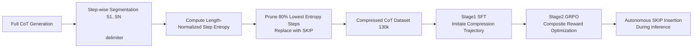

# Making Slow Thinking Faster: Compressing LLM Chain-of-Thought via Step Entropy

**Conference**: ICLR 2026  
**OpenReview**: [https://openreview.net/forum?id=cGLqQfS5wH](https://openreview.net/forum?id=cGLqQfS5wH)  
**Code**: [https://github.com/staymylove/COT_Compresstion_via_Step_entropy](https://github.com/staymylove/COT_Compresstion_via_Step_entropy)  
**Area**: LLM Reasoning / Efficient Inference  
**Keywords**: Chain-of-Thought Compression, Step Entropy, Overthinking, GRPO, [SKIP] token  

## TL;DR
This paper proposes using "step entropy" to quantify the information contribution of each reasoning step in CoT. It discovers that pruning 80% of the lowest-entropy steps results in almost no accuracy loss. A two-stage SFT+GRPO training pipeline is designed to enable models to autonomously insert [SKIP] tokens during inference, reducing token counts by 16–57% while maintaining or even improving accuracy.

## Background & Motivation
- **Background**: Large Reasoning Models (LRMs) like DeepSeek-R1 and Qwen3 significantly enhance performance in math, code, and symbolic logic through "slow-thinking" long CoT, but the generated reasoning chains are often verbose.
- **Limitations of Prior Work**: Long CoT leads to "overthinking" issues such as high inference latency, massive computational costs, and low efficiency, which are critical bottlenecks for large-scale deployment. Existing compression works either make reasoning implicit/latent (iCoT, COCONUT) at the cost of interpretability and verifiability, or perform pruning at the token/chunk level (TokenSkip, R1-Compress, CoT-Valve), lacking a principled way to identify "which entire steps are semantically redundant."
- **Key Challenge**: Humans only record key milestones and omit obvious thoughts during problem-solving. However, current methods lack an **information-theoretic systematic signal** to judge which steps in a reasoning chain are critical and which are redundant.
- **Goal**: Provide a theoretically grounded measure to quantify the importance of each step and use it for both static compression of existing CoT and training models for autonomous compression during inference.
- **Core Idea**: **[Entropy as Redundancy]** If a model generates a step with high confidence (low uncertainty), that step is likely predictable, low-information redundant content. By aggregating token-level entropy into "step entropy," low-entropy steps can be safely removed.

## Method

### Overall Architecture
The method follows two paths: first, using **step entropy** as a metric for static pruning (Generate full CoT → Calculate entropy per step → Replace $\kappa$ proportion of lowest-entropy steps with [SKIP] → Concatenate back to prompt for final answer), validating the "low entropy = redundancy" hypothesis and constructing training data; second, using **SFT + GRPO two-stage training** to internalize "when to skip" as an autonomous behavior during inference.

### Key Designs

**1. Step Entropy: Aggregating token-level uncertainty into a step-level information measure.** The CoT is first segmented by `\n\n` into a sequence of steps $C=(S_1,\dots,S_N)$, where each step $S_i$ contains $M_i$ tokens. When generating the $j$-th token autoregressively, the model provides a distribution over vocabulary $V$, and its Shannon entropy $H(t_{i,j}|c_{i,j})=-\sum_{w\in V}p(w|c_{i,j})\log_2 p(w|c_{i,j})$ characterizes the instantaneous uncertainty. Summing the entropy of all tokens within a step yields the step entropy $H(S_i|S_{<i})=\sum_{j=1}^{M_i}H(t_{i,j}|c_{i,j})$. The intuition is: high entropy indicates the model is hesitant and the information content is large; low entropy indicates nearly deterministic output and predictable content. To eliminate step-length bias, **length-normalized step entropy** $H(S_i|S_{<i})=\frac{1}{M_i}\sum_{j=1}^{M_i}H(t_{i,j}|c_{i,j})$ is adopted.

**2. Theoretical Basis: Step entropy is an upper bound on the mutual information with the answer.** Lemma 1 proves that the conditional mutual information between a single step $S_j$ and the final answer $A$, given all other steps, is bounded by its step entropy: $I(S_j;A|\bar{S}_j)\le H(S_j|S_{<j})$. Theorem 1 further generalizes this to any subset of $K{+}1$ steps $\tilde S$, such that $I(\tilde S;A|C\setminus\tilde S)\le\sum_{i=0}^{K}H(S_{k_i}|S_{<k_i})$. This implies that low-entropy steps contribute very little information to the answer, providing information-theoretic rather than purely heuristic support for "pruning low-entropy steps."

**3. Low-Entropy Step Pruning + [SKIP] Placeholder Inference.** Steps are sorted by entropy in ascending order. The lowest $\kappa\times N$ steps are replaced by a special `[SKIP]` token, while high-entropy steps are kept intact to form a compressed chain $C'$. During inference, $C'$ is concatenated with the user prompt and `</think>` delimiter, prompting the model to generate the final answer directly. A key ablation found that using explicit [SKIP] placeholders is more robust than direct deletion at high compression ratios (preserving the structure of remaining steps). Controlled experiments determined a threshold $\kappa=0.8$—accuracy remains stable even when 80% of low-entropy steps are pruned, only declining beyond this point and eventually converging to "no-thinking" mode accuracy.

**4. SFT+GRPO Two-Stage Autonomous Compression Training.** Static pruning only compresses existing chains; training is required for the model to compress autonomously. **Stage 1 (SFT)**: Fine-tune on (Question, Compressed CoT, Answer) triplets to teach the model to predict compression paths and generate [SKIP], serving as a robust initialization for RL. **Stage 2 (GRPO)**: Since SFT only mimics static patterns and does not explicitly optimize the accuracy-efficiency tradeoff, $K$ completions are sampled for each prompt. A composite reward $R(C)=[R_{correctness},R_{skip\,ratio},R_{skip\,num},R_{response\,length}]$ drives learning: +2.0 for correct answers; 1.0 for skip ratio $\ge\kappa_{high}$, 0.5 for ratio in $[\kappa_{low},\kappa_{high})$; and a -1.0 penalty if the number of [SKIP] tokens exceeds $\tau_{skip}$ or response length exceeds $\tau_{length}$ to prevent degradation. The model thus learns a context-aware adaptive strategy: reason in detail when necessary, and skip when appropriate.

## Key Experimental Results

### Main Results Table (80% Low-Entropy Static Pruning, Pass@1 ACC% / Avg. Thinking Tokens)

| Model | GSM8k | Math500 | AIME 2024 | AIME 2025 |
|---|---|---|---|---|
| DeepSeek-R1-7B | 78.54 / 298 | 88.17 / 3704 | 63.33 / 15843 | 35.71 / 18203 |
| R1-7B (Ours) | 80.82 / 294 (↓1.3%) | 88.17 / 2604 (↓29.7%) | 56.67 / 10093 (↓36.3%) | 35.71 / 11471 (↓37.0%) |
| DeepSeek-R1-14B | 82.64 / 284 | 84.37 / 2854 | 65.52 / 15415 | 58.62 / 18000 |
| R1-14B (Ours) | 84.00 / 278 (↓1.9%) | 82.16 / 1981 (↓30.6%) | 58.62 / 8706 (↓43.5%) | 51.72 / 10842 (↓39.8%) |
| Qwen3-8B | 94.46 / 3054 | 91.37 / 7138 | 79.31 / 20937 | 76.92 / 19902 |
| Qwen3-8B (Ours) | 94.39 / 2557 (↓16.2%) | 91.13 / 5209 (↓27.0%) | 81.48 / 11534 (↓44.9%) | 76.00 / 11717 (↓41.1%) |

The method is consistently effective across both DeepSeek-R1 and Qwen3 architectures, reducing tokens by 16–45% while slightly improving accuracy on GSM8k.

### Two-Stage Training + Comparison with SOTA

| Training Stage (R1-7B) | GSM8k | Math500 | AIME 2024 | AIME 2025 |
|---|---|---|---|---|
| Baseline | 78.54 | 88.17 | 63.33 | 35.71 |
| SFT | 78.47 (↓43% tok) | 85.92 (↓25%) | 56.67 (↓42%) | 30.00 (↓35%) |
| SFT+GRPO | 79.15 (↓44%) | 85.00 (↓35%) | 57.14 (↓57%) | 33.33 (↓41%) |

| Method (vs. Full-CoT) | Math500 ACC/Tok | AIME2024 ACC/Tok |
|---|---|---|
| CoT-Valve | ↓10.6% / ↓48.4% | ↓15.0% / ↓34.6% |
| TokenSkip | ↓5.2% / ↓11.1% | ↓12.3% / ↓27.5% |
| R1-Compress | ↓3.2% / ↓20.3% | ↓6.2% / ↓12.9% |
| **Ours (SFT+RL)** | ↓3.2% / **↓35.0%** | ↓6.2% / **↓57.0%** |

### Key Findings
- **80% is a Safe Threshold**: Accuracy remains stable within 80% low-entropy pruning and only drops thereafter. In contrast, high-entropy pruning causes immediate drops, performing worse than "no-thinking" when over 40% is pruned. Random pruning lies in between. These curves strongly support the "low entropy = redundancy" hypothesis.
- **Step-level > Token-level**: Step-level pruning maintains baseline accuracy even when 40% of thinking tokens are removed, whereas token-level entropy-based removal shows sharp declines at 20%, indicating that "reasoning steps" are the correct units for semantic compression.
- **Training > Static**: On the challenging AIME 2024, the trained model achieved a 57.0% token reduction (vs. 36.3% for static) with a slight accuracy increase, proving it learned a smarter context-aware strategy than fixed rules. Scalability was also validated by maintaining accuracy on large datasets (130k/40k/90k).

## Highlights & Insights
- Redundant steps can be identified using a signal (token entropy) **already generated for free** during the inference process, requiring no extra scoring models or external judges, making it extremely lightweight for engineering.
- Moving the "pruning unit" from tokens to "reasoning steps" aligns with human cognitive intuition of "skipping entire thoughts rather than omitting words," supported by mutual information theory.
- The [SKIP] placeholder + SFT internalizes step skipping, and GRPO fine-tunes the tradeoff with composite rewards, representing a clean "discover pattern → teach model" two-stage paradigm.

## Limitations & Future Work
- Validation is limited to mathematical reasoning benchmarks (GSM8k/Math500/AIME) and MMLU; more evidence is needed for transferability to code, long-chain agents, and open-domain reasoning.
- Step entropy requires access to token-level probability distributions, which is not directly applicable to black-box closed-source models.
- The 80% threshold is an empirically determined fixed hyperparameter; optimal $\kappa$ may vary by task/difficulty. GRPO reward weights and thresholds ($\tau_{skip},\tau_{length}$) also require tuning.
- On some difficult problems (e.g., AIME2024 with R1-7B), static pruning sacrifices a few accuracy points, suggesting "low entropy = redundancy" is not absolute for high-difficulty long chains.

## Related Work & Insights
- **Explicit CoT Compression**: TokenSkip / LC-Prompt (token-level controlled skipping), R1-Compress (chunk-level compression search), CoT-Valve (variable length architecture), and length-constrained RL rewards—this paper advances further with "step-level + information-theoretic signals."
- **Implicit/Latent Space Reasoning**: iCoT, COCONUT, knowledge distillation for internalization, dynamic latent space compression—these offer high efficiency but lose interpretability. This work chooses to maintain explicit chains.
- **Overthinking and Efficient Inference**: Echoes research on the overthinking phenomenon, providing a quantifiable and trainable path towards adaptive reasoning that is "as long as necessary, as short as possible."

## Rating
- **Novelty**: ⭐⭐⭐⭐ The step entropy measure is simple and supported by a theoretical upper bound. The empirical finding that 80% of low-entropy steps can be pruned is impactful—a clear conceptual upgrade over token-level methods.
- **Experimental Thoroughness**: ⭐⭐⭐⭐ Covers three models across two architectures, four benchmarks, both static and training routes, and comparisons with 5 SOTAs. Token vs. step ablation is comprehensive, though limited primarily to the mathematical domain.
- **Writing Quality**: ⭐⭐⭐⭐ Logical flow from motivation to theory, empirical results, and training. Diagrams are clear, though some notation overlap between $\kappa$ and $\tau$ is slightly confusing.
- **Value**: ⭐⭐⭐⭐ Directly addresses the efficiency pain point in LRM deployment. Lightweight signals + plug-and-play pruning + trainable strategies offer high practical value.

<!-- RELATED:START -->

## Related Papers

- [\[ICLR 2026\] Slow-Fast Policy Optimization: Reposition-Before-Update for LLM Reasoning](slow-fast_policy_optimization_reposition-before-update_for_llm_reasoning.md)
- [\[ACL 2026\] CRISP: Compressing Redundancy in Chain-of-Thought via Intrinsic Saliency Pruning](../../ACL2026/llm_reasoning/crisp_compressing_redundancy_in_chain-of-thought_via_intrinsic_saliency_pruning.md)
- [\[ACL 2026\] ETR: Entropy Trend Reward for Efficient Chain-of-Thought Reasoning](../../ACL2026/llm_reasoning/etr_entropy_trend_reward_for_efficient_chain-of-thought_reasoning.md)
- [\[ICLR 2026\] PEAR: Phase Entropy Aware Reward for Efficient Reasoning](pear_phase_entropy_aware_reward_for_efficient_reasoning.md)
- [\[ICLR 2026\] Making, Not Taking, the Best of N](making_not_taking_the_best_of_n.md)

<!-- RELATED:END -->
