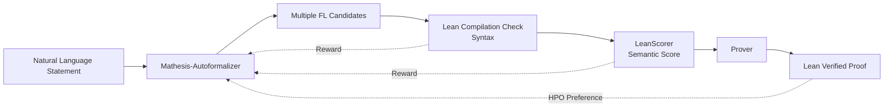

# Mathesis: Towards Formal Theorem Proving from Natural Languages

**Conference**: ICLR 2026  
**OpenReview**: [https://openreview.net/forum?id=CJdX82odge](https://openreview.net/forum?id=CJdX82odge)  
**Code**: [https://github.com/Huawei-AI4Math/Mathesis](https://github.com/Huawei-AI4Math/Mathesis)  
**Area**: LLM Reasoning / Autoformalization / Formal Theorem Proving  
**Keywords**: autoformalization, formal theorem proving, reinforcement learning, GRPO, semantic evaluation, Lean 4  

## TL;DR
Mathesis systematically bridges the gap from "natural language math problems → formal statements → machine-verifiable proofs" for the first time. The core is an autoformalizer trained using online reinforcement learning (GRPO + Hierarchical Preference Optimization), complemented by the LeanScorer evaluation framework for continuous semantic scoring and the challenging Gaokao-Formal benchmark.

## Background & Motivation
**Background**: Current LLM-based theorem provers, such as DeepSeek-Prover-V2, Kimina-Prover, and Goedel-Prover, have shown strong performance on benchmarks like MiniF2F and PutnamBench. However, these benchmarks rely on **expert-written formal statements** as input (formal-to-formal, F2F).

**Limitations of Prior Work**: Real-world math problems are almost exclusively written in natural language (NL) and cannot be directly processed by provers, while manual formalization is labor-intensive. "Autoformalization," which delegates this step to models, faces two long-standing weaknesses: first, mainstream autoformalizers (e.g., Kimina-Autoformalizer) are trained via SFT on static NL-FL pairs and **cannot learn dynamically from direct feedback regarding syntactic or semantic correctness**; second, semantic evaluation is often limited to "Lean compilation success" or "binary LLM judgment," failing to capture **fine-grained semantic errors** (e.g., mistakenly placing the proof goal into the premises or misinterpreting summation ranges, as shown in Figure 1).

**Key Challenge**: Formalization quality is the bottleneck of the entire pipeline. Poor formalization leads to provers either being misled into "false successes" or facing statements that are fundamentally unprovable. However, there is a lack of effective autoformalizers, reliable semantic evaluators, and challenging benchmarks that can expose semantic errors.

**Goal**: This work provides the first systematic study of the entire "natural language to formal theorem proving" workflow, simultaneously addressing the autoformalizer, semantic evaluation, and benchmark gaps.

**Core Idea**: **Unify signals from syntactic verification (Lean compilation), semantic correctness (LeanScorer), and prover feedback into a reinforcement learning reward mechanism.** This allows the autoformalizer to learn online to generate statements that are compilable, semantically faithful, and conducive to downstream proving.

## Method

### Overall Architecture
Mathesis is a three-stage pipeline: **Autoformalization → Verification → Proving**. Given an NL problem, the Mathesis-Autoformalizer first generates multiple Lean 4 candidate statements. These candidates enter the verification stage, undergoing syntax checks via the Lean compiler and semantic checks via LeanScorer. Only statements passing both checks are sent to the prover to generate complete, verifiable Lean proofs. The key to training is using GRPO + HPO to backpropagate feedback from this chain into the autoformalizer.

### Key Designs

**1. GRPO Autoformalization with Composite Rewards: Integrating "Compilability" and "Semantic Correctness."** The model policy $\pi_\theta$ is initialized from Kimina-Autoformalizer (a 7B SFT model). For each NL input $x$, a group of $G$ candidates $\{o_1,\dots,o_G\}$ is sampled, and Group Relative Policy Optimization (GRPO) is used for relative preference optimization within the group. The reward consists of two binary terms: a semantic correctness reward $R_{sem}(x,o_i)$ judged by an auxiliary LLM evaluator as "Appropriate" (1/0), and a syntactic verification reward $R_{ver}(o_i)$ checked by the Lean 4 validator (up to `:= by sorry`) (1/0). The final reward is $r_i = R_{sem} + R_{ver}$. The authors intentionally avoid weighting; since GRPO optimizes relative preferences within a group rather than absolute magnitudes, it is insensitive to uniform scaling, making simple summation robust and sufficient for SOTA performance. Syntactic validity is a "necessary condition" (non-compilable statements are useless to provers), while semantic correctness ensures the formalization corresponds to the actual problem.

**2. Hierarchical Preference Optimization (HPO): Aligning Local Syntax/Semantics first, then Global Proof Success.** While GRPO aligns the autoformalizer with local objectives like compilability, the ultimate goal is to **enable downstream provers to find a proof**. Thus, a layer of Direct Preference Optimization (DPO) is added after GRPO. For each NL statement, candidate formalizations are sampled; those passing syntax and semantic checks are sent to the prover. Preference pairs are constructed based on proof success: successful formalizations $\{x, o_i^w, z_i^w\}$ as positive samples and failed ones $\{x, o_i^l, z_i^l\}$ as negative samples, with DPO coefficient $\beta=0.1$. This two-stage process—GRPO for grounding and DPO for proof alignment—is termed Hierarchical Preference Optimization. GRPO provides the strong initialization necessary for DPO to sample meaningful candidates.

**3. LeanScorer: Upgrading Semantic Evaluation from Binary to Continuous Scoring.** Instead of asking an LLM for a simple "correct/incorrect" judgment, the NL statement is **decomposed into multiple sub-tasks** (premises, conclusions, etc.). Each is aligned with the FL statement and labeled with three grades: Match (M1), Minor Inconsistency (M½), and Major Inconsistency (M0). Mathematical inequalities or missing conditions are marked M0, semantic equivalence with minor variations as M½, and complete alignment as M1. Extra assumptions in the FL or missing sub-tasks from the NL are counted as misalignments, capturing both "over-translation" and "under-translation." Scores are aggregated using the **Sugeno fuzzy integral**: with mapping $f(M1)=1.0,\ f(M\tfrac12)=0.5,\ f(M0)=0$, the fuzzy measure is defined as:

$$\mu(s) = \begin{cases} 0 & \exists l \in s,\ l = M0 \\ \max\left\{\dfrac{n_s}{n}\cdot(1-\delta\cdot n_{M\frac12}),\ 0\right\} & \text{otherwise} \end{cases}$$

where $n_s$ is the subset size and $n_{M\frac12}$ is the count of M½ labels, with $\delta=0.1$ if $n_{M\frac12}\le1$ and $0.2$ otherwise. This design is both flexible and strict: a single M0 results in a zero score (punishing critical flaws), while all-Match yields a full score, and multiple Minor errors result in proportional deductions. Labels are sorted in ascending order to form suffix sets $s_i$, and the LeanScore is:

$$S(L,f,\mu) = \max_{1\le i\le n} \min\big(f(l_{\pi(i)}),\ \mu(s_i)\big)$$

A threshold $\alpha$ (default 0.6) can map the continuous score to a binary decision. This mechanism is more robust to LLM output fluctuations while maintaining strict evaluative standards.

**4. Gaokao-Formal Benchmark: Targetting Hard-to-Formalize Real Problems.** Existing benchmarks often overlook F2F or exclude "hard-to-formalize" types like geometry, combinatorics, and applied problems. Gaokao-Formal includes **495 proof problems** from the Chinese Gaokao (2008-2025), each with original Chinese, English translation, and manual Lean 4 formalization. It covers 7 categories including functions (168), sequences (148), and analytic geometry (76), specifically designed to expose weaknesses in autoformalization. Training data is curated via BERTopic clustering and filtered through base model rollouts (k=14) to remove zero-variance reward samples, totaling approximately 32k problems.

## Key Experimental Results

### Semantic Evaluation Framework (LeanScorer vs. Baselines)
On the manually labeled Gaokao-Formal subset with threshold $\alpha=0.6$:

| Method | Precision | Recall | F1 |
|--------|-----------|--------|-----|
| LLM-as-a-Judge | 73 | 100 | 0.85 |
| Re-informalization | 93 | 50 | 0.65 |
| **LeanScorer (Ours)** | **94** | **89** | **0.92** |

LLM-as-a-Judge achieves perfect recall but only 73% precision (many false positives). Re-informalization has high precision but recall drops to 50%. LeanScorer achieves both high precision and high recall, outperforming LLM-as-a-Judge by 7 points and Re-informalization by 27 points in F1.

### Autoformalization Quality (LC@6 / LC+LSC@6, selected)

| Model | MiniF2F LC | MiniF2F LC+LSC | Putnam LC+LSC | Gaokao LC+LSC |
|-------|-----------|----------------|---------------|---------------|
| Kimina-Autoformalizer | 100 | 91 | 10 | 49 |
| Mathesis-Autoformalizer | 100 | 95 | 25 | 67 |
| **Mathesis-HPO** | 100 | **96** | **30** | **71** |

On Gaokao-Formal, Mathesis-HPO improves LC+LSC@6 from 49% to 71% (+22 points, relative +45%); on Putnam, it improves from 10% to 30% (relative +200%); on MiniF2F, it sets a new record of 96%. Mathesis-HPO averages 311%/86% improvement over much larger API models in LC@6/LC+LSC@6.

### Ablation Study and End-to-End Proof (pass@32 gain)

| Comparison | Gaokao-Formal | MiniF2F |
|------|---------------|---------|
| GRPO → +HPO (Autoformalization score) | 67%→71% | 95%→96% |
| HPO vs GRPO (Avg. Downstream Proof) | +13% | +2% |

Replacing the autoformalizer with Mathesis-HPO improved Goedel, Kimina, and DeepSeek-Prover-V2 on Gaokao-Formal by 86%, 116%, and 122% respectively.

### Key Findings
- **Formalization quality is strongly positively correlated with proof accuracy**. Improving the autoformalizer often yields greater gains than improving the prover—formalization is the true bottleneck for difficult problems.
- HPO prover feedback rewards provide end-task benefits beyond "pure syntax/semantic checks," validating the alignment with the global "provability" goal.

## Highlights & Insights
- **Holistic System Approach**: While previous works focus on either provers or autoformalizers, Mathesis connects NL→FL→proof for the first time, identifying formalization as the long-overlooked bottleneck.
- **Restrained Reward Engineering**: Simple summation of two binary rewards without weighting is justified by the scale-insensitivity of GRPO's relative optimization, avoiding over-parameterization.
- **Fuzzy Integral Aggregation in LeanScorer**: This elegantly balances zero-tolerance for major flaws (M0) with proportional penalties for minor ones, offering more nuance than binary judgments and more logic than simple averaging.
- **Value of Hierarchical Alignment**: The strategy of using online RL for local verifiable signals followed by offline DPO for sparse global success signals is a generic paradigm for "grounding then refining."

## Limitations & Future Work
- Defining "formalization correctness" is inherently difficult—it often depends on whether it **impedes the proof process** (e.g., explicit domain declarations), a vagueness that poses challenges for both training and evaluation.
- Full automation for practical deployment remains distant; Gaokao-Formal is limited to exam-style problems, with fewer extreme cases in geometry or combinatorics.
- While the method is principles-based and transferable to Isabelle or Coq, it has only been validated on Lean 4.

## Related Work & Insights
- **Formal Theorem Proving (F2F)**: Models like DeepSeek-Prover-V2 assume formal inputs; Mathesis fills the "starting from NL" gap. Unlike Lego-Prover, which requires informal proof drafts, Mathesis is fully automated from NL statements.
- **Autoformalization**: Moving beyond prompting and static SFT (e.g., Kimina-Autoformalizer), Mathesis is the first to introduce online RL with prover feedback.
- **Semantic Evaluation**: Compared to training-free LLM-as-a-Judge or the training-based FormalAlign, LeanScorer provides finer granularity and robustness via sub-task decomposition and fuzzy integration.
- **Insight**: When the "final goal" is hard to supervise directly (proof success) but cheap proxy signals exist (compilation, semantic checks), a "multi-signal composite reward + hierarchical RL alignment" represents a highly reproducible path for complex reasoning tasks.

## Rating
- **Novelty**: ⭐⭐⭐⭐ First autoformalizer trained using online RL (with prover feedback); LeanScorer’s fuzzy integral and Gaokao-Formal are significant contributions.
- **Experimental Thoroughness**: ⭐⭐⭐⭐ Covers MiniF2F, Putnam, and Gaokao; tests multiple provers and includes detailed ablations; missing cross-assistant validation is a minor detractor.
- **Writing Quality**: ⭐⭐⭐⭐ Clearly defined tasks; intuitive diagrams; organized tables.
- **Value**: ⭐⭐⭐⭐ Pushes formal reasoning towards real-world natural language problems and clearly identifies the formalization bottleneck.

<!-- RELATED:START -->

## Related Papers

- [\[ICLR 2026\] Process-Verified Reinforcement Learning for Theorem Proving via Lean](process-verified_reinforcement_learning_for_theorem_proving_via_lean.md)
- [\[ICLR 2026\] Neural Theorem Proving for Verification Conditions: A Real-World Benchmark](neural_theorem_proving_for_verification_conditions_a_real-world_benchmark.md)
- [\[ICLR 2026\] EvolProver: Advancing Automated Theorem Proving by Evolving Formalized Problems via Symmetry and Difficulty](evolprover_advancing_automated_theorem_proving_by_evolving_formalized_problems_v.md)
- [\[ICLR 2026\] Long Chain-of-Thought Reasoning Across Languages](long_chain-of-thought_reasoning_across_languages.md)
- [\[ICLR 2026\] Hilbert: Recursively Building Formal Proofs with Informal Reasoning](hilbert_recursively_building_formal_proofs_with_informal_reasoning.md)

<!-- RELATED:END -->
