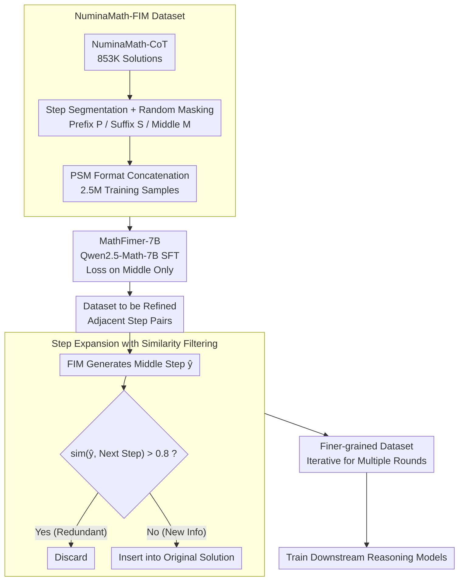

# MathFimer: Enhancing Mathematical Reasoning by Expanding Reasoning Steps through Fill-in-the-Middle Task

**Conference**: ICLR 2026  
**arXiv**: [2502.11684](https://arxiv.org/abs/2502.11684)  
**Code**: None  
**Area**: Code Intelligence  
**Keywords**: Mathematical Reasoning, Fill-in-the-Middle, Reasoning Step Expansion, Chain-of-Thought, Data Augmentation

## TL;DR

Drawing on the Fill-in-the-Middle (FIM) paradigm from code completion, this work trains a specialized step expansion model, MathFimer-7B, to insert finer-grained intermediate reasoning steps into existing mathematical solution chains, thereby systematically enhancing the mathematical reasoning capabilities of downstream models.

## Background & Motivation

Chain-of-Thought (CoT) is the mainstream paradigm for LLM mathematical reasoning, but the quality and granularity of reasoning steps in training data directly limit model performance. Prior research (Jin et al., 2024) indicates that more detailed intermediate steps can significantly improve reasoning accuracy. However, existing step expansion methods face three major issues:

**Dependence on Stronger Models**: They require larger external models to generate better steps, creating a "bigger is better" recursive dependency.

**High Computational Cost**: Search strategies like MCTS require substantial computing power when exploring reasoning paths.

**Insufficient Reliability**: These methods typically generate entirely new reasoning chains rather than enhancing existing human-verified steps, potentially introducing new errors.

**Core Problem**: Can a more efficient and reliable method be developed to expand reasoning steps while preserving the validity of existing human-generated solutions?

## Method

### Overall Architecture

MathFimer decomposes the refinement of reasoning chains into two stages: training a specialized step completion model and then using it to "refine" every solution in an existing dataset. Both stages are based on the Fill-in-the-Middle concept from code completion—given a prefix and a suffix, the model predicts the missing middle part, though here the "middle" consists of mathematical reasoning steps rather than code. The pipeline operates as follows: transform NuminaMath-CoT into a "mask-and-fill" FIM training set (Design 1) $\rightarrow$ fine-tune a lightweight completion model, MathFimer-7B, on a mathematical base (Design 2) $\rightarrow$ attempt to insert an intermediate step between every pair of adjacent steps and filter redundancies using similarity (Design 3) $\rightarrow$ obtain a finer-grained dataset to train downstream reasoning models.

### Key Designs

**1. NuminaMath-FIM Dataset: Framing "Step Completion" as an FIM Task**

To train a model capable of inserting intermediate steps, supervised data in a "mask-and-fill" format is required. The authors perform step-level segmentation based on NuminaMath-CoT (853K math Q&A pairs). Each solution is represented as an ordered sequence of steps $Y = \{y_1, y_2, ..., y_n\}$. A random step $y_i$ is masked, with $y_1...y_{i-1}$ serving as the prefix $P$, $y_{i+1}...y_n$ as the suffix $S$, and the masked $y_i$ as the middle step $M$ to be predicted. Each sample undergoes 3 rounds of random sampling to cover different mask positions, resulting in 2.5M training samples. Sequences are concatenated in PSM (Prefix-Suffix-Middle) format using special tokens `<|fim_prefix|>`, `<|fim_suffix|>`, and `<|fim_middle|>` to help the model distinguish context from content to be generated.

**2. MathFimer-7B: Learning a Lightweight Completer with a Math Base**

The model does not need to be exceedingly large. The authors use the domain-specific Qwen2.5-Math-7B as the base for SFT. The learning objective is $\text{FIM}(Q, P, S) \Rightarrow M$—predicting the middle step given the question $Q$, prefix, and suffix. Loss is calculated only for tokens following `<|fim_middle|>`, with the prefix and suffix acting as conditions without gradient backpropagation, ensuring the model focuses on "filling the middle" rather than repeating context. Ablation results show that 7B and 72B models perform similarly in expansion, as the task of generating a single intermediate step does not strictly demand massive model capacity.

**3. Similarity-filtered Step Expansion: Selective Insertion**

During deployment, the model attempts to insert an intermediate step between every pair of adjacent steps in the original solution: $\hat{y}_i = \text{FIM}(Q, y_1...y_{i-1}, y_i...y_n)$. However, not every gap requires expansion. If the original "next step" is already detailed, the generated content might be highly redundant. Thus, a similarity filtering mechanism is introduced. The sequence similarity between the generated step $\hat{y}_i$ and the original next step $y_i$ is calculated. Using a threshold $\eta = 0.8$, if the similarity exceeds the threshold, the step is deemed redundant; only steps with low similarity that provide new information are inserted. This prevents redundant inflation while preserving the structure of the original human steps, avoiding the risk of new errors associated with regenerating entire chains.

### Loss & Training

Standard cross-entropy loss is used, applied only to tokens in the middle segment. The SFT is implemented using the Megatron-LM framework with `max_length = 8192`, global batch size = 128, and a learning rate of 1e-5. All samples are packed to improve throughput. Training was completed on 64 Ascend H910B-64G GPUs.

## Key Experimental Results

### Main Results

Comprehensive experiments across 4 base models and 5 datasets were conducted:

| Base Model | Dataset | GSM8K | MATH | Odyssey | OB-EN | Average Gain |
|---------|--------|-------|------|---------|-------|---------|
| Llama-3.1-8B | MathInstruct-CoT | 67.78→75.21 | 18.74→22.90 | 22.11→24.42 | 2.37→3.56 | **+3.77** |
| Llama-3.1-70B | MathInstruct-CoT | 89.31→90.98 | 41.96→44.72 | 36.50→39.33 | 9.19→12.15 | **+2.56** |
| Qwen2.5-Math-7B | MetaMathQA | 93.18→93.10 | 70.22→79.08 | 49.10→52.70 | 34.81→41.04 | **+4.65** |
| Qwen2.5-Math-72B | MetaMathQA | 90.22→92.95 | 57.68→63.40 | 42.93→47.30 | 20.00→24.89 | **+4.43** |

### Ablation Study

| Configuration | Key Metric | Description |
|------|---------|------|
| Distilled vs. Original | G+M Orig +5.61 vs. Distilled +1.13 (GSM8K) | Partial gain comes from distillation, but FIM expansion provides extra gain |
| Iterative Expansion (1→3 rounds) | MI-CoT: 67.78→75.21→80.21→83.32 (GSM8K) | Iterative expansion yields continuous gains; 3 rounds improve +15.54% |
| Model Scale (7B vs 72B) | 7B: +7.43 vs 72B: +6.14 (GSM8K, MI-CoT) | Performance gap is minimal, indicating expansion is not dependent on large models |

### Key Findings

1. **Strong Universality**: MathFimer is effective for both general models (Llama) and math-specific models (Qwen-Math), showing consistent gains across 4 bases and 5 datasets.
2. **Iterative Scalability**: Multi-round step expansion accumulates improvements, reaching +15.54% on GSM8K after 3 rounds.
3. **Small Model Sufficiency**: The expansion performance of MathFimer-7B and 72B is very close, suggesting the task does not require massive capacity.
4. **Math Models Benefit Most**: The Qwen2.5-Math series achieved the largest gains on MetaMathQA and ScaleQuest (MATH +8.86%).

## Highlights & Insights

- **Clever Analogy Transfer**: Successfully transfers the mature FIM paradigm from code completion to mathematical reasoning step expansion.
- **Structural Preservation**: Unlike methods that regenerate the entire chain, MathFimer inserts steps into the original structure, making it more reliable.
- **Similarity Filtering Mechanism**: Automatically determines if a position needs expansion, avoiding redundant insertions.
- **Practicality**: Eliminates the need for stronger external models; a 7B model can handle the expansion task.
- **Data Assets**: Open-sourced the NuminaMath-FIM dataset (2.5M samples) and the MathFimer-7B model.

## Limitations & Future Work

1. **Domain Generalization Unknown**: Effectiveness has only been verified for math; applicability to code, logic, or common-sense reasoning is unclear.
2. **Generation Reliability**: Lacks an automatic verification mechanism for logical consistency and mathematical correctness in inserted steps; multiple iterations may accumulate errors.
3. **Methodological Constraints**: Primarily expands existing solving patterns; exploration of novel methods for highly complex or unconventional problems is limited.
4. **Lack of Adaptive Expansion**: Currently applies expansion to all step pairs uniformly, lacking intelligent judgment on which steps truly require more detail.

## Related Work & Insights

- CoT Prompting (Wei et al., 2023) and Self-Consistency (Wang et al., 2023) are foundational for reasoning enhancement.
- Jin et al. (2024) demonstrated the vital impact of reasoning step length on LLMs.
- MCTS methods (Chen et al., 2024; Guan et al., 2025) focus on searching for optimal paths.
- Unlike OpenMathInstruct (Toshniwal et al., 2024), MathFimer does not rely on strong models to generate new data.
- **Insight**: The FIM paradigm can likely be generalized to any sequential task requiring "intermediate step completion."

## Rating
- Novelty: ⭐⭐⭐⭐ (Transferring FIM to math is novel, though essentially data augmentation)
- Experimental Thoroughness: ⭐⭐⭐⭐⭐ (Comprehensive across 4 bases, 5 datasets, and 4 benchmarks)
- Writing Quality: ⭐⭐⭐⭐ (Clear structure and detailed experiments)
- Value: ⭐⭐⭐⭐ (Simple and practical method for enhancing existing datasets)

<!-- RELATED:START -->

## Related Papers

- [\[ICLR 2026\] VoG: Enhancing LLM Reasoning through Stepwise Verification on Knowledge Graphs](vog_enhancing_llm_reasoning_through_stepwise_verification_on_knowledge_graphs.md)
- [\[ICLR 2026\] Expanding Reasoning Potential in Foundation Model by Learning Diverse Chains of Thought Patterns](expanding_reasoning_potential_in_foundation_model_by_learning_diverse_chains_of_.md)
- [\[ACL 2025\] ClozeMath: Improving Mathematical Reasoning in Language Models by Learning to Fill Equations](../../ACL2025/llm_reasoning/clozemath_improving_mathematical_reasoning_in_language_models_by_learning_to_fil.md)
- [\[ICLR 2026\] Generative Adversarial Reasoner: Enhancing LLM Reasoning with Adversarial Reinforcement Learning](generative_adversarial_reasoner_enhancing_llm_reasoning_with_adversarial_reinfor.md)
- [\[ICLR 2026\] Learning Global Hypothesis Space for Enhancing Synergistic Reasoning Chain](learning_global_hypothesis_space_for_enhancing_synergistic_reasoning_chain.md)

<!-- RELATED:END -->
