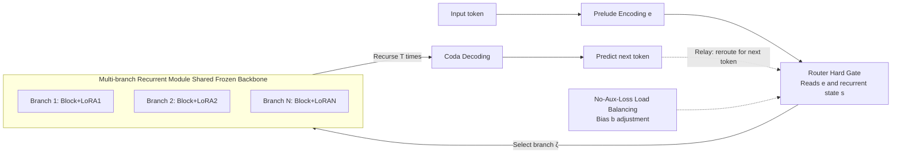

# MoDr: Mixture-of-Depth-Recurrent Transformers for Test-Time Reasoning

**Conference**: ICLR 2026  
**OpenReview**: [https://openreview.net/forum?id=9Pba4rcQbE](https://openreview.net/forum?id=9Pba4rcQbE)  
**Code**: [https://github.com/zhangxjohn/MoDr](https://github.com/zhangxjohn/MoDr)  
**Area**: LLM Reasoning / Latent Space Reasoning / Recurrent Depth Transformer  
**Keywords**: Depth-Recurrent Transformer, Huginn, Latent Space Reasoning, Mixture-of-Experts, LoRA, Dynamic Routing, Test-Time Compute  

## TL;DR
Decouples the "single-chain" latent space recurrent module of Depth-Recurrent Transformers (Huginn) into multiple recurrent branches that share a backbone with individual LoRAs. It employs a hard-gate router without auxiliary loss to dynamically switch branches during each token's generation, significantly improving math and commonsense reasoning accuracy by training $<0.2\%$ of parameters.

## Background & Motivation
**Background**: Mainstream LLMs rely on Chain-of-Thought (CoT) to "explicitly" write intermediate steps in natural language, which increases computational cost and latency. An alternative path is **latent space reasoning**—using looped structures to "think deeply" repeatedly in a continuous latent space. Huginn (Geiping et al. 2025) decomposes a 3.5B Transformer into Prelude (encoding), Loop (recurrent block), and Coda (decoding). By reusing the same Loop block $T$ times in the latent space, the effective compute depth per token increases, with performance scaling steadily with the number of recursions while maintaining low memory and latency.

**Limitations of Prior Work**: Each reasoning step in Huginn depends on **the same fixed recurrent module**, resulting in a unidirectional, chain-like reasoning trajectory. This rigid structure limits the model's ability to explore or backtrack within the solution space.

**Key Challenge**: From the perspective of thinking structures, the evolution from chain-like (CoT) $\to$ tree-like (ToT, allowing exploration/backtracking) $\to$ graph-like (GoT, allowing sub-problem aggregation/self-verification) suggests that "multi-path exploration" is superior to a "single chain." However, Huginn's single recurrent module is inherently chain-like, leading to **naturally limited exploration capabilities**. The difficulty lies in: how to add adaptive "exploration-rumination" modules to Huginn **without introducing extra computational or VRAM burdens**?

**Goal**: Upgrade linear latent reasoning into a multi-branch, dynamically switchable "relay exploration" mode while freezing the Huginn backbone and maintaining nearly zero additional overhead.

**Core Idea (Mixture-of-Depth-Recurrent)**: Construct an "expert branch library" using multiple recurrent branches that share backbone weights but each have an independent LoRA. A hard-gate router dynamically selects a branch based on the context to perform "relay reasoning" for each token, using a bias-based load balancing strategy without auxiliary loss to prevent routing collapse.

## Method

### Overall Architecture
Based on Huginn's Prelude/Loop/Coda framework, MoDr only transforms the central Loop (recurrent module). It replicates the single recurrent block into $N$ "branches," where each branch = **shared frozen recurrent block + one independent LoRA**. A hard-gate routing network reads the latent context state to select one branch for the current token to execute its $T$ iterations of "deep thinking." The next token may switch to another branch, forming a "relay race" across branches. Only the LoRAs and the router are updated during training, with bias terms used for load balancing.

### Key Designs

**1. LoRA-based Multi-branch Recurrent Module**: Stack "cheap" exploration branches using low-rank adapters. Huginn's recurrent blocks follow the standard Transformer "sandwich" structure (Attention + MLP, each with residuals and LayerNorm). The hidden state update for the original $l$-th block is $\hat z^l_t = \text{LN}(\text{Attn}(\text{LN}(z^{l-1}_t)\mid W^l) + z^{l-1}_t)$ and $z^l_t = \text{LN}(\text{MLP}(\text{LN}(\hat z^l_t)\mid W^l) + \hat z^l_t)$. Full fine-tuning of multiple independently initialized recurrent modules would incur massive computational and VRAM costs. MoDr's trick is to let all branches **share the same frozen backbone $W^l$** and attach an independent LoRA $\Delta W^l_j$ to each branch. The forward pass for branch $j$ becomes $z = W_0 x + \frac{\alpha}{r}\Delta W x = W_0 x + \frac{\alpha}{r}BAx$ (where $B\in\mathbb R^{h\times r}$, $A\in\mathbb R^{r\times k}$, and rank $r\ll\min(h,k)$). This **freezes the backbone to preserve world knowledge** and avoids computational increases—total trainable parameters are less than 0.2% of the base Huginn.

**2. Hard-gate Branch Routing**: Select branches in a "relay" fashion for each token based on latent context. The router considers two inputs: the Prelude output $e$ and the current recurrent state $s$. These are concatenated and mapped to the hidden dimension $h$ via an adapter matrix $\mathbb R^{2h}\to\mathbb R^h$. Given routing weights $W_{\text{router}}\in\mathbb R^{N\times h}$, branch scores are calculated as $u = W_{\text{router}}h^\top$. Scores are averaged across the token dimension and passed through a sigmoid to get $r = \sigma(\frac1n\sum_{i=1}^n u_i)\in\mathbb R^N$. The branch with the highest confidence is selected: $\zeta = \arg\max_j r_j$ (Top-1 hard gate). The hidden state of the selected branch is weighted by its gate score $g = r_\zeta$ as $z^{l,'}_{j,t} = g\cdot z^l_{j,t}$. The **router is invoked for every new token generated**, meaning "deep thinking" for consecutive tokens is shared across branches.

**3. No-Auxiliary-Loss Load Balancing**: Use bias terms to prevent routing collapse without polluting gradients. MoE routing often collapses to a few branches. Instead of traditional auxiliary losses—which can introduce conflicting gradients—MoDr adds a **bias $b_i$** to each branch's gate score $r_i$. Branch selection uses $\hat r = r + b$ to find $\hat\zeta = \arg\max_j \hat r_j$, but the final weighting score $g = r_{\hat\zeta}$ **excludes the bias** (the bias influences "who is chosen" but not the "weight intensity"). Biases are updated online: each batch counts the samples $c_i$ assigned to each branch against the mean $\bar c_i$, calculates the load violation error $e_i = \bar c_i - c_i$, and adjusts via $b_i = b_i + \eta\cdot\text{sign}(e_i)$.

## Key Experimental Results
Setting: 3.5B Huginn base. MoDr uses 4 LoRA branches (rank and alpha = 16, applied to q/k/v/o projections) + Top-1 hard gate. Average recursions $T=32$, BPTT truncated to the last 8 steps. Trainable parameters $<0.2\%$. Baselines include original Huginn, Huginn-SFT (LoRA fine-tuned), and a multi-branch Huginn without routing (random selection).

### Main Results (Math Reasoning, Unit: %)

| Method | GSM8K (ID) | MAWPS (ID) | AQuA (ID) | MultiArith (OOD) | AddSub (OOD) | SingleEq (OOD) | Avg (6 Datasets) |
|------|-----------|-----------|----------|-----------------|-------------|---------------|--------------|
| Huginn | 43.59 | 71.85 | 27.95 | 79.83 | 71.90 | 76.97 | 62.02 |
| Huginn-SFT | 49.43 | 78.15 | 30.71 | 87.17 | 74.68 | 80.31 | 66.74 |
| **MoDr (Ours)** | **49.89** | **80.67** | **33.07** | **91.17** | **79.24** | **81.30** | **69.22** |

MoDr achieves a **+7.2% / +2.48%** Gain over Huginn / Huginn-SFT. OOD gains (+7.67% / +3.18%) are higher than ID gains (+6.75% / +1.78%), indicating stronger generalization.

### Ablation Study (Effect of Routing, Avg. Acc %)

| Config | GSM8K | MAWPS | AQuA | MultiArith | AddSub | SingleEq | Average |
|------|-------|-------|------|------------|--------|----------|------|
| No Router (Random Train/Test) | **50.72** | 79.41 | 31.89 | 90.17 | 75.70 | 76.57 | 67.41 |
| MoDr w/o Router (Random Test) | 48.60 | 77.73 | 29.92 | 89.17 | 74.68 | 78.35 | 66.41 |
| **MoDr w/ Router** | 49.89 | **80.67** | **33.07** | **91.17** | **79.24** | **81.30** | **69.22** |

### Key Findings
- **Load Balancing Efficacy**: $\eta=0$ leads to routing collapse (low balance entropy, Avg.Acc=68.66), while $\eta=0.001$ yields better balance and generalization (69.22).
- **Branch Count Sweet Spot**: Performance rises monotonically from 1 to 4 branches; gains diminish beyond 4.
- **Spontaneous Branch Specialization**: Branch-2 acts as a "generalist," while Branch-3 focuses on complex arithmetic (activated 46.72% in MultiArith) and Branch-4 on multiple-choice like AQuA (33.16%), proving non-redundant specialization.

## Highlights & Insights
- **Moving MoE+LoRA to "Block-level Recurrent Branches"**: Unlike traditional MoELoRA that uses intra-layer experts, MoDr applies the MoE structure to the recurrent block—which is reused $T$ times—allowing architectural diversity to act directly on the latent reasoning trajectory.
- **Near-Zero Cost Exploration**: Freezing the backbone and training $<0.2\%$ parameters transforms single-chain latent reasoning into multi-branch relay exploration, with significant OOD gains.
- **"Relay Race" Token-level Dynamic Depth**: Re-routing every token assigns different "thinking paths" to different tokens, coming closer to the ideal of "adaptive computation."

## Limitations & Future Work
- **Top-1 Hard Gate Limitation**: Only one branch is active per token; multi-branch parallel execution or soft fusion has not been explored.
- **Sub-optimal Routing**: Ablations show MoDr ranks 3rd on AQuA/MultiArith compared to single-branch baselines, suggesting the router doesn't always pick the optimal branch.
- **Base Model Dependency**: The method is tied to the Prelude/Loop/Coda structure of Huginn 3.5B; transferability to other recurrent Transformers is unverified.
- **Task Scope**: Experimental coverage is limited to small/medium math and commonsense datasets; complex reasoning like code or long-chain multi-hop remains untested.

## Related Work & Insights
- **Recurrent Depth**: Universal Transformer, AlgoFormer, and Huginn increase effective depth via weight sharing; MoDr is a direct extension of Huginn's recurrent module.
- **Reasoning Structures**: The CoT $\to$ ToT $\to$ GoT evolution inspired the judgment that single-chain exploration is insufficient; MoDr approximates "multi-path" exploration.
- **MoE & PEFT**: Utilizes hard-gate routing from Switch Transformers, low-rank adaptation from LoRA/MoLA, and no-auxiliary-loss load balancing from DeepSeek.
- **Insight**: Expertizing the "repeatedly reused module" is a high-leverage entry point for MoE in latent reasoning.

## Rating
- **Novelty**: ⭐⭐⭐⭐ — First to introduce dynamic MoE+LoRA routing into the loop of a Depth-Recurrent Transformer.
- **Experimental Thoroughness**: ⭐⭐⭐ — Solid across math/commonsense and ID/OOD, but limited to a single 3.5B base model.
- **Writing Quality**: ⭐⭐⭐⭐ — Clear motivation chain (single-chain $\to$ multi-path) and intuitive diagrams.
- **Value**: ⭐⭐⭐⭐ — Provides a low-cost, reproducible path for adaptive depth reasoning with meaningful generalization gains.

<!-- RELATED:START -->

## Related Papers

- [\[ICLR 2026\] ChainGPT: Dual-Reasoning Model with Recurrent Depth and Multi-Rank State Updates](chaingpt_dual-reasoning_model_with_recurrent_depth_and_multi-rank_state_updates.md)
- [\[ICLR 2026\] TUMIX: Multi-Agent Test-Time Scaling with Tool-Use Mixture](tumix_multi-agent_test-time_scaling_with_tool-use_mixture.md)
- [\[ICLR 2026\] PERK: Long-Context Reasoning as Parameter-Efficient Test-Time Learning](perk_long-context_reasoning_as_parameter-efficient_test-time_learning.md)
- [\[ICLR 2026\] Learning to Reason via Mixture-of-Thought for Logical Reasoning](learning_to_reason_via_mixture-of-thought_for_logical_reasoning.md)
- [\[NeurIPS 2025\] A Little Depth Goes a Long Way: The Expressive Power of Log-Depth Transformers](../../NeurIPS2025/llm_reasoning/a_little_depth_goes_a_long_way_the_expressive_power_of_logde.md)

<!-- RELATED:END -->
