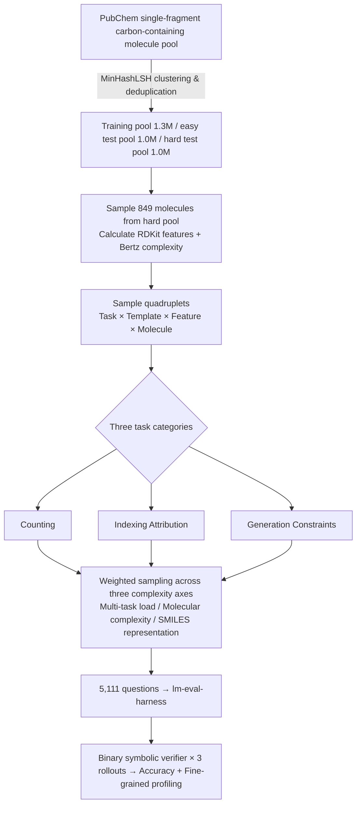

# MolecularIQ: Characterizing Chemical Reasoning Capabilities Through Symbolic Verification on Molecular Graphs

**Conference**: ICLR 2026  
**OpenReview**: [https://openreview.net/forum?id=RqwEzZqMFv](https://openreview.net/forum?id=RqwEzZqMFv)  
**Code**: [https://github.com/ml-jku/moleculariq](https://github.com/ml-jku/moleculariq) (Includes leaderboard, symbolic solver, and dataset)  
**Area**: LLM Reasoning Evaluation / Chemical Structure Reasoning / Benchmark  
**Keywords**: Molecular graph reasoning, Symbolic verification, SMILES, RDKit, Verifiable rewards, Chemistry LLM  

## TL;DR
MolecularIQ is the first **fully symbolic verifiable** molecular structure reasoning benchmark. All answers are precisely calculated from molecular graphs using RDKit, completely decoupling "true structural understanding" from "memorized molecule-property pairs." It fine-grainedly identifies where 38 LLMs fail across task types, molecular complexity, and representation forms.

## Background & Motivation
- **Background**: LLMs are increasingly used as unified chemical assistants, aiming to cover naming conversion, property prediction, reaction prediction, and molecular generation. This drives a surge in demand for evaluating chemical capabilities in general and specialized LLMs.
- **Limitations of Prior Work**: Existing chemical benchmarks either rely on multiple-choice questions (testing **factual memory**) or use labels from public datasets like MoleculeNet/USPTO. The latter suffer from **data leakage**, making it impossible to distinguish "structural reasoning" from "memorized pairs." When ground truth is missing, they rely on surrogate predictors or heuristics, introducing **judge bias**.
- **Key Challenge**: The fundamental principle of chemistry is "structure determines property," so **structural understanding is a prerequisite for molecular reasoning, not just one of many capabilities**. However, current benchmarks obscure whether LLMs actually reason on molecular graphs or merely perform token pattern matching.
- **Goal**: Create a benchmark containing only symbolic verifiable tasks where every answer can be programmatically verified to ensure label correctness, eliminate judge bias, and precisely locate where and why models fail.
- **Key Insight**: **[Symbolic Verification as Diagnostic Probes]** These tasks can be solved instantly by cheminformatics software, which is precisely their value—they set a "baseline" that any model internalizing molecular structure should not fall below. A model with high property prediction scores that fails to identify basic substructures is likely exploiting dataset correlations rather than reasoning. **[Inferring 2D Graphs from 1D Strings]** LLMs treat molecules as SMILES sequences; these tasks implicitly test whether they can reconstruct 2D graph topology from linear strings.

## Method

### Overall Architecture
MolecularIQ decomposes "molecular structure reasoning" into a Cartesian combination of **three task categories × six symbolic verifiable features × three orthogonal complexity axes**. For each feature, an RDKit symbolic solver calculates the ground truth. Questions are sampled based on the (task, template, feature, molecule) quadruplet. Each question is scored using a binary symbolic verifier (mean of three rollouts). The static version contains 849 molecules and 5,111 questions, complemented by MolecularIQ$_D$ for dynamic sampling to prevent overfitting/saturation.

### Key Designs

**1. Three task ladders: From Counting to Indexing to prevent shortcuts, then to Generation for practical capability.** Counting (functional groups/rings/atoms) builds basic understanding, but high scores may come from shortcuts. Thus, **nearly every counting question is paired with an Indexing question** for the same molecule—requiring the model to provide specific atom/bond indices involved in the feature (e.g., "Which sites are HBA? Answer: 1,3,6,8,10,13"). This blocks the false path of "memorizing counts" and forces the model to ground answers on specific substructures. Generation formalizes molecular design as "generating molecules satisfying given constraints" to test utility.

**2. Six symbolic verifiable features, all backed by RDKit solvers for ground truth.** Features cover graph topology (rings, bridgeheads, branch points), chemically typed topology (aromaticity, heterocycles, chirality R-S/E-Z, sp³), composition (counts of C/hetero/halogen/heavy atoms, molecular formula), chemical perception (HBD/HBA, rotatable bonds, oxidation states), functional groups (alcohols, amines, carboxylic acids, etc.), and synthesis/fragmentation (BRICS fragments, template reactions, Murcko scaffolds). Each feature has an RDKit-based solver that calculates counts and locates atom indices, **ensuring programmatically verifiable labels and removing surrogate bias**.

**3. Three orthogonal complexity axes to expand failure analysis.** **SMILES Representation**: Randomized/kekulized perturbations (plus ring-index re-labeling) are applied independently with 50% probability. True structural reasoning should be invariant to normalization; drops from canonical to non-canonical expose reliance on memorized token patterns. **Molecular Complexity**: Categorized by Bertz index (0–250 / 250–1000 / 1000+), covering a wider range than ChemIQ or ChemCoTBench. **Multi-task Load**: Requesting 1/2/3/5 sub-tasks in a single prompt—all must be correct for the prompt to count as correct—separating "task difficulty" from "multi-task management" failures.

**4. Robust symbolic extraction + living benchmark + verifiable rewards.** To avoid artificial score changes from weak extraction, **layered extraction + key-specific normalized matching** decouples formatting compliance from chemical correctness. The benchmark reports type-validity rate to distinguish "semantic errors" from "bad formatting." It is integrated into lm-evaluation-harness for standardized evaluation and hosted on an online leaderboard. MolecularIQ$_D$ supports dynamic sampling, and its solvers can serve as efficient reward models for Reinforcement Learning from Verifiable Rewards (RLVR).

## Key Experimental Results

### Main Results (Overall & Task-specific Accuracy, %, Selected Top Models)

| Model | Scale | R | C | Overall | Counting | Indexing | Generation |
|---|---|---|---|---|---|---|---|
| TxGemma-27B (Chem) | 27B | ✓ | ✓ | 5.0 | 7.0 | 1.8 | 6.2 |
| Ether0 (Chem) | 24B | ✓ | ✓ | 6.5 | 3.2 | 0.1 | 17.5 |
| ChemDFM-R-14B (Chem) | 14B | ✓ | ✓ | 8.7 | 12.9 | 2.8 | 10.5 |
| GLM-4.6 | 355B(A32B) | ✓ | | 16.2 | 15.9 | 11.3 | 22.0 |
| Qwen-2.5 72B | 72B | ✓ | | 39.2 | 37.1 | 34.5 | 46.7 |
| **GPT-4o / O1 (Proxy)** | --- | ✓ | | **47.5** | 46.8 | 42.5 | 53.7 |

> 38 open-source LLMs (27 general + 11 chem-specialized) were evaluated. The strongest models only reached ~48%, indicating structural understanding remains a key bottleneck.

### Ablation Study (Key Findings)

| Dimension | Observation |
|---|---|
| Reasoning Budget | Higher budgets lead to better performance; intra-model "budget gap" can exceed "size gap." |
| Multi-task Load | Accuracy drops as load increases, with a larger impact than Bertz complexity. However, n-task success rate often > $p_{single}^n$, suggesting prompts help frame sub-tasks. |
| Counting→Indexing | Top models only drop ~5–30%, proving correct counts often derive from true substructure localization (true graph reasoning). |
| SMILES Perturbation | All top 10 models show performance drops under randomized/kekulized/ring-enum perturbations → dependency on canonical tokens and aromatic notation. |
| Feature Category | Composition tasks are easiest (70–90%), synthesis/fragmentation are most difficult; low success for organosulfur and C≡N/N=O motifs. |

### Key Findings
- **Failures Stem from Lack of Reasoning, Not Extraction**: Type-validity often reaches 80–90%, but accuracy is much lower. Incorrect answers are primarily semantic rather than formatting errors. Analyzing 300 failed traces shows models handle basic SMILES parsing but collapse on functional group identification, attribution, stereochemistry, and constraint tracking.
- **Naive Chemistry Fine-tuning Systematically Degrades Performance**: Modern general LLMs outperform chemistry-specialized models. Chemistry fine-tuning often leads to a drop in scores compared to base models, with type-validity dropping by an average of 18 percentage points, indicating that narrow instruction tuning overfits and harms general language/format following.
- **Generation Strengths Do Not Generalize**: Accuracy plummets when constraints are rare or when the number of constraints is $\ge 3$, indicating a lack of true combinatorial reasoning.

## Highlights & Insights
- **"Baseline" Philosophy**: Using tasks that are trivial for software as diagnostic tools creates a hard metric for structural internalization, free from leakage and judge bias.
- **Counting↔Indexing Pairing**: This is the core design strength. Identifying indices prevents "guessing the count" and quantifiably proves whether a model is performing graph reasoning.
- **Multi-axis Failure Localization**: Rather than a single score, the benchmark provides a "capability profile," pinpointing failures by molecule type, functional group, or SMILES notation.
- **Dual-use Symbolic Solver**: Functions as both an evaluation ground truth and a reward model for RLVR, bridging the gap between benchmark and training.

## Limitations & Future Work
- **Narrow Feature Scope**: Covers only symbolic verifiable tasks. It excludes properties like solubility or activity that lack exact symbolic solutions and does not cover the full spectrum of drug discovery. Future work could integrate QM numerical approximations.
- **2D Single Molecule Modality**: Limited to SMILES and single molecules. It ignores 3D phenomena (stereoisomers, spatial constraints) and higher-order reasoning like reaction prediction or retrosynthesis.
- **Living Benchmark Evolution**: Utilizing MolecularIQ$_D$ to refresh samples as models saturate/overfit and customizing sets for specific domains like natural products.

## Related Work & Insights
- Compared to MolPuzzle (spectra-to-structure, prone to contamination), ChemIQ (SMILES parsing, saturated by base models), and FGBench (labels inherited from MoleculeNet)—MolecularIQ is unique in its **systematic variation of tasks/complexity/representation** to locate failure points.
- Insights: (1) Evaluation design should prioritize eliminating data leakage and judge bias; symbolic verification is a robust paradigm. (2) Capability profiling is superior to single scores for diagnosis and training guidance. (3) Beware of "negative transfer" where narrow-domain tuning harms general reasoning and formatting.

## Rating
- **Novelty**: ⭐⭐⭐⭐ — First fully symbolic verifiable molecular reasoning benchmark with counting↔indexing pairing and triple-axis diagnostics.
- **Experimental Thoroughness**: ⭐⭐⭐⭐⭐ — Fine-grained analysis of 38 models, manual failure mode evaluation, and analysis of fine-tuning degradation.
- **Writing Quality**: ⭐⭐⭐⭐ — Logical progression with a strong "baseline" argument.
- **Value**: ⭐⭐⭐⭐ — Open-source leaderboard, solvers, training pools, and RLVR rewards provide immediate utility for the community.

<!-- RELATED:START -->

## Related Papers

- [\[ICLR 2026\] VoG: Enhancing LLM Reasoning through Stepwise Verification on Knowledge Graphs](vog_enhancing_llm_reasoning_through_stepwise_verification_on_knowledge_graphs.md)
- [\[ICLR 2026\] Reference-guided Policy Optimization for Molecular Optimization via LLM Reasoning](reference-guided_policy_optimization_for_molecular_optimization_via_llm_reasonin.md)
- [\[AAAI 2026\] Graph of Verification: Structured Verification of LLM Reasoning with Directed Acyclic Graphs](../../AAAI2026/llm_reasoning/graph_of_verification_structured_verification_of_llm_reasoning_with_directed_acy.md)
- [\[ICLR 2026\] Variation in Verification: Understanding Verification Dynamics in Large Language Models](variation_in_verification_understanding_verification_dynamics_in_large_language_.md)
- [\[ICLR 2026\] Characterizing and Mitigating Reasoning Drift in Large Language Models](characterizing_and_mitigating_reasoning_drift_in_large_language_models.md)

<!-- RELATED:END -->
