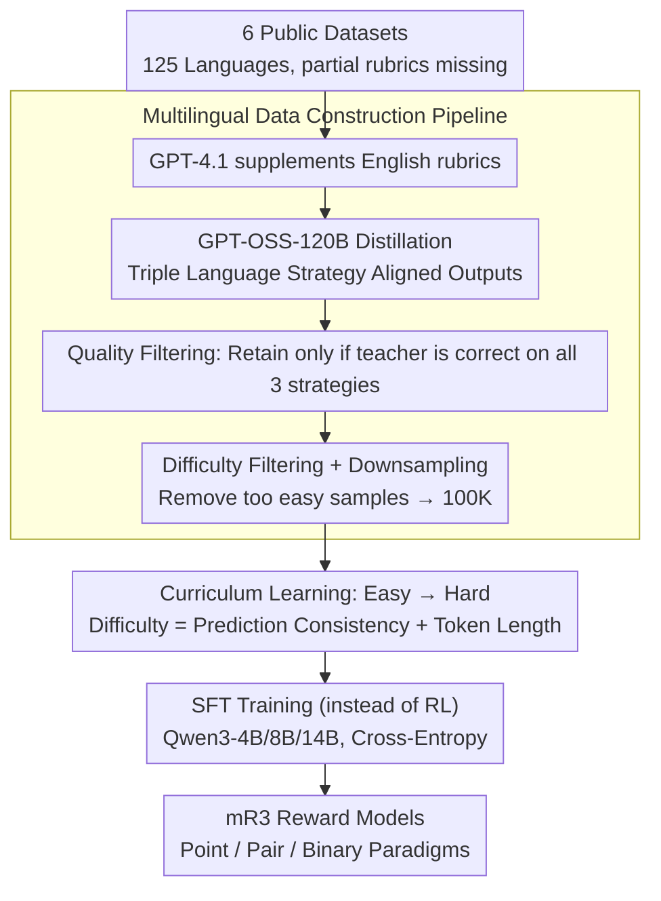

# mR3: Multilingual Rubric-Agnostic Reward Reasoning Models

**Conference**: ICLR 2026  
**arXiv**: [2510.01146](https://arxiv.org/abs/2510.01146)  
**Code**: [github.com/rubricreward/mr3](https://github.com/rubricreward/mr3)  
**Area**: LLM Inference / Alignment RLHF  
**Keywords**: Multilingual Reward Models, Reasoning Evaluation, Curriculum Learning, Rubric Evaluation, Knowledge Distillation

## TL;DR
The authors propose mR3, a series of multilingual rubric-agnostic reward reasoning models covering 72 languages. Through systematic data construction (GPT-OSS-120B distillation + difficulty filtering) and curriculum learning, the 14B model outperforms the 120B teacher and all comparable baselines on multilingual benchmarks, supporting point-wise, pair-wise, and binary evaluation paradigms.

## Background & Motivation

**Background**: LLM-as-judge evaluation methods are widely adopted in English scenarios, but support for non-English languages remains extremely limited. Existing reward models (e.g., ArmoRM, RM-R1) focus almost exclusively on English. Multilingual evaluation models (e.g., m-Prometheus) cover only 6 languages and lack systematic research on training strategies.

**Limitations of Prior Work**:
   - Existing reward models show significant accuracy drops in non-English settings.
   - LLMs lack coherent reasoning capabilities in low-resource languages (LRL).
   - Multilingual evaluation lacks a standardized framework; existing works often support only pair-wise comparisons, neglecting point-wise and binary evaluations.
   - There is a lack of systematic study on building high-quality training data for multilingual reward models, specifically regarding the optimal choice of instruction language, rubric language, and reasoning language.

**Key Challenge**: Multilingual evaluation requires both strong reasoning capabilities and cross-lingual knowledge transfer. However, reasoning in non-English languages is far inferior to English. The challenge lies in simultaneously improving both under limited multilingual data conditions.

**Goal**:
   - Design multilingual reward reasoning models covering 72 languages.
   - Systematically study the optimal combination of instruction language, reasoning language, and target language.
   - Explore data selection and curriculum learning strategies.
   - Support point-wise, pair-wise, and binary evaluation paradigms.

**Key Insight**: Instead of training traditional scalar reward models, one should train generative reward models that produce a reasoning trace followed by a score. Explicit reasoning processes improve interpretability and cross-lingual robustness.

**Core Idea**: Construct a 72-language aligned dataset (100K samples) via GPT-OSS-120B distillation, combined with difficulty filtering and curriculum learning to train generative reward models that surpass the teacher model despite having fewer parameters.

## Method

### Overall Architecture

mR3 aims to train a **generative** reward model capable of scoring responses based on "arbitrary languages and arbitrary rubrics," rather than a traditional scorer that outputs only a scalar. It formulates evaluation as $f(x)=y$, where the input $x=(t, i, a, r)$ includes the task instruction $t$, input instance $i$, candidate answer $a$, and evaluation rubric $r$. The output $y=(\text{trace}, e, s)$ consists of a reasoning trace, a brief explanation $e$, and a final score $s$. The model supports three evaluation modes: point-wise (scoring a single answer), pair-wise (comparing two answers), and binary (correctness judgment).

The pipeline focuses on data quality and training strategy rather than model architecture (which utilizes Qwen3 with supervised fine-tuning). The workflow involves aggregating 6 public datasets into a 125-language pool, supplementing missing rubrics with English ones via GPT-4.o, distilling aligned outputs across three language strategies using GPT-OSS-120B, and filtering down to 100K high-quality samples. These samples are sorted from "easy-to-hard" for SFT using cross-entropy, resulting in 4B/8B/14B reward models.

### Key Designs

**1. Multilingual Data Construction Pipeline: Filtering 100K High-Quality Samples from 3M+**
The pipeline is designed to address the scarcity of broad-coverage, high-quality aligned data. The initial pool covers 125 languages. GPT-OSS-120B generates outputs under three strategies (eng-eng / tgt-eng / tgt-tgt). **Quality filtering** retains samples where the teacher is correct across all strategies. **Difficulty filtering** removes samples that are too easy (measured by accuracy over 5 attempts), prioritizing "hard" samples where correctness $\leq 2$.

**2. Triple Language Reasoning Strategy: Comparing eng-eng / tgt-eng / tgt-tgt Paths**
The distillation provides three paths: eng-eng (English instruction + English reasoning), tgt-eng (Target language instruction + English reasoning), and tgt-tgt (Target language instruction + Target language reasoning). Results show a clear gradient: eng-eng is strongest due to mature reasoning in English; tgt-eng is close, showing robustness to non-English prompts; tgt-tgt is weakest before fine-tuning but shows the **largest gains after fine-tuning**, even surpassing the base model's eng-eng performance.

**3. Curriculum Learning: Sorting Training Data from Easy to Hard**
Authors compared six ordering schemes and found that **easy-to-hard** sorting yields the best results. Difficulty is first determined by accuracy (fewer correct teacher attempts means harder) and subsequently by token length (longer means harder). This allows the model to establish basic evaluation capabilities before tackling noisier/harder samples.

**4. SFT instead of RL Training**
mR3 uses standard supervised fine-tuning (SFT) with cross-entropy loss rather than RL:

$$\mathcal{L}_{\text{SFT}}(\theta) = -\frac{1}{N}\sum_{i=1}^{N}\sum_{t=1}^{T_i}\log \pi_\theta\big(y_t^{(i)} \mid y_{<t}^{(i)}, x^{(i)}\big)$$

Experiments comparing SFT with RLVR + GRPO showed that SFT is more stable and effective when data is strictly filtered. SFT is also significantly more computationally efficient.

### Loss & Training
The model is trained with the SFT cross-entropy loss using Qwen3 (4B/8B/14B). Data is fed via curriculum learning, with the same sample repeated across the three language strategies to ensure aligned cross-lingual reasoning.

## Key Experimental Results

### Main Results (Pairwise Evaluation, eng-eng setting)

| Model | m-RewardBench (23lang) | RewardBench (1lang) | MM-Eval (18lang) | IndoPref (1lang) |
|------|----------------------|--------------------|-----------------|-----------------| 
| GPT-OSS-120B | 89.05 | 90.30 | 85.01 | 72.15 |
| Nemotron-Multi-49B | 89.03 | 89.62 | 76.27 | 68.40 |
| R3-Qwen3-14B-LoRA | 88.07 | **91.00** | 84.04 | 72.65 |
| **mR3-Qwen3-14B** | **89.18** | 90.79 | **86.05** | **74.14** |
| **mR3-Qwen3-8B** | 88.44 | 90.50 | 84.84 | 72.86 |
| **mR3-Qwen3-4B** | 87.61 | 89.74 | 82.62 | 72.22 |

mR3-Qwen3-14B outperforms the 120B teacher (+0.13 on m-RB, +1.04 on MM-Eval, +1.99 on IndoPref) and is 3.5x faster than Nemotron-49B.

### Ablation Study

| Configuration | Key Finding |
|------|---------|
| Curriculum: Easy→Hard vs Random | Easy→Hard is optimal on HelpSteer3. |
| Data Size: 50K vs 100K vs 200K | 100K is the sweet spot; 200K shows no significant gain. |
| Language Strategy: eng-eng vs tgt-tgt | eng-eng has higher absolute scores, but tgt-tgt shows the largest gain. |
| Difficulty Filtering: Yes vs No | Removing easy samples significantly boosts performance. |
| Training Method: SFT vs RLVR | SFT consistently outperforms RL for this task. |

### Key Findings
- **Small Models, Large Power**: The 14B model systematically outperforms the 120B teacher and 49B competitors, proving quality and strategy outweigh scale.
- **Tgt-tgt Strategy Leap**: Fine-tuning effectively "activates" cross-lingual reasoning, significantly closing the gap between target language and English reasoning.
- **DPO Verification**: Using mR3-Qwen3-14B for DPO on Qwen3-30B improved the English win rate on m-ArenaHard from 49.1% to 57.3%.
- **Human Evaluation**: In evaluations by 20 native speakers across 12 languages, mR3's reasoning traces performed significantly better in factuality (2.78) and logic (2.67) compared to the Qwen3 baseline (2.06/2.05).

## Highlights & Insights
- The **unified 72-language training framework** is a major breakthrough, far exceeding the 6-language coverage of prior work like m-Prometheus.
- **Easy-to-hard curriculum learning** is effective for training Reward Models, a finding that can be transferred to other generative evaluation models.
- **Quality > Scale**: 100K curated samples outperform 3M+ raw samples, emphasizing the importance of multi-stage filtering.
- **Interpretability of Target Language Reasoning**: While English reasoning might be slightly more accurate, target language reasoning is crucial for trust among LRL users.

## Limitations & Future Work
- Distilled outputs from GPT-OSS-120B carry inherent English bias.
- Coverage of low-resource languages (LRL) may be uneven across the 72 languages.
- Only SFT was explored; the full potential of post-SFT RL (e.g., GRPO) remains to be investigated.
- Human evaluation only covered 12 of the 72 languages.

## Related Work & Insights
- **vs R3 (Anugraha et al., 2025)**: mR3 extends the English-only R3 framework to 72 languages, significantly outperforming it on multilingual benchmarks.
- **vs m-Prometheus (Pombal et al., 2025)**: mR3 covers more languages (72 vs 6) and has much better performance (89.18 vs 79.51 on m-RewardBench).
- **vs Nemotron-Multilingual-49B (Wang et al., 2025)**: mR3-14B uses 1/3.5 the parameters and covers 7.2x more languages with superior accuracy.

## Rating
- Novelty: ⭐⭐⭐⭐
- Experimental Thoroughness: ⭐⭐⭐⭐⭐
- Writing Quality: ⭐⭐⭐⭐
- Value: ⭐⭐⭐⭐⭐

<!-- RELATED:START -->

## Related Papers

- [\[ICLR 2026\] Pushing on Multilingual Reasoning Models with Language-Mixed Chain-of-Thought](pushing_on_multilingual_reasoning_models_with_language-mixed_chain-of-thought.md)
- [\[ACL 2026\] C2: Scalable Rubric-Augmented Reward Modeling from Binary Preferences](../../ACL2026/llm_reasoning/c2_scalable_rubric-augmented_reward_modeling_from_binary_preferences.md)
- [\[ICLR 2026\] FlowRL: Matching Reward Distributions for LLM Reasoning](flowrl_matching_reward_distributions_for_llm_reasoning.md)
- [\[ICLR 2026\] PEAR: Phase Entropy Aware Reward for Efficient Reasoning](pear_phase_entropy_aware_reward_for_efficient_reasoning.md)
- [\[ICLR 2026\] DRPO: Efficient Reasoning via Decoupled Reward Policy Optimization](drpo_efficient_reasoning_via_decoupled_reward_policy_optimization.md)

<!-- RELATED:END -->
