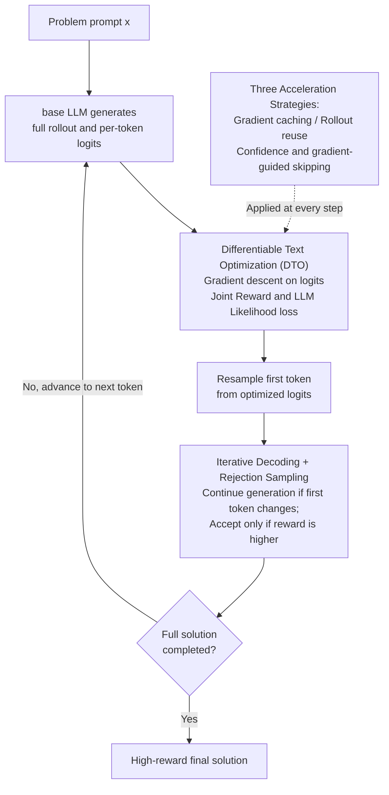

# $\nabla$-Reasoner: LLM Reasoning via Test-Time Gradient Descent in Latent Space

**Conference**: ICLR 2026  
**arXiv**: [2603.04948](https://arxiv.org/abs/2603.04948)  
**Code**: [https://github.com/VITA-Group/Nabla-Reasoner](https://github.com/VITA-Group/Nabla-Reasoner)  
**Area**: Optimization  
**Keywords**: test-time scaling, gradient-based optimization, differentiable optimization, reward model, inference-time reasoning

## TL;DR
$\nabla$-Reasoner is proposed to upgrade inference-time search from zeroth-order (sampling + evaluation) to first-order (gradient descent). By using Differentiable Text Optimization (DTO) on token logits, it iteratively improves decoding strategies by combining reward gradients with LLM likelihood. It achieves 10-40% accuracy improvements on mathematical reasoning tasks while reducing model calls by 10-40%.

## Background & Motivation
**Background**: Inference-time scaling has become a critical path for enhancing LLM reasoning. Existing methods like Best-of-N, Self-Consistency, Tree-of-Thought, and RAP search for high-quality answers through multiple samplings and evaluations.

**Limitations of Prior Work**: These methods are inherently **zeroth-order searches**—they use only scalar reward values to filter candidates without utilizing reward gradient direction. As the search space grows exponentially with sequence length, directionless search becomes inefficient, leading to performance saturation as computational budgets increase.

**Key Challenge**: Reward models (transformer-based classifiers) are inherently differentiable, yet their gradient information is entirely wasted. Zeroth-order methods cannot effectively exploit the structural information of the reward landscape.

**Goal**: How to utilize reward gradients during inference to efficiently guide LLM outputs towards high-reward regions while maintaining generation fluency?

**Key Insight**: Reframe LLM reasoning as a continuous optimization problem—performing gradient descent in the token logits space and bridging the discrete-continuous gap via a straight-through estimator.

**Core Idea**: Replace zeroth-order search with first-order gradient descent for inference-time policy optimization, simultaneously maximizing reward and LLM likelihood in the logits space.

## Method

### Overall Architecture
$\nabla$-Reasoner is an iterative decoding framework: given a prompt, the base LLM generates an initial rollout and its per-token logits as the starting policy. Differentiable Text Optimization (DTO) then performs gradient descent on the logits to push the strategy toward higher rewards. The first token is resampled from the optimized logits, followed by rejection sampling to determine if the change improves the reward—the change is accepted only if the reward increases. The process then advances to the next token, repeating the cycle until a complete solution is generated. Three acceleration strategies are applied throughout to keep overhead close to a single forward pass.

### Key Designs

**1. Differentiable Text Optimization (DTO): Replacing zeroth-order "sample-evaluate" with first-order gradient descent on logits**

As the core mechanism, DTO addresses the waste of gradient directions in zeroth-order search. It directly performs gradient descent in the token logits space with an optimization objective combining reward and LLM likelihood:

$$\mathcal{L}(\mathbf{y}) = -\lambda\, r(\mathbf{y}\mid\mathbf{x}) - \log \pi_{LLM}(\mathbf{y}\mid\mathbf{x})$$

The reward term $r$ provides guidance on "which direction to change," while the NLL term $-\log\pi_{LLM}$ acts as a constraint to keep the optimization within the LLM's distribution and prevent reward hacking. Since tokens are discrete, DTO uses a Gumbel-softmax straight-through estimator to parameterize discrete tokens into continuous logits, allowing reward gradients to backpropagate to each token. This also enables **bidirectional propagation**: prefix tokens are constrained by NLL for coherence, while subsequent tokens propagate reward signals back via attention, achieving look-ahead global optimization without explicit tree search.

**2. Iterative Decoding + Rejection Sampling: Embedding DTO into per-token decoding to ensure reward gains**

Gradient optimization alone is insufficient as gradient directions can be noisy. $\nabla$-Reasoner embeds DTO into a per-token decoding loop: after a token is generated, DTO optimizes the corresponding logits, and a new token $\tilde{y}_1$ is sampled from $\text{softmax}(\tilde{\mathbf{z}}_1/\tau)$. If $\tilde{y}_1$ differs from the original token $y_1$, a new completion is generated and compared against the original. **The modification is accepted only if the new completion yields a higher reward.** This rejection sampling layer ensures every applied change is beneficial and filters out gradient noise; experiments show it reduces the rejection rate from ~66% (without DTO) to 29–40%.

**3. Three Acceleration Strategies: Reducing overhead to near a single forward pass**

Per-token backpropagation is computationally expensive, so three complementary tricks are used. First, **gradient caching**: since softmax is relatively "hard," one-hot tokens do not flip frequently, allowing $\partial\mathcal{L}/\partial\mathbf{y}$ to be cached and reused until a token actually flips. Second, **rollout reuse**: if a step is rejected, its generated rollout trajectory can be used as the starting point for the next step. Third, **confidence + gradient-guided token selection**: DTO is only run for tokens with high entropy and high gradients, skipping those where the model is already confident (low entropy) or the gradient is small. Together, these allow the gradient computation overhead to approach that of a forward pass through parallel execution.

### Loss & Training
This is a training-free inference-time method. The DTO optimization target is $\mathcal{L} = -\log \pi_{LLM}(\mathbf{y}|\mathbf{x}) - \lambda \cdot r(\mathbf{y}|\mathbf{x})$, where $\lambda$ balances reward and NLL regularization. Theoretical analysis proves that DTO’s sample-space gradient descent is equivalent to PPO’s Wasserstein gradient flow (Theorem 4.1), unifying the theoretical frameworks of pre-training scaling and inference-time scaling.

## Key Experimental Results

### Main Results

| Model + Benchmark | Greedy | SC (N=8) | BoN (N=8) | RAP | GRPO | $\nabla$-Reasoner |
|---|---|---|---|---|---|---|
| Qwen-2.5-7B MATH-500 | 43.8 | 69.8 | 70.2 | 68.6 | 70.8 | **71.0** |
| Qwen-2.5-7B AMC | 33.0 | 49.4 | 50.1 | 50.1 | 52.8 | 51.5 |
| Qwen-2.5-7B-Inst MATH-500 | 71.2 | 76.6 | 77.8 | 80.2 | - | **80.4** |
| Qwen-2.5-7B-Inst AMC | 43.0 | 55.5 | 55.9 | 54.6 | - | **56.8** |
| Qwen-2.5-7B-Inst AIME24 | 5.3 | 25.0 | 22.5 | 1.6 | - | **26.6** |
| Llama-3.1-8B-Inst MATH-500 | 40.6 | 54.8 | 52.2 | 55.4 | - | **55.8** |

### Ablation Study

| Configuration | Gain/Effect | Note |
|------|------|------|
| DTO rejection rate (Qwen-Inst) | 28.9% | Significantly lower than the 66.5% of the no-DTO baseline |
| DTO rejection rate (Llama-Inst) | 40.1% | Compared to 66.9% baseline |
| Reward model 4B vs 8B (MATH-500) | 80.4 vs 80.8 | Larger reward model only improves by 0.4% |
| Model Call Count | 10-40% Reduction | Compared to BoN/SC |

### Key Findings
- DTO reduces the rejection rate from a theoretical ~66% to approximately 30%, proving that gradient optimization effectively improves per-step policy.
- Computational efficiency: Parallel execution in transformers makes gradient calculation costs comparable to forward passes; confidence/gradient-guided selection skips many tokens that do not need optimization.
- Low sensitivity to reward model quality (difference between 4B and 8B is <1%).
- On the test-time scaling curve, the Pareto frontier of $\nabla$-Reasoner consistently outperforms BoN and SC.

## Highlights & Insights
- **Paradigm shift from zeroth-order to first-order**: A fundamental improvement in test-time scaling, proving for the first time that first-order gradients are viable and more efficient during inference.
- **Theoretical elegance**: Proof that DTO’s sample-space gradient descent is equivalent to PPO’s Wasserstein gradient flow unifies optimization in parameter space (pre-training) and sample space (inference-time).
- **Reusable gradient caching trick**: The observation that one-hot tokens do not change frequently due to softmax hardening can be generalized to other scenarios requiring gradient optimization of discrete structures.

## Limitations & Future Work
- Performance is capped by the upper bound of the base model and reward model capabilities.
- The base model and reward model must share the same vocabulary for end-to-end logit optimization, limiting model combination flexibility.
- Currently only validated on mathematical reasoning; performance in code generation or open QA remains unknown.
- Integration with serving engines (e.g., vLLM) requires significant engineering to insert backpropagation into the decoding loop.

## Related Work & Insights
- **vs Best-of-N / SC**: These are pure zeroth-order filtering methods; $\nabla$-Reasoner uses first-order gradients to optimize directly, achieving better results with fewer samples.
- **vs ToT / RAP**: While these also guide search, they rely on heuristic tree search and Q-value estimation; $\nabla$-Reasoner is more efficient by using differentiable optimization.
- **vs GRPO (Training-time method)**: Achieves performance close to GRPO without modifying model weights, with mathematical equivalence proven between the two.

## Rating
- Novelty: ⭐⭐⭐⭐⭐ Paradigm shift from zeroth to first order; theoretically and methodologically novel.
- Experimental Thoroughness: ⭐⭐⭐⭐ Extensive coverage of math reasoning, but task variety is limited.
- Writing Quality: ⭐⭐⭐⭐⭐ Clear theoretical derivations, intuitive diagrams, and smooth narrative.
- Value: ⭐⭐⭐⭐⭐ Opens a new direction for test-time scaling, likely to become an important baseline.

<!-- RELATED:START -->

## Related Papers

- [\[ICLR 2026\] CaTS: Calibrated Test-Time Scaling for Efficient LLM Reasoning](cats_calibrated_test-time_scaling_for_efficient_llm_reasoning.md)
- [\[ICLR 2026\] Optimal Aggregation of LLM and PRM Signals for Efficient Test-Time Scaling](optimal_aggregation_of_llm_and_prm_signals_for_efficient_test-time_scaling.md)
- [\[ICLR 2026\] On the Design of KL-Regularized Policy Gradient Algorithms for LLM Reasoning](on_the_design_of_kl-regularized_policy_gradient_algorithms_for_llm_reasoning.md)
- [\[ICML 2026\] Beyond Test-Time Memory: State-Space Optimal Control for LLM Reasoning](../../ICML2026/llm_reasoning/beyond_test-time_memory_state-space_optimal_control_for_llm_reasoning.md)
- [\[ACL 2026\] Parallel Test-Time Scaling for Latent Reasoning Models](../../ACL2026/llm_reasoning/parallel_test-time_scaling_for_latent_reasoning_models.md)

<!-- RELATED:END -->
